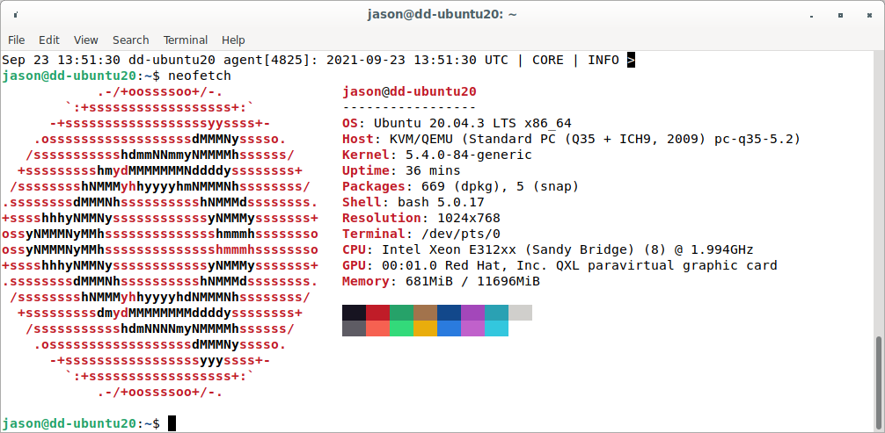
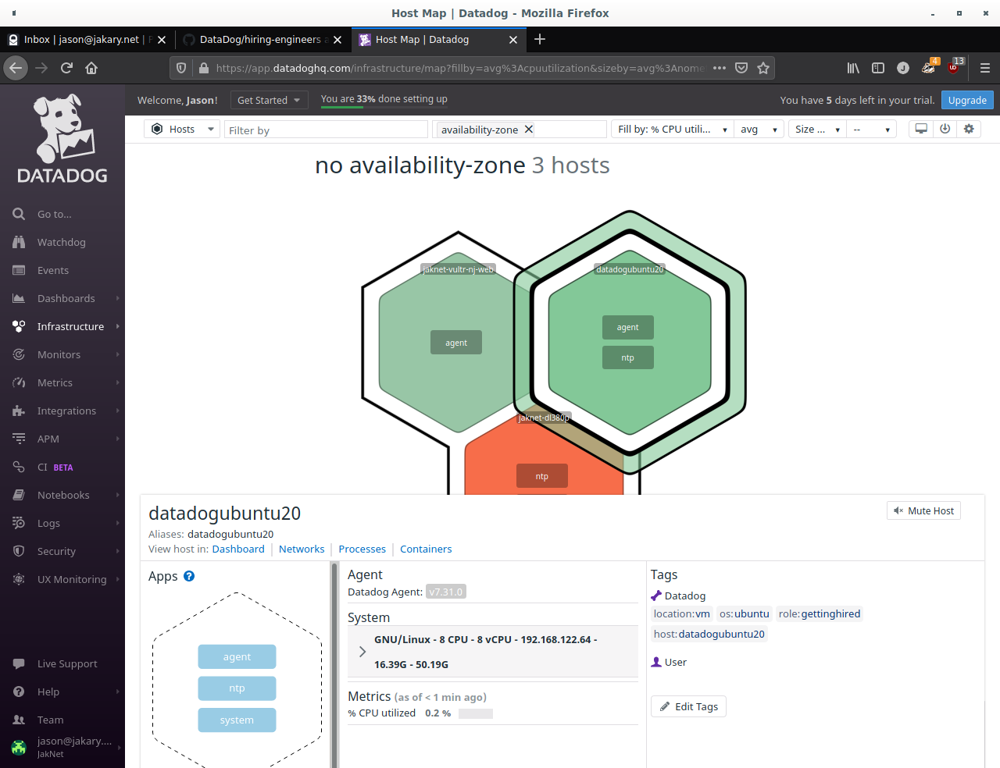

# Jason Jakary, Sales Engineer Candidate
### September, 2021

## Overview
This was a fun exercize that gave me a much better under-the-hood look at Datadog than what I was able to research with an interest and the [Youtube channel](https://www.youtube.com/channel/UCPO2QgTCReBAThZca6MB9jg). For the sake of clearity and brivity, I've organized this document to mirror the exercize readme. 

### Why work at Datadog?
In a sentence, working here as an SE means an opportunity to merge my technical, people, and business backgrounds to work with cool software I personally use and help to teach more people about it. I was originally looking for a monitoring and analytics platform for my homelab when I discoverd that not only does Datadog seem the solution on this front, but that there's an SE opening in Denver. Having just completed my MBA, I'm actively searching for SE positions to put that business education to use. My fiancee and I are also planning to move to Denver in the coming months. After having conversations with Amanda and Jake, the company atmosphere seems fantastic. I'd love to work with you all and look forward to meeting you, pending review of this document.  

### Files that need to be included:
- [x] dd-ubuntu20 neofetch output
- [x] /etc/datadog-agent/checks.d/my_metric.py
- [x] /etc/datadog-agent/conf.d/my_metric.yaml
- [] Agent config file
- [x] Screenshot of Hostmap showing tags
- [] Timeboard script

### Setting up the environment:
- [x] Create a fresh Linux VM
- [x] Setup Datadog account
- [x] Get datadog-agent running on the VM

To get started, I spun up a virtual instance of Ubuntu Server 20.04.03 following the recommendation to use an Ubuntu image 16.04 or newer. 
Rather than usisg Oracle's VirtualBox software, I'm using QEMU/KVM with virt-manager as I've found VMs created and managed this way tend to run faster and smoother on Linux systems when compared to VirtualBox.  

### Collecting Metrics:
- [x] Add tags in the Agent config file 
- [x] Install database and intigration on the VM
- [x] Create custom Agent Check sumbitting the metric, *my_metric*, with a random value between 0-1000 every 45 seconds
###### Can you change the collection interval without modifying the Python check file?
The great thing about open source is that the answer to "Can you..." is usually "Yes, provided a sufficent understanding of the system." In our case, the collection interval is changed via `min_collection_interval` in *my_metric.yaml* (which isn't a python file, but rather a .yaml file). That's a bit inside-the-box though, as the Python and YAML files work together directly. For an outside-the-box solution, we can use a cron job! Kind of... cron jobs are native to all linux distros and are an easy way to automate commands. Since the Datadog agent runs all metrics upon startup, running `systemctl restart datadog-agent` as root will get the random number generator within our metric to genarate a new number. The issue here is twofold though:
1. The agent may be running other services that we don't want restarted.
2. Cron jobs have a resolution of one minute, so to restart the agent every 45 seconds requires the creation of a script to run `systemctl restart datadog-agent` every 45 seconds and cron job set to run at a time divisible by 45 seconds to ensure the script stays on schedule. 

### Visualizing Data:
###### Create a Timeboard that contains:
- [x] *my_metric* scoped over the host
- [x] Any metric from the database integration with the anomaly function applied
- [x] *my_metric* with the rollup function applied to sum up all points from the past hour into one bucket
- [x] Set the timeframe to the past 5 minutes
- [] Take a snapshot and use @ notation to send it to myself
###### What is the Anomaly graph displaying? 
In this case, it's displaying any situation where far more or far less querries to my database are performed. That's a bit boring though, since it's an empty database with nobody intentionally connecting to it. Instead, see my other widget,*jaknet-dl380p CPU Usage* as it's tracking the CPU usage of the server that's running *dd-ubuntu20* and therefore much more active.

### Monitoring Data:
###### Create a new Metric Monitor:
- [x] Monitoring *my_metric*
- [x] Warning threshold of 500 over the last 5 minutes
- [x] Alert threshold of 800 over the last 5 minutes
- [x] Notify me if there is no data over the past 10 minutes
- [x] Alert message will email whenever monitor triggers
- [x] Alert message will have different messages for Warning, Alert, and No Data
- [x] Alert message will include the offending metric value and host IP
- [] Alert message will have downtime between 0700-2100 M-F
- [] Alert message will have downtime between 0000-2359 S-S
- [] Email will be sent when downtime is scheduled

### Collecting APM Data:
- [] Utilize the provided Flask app
- [] What's the difference between a service and a resource?

### Final Question:
My "creative" usecase is pretty typical for an enterprise, but a little "out there" for an indivdual. When I've got some more down time I'll be configuring my platform to manage my homelab. A few solutions I'd like to implement beyond just "manage the rack" over the next few months:
- Create integration for OpenHab to monitor temp, atmospheric pressure, lights, and power consumption at various points
- Alert via email if apliances are on, but nobody's home (stove, curling irons, etc.)
- Keep an eye on nutrient levels for hydroponic garden
- Keep learning more about the platform. It seems super powerful and I fully recognize there's a ton to discover :)
