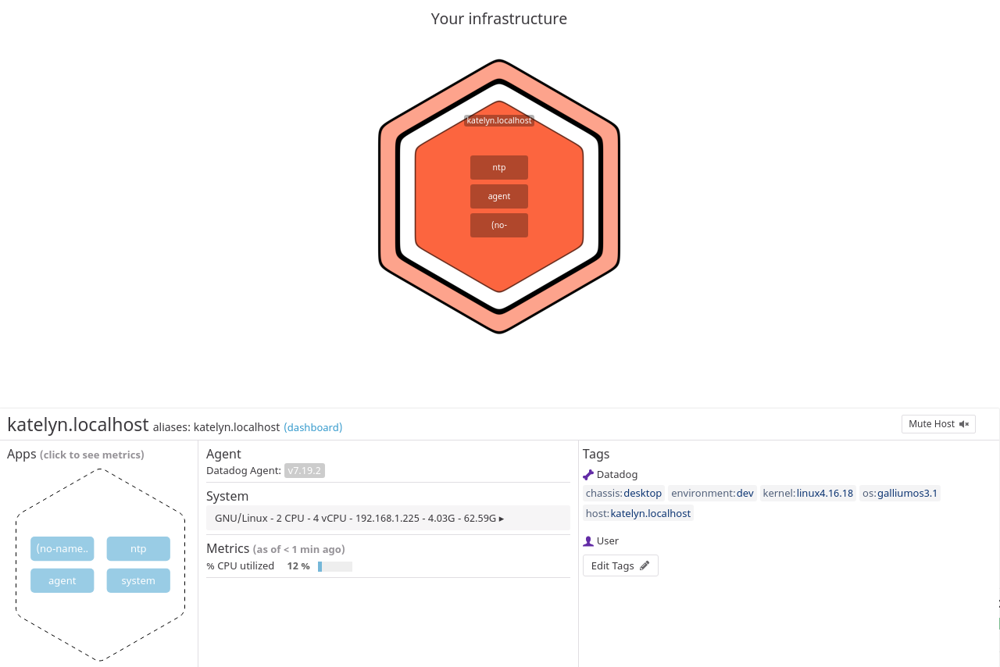

# Prerequisites

To begin this exercise, I had to choose an appropriate environment to model Datadog’s functionality that's feasible within the confines of my Chromebook running ChromeOS. I opted to dual-boot my machine to run [GalliumOS](https://galliumos.org/), a lightweight Linux distribution based on Xubuntu, partitioned alongside the ChromeOS. From my new VM, I was easily able to sign up for Datadog and begin running the agent.  

```
## @param tags  - list of key:value elements - optional
## List of host tags. Attached in-app to every metric, event, log, trace, and service check emitted by this Agent.
##
## Learn more about tagging: https://docs.datadoghq.com/tagging/
#
tags:
   - environment:dev
   - chassis:desktop
   - os:galliumos3.1
   - kernel:linux4.16.18
```


