# Solutions Engineer Exercise - Kyle Neale

For the purpose of this exercise, I'm choosing to run Vagrant and Virtual-Box. Vagrant provides easy to configure, reproducible, and portable work environments while maxing user productivity. With just one line of configuration and one command in your terminal, you can bring up a fully functional, SSH accessible virtual machine. More information about the use case of Vagrant can be found [here](https://www.vagrantup.com/intro/index.html) as well as the docs, [here](https://www.vagrantup.com/intro/getting-started/).

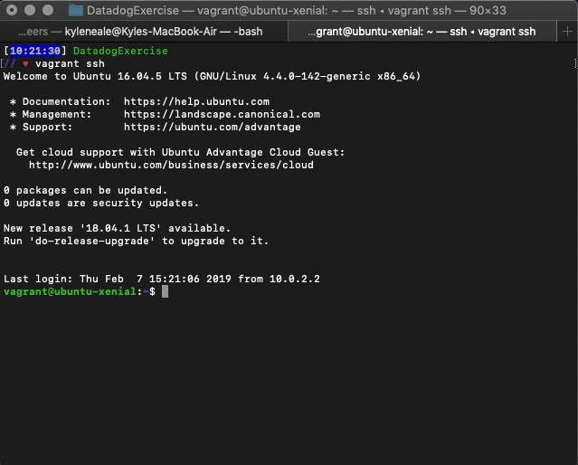

## Prerequisites - Setup

Once Vagrant and Virtual-Box have been installed, in order to avoid potential dependency, Ubuntu 16.04 LTS was recommended for use. The proper build was found (ubuntu/xenial64) though [Vagrant Cloud](https://app.vagrantup.com/boxes/search) and I initialized my VM.

Next, I downloaded the Datadog Agent via terminal. I signed up for Datadog (use “Datadog Recruiting Candidate” in the “Company” field). I was given an API key, which should never be shown to the public.

```
DD_API_KEY=API_KEY bash -c "$(curl -L https://raw.githubusercontent.com/DataDog/datadog-agent/master/cmd/agent/install_script.sh)"

```

Running the above command will install Datadog's Agent onto my VM and provide access to the Datadog dashboard.

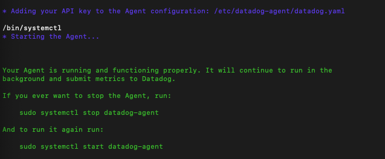

Up until this point everything has gone smoothly and thus, I proceeded to the next step.

## Collecting Metrics

Tagging, in the Datadog Agent, is a way of adding 'dimensions' to metrics. With tags, metrics can be filtered, aggregated and compared. A quick stop in Datadog's [Tagging](https://docs.datadoghq.com/tagging/) documentation provided most of the steps necessary to add tags.

```
cd /etc/datadog-agent
```
and ...
```
sudo vim Datadog.yaml
```

Tags did not show up initially, so I checked the Agent Status to see what was wrong using: `sudo systemctl status datadog-agent.service`. The Agent was offline and in order to get a documented log of what the issue was, I debugged using, `sudo journalctl -u datadog-agent.service`. Documentation of the two commands can be found [here](https://docs.datadoghq.com/agent/troubleshooting/?tab=agentv6).

Eventually, I found there was an error in the format of the tags and corrected it. A screenshot of the tags can be shown below.

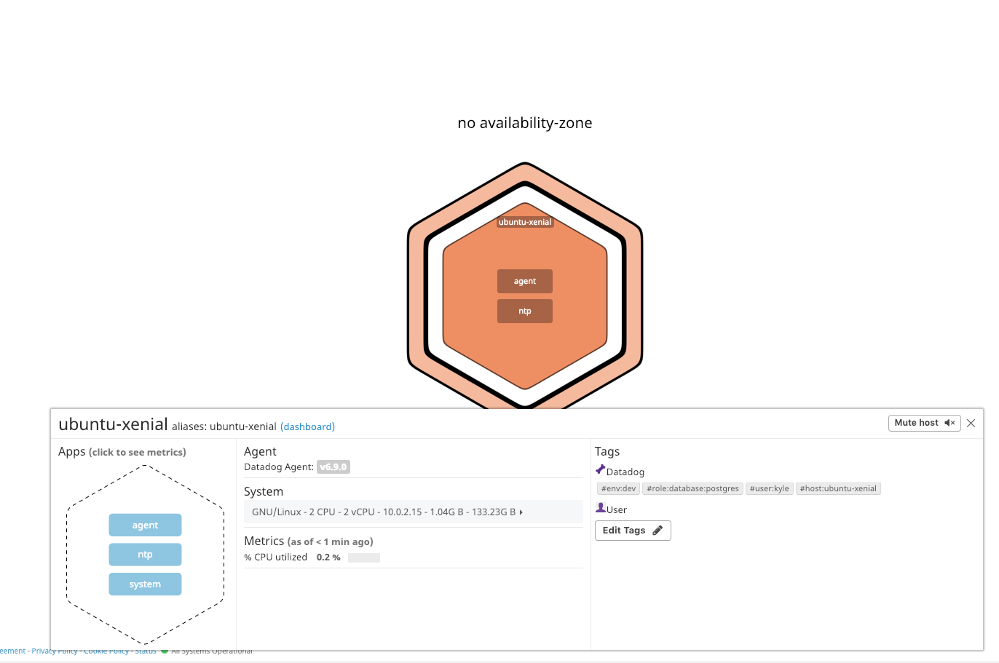

#### Installing a database

I chose to install PostgreSQL since it was a database I was familiar with. The following command handled the installation ``` sudo apt-get install postgres```. The documentation can be found [here](https://www.digitalocean.com/community/tutorials/how-to-install-and-use-postgresql-on-ubuntu-16-04).

In order to login to PostGreSQL, you can either run `sudo -i -u postgres` to switch over to the postgres account and `psql` to access the prompt, or `sudo -u postgres psql` to skip the intermediary bash shell in between.

Once in the database, I navigated to the matched PostgreSQL integration and followed the steps provided

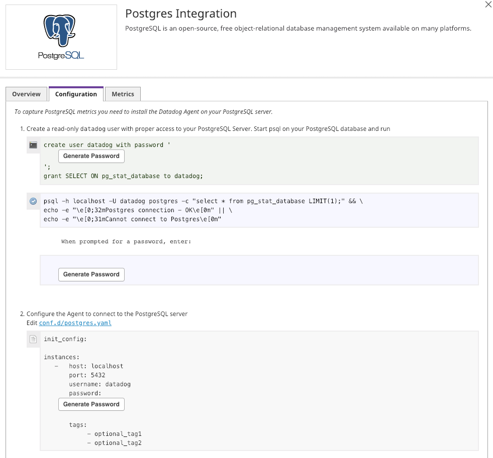

I also navigated to my ```conf.d/postgres.yaml``` directory and configured my ```conf.yaml``` file.

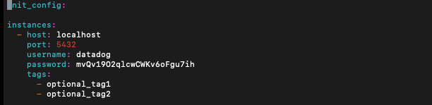

It is recommended to restart client after configuring the ```conf.yaml``` file executing the Agent Status command, ```sudo datadog-agent status```, in order to verify that the integration check has passed. Look for postgres under the Running Checks section.

A couple minutes later, the integration installation shows that it was successful.

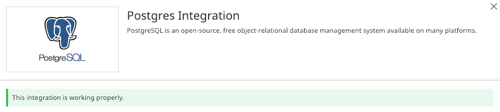

#### Adding a custom check

Adding a custom check is well explained in the docs [here](https://docs.datadoghq.com/developers/write_agent_check/?tab=agentv6). The docs state that the names of the configuration and check files must match. If your check is called mycheck.py, your configuration file must be named mycheck.yaml.

I created two files, one python file named my_check.py which was placed in directory /etc/datadog-agent/checks.d/my_check.py.

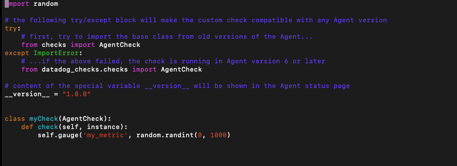

The other file, my_check.yaml, was placed in directory /etc/datadog-agent/conf.d/my_check.d/my_check.yaml.


Your custom metric can now be viewed in the Metrics Explorer sub-tab of Metrics:

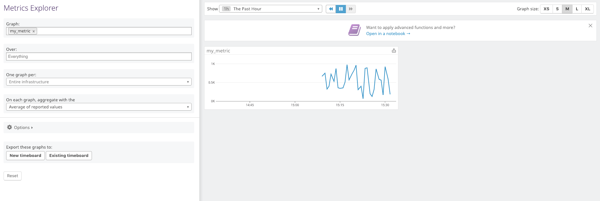

###### Bonus Question: Can you change the collection interval without modifying the Python check file you created?

Yes, it is possible to change the interval by editing my my_check.yaml file and changing ```min_collection_interval```. It defaults to 15 seconds. This information can be found [here](https://docs.datadoghq.com/developers/write_agent_check/?tab=agentv6#collection-interval).

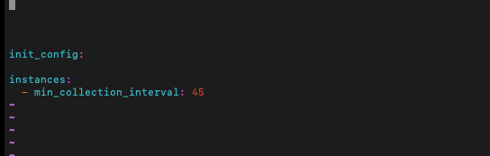

## Visualizing Data

In this section we use the Datadog API to create a Timeboard. A Timeboard is a live monitoring dashboard which utilizes graphs that can be used to draw useful insights and analytics. Further research shows that, since Timeboards are requesting data, we will need to generate an APP key as well as utilize our API key.

I generated our APP key through the API subsection in the Integrations tab.

Furthermore, I needed to install the Python Datadog package so we can import both the `initialize` and `api` methods provided.

`from datadog import initialize, api`

I was tasked to build 3 graphs:
- Your custom metric scoped over your host.
- Any metric from the Integration on your Database with the anomaly function applied.
- Your custom metric with the rollup function applied to sum up all the points for the past hour into one bucket

Provided below is the code executed for the request:

```
options = {
    'api_key': API_KEY,
    'app_key': APP_KEY
}

initialize(**options)

title = "Kyle's TimeBoard"
description = "Solution's Engineer Code Challenge Timeboard"
graphs = [{
    "definition": {
        "events": [],
        "requests": [{
            "q": "avg:my_metric{host:ubuntu-xenial}",
            "type": "line",
        }],
        "viz": "timeseries"
    },
    "title": "Metric Scoped With Host",
}, {
    "definition": {
        "events": [],
        "requests": [{
         "q": "avg:postgresql.bgwriter.checkpoints_timed{host:ubuntu-xenial}.as_count()",
         "type": "line",
        }],
        "viz": "timeseries"
    },
    "title": "Anomoly monitor for PostgreSQL",
}, {
    "definition": {
        "events": [],
        "requests": [{
            "q": "avg:my_metric{*}.rollup(sum, 3600)",
            "type": "line",
        }],
        "viz": "timeseries"
    },
    "title": "Metric Rollup Point Sum",
}]

template_variables = [{
    "name": "host1",
    "prefix": "host",
    "default": "host:my-host"
}]

read_only = True

api.Timeboard.create(
    title=title,
    description=description,
    graphs=graphs
    template_variables=template_variables,
    read_only=read_only
    )
```

Once finished, I navigated back to my Agent and open the Dashboard List under the Dashboard tab. Three graphs should have been created.

#### Navigating the Agent GUI

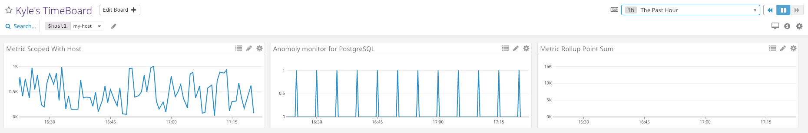

In order to set the Timeboard's timeframe to the past 5 minutes, I manually highlighted the time interval I would like to observe.

 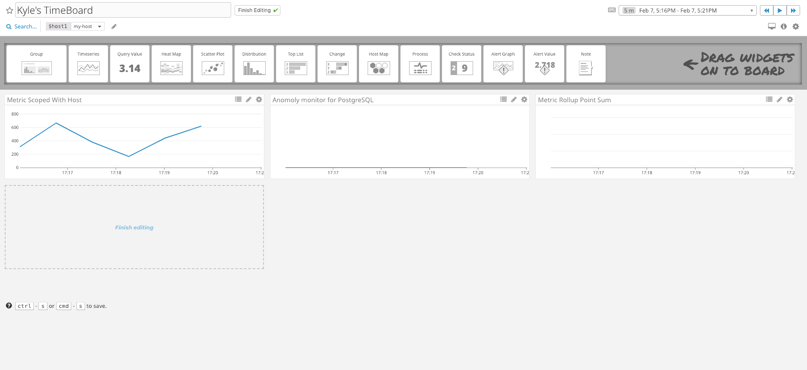

In addition you can send snapshots of metrics to yourself using the camera icon located at the top right of each graph.

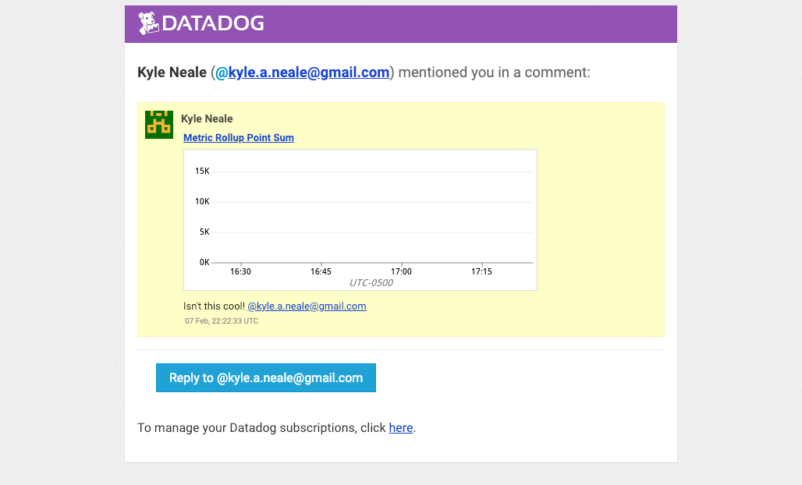


###### Bonus Question: What is the Anomaly graph displaying?

According to the Alerting Section in the Datadog docs, the [anomaly](https://docs.datadoghq.com/monitors/monitor_types/anomaly/) graph is an algorithmic feature that allows you to identify when a metric is behaving differently than it has in the past, taking into account trends, seasonal day-of-week, and time-of-day patterns. It is well-suited for metrics with strong trends and recurring patterns that are hard or impossible to monitor with threshold-based alerting.

## Monitoring Data

In this step, I created monitors based on the following criteria:
- Warning threshold of 500
- Alerting threshold of 800
- And also ensure that it will notify you if there is No Data for this query over the past 10m.

I created a new metric Monitor in the Monitors tab and below are the pictures detailing my process:

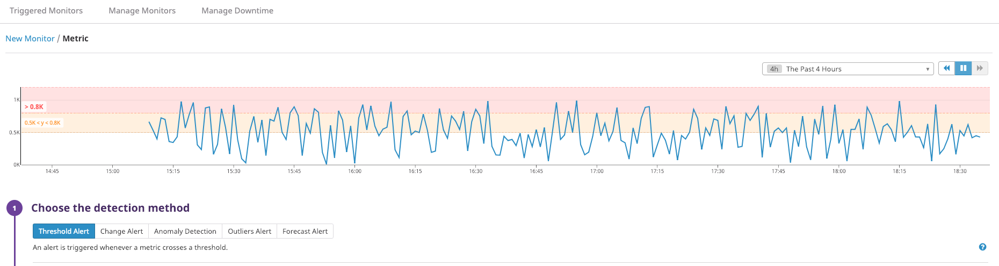
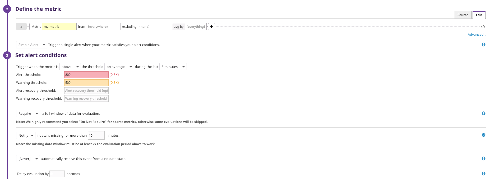

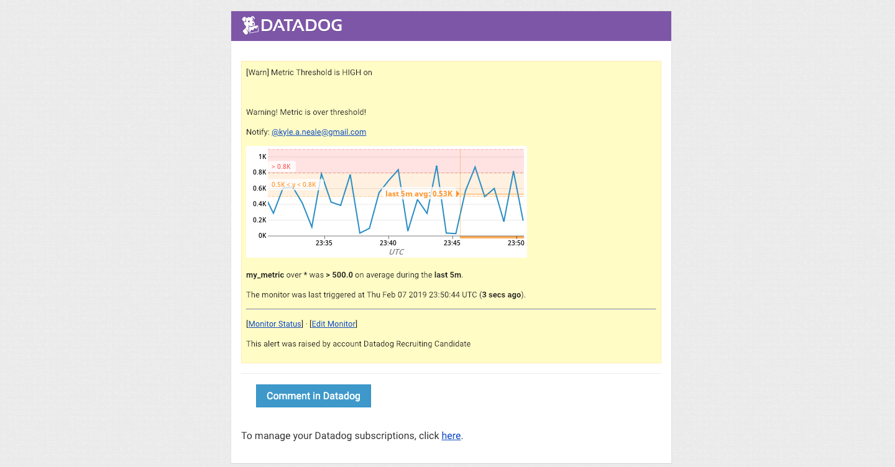

###### Bonus:  Since this monitor is going to alert pretty often, you don’t want to be alerted when you are out of the office. Set up two scheduled downtimes for this monitor:
- *One that silences it from 7pm to 9am daily on M-F,*
- *One that silences it all day on Sat-Sun.*
- *Make sure that your email is notified when you schedule the downtime and take a screenshot of that notification.*

Below are the pictures detailing my process:

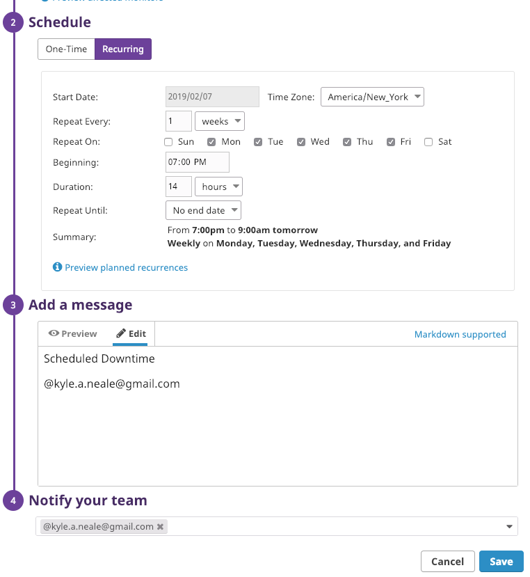

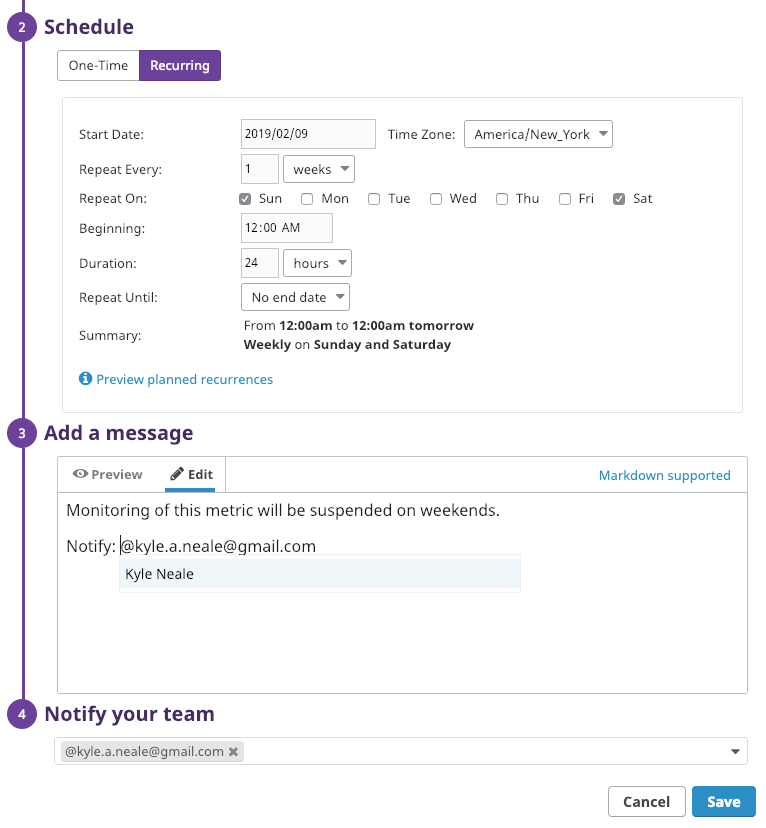
## Collecting APM Data

Following the docs about [Tracing](https://docs.datadoghq.com/tracing/), about [Flask](http://flask.pocoo.org/docs/0.12/quickstart/), and about [getting starting with the APM](https://docs.datadoghq.com/tracing/visualization/), I was finally ready to get started tackling this section.

The APM allows the setup with a variety of language, but I decided to go with Python. I also install Flask, `pip install flask` and the Datadog Tracing Library, ddtrace, `pip install ddtrace`.

The docs provide the necessary code for the Flask app:

```
from flask import Flask
import logging
import sys

# Have flask use stdout as the logger
main_logger = logging.getLogger()
main_logger.setLevel(logging.DEBUG)
c = logging.StreamHandler(sys.stdout)
formatter = logging.Formatter('%(asctime)s - %(name)s - %(levelname)s - %(message)s')
c.setFormatter(formatter)
main_logger.addHandler(c)

app = Flask(__name__)

@app.route('/')
def api_entry():
    return 'Entrypoint to the Application'

@app.route('/api/apm')
def apm_endpoint():
    return 'Getting APM Started'

@app.route('/api/trace')
def trace_endpoint():
    return 'Posting Traces'

if __name__ == '__main__':
    app.run(host='0.0.0.0', port='5050')

```

It is also important to navigate to ```/etc/datadog-agent/datadog.yaml``` include ```apm_config: enabled: true``` located at the bottom of the file.

After the setup I ran the trace with `ddtrace-run python my_app.py` and saw the IP of the server that was hosting the Flask application.

However when navigating back to the APM UI in the Datadog Agent, the UI had not changed and was stuck on the setup page. In addition, when I tried to navigate to the endpoint through the browser, it seemed as though the server hadn't started. I also tried changing the endpoint, still to no avail.

I searched for a brute force way to hit the endpoints and I happened upon cURL. These are the commands that I entered:

```
curl http://localhost:3000/
```
```
curl http://localhost:3000/api/apm
```
```
curl http://localhost:3000/api/trace
```

Below are the responses that I received:

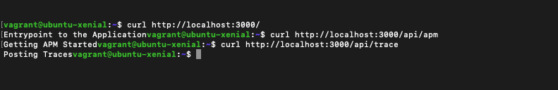

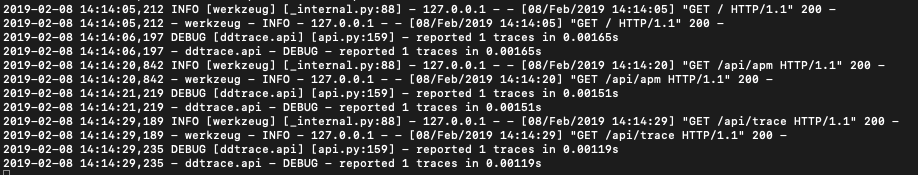

It looked as though I was finally successful and when I went back to the Agent, the UI changed and displayed the traces as well as the endpoints that were hit.

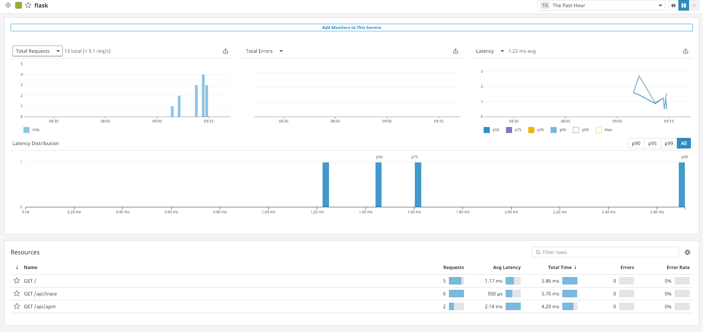

Additionally, I was able to view my traces from the Trace List sub-tab.

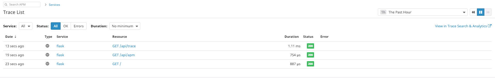

###### Bonus Question: What is the difference between a Service and a Resource?

A service is the name of a set of processes that work together to provide a feature set while a resource is a particular query to a service. An example would be a web application consisting of two services, the web service and a database service

Resources are the queries that a user constructs to interact with the services they've created. An example being a routes in a MVC framework or a query to a database.

More information on Services and Resources can be found [here](https://docs.datadoghq.com/tracing/visualization/).

## Final Question:

###### Is there anything creative you would use Datadog for?

During Flatiron School, I was able to present a technical talk on IoT and the global move towards more 'smart' environments. I think the Datadog Agent and its APM service would thrive in this field. Datadog would be able to monitor device/sensor malfunctions, identify potential trends in power/water usage and alert us when something doesn't look right - identify when something is either above or below its normal thresholds (temperature for example).

I think another cool use case for Datadog would be with eSports. eSports is essentially competitive gaming and because of how popular it's becoming, using Datadog to monitor and report metrics on, for instance, if there is a problem with the game server or a potential DDoS attack would keep engineers a step ahead of the problem. Datadog would also be able to monitor the streaming service so that its users receive real time, low-lag visuals on the progress of the competition.
