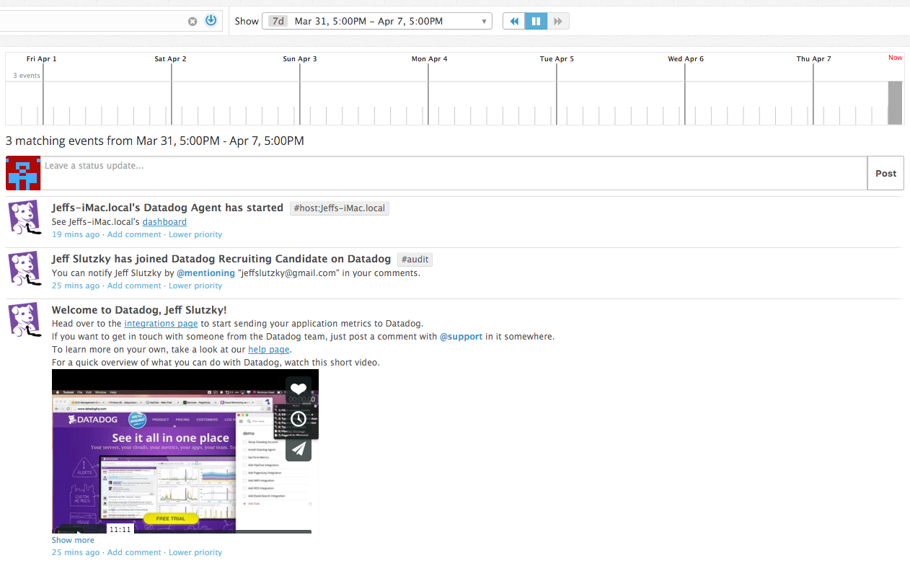
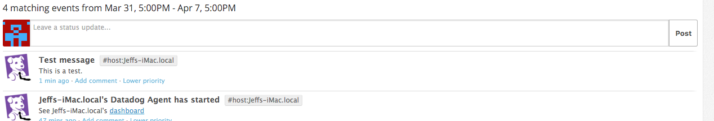
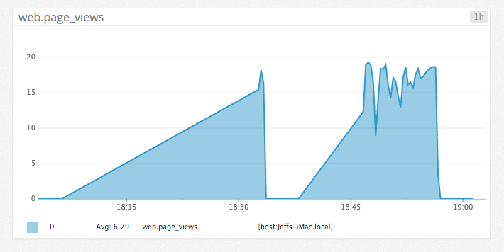

Your answers to the questions go here.

# Level 1
* Sign up for Datadog (use "Datadog Recruiting Candidate" in the "Company" field), get the agent reporting metrics from your local machine.

* Bonus question: what is the agent?
The agent is the software that runs on the user's computer, monitors the metrics, and sends them to Datadog. It consists of the Collector, Dogstatsd, and the Forwarder.

* Submit an event via the API.

Code: see level1.rb.

* Get an event to appear in your email inbox (the email address you signed up for the account with)

# Level 2
* I ran a load test on my app locally with the following command:
ab -n 10000 -c 10 http://127.0.0.1:3000/

Here is the resulting graph: https://p.datadoghq.com/sb/1a534df4e-6235422a4d

