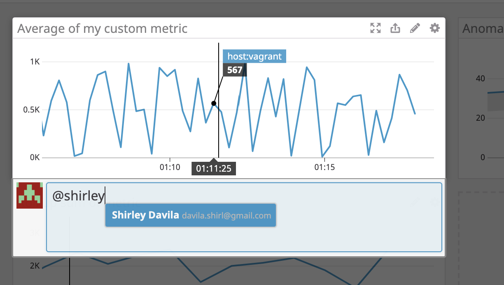
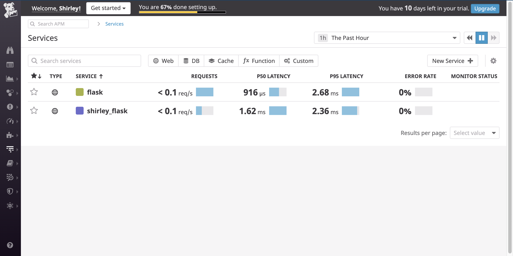
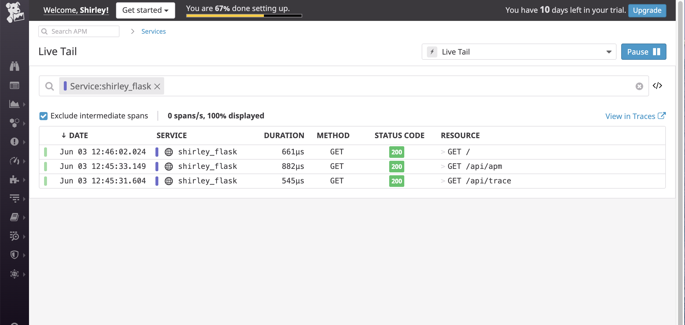
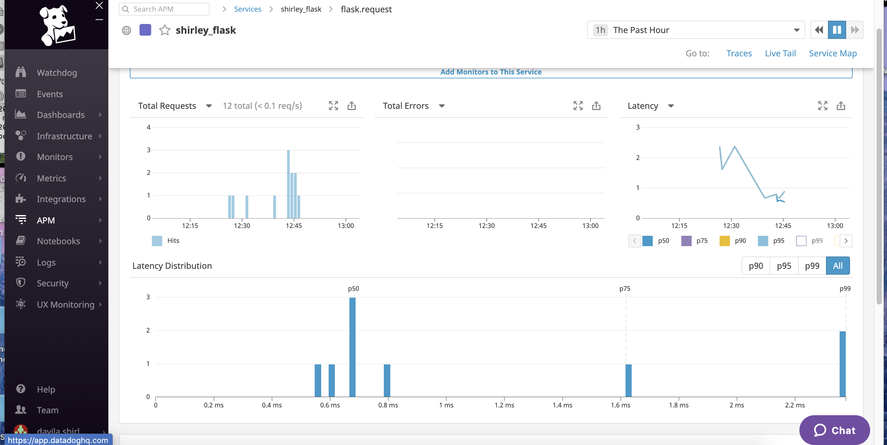
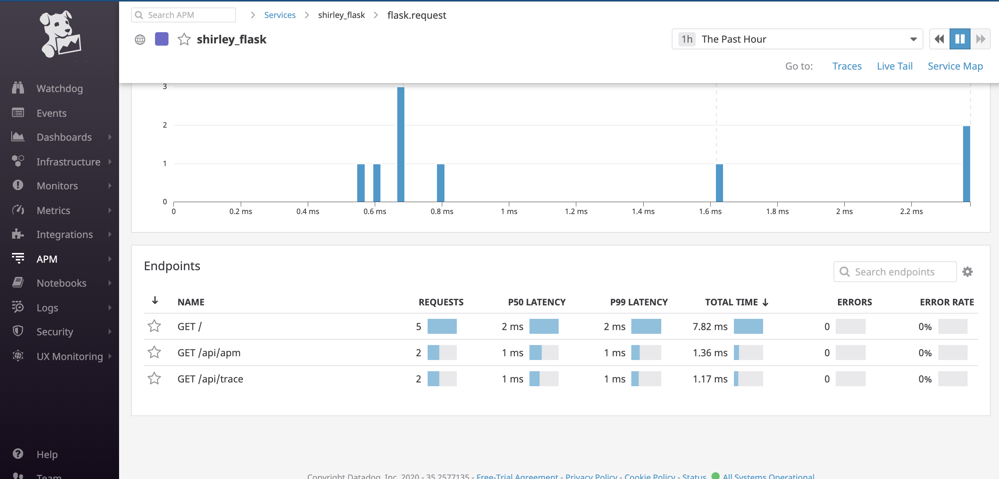
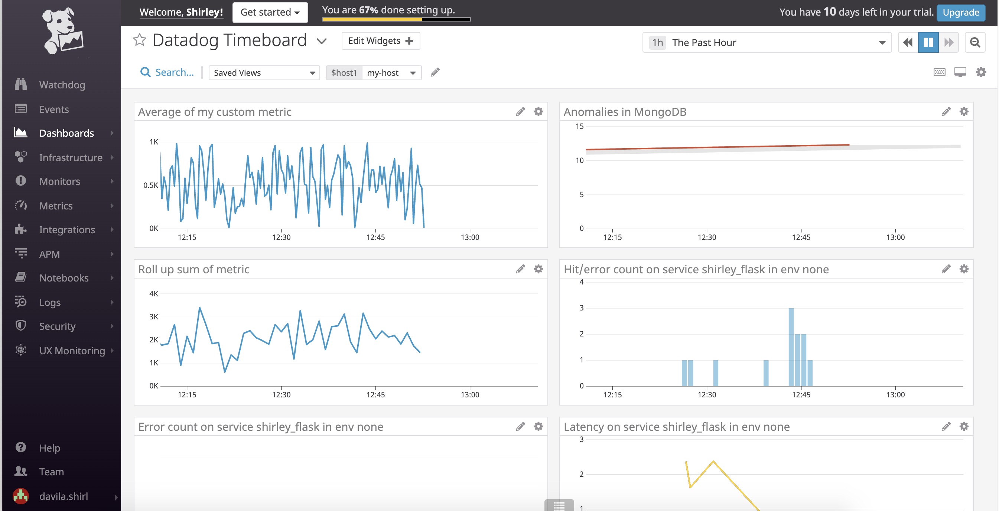

# A Hands-on Introduction to Datadog!
## About Datadog
If you've never heard or used the Datadog monitoring tool, this is a great exercise for you to tackle. 
In this tutorial, I will spin up a VM, sign up for Datadog, and begin using their tools. 

## Setting up your environment
You can utilize any OS/host that you would like to complete this exercise. However, the Datadog team has recommend one of the following approaches:
  * You can spin up a fresh linux VM via Vagrant or other tools so that you don’t run into any OS or dependency issues.
  * You can utilize a Containerized approach with Docker for Linux and our dockerized Datadog Agent image.

#### I decided to spin up a VM via Vagrant. I followed the instructions from [here.](https://www.vagrantup.com/intro/getting-started)

## Signing up for Datadog
Sign up for [Datadog](https://www.datadoghq.com/) (use “Datadog Recruiting Candidate” in the “Company” field), get the Agent reporting metrics from your local machine.
Once you sign up, you'll follow the steps to install the Datadog agent on your machine.

## Let's collect some metrics
After you're done signing up and have the agent installed. You will now go to the Datadog Infrastructure/[Host Map page.](https://docs.datadoghq.com/infrastructure/hostmap/) 
Here you are able to see your hosts!

1. Now that we have all that set up. Let's add some tags in the Agent config file (/etc/datadog-agent/datadog.yaml) and make sure the tags appear on the Host Map page in Datadog app. I also went ahead and changed my hostname in the same file to "datadogwork". 


2. Now the next step is to install a database on your machine (MongoDB, MySQL, or PostgreSQL) and then install the respective Datadog integration for that database! I decided to go with MongoDB.
  * I first installed MongoDB on my box using the instructions [here](https://docs.mongodb.com/manual/tutorial/install-mongodb-on-ubuntu/)
  * I then followed the [instructions for Mongo](https://docs.datadoghq.com/integrations/mongo/) 
  * I went to the integrations page on the Datadog app and searched for Mongodb
  * I followed the instructions, created a new user in Mongodb and made a [conf file](mongodb_conf.yaml)
  * After I made all these changes I restarted the agent: sudo service datadog-agent restart

3. After you're done setting up your database. It's time to do some work! 
* Let's create a custom Agent check that submits a metric named my_metric with a random value between 0 and 1000. 
We can use this [guide](https://docs.datadoghq.com/developers/write_agent_check/?tab=agentv6v7) to create our new agent.
The first step is to create our two files (make sure the two have the same name)!
    * [conf.d/custom_mymetric.yaml](custom_mymetric.yaml)
    * [checks.d/custom_mymetric.yaml](custom_mymetric.py)
    
* Now let's change your check's collection interval so that it only submits the metric once every 45 seconds. 
    * I imported threading/timer and made changes to my python script [custom_mymetric_45sec.py](custom_mymetric_45sec.py)
* Bonus Round - Let's change the collection interval without modifying the Python check file we created. 
    * In order to change the collection interval without modifying the python file you have to [update the custom_mymetric.yaml file](custom_mymetric_45sec.yaml)

In order to check if your metric is working - you can enter "sudo service datadog-agent status".


### WOOHOO! We are done with that section! Now on to the next one!! 

## Let's actually see some data! 

Let's utilize the Datadog API to create a Timeboard!

The first steps to this is installing python, installing the datadog module, and running a command found [here.](https://docs.datadoghq.com/api/) We're also going to use this [documentation](https://docs.datadoghq.com/api/v1/dashboards/) to get an example script to create our timeboard.  

After finishing up will all the pre-requisites, we create the python scripts. 

1. Let's create a timeboard for our custom metric over our Host with a python script
You can check if your board was created if you check the Dashboard List on the Datadog App. 
Script: [custom metric scoped over your host](custom_metricavghost.py)


2. Any metric from the Integration on your Database (I used [the documentation for MongoDB](https://docs.datadoghq.com/integrations/mongo/)) with the anomaly function applied.
Script: [custom metric db anomaly](custom_metricdbanomaly.py)


3. Your custom metric with the rollup function applied to sum up all the points for the past hour into one bucket
Please be sure, when submitting your hiring challenge, to include the script that you've used to create this Timeboard.
Script: [custom Metric Roll Up Sum](custom_metricRollUpSum.py)


4. The whole time board script is [here](TheWholeTimeboard.py)


Once this is created, let's access the Dashboard from your Dashboard List in the UI:

Let's change some settings. Let's set the Timeboard's timeframe to the past 5 minutes. 


To do this we need to go to each individual graph and edit the time to 5 min. 

Take a snapshot of this graph and use the @ notation to send it to yourself. 

We need to right click on the graph and select "Annotate this graph"




Bonus Question: What is the Anomaly graph displaying?
The Anomaly graph is displaying what's expected in gray based on historical trends and the actual data real time. 
It detects anything out of the norm!

## Now let's monitor our data! 
Since you’ve already caught your test metric going above 800 once, you don’t want to have to continually watch this dashboard to be alerted when it goes above 800 again. So let’s make life easier by creating a monitor.

Create a new Metric Monitor that watches the average of your custom metric (my_metric) and will alert if it’s above the following values over the past 5 minutes:

Warning threshold of 500
Alerting threshold of 800
And also ensure that it will notify you if there is No Data for this query over the past 10m.
Please configure the monitor’s message so that it will:

Send you an email whenever the monitor triggers.

Create different messages based on whether the monitor is in an Alert, Warning, or No Data state.

Include the metric value that caused the monitor to trigger and host ip when the Monitor triggers an Alert state.

When this monitor sends you an email notification, take a screenshot of the email that it sends you.

Bonus Question: Since this monitor is going to alert pretty often, you don’t want to be alerted when you are out of the office. Set up two scheduled downtimes for this monitor:

One that silences it from 7pm to 9am daily on M-F,
And one that silences it all day on Sat-Sun.
Make sure that your email is notified when you schedule the downtime and take a screenshot of that notification.

## Let's collect some APM data!
Given the following Flask app (or any Python/Ruby/Go app of your choice) , let's instrument it using Datadog’s APM solution:
```
from flask import Flask
import logging
import sys

# Have flask use stdout as the logger
main_logger = logging.getLogger()
main_logger.setLevel(logging.DEBUG)
c = logging.StreamHandler(sys.stdout)
formatter = logging.Formatter('%(asctime)s - %(name)s - %(levelname)s - %(message)s')
c.setFormatter(formatter)
main_logger.addHandler(c)

app = Flask(__name__)

@app.route('/')
def api_entry():
    return 'Entrypoint to the Application'

@app.route('/api/apm')
def apm_endpoint():
    return 'Getting APM Started'

@app.route('/api/trace')
def trace_endpoint():
    return 'Posting Traces'

if __name__ == '__main__':
    app.run(host='0.0.0.0', port='5050')
```

First step is to save this Flask app. I saved it as flask_app.py.

Let's then follow the instructions from this [page](https://docs.datadoghq.com/getting_started/tracing/).

1. sudo apt-get install python-pip
2. pip install flask
3. pip install ddtrace

Let's also enable apm in the agents config file aka datadog.yaml. 
```
apm_config:
    enabled: true
```
and then restart the agent
```
sudo service datadog-agent restart
```
Now we're ready to run our app!

```DD_SERVICE=Shirley_Flask ddtrace-run python flask_app.py```

Once we do this, we need to start testing by opening a new terminal window and sending your traces to Datadog using curl. 

```curl http://0.0.0.0:5050/```
```curl http://0.0.0.0:5050/api/trace```
```curl http://0.0.0.0:5050/api/apm```

Now, we have to give it about 3-5 minutes for it to appear in the Service List page on the UI. 



To view a live tail of all the commands you're testing - click on Live tail.



If we then click on the service, we can view the graphs detailing everything about that service.





We can then add those graphs onto our existing timeboard we created earlier, by clicking on the export button and "Export to dashboard"


We can then generate a public url by clicking on the gear on the left hand side of your selected dashboard and generate a link. 
Public URL:[Datadog Dashboard](https://p.datadoghq.com/sb/gj2ioi4cfzha9ar7-c7f213a5d752e37c59b579937902063d)

