Your answers to the questions go here.
## Answers by Christoph Berlin - Thank you
* Below in-line after the Questions section

Questions:
## Collecting Metrics:

* Add tags in the Agent config file and show us a screenshot of your host and its tags on the Host Map page in Datadog.
* Install a database on your machine (MongoDB, MySQL, or PostgreSQL) and then install the respective Datadog integration for that database.
* Create a custom Agent check that submits a metric named my_metric with a random value between 0 and 1000.
* Change your check's collection interval so that it only submits the metric once every 45 seconds.
* **Bonus Question** Can you change the collection interval without modifying the Python check file you created?

* **Answers**:

<https://github.com/DataDog/heroku-buildpack-datadog>
* created using ruby heroku app entirely the stack, against the EU location, given the trend towards cloud native and less infrastructure, and ease of code deployment / services like database to save time. the associated ruby app contains also
the scripts for testing, and is self contained - so anyone can run through this
exercise and just deploy.

* latest Heroku Free Dyno Stack and PostgreSQL
* heroku config variables
DD_DYNO_HOST:true
DD_SERVICE_NAME: datadog-test-christ
DD_SITE: datadoghq.eu
DD_TAGS: env:datadog-test-app
Addons:         heroku-postgresql:hobby-dev

* hostmap

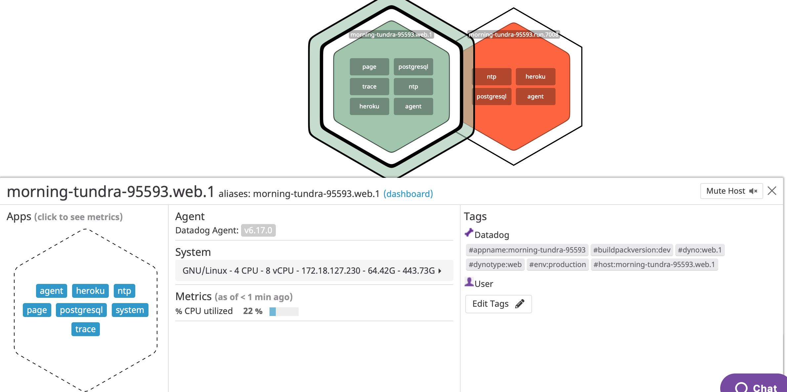

* postgres Integration - required PostgreSQL Logic in Pre-Run

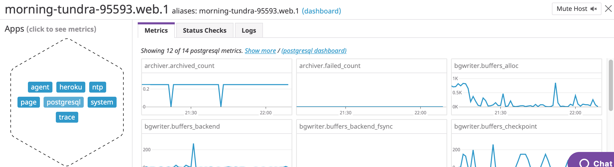

* custom heroku mymetric agentcheck / bonus question answer interval adjusted with yaml per deploy on heroku

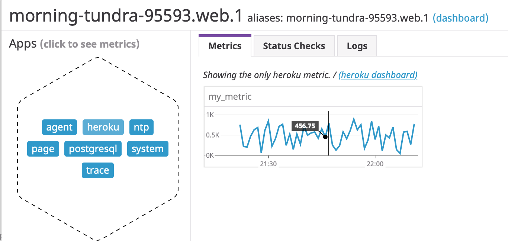

* see scripts assets and issues around UX and Documentation, also some caching and purging issues to load the latest buildpack version into the ephemeral dynos
issues      
       https://github.com/DataDog/dd-agent/issues/3864
       https://github.com/DataDog/heroku-buildpack-datadog/issues/175
       discrepancy initially loading old 6.x version agent, cleaned up with slug
       purging and re-deployed with verison 7.x Datadog Agent. Maintainer is aware.

## Visualizing Data:

Utilise the Datadog API to create a Timeboard that contains:

* Your custom metric scoped over your host.
* Any metric from the Integration on your Database with the anomaly function applied.
* Your custom metric with the rollup function applied to sum up all the points for the past hour into one bucket

Please be sure, when submitting your hiring challenge, to include the script that you've used to create this Timeboard.

Once this is created, access the Dashboard from your Dashboard List in the UI:

* Set the Timeboard's timeframe to the past 5 minutes
* Take a snapshot of this graph and use the @ notation to send it to yourself.
* **Bonus Question**: What is the Anomaly graph displaying?

* **Answers**:
* used https://docs.datadoghq.com/dashboards/guide/timeboard-api-doc/?tab=bash
 used the example timebaord shell script to wrap around curl and set my api and app keys up, and then build 3 graphs into the heroku timeboard from the my_metric setup in the my_metric.py custom agent check with random values, then edited the dashboards according to the alert timeframe. Anomaly is displaying basic algorithm, and deviation of 3 from the heroku my_metric set earlier in the exerchise.

 * timeboard
  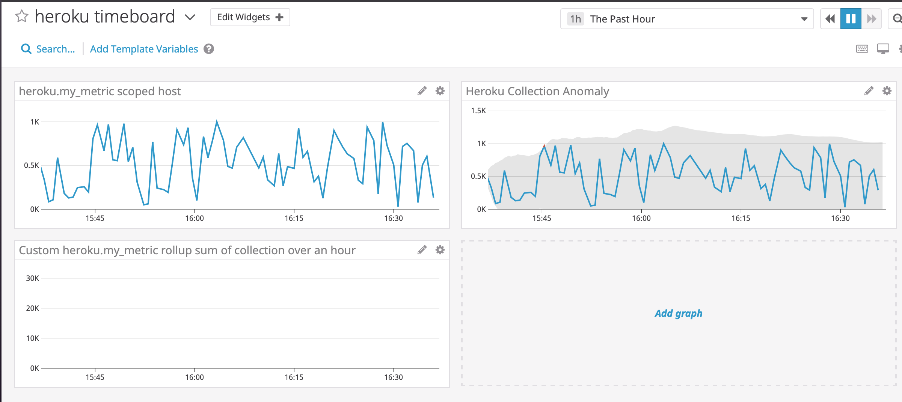
  * snapshot with email alert (blocked out personal email for privacy)
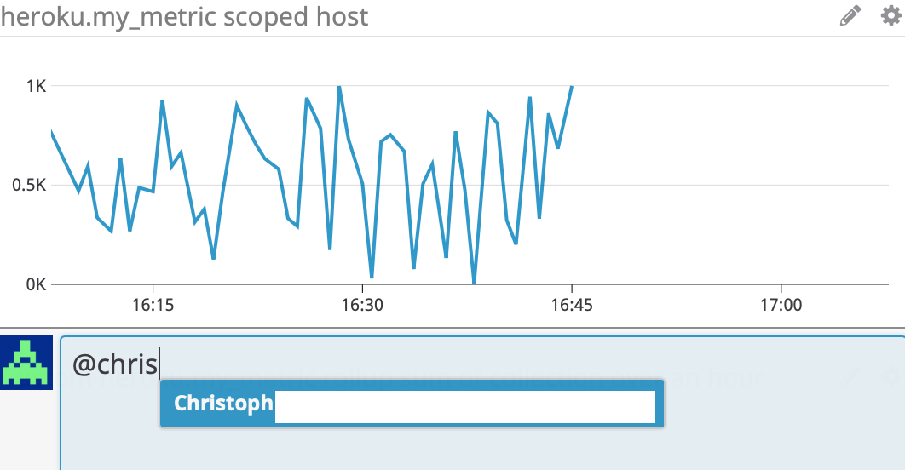
 * 5 min metric breakdown using timeframe specificed
 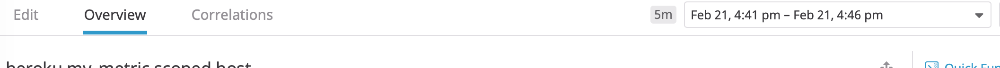
 * 5 min detailed view
 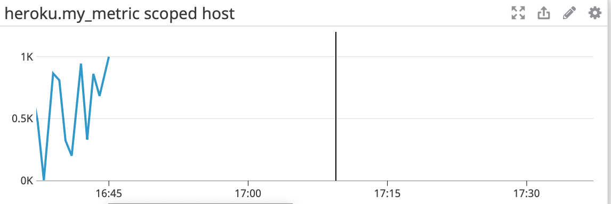

  ## Monitoring Data

Since you’ve already caught your test metric going above 800 once, you don’t want to have to continually watch this dashboard to be alerted when it goes above 800 again. So let’s make life easier by creating a monitor.

Create a new Metric Monitor that watches the average of your custom metric (my_metric) and will alert if it’s above the following values over the past 5 minutes:

* Warning threshold of 500
* Alerting threshold of 800
* And also ensure that it will notify you if there is No Data for this query over the past 10m.

Please configure the monitor’s message so that it will:

* Send you an email whenever the monitor triggers.
* Create different messages based on whether the monitor is in an Alert, Warning, or No Data state.
* Include the metric value that caused the monitor to trigger and host ip when the Monitor triggers an Alert state.
* When this monitor sends you an email notification, take a screenshot of the email that it sends you.

* **Bonus Question**: Since this monitor is going to alert pretty often, you don’t want to be alerted when you are out of the office. Set up two scheduled downtimes for this monitor:

  * One that silences it from 7pm to 9am daily on M-F,
  * And one that silences it all day on Sat-Sun.
  * Make sure that your email is notified when you schedule the downtime and take a screenshot of that notification.

* **Answers**:
* monitor customisation of warning 800 / 500 through the Monitoring UI
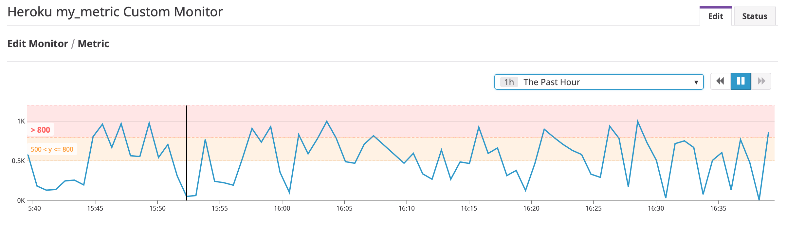

* monitor configuration (for the sake of reducing emails, and screenshots - only included the main emails for downtime, and scheduling, everything works, conditioning, different levels of warning etc).
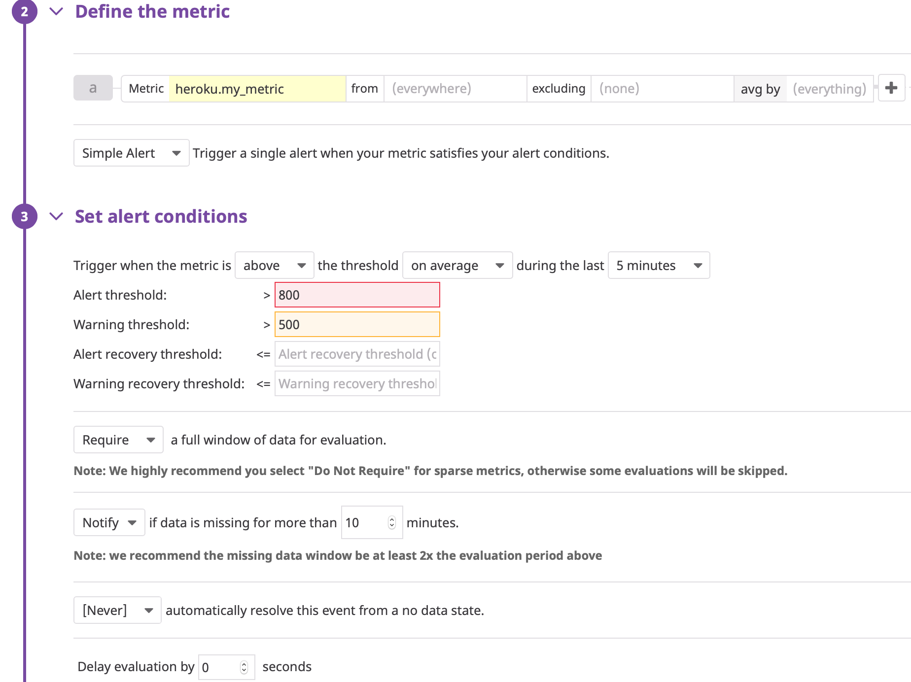

* monitor downtime email
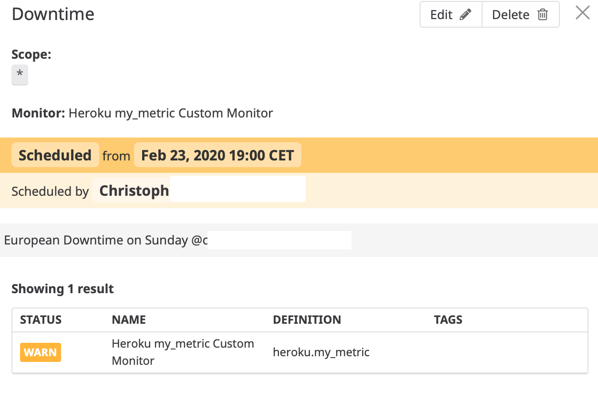
* monitor downtime email recepient
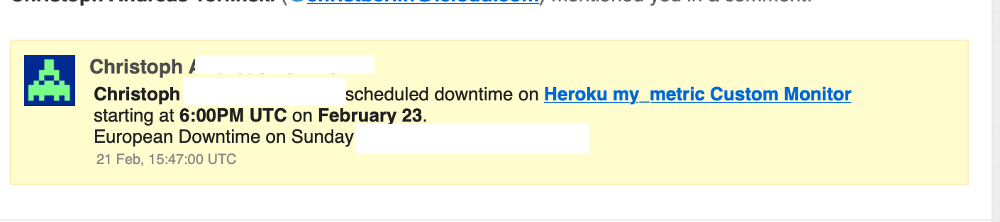
* nodata monitor triggered (to setup email/team)
from the triggered view:
The monitor has been missing data for the last 10m

The monitor was last triggered at Fri Feb 21 2020 15:55:30 UTC.

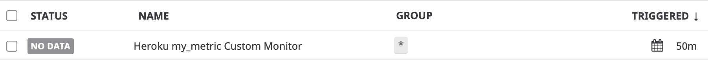
* i muted the alerts for week in the manage monitor tool and edited accordingly, scheduling it as requested in the UI.

## Collecting APM Data:
* **Answers**:

* for APM i used the ruby app with dogstatd and ddtrace (Ruby Gems)for the sinatra web request , the heroku app is supplied (i refactored a ruby  demo cloud foundry app to run on Heroku) stimulated the Web GET requests for some Latency Measurement. The Heroku App is included here and easily pushed for testing - service name is hello-datadog-heroku-ruby. You will find the repo as part of my answers containing
the ruby app named "datadog-test-christ" inside the hello-datadog-heroku-ruby-app asset - anyone can repurpose it.

* overview of service and resources fetching pages with GET/
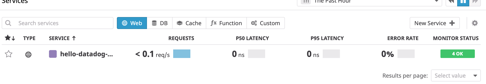
* traces dashboard
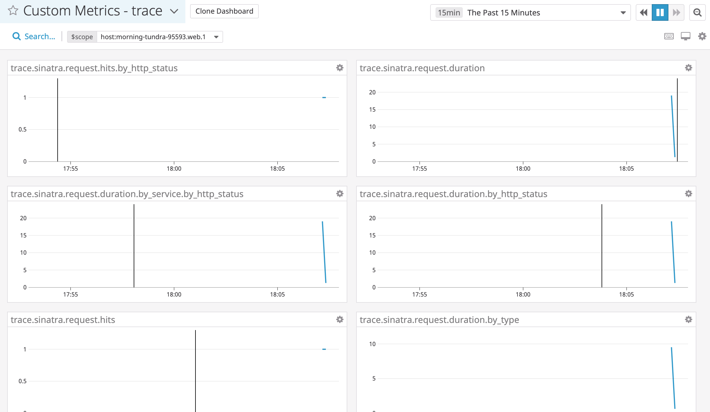
* sinatra traces oview (triggered with HTTP requests / browser)
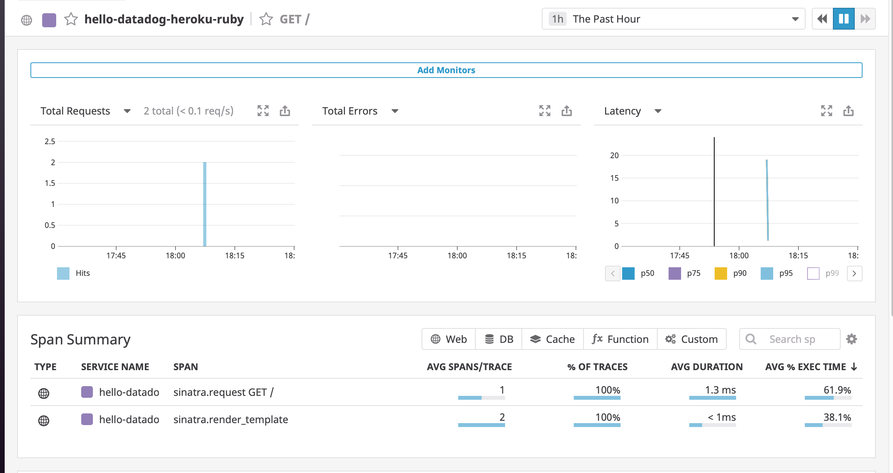
* satus codes and durations

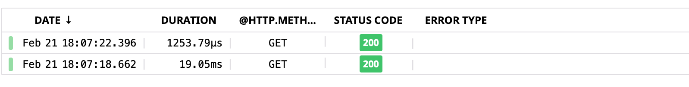

## Final Question:

Datadog has been used in a lot of creative ways in the past. We’ve written some blog posts about using Datadog to monitor the NYC Subway System, Pokemon Go, and even office restroom availability!

* **Answer**: a way to monitor cloud native applications and their respective data center / power / energy consumption based on geographic locality would be nice - given the trend to sustainability, and running applications with the planet in mind.

Thanks for the exercise - it was a nice refresher, there is not much infrastructure on the Heroku Dyno as it's ephemeral Infrastructre  (basic CPU,Disk,Network)

* infra listing summary for a dyno based web app
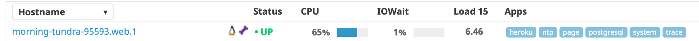
