## The Exercise

##Antonio Farias - Datadog Recruiting Candidate##

Thank you for this opportunity! This was a fun way to learn about Datadog.

If any questions, do contact me at antonio0farias@gmail.com or (484) 326-6373.

## Questions

## Collecting Metrics:

After installing the agent in my Vagrant VM,

I added tags added at the agent level, to reflect my host,the dev environment, device and OS, networking information, and a service level tag that I could use across resources and components. I make more use of service level tags later on, to specify feature levels and to get a service map working.
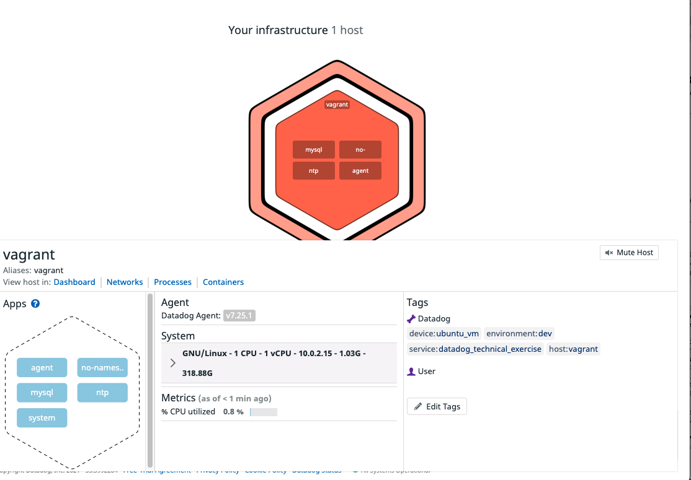

I installed a MySQL database and check that the Datadog integration is working correctly for it, using <code>sudo service datadog status</code>.

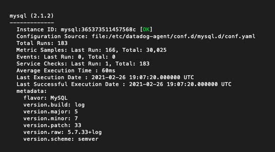

I tested a few inserts into a "pet" table I created, to double check that I could see some useful variables in a Datadog Dashboard.

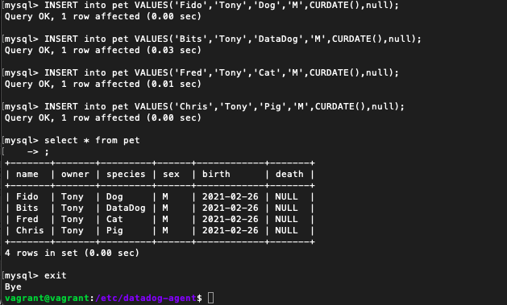

I then created a script to setup a custom metric called my_metric, outputting a random value between 0 and 1000. 
This can be setup by creating a custom script under <code>/etc/datadog-agent/checks.d/</code>
See my script below, also found under <code>supporting_code/custom_metric.py</code>

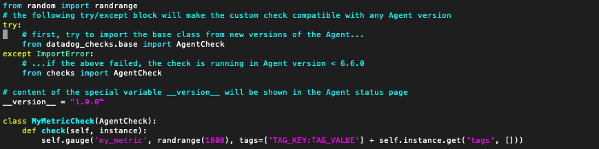

I then used the status check to verify that this custom_metric is being collected.

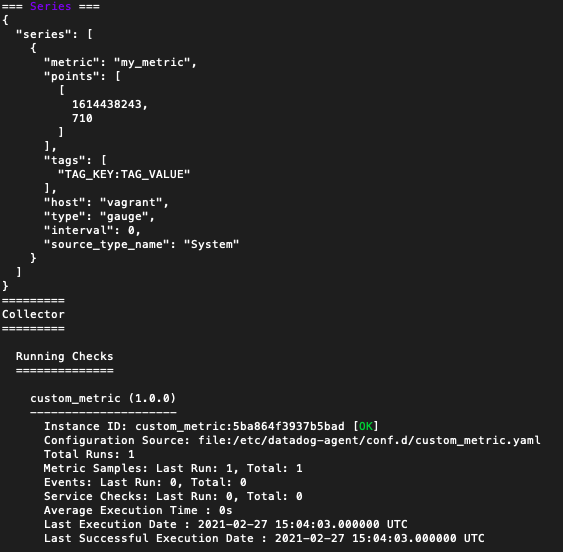

I decided to specify the custom collection interval directly in config, see below.
* **Bonus Question** Can you change the collection interval without modifying the Python check file you created?

**Yes.** Yes, this is specified at the instance level in conf.d/custom_metric.yaml (this filename matches the name under of the file under checks.d). It can be specified like below.

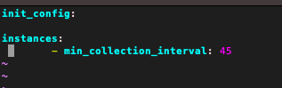

## Visualizing Data:

Setup a Timeboard with three different widgets. They display: 
1. my custom my_metric, 
2. my reads from the MySQL database, which I can trigger using a select query, and 
3. the sum of my_metric values, rolled into hourly buckets (a discrete roll-up, not a moving window rollup).
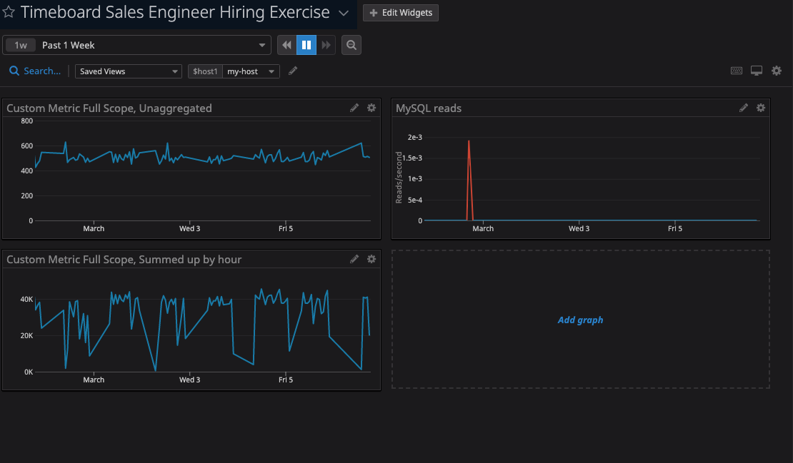

* **Bonus Question**: What is the Anomaly graph displaying?

Per the Datadog docs, the anomaly function makes a forecast based on prior values of the time series (i.e., an ARIMA style forecast).
In my particular implementation, with the parameters I passed in, the anomaly function flags anything that is two standard deviations or more from the usual value of the timeseries.
Since row reads for this DB are generally 0 (I request reads manually and only sporadically), values of a few reads per second show up as anomaly.
 Were this DB to start having a few reads per second more consistently, they would not show up as anomalies anymore (ie, the anomaly function adapts to the trend of data patterns recently).

## Monitoring Data

I set up the notification using the Monitor UI, though I did see there was an API for it- since it wasn't requested, and monitor setup is often one-off and custom,
the UI felt like a better way to do the job :).

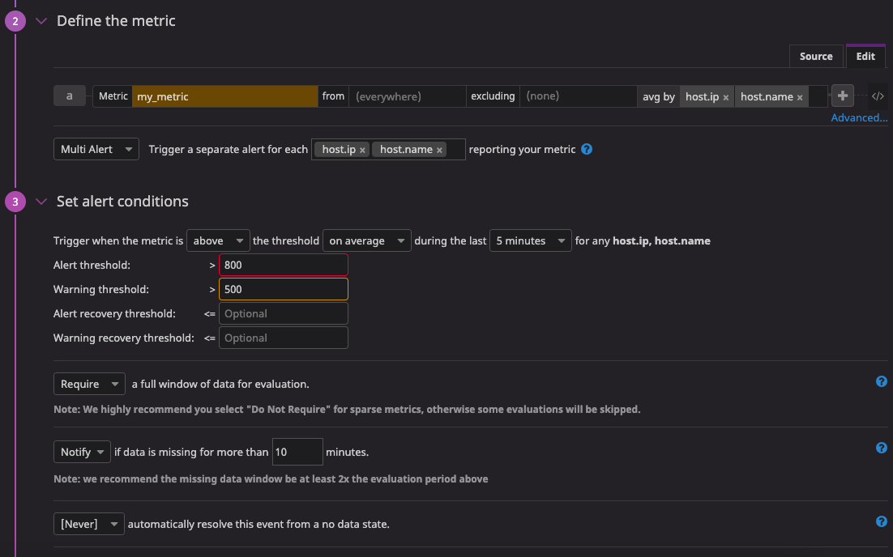
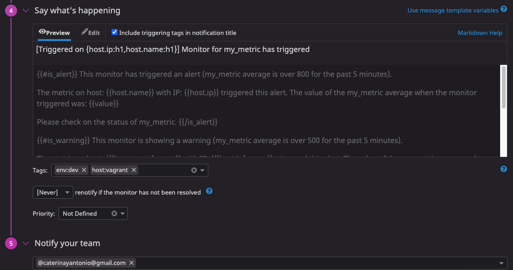

Then I triggered the notifications for the three different notification types.

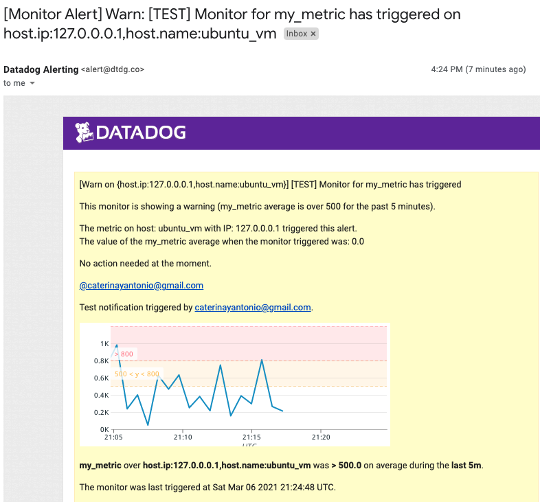
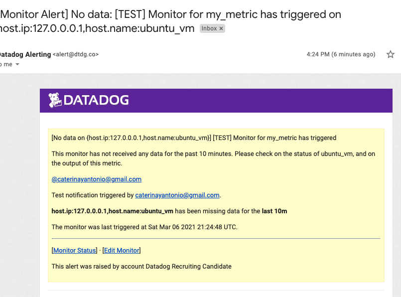
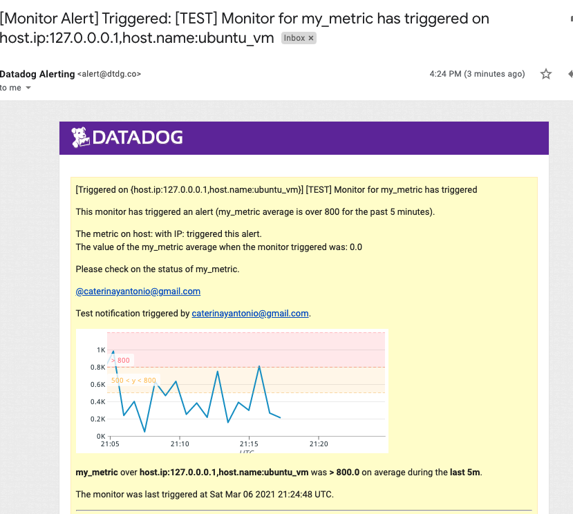

Later on, I recorded some examples of real, triggered notifications:

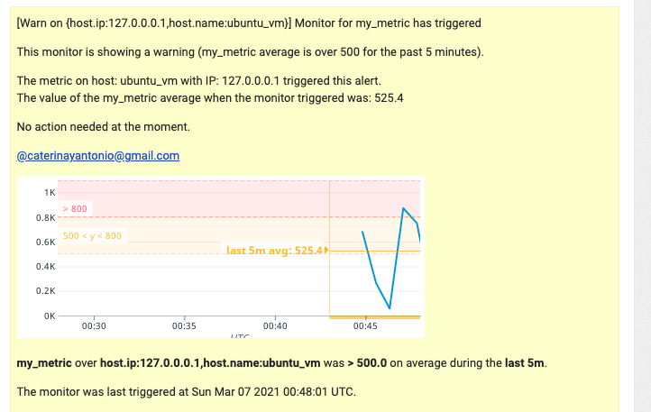
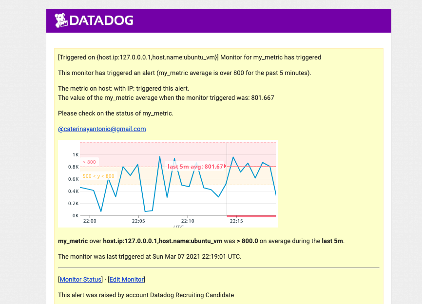

* **Bonus Question**: Since this monitor is going to alert pretty often, you don’t want to be alerted when you are out of the office. Set up two scheduled downtimes for this monitor.

I setup both of these notifications and took the screenshots below:

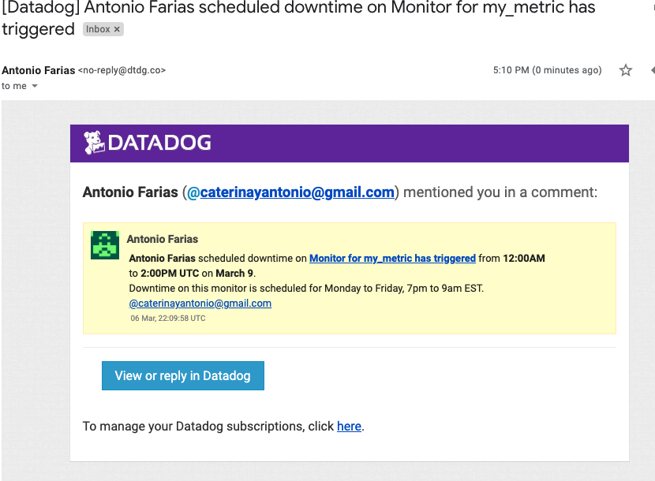
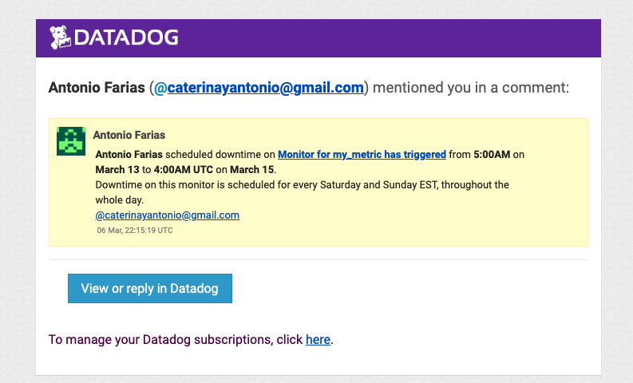

## Collecting APM Data:

Though I read about using the Python middleware API, I prefer to manually instrument, which is how I would instrument something that was production-ready.
To the Python script, I added an endpoint that makes a select query call to my earlier pet database table, in order to measure the performance.
The script is under <code>/supportingCode/apm.py</code> and was run using <code> DD_SERVICE="flask-exercise" DD_ENV="dev"  DD_PROFILING_ENABLED=true ddtrace-run python3 apmApp.py </code>.

I also tagged my running flask server and the MySQL database (in its conf.d config file), in order to play around with the service map feature.
This allowed me to get a view of my test app, with the ability to drill down into the performance of individual resources. I included a view of this service map in the Dashboard I created.
 
See below for a Dashboard of APM and Performance metrics :
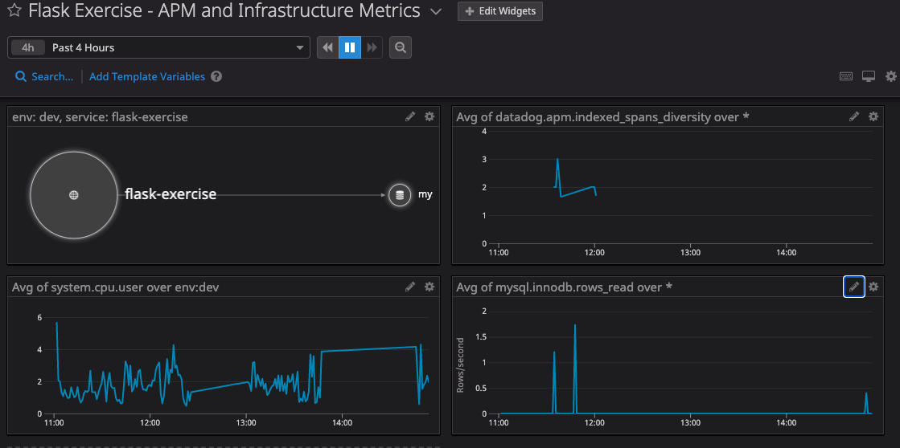

* **Bonus Question**: What is the difference between a Service and a Resource?

Per the Datadog docs:

* A service represents a grouping of endpoints, queries, geared around a particular domain. Its definition within the Datadog is similar to the definition of the builiding blocks in a micro-services
architecture. For example, in my Flask Example, both the DB and the Flask App are considered services, as shown by the below service list feature.
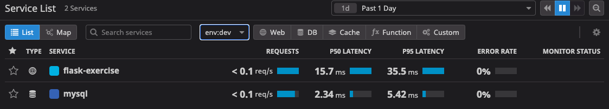
* A resource is a particular action for a given service (typically an individual endpoint or query). For example, the endpoint that triggers the query to the pet table of my database is a resource.
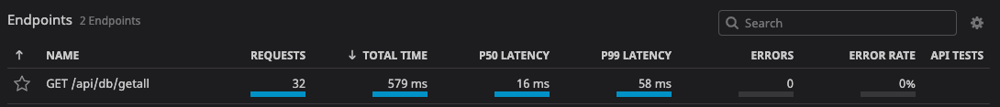

## Final Question:

Theoretically, it seems that any distributed system that could be instrumented for measuring and making less opaque, could use Datadog as a useful tool in -  measuring variables, tagging different services to make groupings, and then analyzing those grouped variables in a human readable way. Alongside other features of alerting, automated/synthetic testing, etc.

One application that seems interesting to me is monitoring the weather and birds, a nerdy quarantine hobby of mine (in 2020, I saw 93 unique species of birds). 
One of the best ways to view birds, particularly certain species, is to attract them using a backyard feeder. Many of these were in my family’s backyard in Massachusetts, on a balcony feeder. I would like to correlate certain weather patterns with the appearance of particular birds at the backyard feeder.

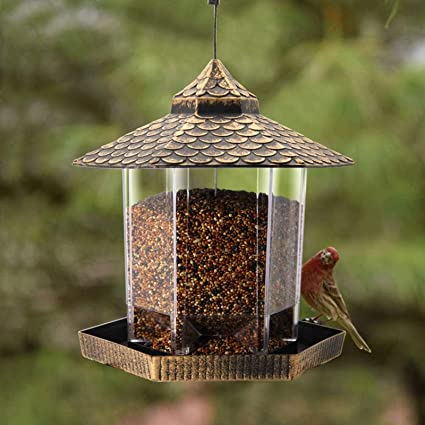

Here’s what a system design for this could look like, to illustrate how I think Datadog could be used to solve the problem :

1. Set up sensor devices - needs to be on an OS where I can install the DataDog agent, not sure if there’s compatibility with a RealTimeOS; but certainly with a standard Unix distribution. Have a temperature sensor collecting temperature, another device collecting humidity humidity, a device to measure the incidence of light (photo_incidence) on the balcony.

2. Tag all of these as one service. Sidenote: across a larger property (ie a park), it seems like I could geotag each, if I had different instances of a measuring service .

3. Setup a bird feeder with sensors at its access points, with a camera to capture images of the access. When the bird feeder is accessed, log this as an event, perhaps with an associated link. We can use Datadog APM to register this event.
 It would be great if we could identify the bird from the images using AI - it seems like the best systems still have some trouble, so this may involve some manual tagging at the moment.
 From Datadog’s perspective it does not make a difference whether the bird is manually identified, we can log the associated event with the time stamp of observation, when the bird is identified.
 Capture this bird event as a list of **bird_sighting** .
To avoid multiple events from the bird, we could clean the data or aggregate events: https://docs.datadoghq.com/events/#event-query-language

4. Setup a Timeboard plotting temperature, humidity, photo_incidence. 

5. We now have a searchable Timeboard! We can search for particular **bird_sighting** event , filtered by particular logged out features. We can overlay these events on the particular weather patterns above.
 
With this tool we can now try to correlate particular bird-sightings, in almost real-time, with the particular climatic events around us. Here's one hypothesis to test - dark-eyed juncos are known as snowbirds, because they appear around the first snowfall. But does the data actually validate this? Can we correlate the appearance of these birds, with snow, or with a temperature drop? Or would we have to add in additional measured variables? Unlike other systems that purely measure historical correlation, Datadog allows us to monitor in real-time - a large number of dark-eyed juncos on a somewhat hot day would be something of an anomaly, and our system could flag it!

