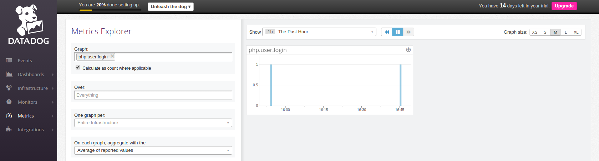
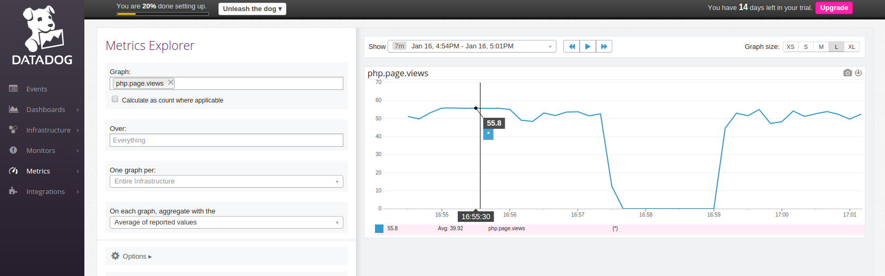

## Answers

### Level 1

* Sign up for Datadog (use "Datadog Recruiting Candidate" in the "Company" field), get the agent reporting metrics from your local machine.


[Metrics](https://app.datadoghq.com/dash/host/45359250?live=true&page=0&is_auto=false&from_ts=1452962740892&to_ts=1452966340892&tile_size=m)

* Bonus question: what is the agent?

The agent is the service that runs in the host and collects events and metrics to send to Data Dog for monitoring. It is comprised of three main parts:
* Collector: Checks for integrations and monitors system metrics.
* Dogstatsd: Back-end server that receives custom metrics from an application.
* Forwarder: Captures the data from the collector and dogstatsd and sets it to be sent to Data Dog.

There is also a supervisor process that controls and ties everything together.

* Submit an event via the API.

```
#!/bin/sh

curl  -X POST -H "Content-type: application/json" \
-d '{
      "title": "Can you hear me DD?",
      "text": "First event test.",
      "priority": "normal",
      "tags": ["environment:test"],
      "alert_type": "info"
  }' \
'https://app.datadoghq.com/api/v1/events?api_key=f22de6751add6c71161b8582cac9e488'
```


[First event](https://app.datadoghq.com/event/event?id=365550117954820773)

* Get an event to appear in your email inbox (the email address you signed up for the account with)

```
#!/bin/sh

curl  -X POST -H "Content-type: application/json" \
-d '{
      "title": "Email notification from event",
      "text": "@jorgerc85@gmail.com. Check this out!",
      "priority": "normal",
      "tags": ["environment:test"],
      "alert_type": "info"
  }' \
'https://app.datadoghq.com/api/v1/events?api_key=f22de6751add6c71161b8582cac9e488'
```


[Email event](https://app.datadoghq.com/event/event?id=365560316136793562)

### Level 2

* Take a simple web app ([in any of our supported languages](http://docs.datadoghq.com/libraries/)) that you've already built and instrument your code with dogstatsd. This will create **metrics**.

For this section I will use a web app with a PHP backend.

To install dogstatsd I added this dependency to `composer.json`:

```
"datadog/php-datadogstatsd": "0.3.*"
```

To increment a counter I added this to the login function of the UserController:

```
public function login()
{
  \Datadogstatsd::increment('php.user.login');

  ...
}
```


[Dogstatsd PHP user login](https://app.datadoghq.com/metric/explorer?live=true&page=0&is_auto=false&from_ts=1452965171334&to_ts=1452968771334&tile_size=m&exp_metric=php.user.login&exp_scope=&exp_agg=avg&exp_row_type=metric)

* While running a load test (see References) for a few minutes, visualize page views per second. Send us the link to this graph!

To run the load test I used this command:

```
ab -t 360 -c 100 http://localhost:8000/patients
```


To monitor the page views I added this to the patients route function:

```
Route::get('/patients', function () {
    Datadogstatsd::increment('php.page.views');

    ...
});
```


[Dogstatsd PHP page views](https://app.datadoghq.com/metric/explorer?live=false&page=0&is_auto=false&from_ts=1452974048178&to_ts=1452974471940&tile_size=l&exp_metric=php.page.views&exp_scope=&exp_agg=avg&exp_row_type=metric&exp_calc_as_rate=true)
