# First: 
Thanks. I wish to thank you for letting me so far in the process.

In the "**/00_ASSETS**" folder, you will find:
* The 26 Screenshots in "**./01_SCREENSHOTS**"
* The Scripts I wrote and may or may not have used in "**./02_SCRIPTS**"
* The app used for the APM "**./03_APM**"

## Prerequisites:
I configured a fresh Linux Ubuntu 17.04 VM via the Oracle Virtual Box tool so I would have no OS or dependency issues and I could type my way out of almost anything using the terminal.
I then signed up for a Datadog free account and downloaded everything I needed: the dd-agent, a MySQL cluster, the latest Python and Node.js versions.
Once everything was settled and clean, I started working on the Datadog application. 

## Collecting Metrics:
### Host Dashboard [here](https://app.datadoghq.com/dash/host/549363268)
 * Tags: I modified the "_datadog.conf.yaml_" file, uncommented the Tags option and added three tags I thought meaningful for this host.

__Vim interface of the .conf.yaml file__

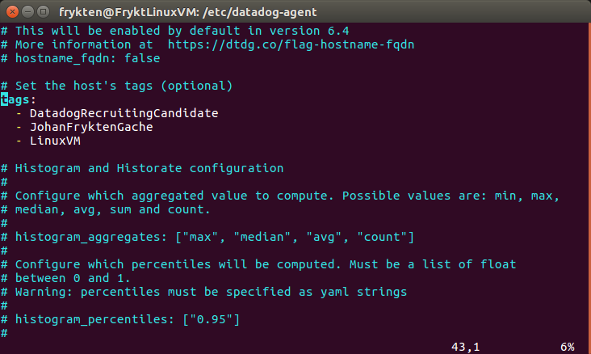

__DD's Host Map page__

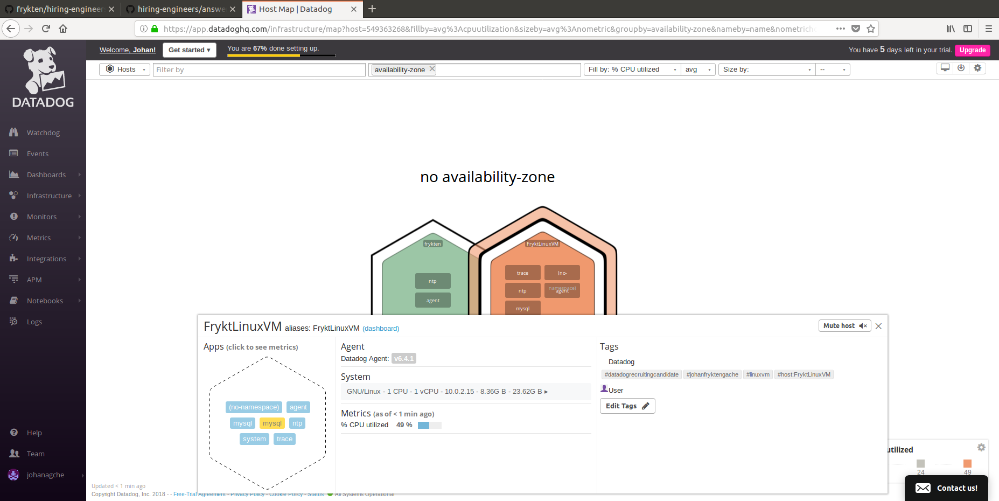

 * Custom Check: To create a Custom Agent check we need two files.
One in the "_/etc/datadog-agent/checks.d_" and one in the "_/etc/datadog-agent/conf.d_". We'll see about the later at the next question. 
The first one is a .py document and is a small Python Program just to check a random number between 0 and 1000.

__.py Check__

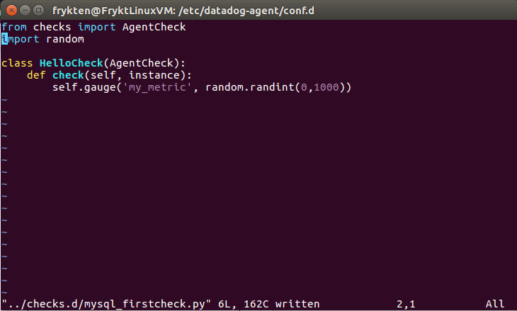

 * Collection interval: The second file is a .yaml configuration file for the check we have previously written. Here we will only tell the Agent to change the default collection_interval to 45 thus changing the rate of submission of the metric.

__.yaml Config__

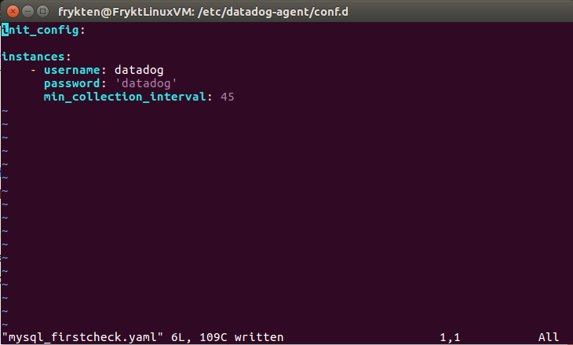

 * **Bonus**:
Elsewhere on the "_app.datadoghq.com/metric/summary_", we have access to the metadata of our metrics, therefore, we can modify the interval. It also does not modify _neither_ our Python Check File nor our Yaml Config File!

__Web App Metadata__

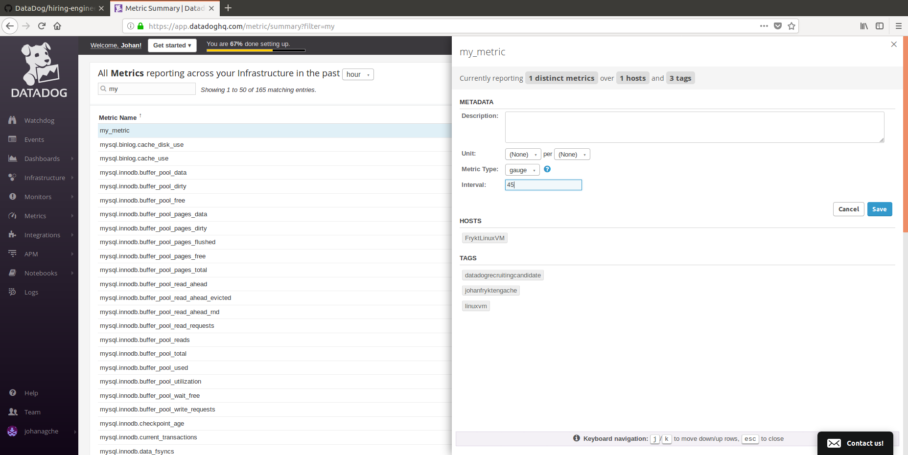

## Visualizing Data:
### Timeboard [here](https://app.datadoghq.com/dash/883660/test-timeboard-v01)
 * Timeboard: I created a Timeboard on the Web Application with three graphs:

__My custom metric scoped__

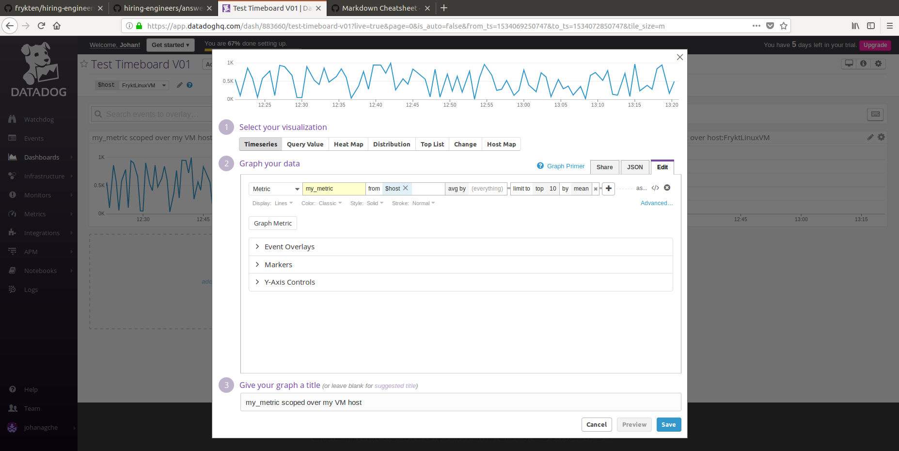

__The CPU Time from the mysql.performance__

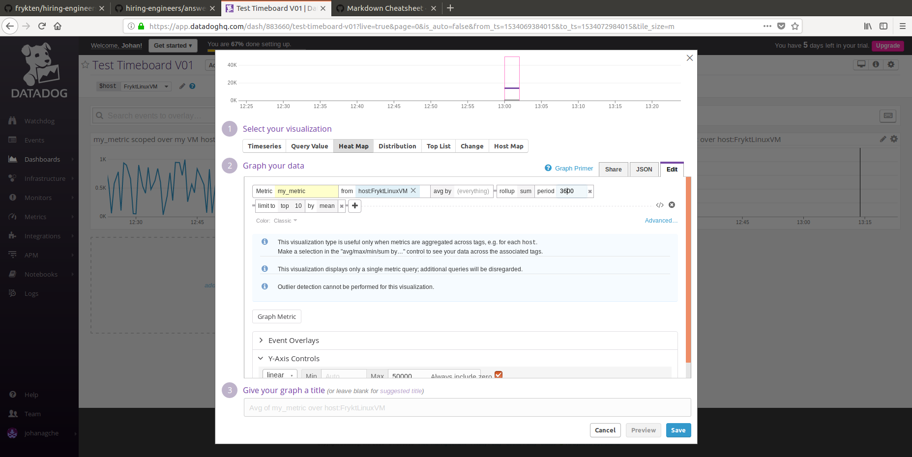

__My custom metric with a rollup function__

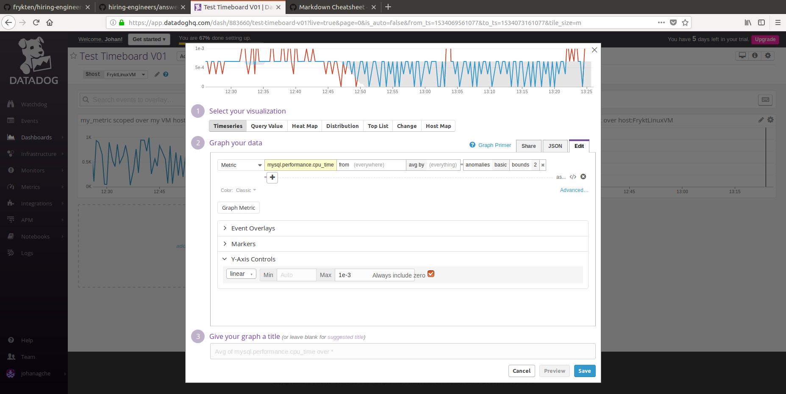
As for the script, since I did not use the API but the UI, I wrote one to fetch my Timeboard which is used as a save. The Curl request was:
> curl "https://api.dash/883660?api_key=c2a059719d8ed637828c38c8d5699d44&application_key=f291ca2d769bbda165f427a823f004980a00ffeb"

I stored the JSON result and the Curl request in my "**00_ASSETS/02_SCRIPTS**" folder as "[**Script_Timeboard_Get**](00_ASSETS/02_SCRIPTS/Script_Timeboard_Get.txt)"
__Curl GET request__

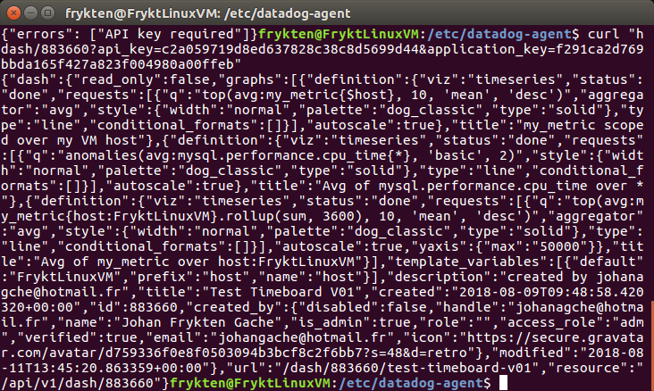

 * Timeboard's timeframe: Unfortunately, I didn't find how to modify the timeframe to _less than 1h_.

 * Snapshot:

__Snapshot sent to my account__

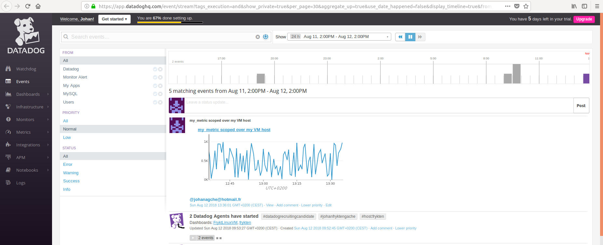

 * **Bonus**:
The MySql Performance CPU with Anomaly Detection graph is displaying what is normal - the _greyed area_ - and what is not - the _red flagged points_ outside of this greyed area. The greyed area shows a trend of what should be next and by such detects what should not be: strange checks that are way too high or way too low.

## Monitoring Data:
### Monitor [here](https://app.datadoghq.com/monitors/5882259)
 * Creating a Metric Monitor: Setting the monitor was very straightforward for this step.

__Creation of the Monitor__

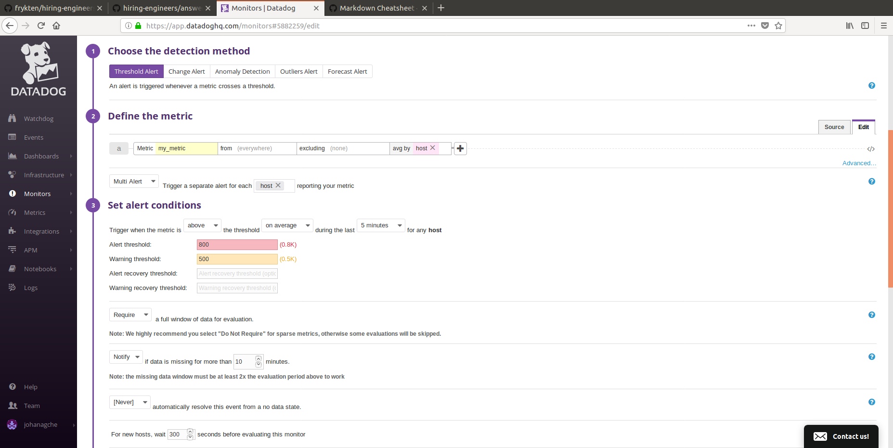

The result is also pretty clear:

__On the DD Web App__

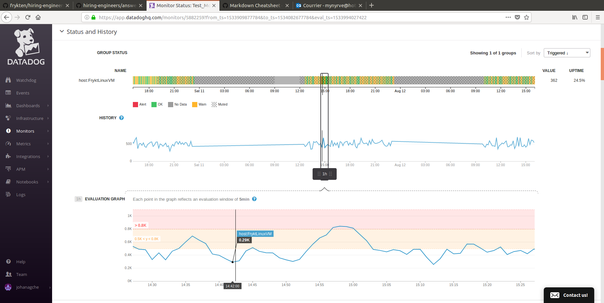

 * Sending an email: Writing the email script is also neat. We need the Team/Person(s) to contact tag(s) (here: _@me_). We can program some conditions with brackets and *#is_something* (here: *{{#is_alert}}* for example). And we have access to some variables like the "_{{value}}_" we are monitoring and our "_{{host.ip}}_" to know where is the problem.

__Scripted Email__

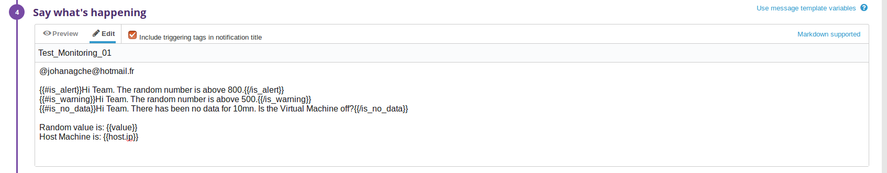

__Result in my mailbox!__

 * **Bonus**: Manage Downtime
On the UI, just a switch to /monitors#/downtime and we're good to schedule some for the nights and the weekends.

__Downtimes UI Editing__

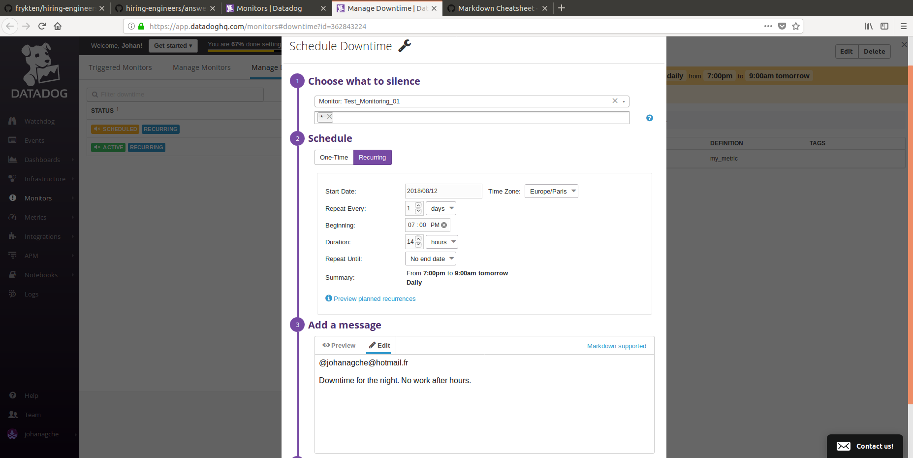

__The Two Downtimes scheduled__

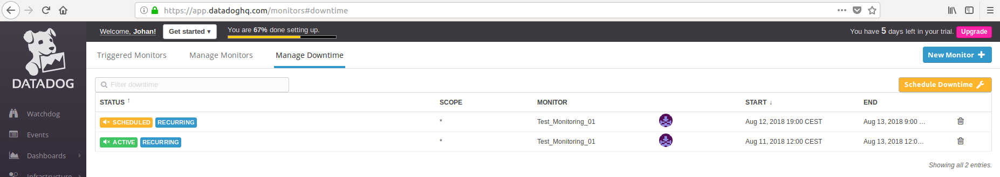

__Arrival on themail box!__

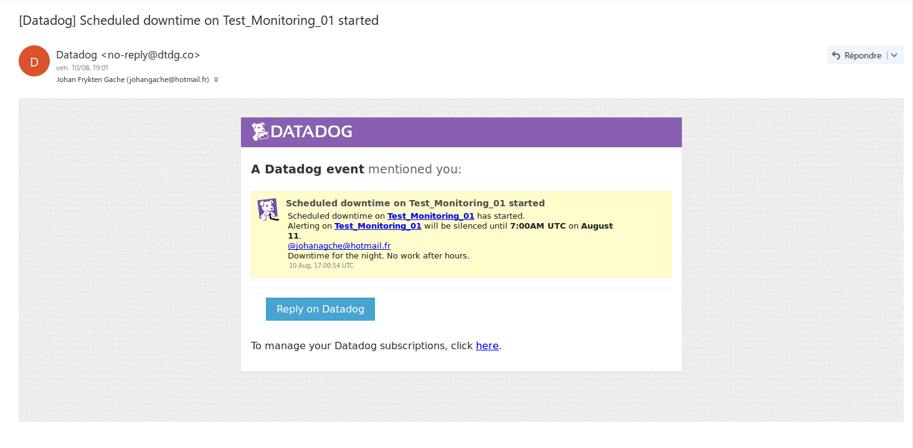

## Collecting APM Data:
 * I wrote a Node.js app with the DD-trace Middleware to test the Datadog's APM solution.
The script was little but efficient enough:

> const tracer = require('dd-trace').init({
>  debug: true
>})
>const span = tracer.startSpan('web.request')
>
>span.setTag('http.url', '/login')
>span.finish()

__Working on the host__

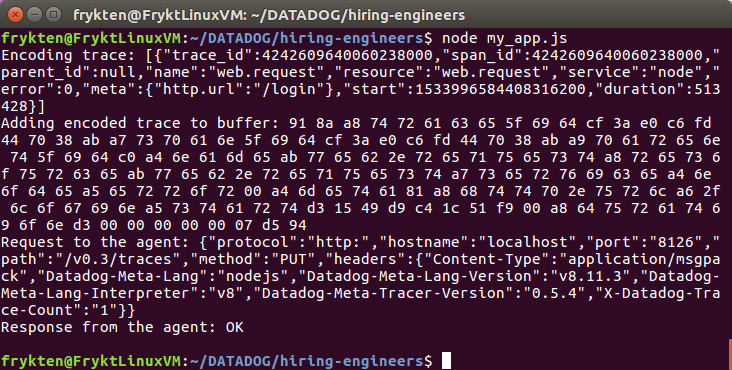

__And on Datadog's Application__

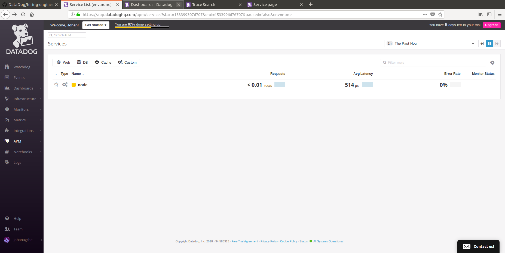

__First check__

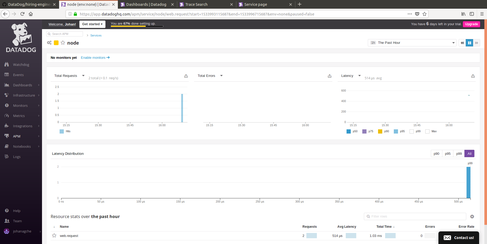

However, strangely, I did not understand how to create a new Dashboard with both the APM and the Infrastructure Metrics. There was an APM Metrics option on the Dashboard Creation's page but it was greyed and disabled...

 * **Bonus**:
From what I understood, a service is _a process or a set of processes_ like a database and a resource is _an action for a service_ like a query to a database. Therefore, a service can have _multiple_ resources.

## Final Question:
I could think of an application for Spotify, Deezer, Qobuz or maybe even Youtube to monitor what kind of music we listen to and at which hours. Maybe I listen to classical in the morning and metal in the evening _usually_ and that on days where I listen to jazz _before_ going to sleep I lose my will sleep! Or if I _start_ the day with some cult badass 70s rock maybe I will want to eat more at lunch...
Well... You said "_creative_".

Once again, thank you. I hope I wrote enough and was able to be clear and sound.
