# Answers

## Collecting metrics

### Setup tags
*1.Add tags in the Agent config file and show us a screenshot of your host and its tags on the Host Map page in Datadog.*

First let's start with one container, the tags *env:local type:docker-container* have been added, and can be seen in the event page

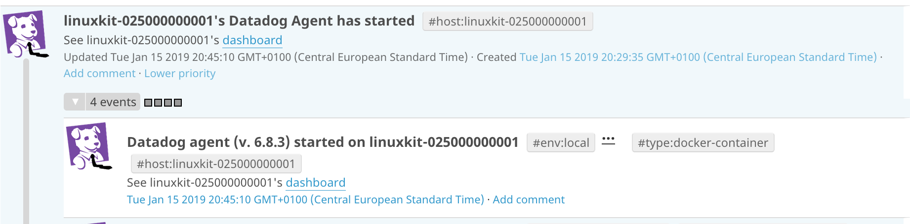

For our VM, the tags *myvirtualboxtag, env:local, type:virtualbox* have also been added and can be seen in the host map page as seen below.

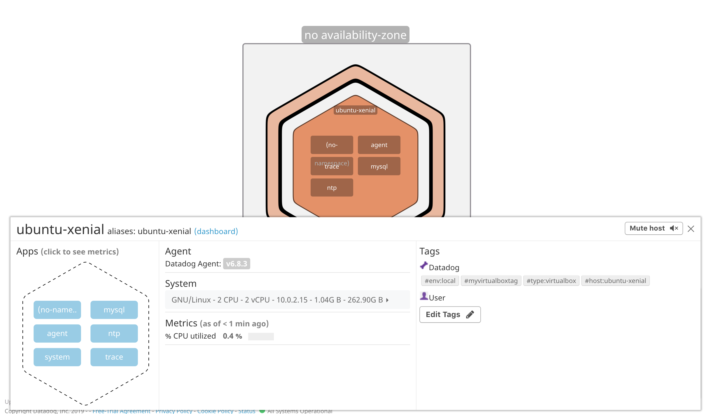

Documentation:
- [Tag Doc](https://docs.datadoghq.com/tagging/)

### Monitor database
*2.Install a database on your machine (MongoDB, MySQL, or PostgreSQL) and then install the respective Datadog integration for that database.*

Let's choose MySQL and install it on our VM.

We now need to configure of MySQL through a few steps.
- Create datadog user within MySQL server `CREATE USER 'datadog'@'localhost' IDENTIFIED BY '123456';` 
- Configure user `GRANT REPLICATION CLIENT ON *.* TO 'datadog'@'localhost';`, `GRANT PROCESS ON *.* TO 'datadog'@'localhost';`, `ALTER USER 'datadog'@'localhost' WITH MAX_USER_CONNECTIONS 5;`, `GRANT SELECT ON performance_schema.* TO 'datadog'@'localhost';`
- Check user creation with `mysql -u datadog --password=123456 -e "show status" | grep Uptime && echo -e "\033[0;32mMySQL user - OK\033[0m" || echo -e "\033[0;31mCannot connect to MySQL\033[0m"` and `mysql -u datadog --password=123456 -e "show slave status" && echo -e "\033[0;32mMySQL grant - OK\033[0m" || echo -e "\033[0;31mMissing REPLICATION CLIENT grant\033[0m"`

We now need to configure the datadog agent. Go on *datadog.yaml* in `/etc/datadog-agent/` and enable the *process_config*:

```
process_config:
#   A string indicating the enabled state of the Process Agent.
#   If "false" (the default) it will only collect containers.
#   If "true" it will collect containers and processes.
#   If "disabled" it will be disabled altogether and won't start.
   enabled: "true"
```

Then, go to relevant directory `cd /etc/datadog-agent/conf.d/mysql.d/` and edit `conf.yaml` file as below:
```
init_config:

instances:
    - server: 127.0.0.1
      user: datadog
      pass: '123456'
      port: 3306 # e.g. 3306
```

Now we can just restart the agent with this command:
```
sudo service datadog-agent restart
```

If you need to do some troubleshooting, here are two commands of interest:
```
sudo service datadog-agent status
sudo datadog-agent status
```

Documentation
- [Basic Agent Usage Doc](https://docs.datadoghq.com/agent/basic_agent_usage/ubuntu/?tab=agentv6)
- [Process Monitoring Doc](https://docs.datadoghq.com/graphing/infrastructure/process/?tab=linuxwindows)
- [MySQL Doc](https://docs.datadoghq.com/integrations/mysql/)

### Custom metric
*3.Create a custom Agent check that submits a metric named my_metric with a random value between 0 and 1000.*

You can find below the content of the python script located in `/etc/datadog-agent/checks.d/my_metric.py` that will collect a custom metric.
```
import 'random'

# the following try/except block will make the custom check compatible with any Agent version
try:
    # first, try to import the base class from old versions of the Agent...
    from checks import AgentCheck
except ImportError:
    # ...if the above failed, the check is running in Agent version 6 or later
    from datadog_checks.checks import AgentCheck

# content of the special variable __version__ will be shown in the Agent status page
__version__ = "1.0.0"


class HelloCheck(AgentCheck):
    def check(self, instance):
        self.gauge('my_metric', random.randint(1,1001))
```

This operation will create an agent that will collect a metric to send to datadog. In our case this is more a random number than a pure metric, but the concept is the same.

Documentation
- [Custom metric Doc](https://docs.datadoghq.com/developers/write_agent_check/?tab=agentv6)


### Edit interval
*4.Change your check's collection interval so that it only submits the metric once every 45 seconds.*

In the file `/etc/datadog-agent/conf.d/my_metric.yaml`, you have a parameter that control the interval to collect the metric. We can just edit it to our custom need. You can see below the content of this file.
```
init_config:

instances:
  - min_collection_interval: 45
```

Documentation
- [Metrics Doc](https://docs.datadoghq.com/developers/metrics/)

*5.Bonus Question Can you change the collection interval without modifying the Python check file you created?*

Yes, the collection interval can be edited from `/etc/datadog-agent/conf.d/my_metric.yaml` directly.

## Visualizing Data:

### Setup timeboard
*6.Utilize the Datadog API to create a Timeboard that contains:*
- *Your custom metric scoped over your host.*
- *Any metric from the Integration on your Database with the anomaly function applied.*
- *Your custom metric with the rollup function applied to sum up all the points for the past hour into one bucket*

First, you can start a *my_timeboard.py* script based on the template available in the doc [here](https://docs.datadoghq.com/api/?lang=python#create-a-timeboard). 

Then you can insert the credentials. Note that the app secret has to be generated [here](https://app.datadoghq.com/account/settings#api).

It is now time to create the various graphs you want to include. Here are the one used for this exercise.

```
graphs = [{
    "definition": {
        "events": [],
        "requests": [
            {"q": "my_metric{env:local}"}
        ],
        "viz": "timeseries"
    },
    "title": "my_metric"
},{
    "definition": {
        "events": [],
        "requests": [
            {"q": "anomalies(avg:mysql.performance.cpu_time{*}, 'basic', 3)"}
        ],
        "viz": "timeseries"
    },
    "title": "Avg CPU time"
},{
    "definition": {
        "events": [],
        "requests": [
            {"q": "sum:my_metric{env:local}.rollup(sum, 3600)"}
        ],
        "viz": "query_value"
    },
    "title": "Sum of my_metric /hour"
}]
```

For information, the complete file is [here](scripts/my_timeboard.py).

To conclude, execute the script with `python my_timeboard.py` and check in *Dashboards > Dashboard List* for your creation.

The final result could look like the screenshot below.

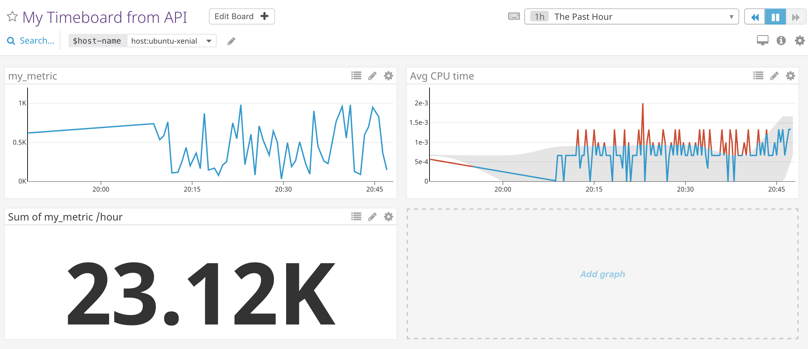

**Note:** To confirm that the dashboard is acting correctly, the rollup sum of your metric should be around: roll_up_period / metric_interval * average_metric_value = 3600 / 45 * 500 = 40,000. 

In my case, the value is around 23,000 which is not normal. Even though the roll_up_period is in seconds and we are below the maximum number of points (3600/45 < 350). It can be due to poor network that prevent metrics to be sent properly.

**Tips:** You can also develop a dashboard through the UI and extract some of the code used to create it. This may help to create new graphs faster when you are beginning with datadog.

**Note:** It is interesting to use the API to create a dashboard since it enables you to easily replicate it on multiple accounts. This could for instance be used for consulting practices and for solution integrators.

Documentation
- [API Doc](https://docs.datadoghq.com/api/?lang=python#overview)
- [Algorithms Doc](https://docs.datadoghq.com/graphing/functions/algorithms/#anomalies)
- [Rollup Doc](https://docs.datadoghq.com/graphing/functions/rollup/)
- [Anomalies Doc](https://docs.datadoghq.com/monitors/monitor_types/anomaly/)

### Navigate on the timeboard
*7.Once this is created, access the Dashboard from your Dashboard List in the UI:*
- *Set the Timeboard's timeframe to the past 5 minutes*
- *Take a snapshot of this graph and use the @ notation to send it to yourself.*
- *Bonus Question: What is the Anomaly graph displaying?*

The dashboard does not allow to select a timeframe of 5 minutes. The shortcuts have to be used. You can just reduce the timeframe with `alt + ]`.

Once setup to 5 min, go to any graph and click on the camera. Leave a comment and end up with @your_email

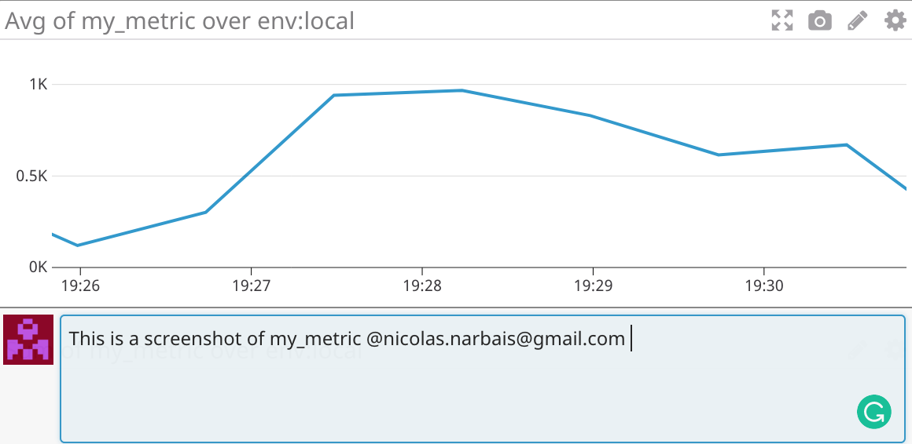

The snapshot received can be seen below.

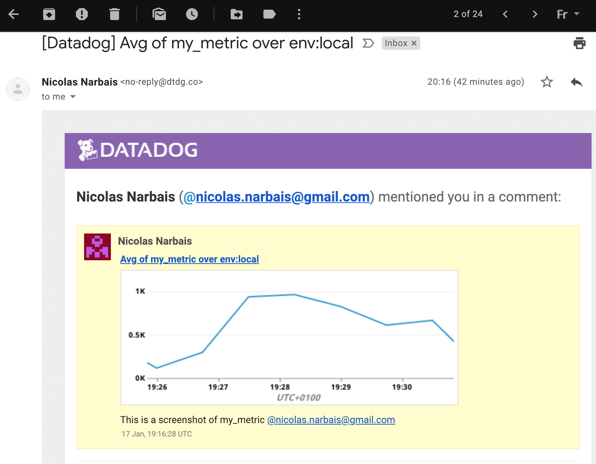


Quote:
> Anomaly detection is an algorithmic feature that allows you to identify when a metric is behaving differently than it has in the past, taking into account trends, seasonal day-of-week, and time-of-day patterns. It is well-suited for metrics with strong trends and recurring patterns that are hard or impossible to monitor with threshold-based alerting.

The anomaly graph is displaying the area that could be considered "normal". Everything out of this aera will then be an anomaly. Multiple algorithms are already included and a tolerance factor is provided. With little to no code, alerts can be triggered!

## Monitoring Data

### Setup alerts
*8.Create a new Metric Monitor that watches the average of your custom metric (my_metric) and will alert if it’s above the following values over the past 5 minutes:*
- *Warning threshold of 500*
- *Alerting threshold of 800*
- *And also ensure that it will notify you if there is No Data for this query over the past 10m.*

You can go to Monitors > New Monitor > Metric and fill the form as shown below.

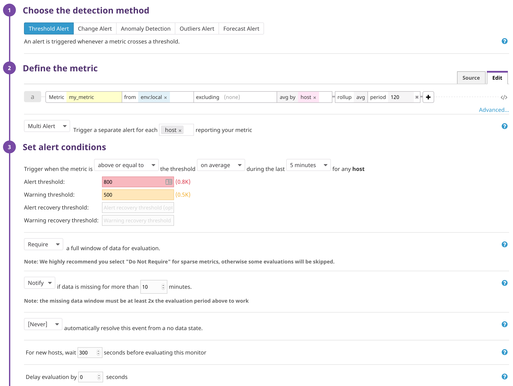

**Note:** By selecting multi alert per host, this will enable you to access the variables *host.name* and *host.ip* in the message.

Documentation
- [Alerting Doc](https://docs.datadoghq.com/monitors/)
- [Metric Monitor Doc](https://docs.datadoghq.com/monitors/monitor_types/metric/)


### Setup notifications
*9.Please configure the monitor’s message so that it will:*
- *Send you an email whenever the monitor triggers.*
- *Create different messages based on whether the monitor is in an Alert, Warning, or No Data state.*
- *Include the metric value that caused the monitor to trigger and host ip when the Monitor triggers an Alert state.*
- *When this monitor sends you an email notification, take a screenshot of the email that it sends you.*

In the section *Say what's happening*, insert the values below.

title:
```
[Datadog][my_metric] {{#is_no_data}}No data sent{{/is_no_data}}{{#is_warning}}Warning!{{/is_warning}}{{#is_alert}}Alert!{{/is_alert}}{{^is_no_data}}Levels too high{{/is_no_data}}
```

body: 
```
{{#is_no_data}}No data has been sent in a while!{{/is_no_data}}
{{^is_no_data}}The average of my_metric is too high.{{/is_no_data}}
{{#is_warning}}Just a warning on {{host.ip}}{{/is_warning}}
{{#is_alert}}Please check what is happening now!{{/is_alert}} 

___

For more info: 

- Current value: {{value}} 
- Warning: {{comparator}} {{warn_threshold}} 
- Alert: {{comparator}} {{threshold}} 
- Last trigger was on {{last_triggered_at}}
- Host name and ip {{host.name}}, {{host.ip}}

@your_email 

```

Once inserted, this is what the section should look like.

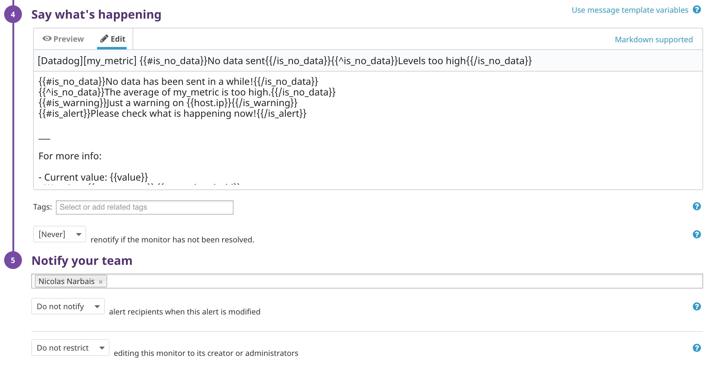

You will then receive emails such as the one below.

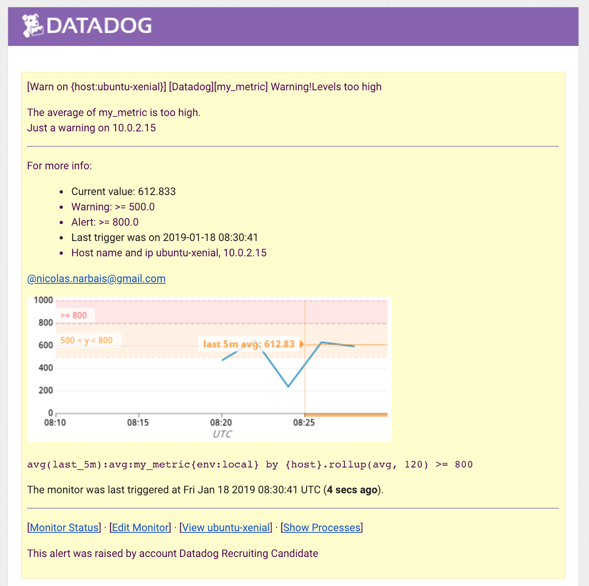

Documentation
- [Notification Doc](https://docs.datadoghq.com/monitors/notifications/?tab=is_alertis_warning)

### Downtime
*10.Bonus Question: Since this monitor is going to alert pretty often, you don’t want to be alerted when you are out of the office. Set up two scheduled downtimes for this monitor:*
- *One that silences it from 7pm to 9am daily on M-F,*
- *And one that silences it all day on Sat-Sun.*
- *Make sure that your email is notified when you schedule the downtime and take a screenshot of that notification.*

Go to *Monitors > Manage Downtime* and you can add 2 new downtime periods for alerts setup above. To see the configuration, check screenshot below.

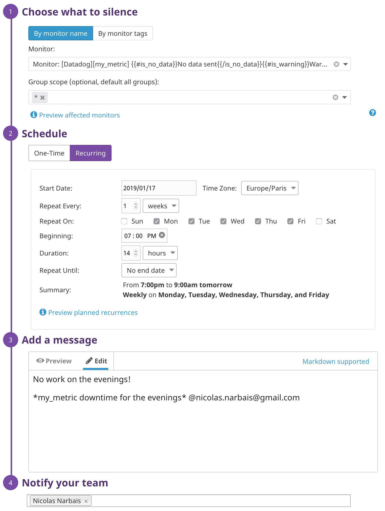
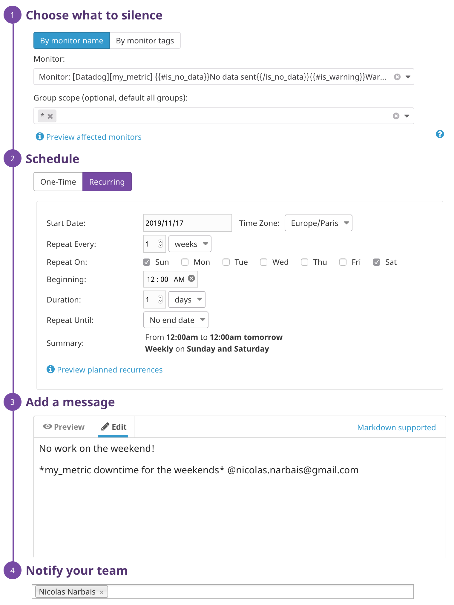

On specified date, you will receive such email.

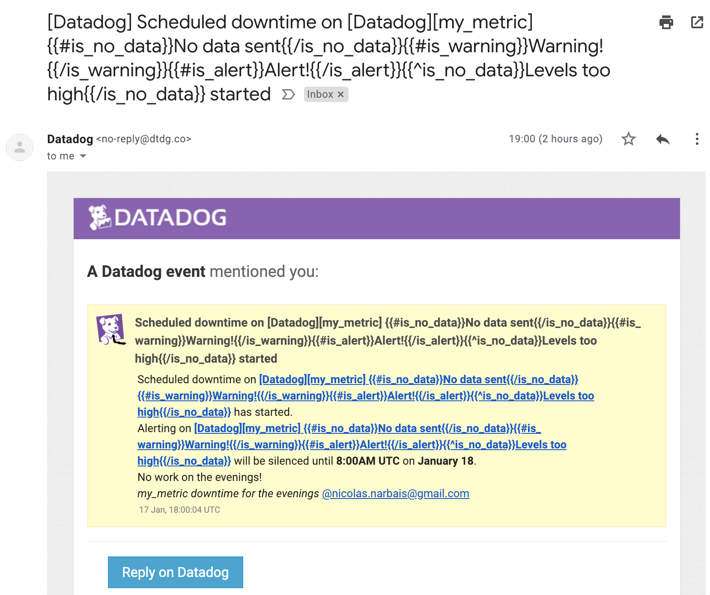

Documentation
- [Downtimes Doc](https://docs.datadoghq.com/monitors/downtimes/)

## Collection APM Data
*11.Given the following Flask app (or any Python/Ruby/Go app of your choice) instrument this using Datadog’s APM solution*

First, you can go to datadog.yaml and enable apm_config:
```
apm_config:
  enabled: true
```

Then once installed all the relevant dependencies with `pip`, start the application with `ddtrace-run python app.py` as shown below.

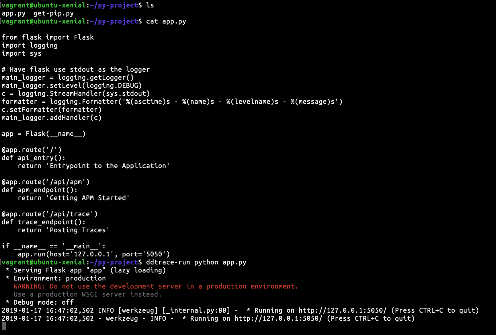

Go to *APM* on the Datadog interface and visualize the first metrics.

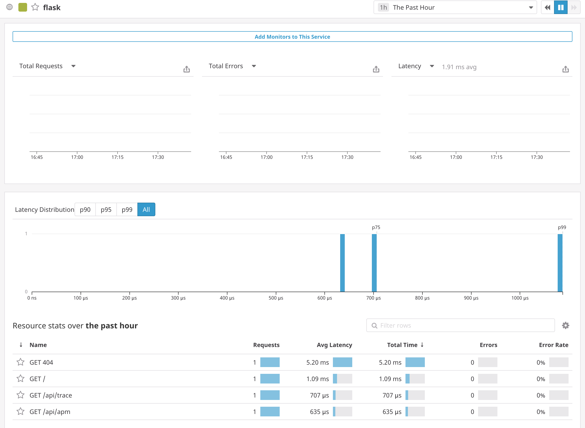

If you want to test the endpoints, you can execute this cmd:

```
curl http://127.0.0.1:5050/ && curl http://127.0.0.1:5050/api/apm && curl http://127.0.0.1:5050/api/trace && curl http://127.0.0.1:5050/notfound-url
```

**Note:** The flask app has been edited to be exposed on 127.0.0.1 instead of 0.0.0.0.

Documentation
- [APM Setup Doc](https://docs.datadoghq.com/agent/apm/?tab=agent630)
- [APM Doc](https://docs.datadoghq.com/tracing/)

*12.Bonus Question: What is the difference between a Service and a Resource?*

A service as shown in the datadog interface is in our case the flask application. It is a process that aims to answer a set of functions usually around the same theme (e.g. database, resource manager, etc.). (*Official definition*: A service is a set of processes that do the same job - for example a web framework or database.)

As we can see from the screenshot above, the resources are all the endpoints of the application. They represent all the queries to a service. (*Official definition*: A resource is a particular action for a given service (typically an individual endpoint or query.))

Please find below a dashboard that includes the infrastructure and APM metrics.

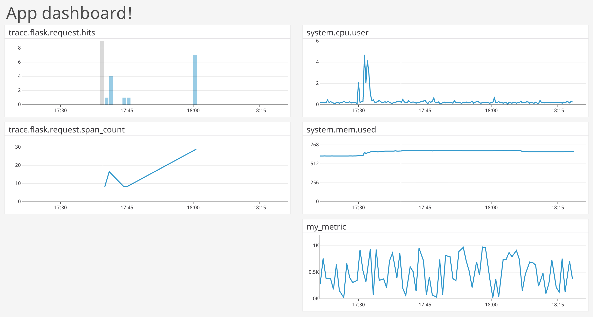

## Final Question:

*13.Datadog has been used in a lot of creative ways in the past. We’ve written some blog posts about using Datadog to monitor the NYC Subway System, Pokemon Go, and even office restroom availability! Is there anything creative you would use Datadog for?*

Datadog could be used to create additional dashboard for open solutions such as the one we currently provide at Activeeon. With the ability to create custom dashboard from the API we could provide a code already made.

Otherwise, let's create an app that registers the number of candies left in a candy dispenser.