<h1>Julia Szymanski Datadog Technical Assessment</h1>

<h2>Notes on Prerequisites:</h2>
<h3>I took this assessment as a great opportunity to learn about Docker and opted for the Containerized approach using Docker for Desktop (Mac M1) and the dockerized Datadog agent.</h3>


<h2>Collecting Metrics:</h2>
<h3>1. I added tags in the datadog.yaml file and verified they were in the Host Map.</h3>

```
apm_config:
  apm_non_local_traffic: true

jmx_use_container_support: true

tags:
    - "name:Julia Szymanski"
    - "email:julszymanski@gmail.com"
    - "region:us-east-1"
    - "tag:test"
    - "env:staging"
```
<h3>Code block: datadog.yaml with tags</h3>

<p></p>

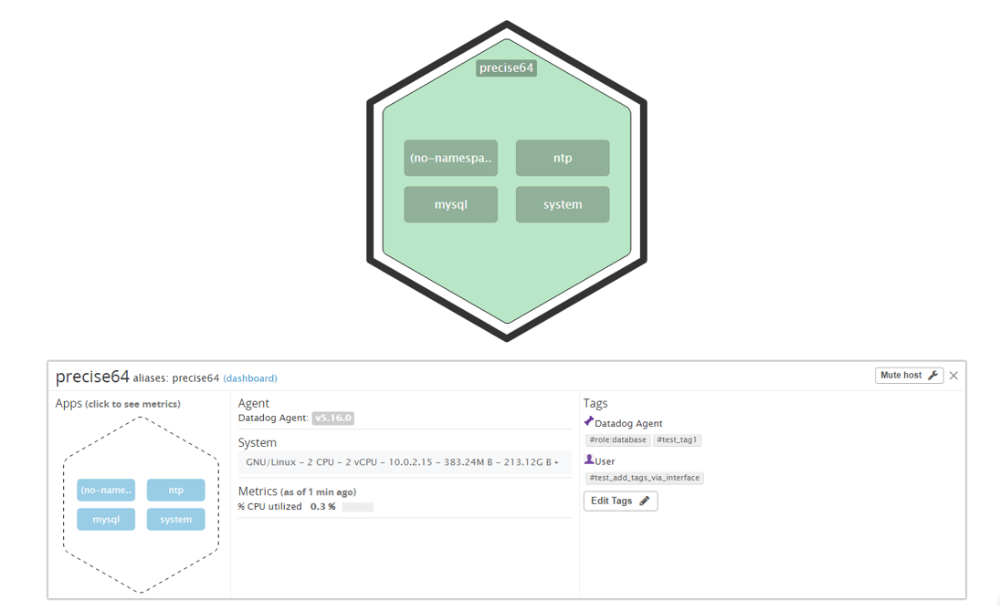

<p></p>
<h3>2. I updated PostgreSQL on my machine and installed the PostgreSQL Datadog integration.
<p></p>

At first, this is the error I was seeing in the root terminal and dd-agent log:</h3>
<p></p>

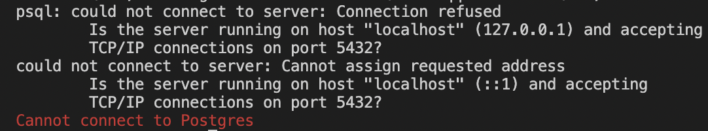

<p></p>
<p></p>


<p></p>

<h3>The issue was that I had set host to localhost in postgres.d/conf.yaml, but the host has a changing IP address. I reset host to host.docker.internal. This enabled the connection of the container with the db service on the host by forwarding to the internal IP address used by the host.</h3>
<h3>Click here to see the docs --> <a href="https://docs.docker.com/desktop/mac/networking/">Networking features in Docker Desktop for Mac</a></h3>


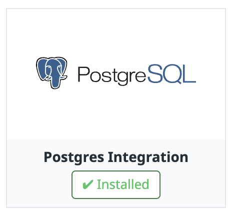

<h3>3. I created a custom Agent check that submits a metric named my_metric with a random value between 0 and 1000.</h3>

```
import random

# the following try/except block will make the custom check compatible with any Agent version
try:
    # first, try to import the base class from new versions of the Agent...
    from datadog_checks.base import AgentCheck
except ImportError:
    # ...if the above failed, the check is running in Agent version < 6.6.0
    from checks import AgentCheck

# content of the special variable __version__ will be shown in the Agent status page
__version__ = "1.0.0"

class HelloCheck(AgentCheck):
    def check(self, instance):
        self.gauge('my_metric', random.randint(0,1000), tags=["host:docker-desktop"] + self.instance.get('tags', []))
```
<h3>Code block: checks.d/custom_my_metric.py</h3>

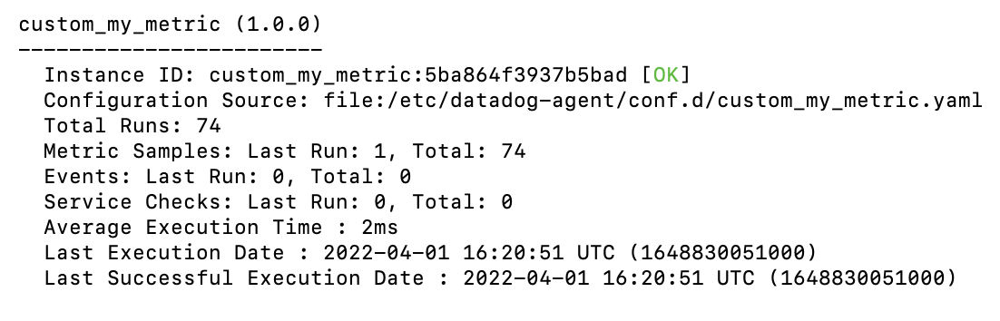


<h3>4. I changed my check's collection interval so that it only submits the metric once every 45 seconds by modifying the respective yaml file.</h3>


```
init_config:

instances:
  - min_collection_interval: 45
```
<h3>Code block: conf.d/custom_my_metric.yaml</h3>


<h3><b>Bonus Question</b>: By modifying conf.yaml that lives in the conf.d folder, I did change the collection interval without modifying custom_my_metric.py.</h3>

<h2>Visualizing Data:</h2>

<h3>I created an Application Key and verified that the App Key and the API Key are valid via Postman. Then I wrote the script for a timeboard importing the Datadog API.</h3>

```
"""
Create a new dashboard returns "OK" response
"""

from datadog_api_client.v1 import ApiClient, Configuration
from datadog_api_client.v1.api.dashboards_api import DashboardsApi
from datadog_api_client.v1.model.dashboard import Dashboard
from datadog_api_client.v1.model.dashboard_layout_type import DashboardLayoutType
from datadog_api_client.v1.model.log_query_definition import LogQueryDefinition
from datadog_api_client.v1.model.log_query_definition_group_by import LogQueryDefinitionGroupBy
from datadog_api_client.v1.model.log_query_definition_group_by_sort import LogQueryDefinitionGroupBySort
from datadog_api_client.v1.model.log_query_definition_search import LogQueryDefinitionSearch
from datadog_api_client.v1.model.logs_query_compute import LogsQueryCompute
from datadog_api_client.v1.model.timeseries_widget_definition import TimeseriesWidgetDefinition
from datadog_api_client.v1.model.timeseries_widget_definition_type import TimeseriesWidgetDefinitionType
from datadog_api_client.v1.model.timeseries_widget_request import TimeseriesWidgetRequest
from datadog_api_client.v1.model.widget import Widget
from datadog_api_client.v1.model.widget_sort import WidgetSort

body = Dashboard(
    layout_type=DashboardLayoutType("ordered"),
    title="my_metric Dash",
    widgets=[
        Widget(
            definition=TimeseriesWidgetDefinition(
                type=TimeseriesWidgetDefinitionType("timeseries"),
                title="Avg of My_Metric",
                requests=[
                    TimeseriesWidgetRequest(
                        q="avg:my_metric{host:docker-desktop}")
                        ],
                    )
                ),
        Widget(
            definition=TimeseriesWidgetDefinition(
                type=TimeseriesWidgetDefinitionType("timeseries"),
                title="Database + Anomaly - Avg of PostgreSQL Connections",
                requests=[
                    TimeseriesWidgetRequest(
                        q="anomalies(avg:postgresql.connections{db:julia}, 'basic', 2)"
                        )
                    ],
                )
            ),
        Widget(
            definition=TimeseriesWidgetDefinition(
                type=TimeseriesWidgetDefinitionType("timeseries"),
                title="My_Metric with Rollup Function - Sum of All Points in Last Hour",
                requests=[
                    TimeseriesWidgetRequest(
                        q="my_metric{host:docker-desktop}.rollup(sum, 3600)"
                        )
                    ], 
                )
            )
    ]
)


configuration = Configuration()
with ApiClient(configuration) as api_client:
    api_instance = DashboardsApi(api_client)
    response = api_instance.create_dashboard(body=body)

    print(response)
    
```

<h3>Code block: Complete script in timeboard.py</h3>
<p></p>

<h3>I scoped My_Metric over my host.</h3>


<h3>2. I applied an anomaly function using the postgres.connections metric as an argument.</h3>


<h3>3. The rollup function is used to aggregate metrics data. The two arguments passed to the rollup function are the aggregator (min, max, in this case sum) and the optional time interval. In my rollup function, I sum all my_metric values collected in the last hour. In the graph below, the sum value is 28.71K. Dividing this number by our min_collection_interval value of 45 seconds, the average my_metric value for that hour came out to be 359.
</h3>


<h3>4. I set the Timboard's timeframe to the past 5 minutes.</h3>


<h3>5. I took a snapshot of the graph and used the @ notation to email it to myself. 📧</h3>

<h3><a href="https://p.datadoghq.com/sb/ed061656-ad77-11ec-8f93-da7ad0900002-a5b873d8ff693982e6baaa49f52b461d">Link to My_Metric Dashboard</a></h3>
<p></p>


<h3><b>Bonus Question:</b>
Anomaly detection is an algorithmic feature that identifies when a metric is behaving differently than it has in the past. A metric is considered to be anomalous (deviating from what is standard, normal, or expected) if it is outside of the gray anomaly band in the anomaly graph.</h3>


<h2>Monitoring Data:</h2>

<h3>1. I created a new Metric Monitor that watches the average of my_metric and will alert if it's above the following values over the past 5 min:

• Warning threshold of 500
• Alerting threshold of 800
• And also ensure that it will notify me if there is No Data for this query over the past 10m.</h3>


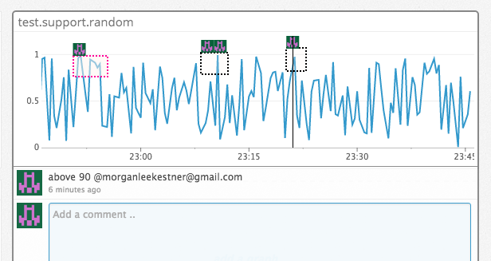
<h3>2. I set the monitor to send me an email whenenever it is triggered.</h3>
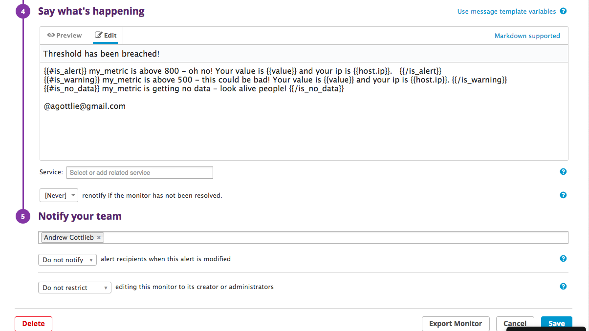
<h3>3. I created different messages based on whether the monitor is in an Alert, Warning, or No Data state.</h3>
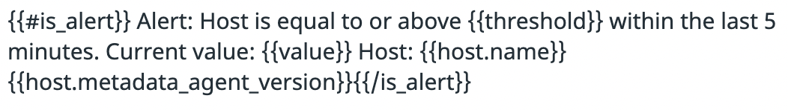
<h3>4. I included the metric value that caused the monitor to trigger and host name and ip when the monitor triggers an Alert state.</h3>

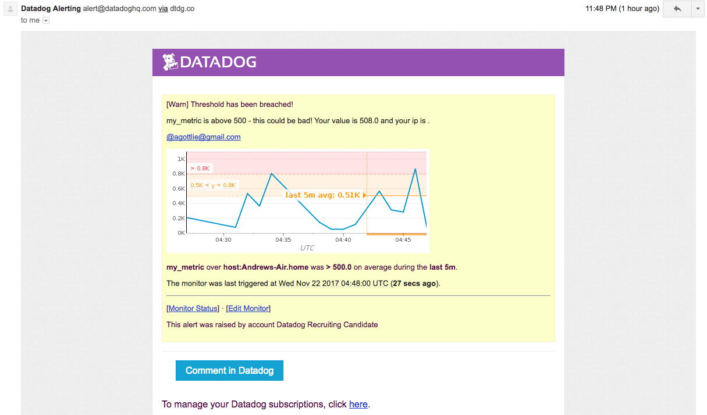
<h3>5. Here is a screenshot of an email notification for the Alert state sent by the monitor.</h3>


<h3><b>Bonus question:</b> I set up two scheduled downtimes for this monitor.</h3>


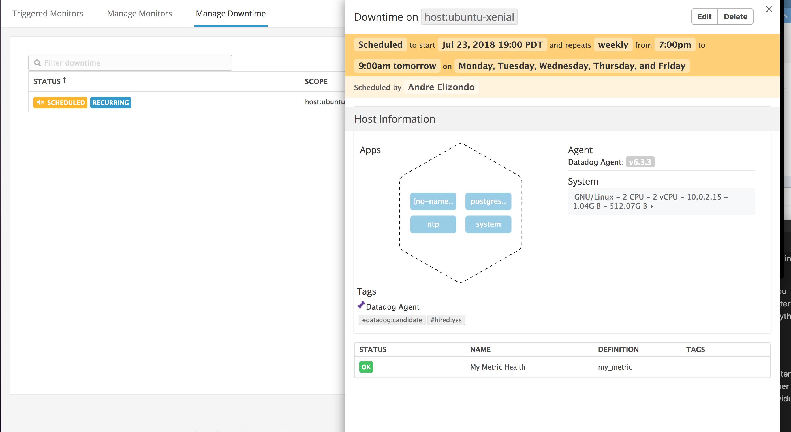

<h3>1. I silenced the monitor from 7pm to 9am daily Monday-Friday. 💤</h3>
<p></p>

<p></p>

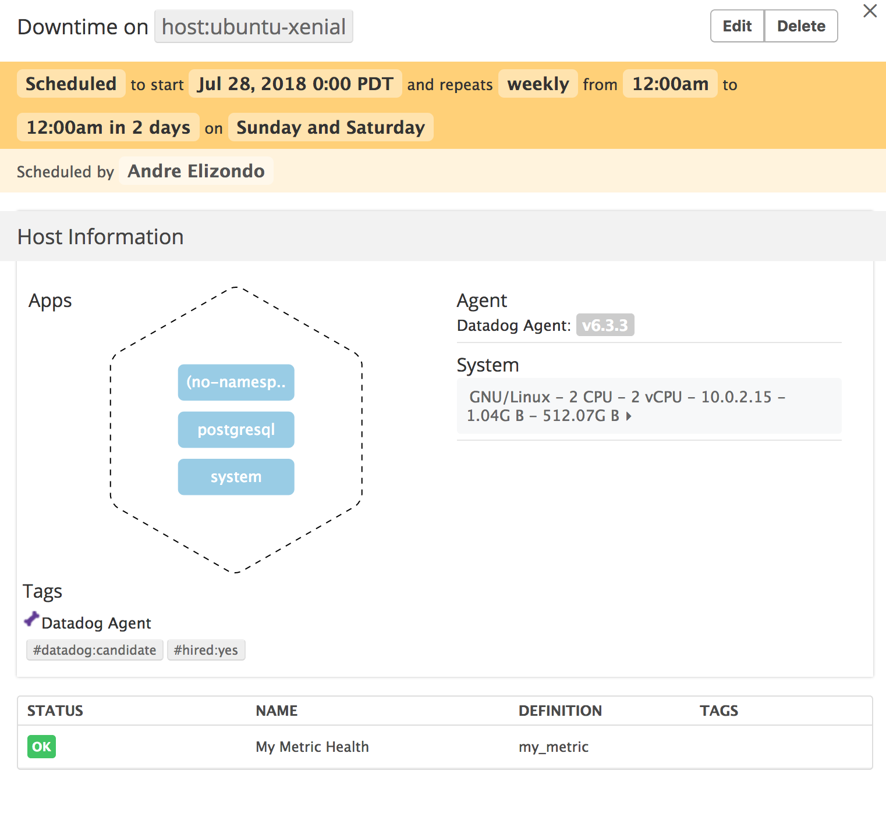
<h3>2. I also silenced the monitor all day on Saturday and Sunday. 🌴 🏄 🏖️</h3>
<p></p>

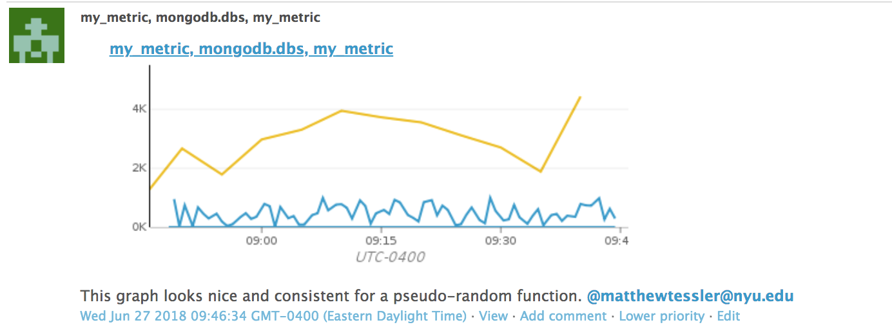
<h3>3. 📧 My email was notified when I scheduled the downtime.</h3>


<h2>Collecting APM Data:</h2>

<h3><b>Bonus Question</b>: Difference between a Service and a Resource
<p></p>
<h3>Referred to <a href="https://docs.datadoghq.com/tracing/visualization">APM Glossary & Walkthrough</a></h3>

<h3>
<b>Services</b> are the building blocks of modern microservice architectures - broadly a service groups together endpoints, queries, or jobs for the purposes of building your application. For example, a database service groups resources such as database queries. Resources belong to services.
<p></p>
<b>Resources</b> are actions for your services representing a particular domain of a customer application - they are typically an instrumented web endpoint, database query, or background job.</h3>

<p></p>
<h3>You can view trace metrics on a service's Service page to see the performance of every resource such as a web endpoint or database query belonging to the service. Each resource has its own Resource page with trace metrics scoped to the specific endpoint.</h3>

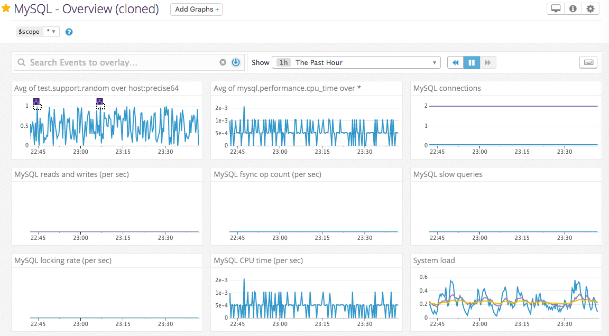

<h3>Note: See fully instrumented app <b>my_app.py.</b></h3>

<a href="https://p.datadoghq.com/sb/ed061656-ad77-11ec-8f93-da7ad0900002-bd8c8a622986bb7cf5b5414c9e7ac6dc">Click here to see Integrations + APM Dashboard</a>

<h2>Final Question:</h2>

<h3>Datadog has been used in a lot of creative ways in the past. We’ve written some blog posts about using Datadog to monitor the NYC Subway System, Pokemon Go, and even office restroom availability!

Is there anything creative you would use Datadog for?</h3>

<h3>When I first moved to Atlanta, I moved into an older home with a rodent problem. I measured rodent activity in the house by taking mental notes of the frequency of the scuttling sounds in the ceilings and walls. It would be interesting to place a sensor with a scanner in my home to monitor where rodent activity is the highest. I can integrate the sensor with Datadog to monitor rodent activity at different points in the house. The next time I hire Critter Stoppers, they could use these metrics to place traps in the rooms or areas with the highest measured rodent activity. I can be alerted if rodent activity drops, meaning that the exterminator did a great job.</h3>


