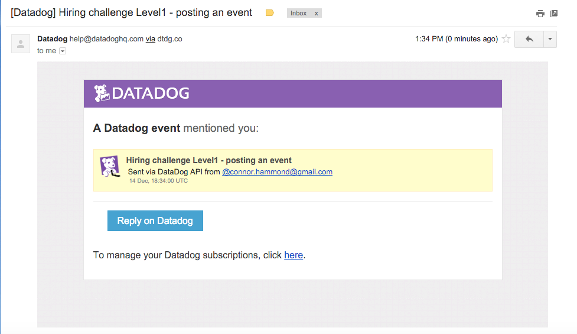

Hi Datadog!  Thanks for the opportunity to work with such a cool technology.  Hope to continue the consideration of my candidacy following this challenge; had a great time with it!

-Connor Hammond

#Level 1
Sign up for Datadog (use "Datadog Recruiting Candidate" in the "Company" field), get the agent reporting metrics from your local machine.


- ###Bonus question: what is the agent?
    - The Agent is a piece of software that collects events and metrics from the host and brings them to Datadog that enables the user you graph and chart monitoring and performance data.

        The Agent has three main parts: the collector, dogstatsd, and the forwarder.
        - The collector runs checks on the current machine for whatever integrations you have and it will capture system metrics like memory and CPU.

        - Dogstatsd is a statsd backend server you can send custom metrics to from an application.

        - The forwarder retrieves data from both dogstatsd and the collector and then queues it up to be sent to Datadog.

Submit an event via the API.



Get an event to appear in your email inbox (the email address you signed up for the account with)


###Code:
```python

        from datadog import initialize, api

        options = {
            'api_key': '',#excluded for security
            'app_key': ''# excluded for security
            }

            initialize(**options)

            title = "Hiring challenge Level1 - posting an event"
            text = 'Sent via DataDog API from @connor.hammond@gmail.com'
            tags = ["connor.hammond", 'level1']

            api.Event.create(title=title, text=text, tags=tags)
```
#Level 2

- I decided to use my "Final Fantasy Football" app for testing.  While the app is deployed (http://finalfantasyfootball.us), I decided to use the version on my local for the purposes of thi exercise.  Following the instructions for graphing metrics on the datadog website, I graphed pageviews for the homepage and measured latency and database query time.


>link to pageviews and latency graphs (& more):            https://app.datadoghq.com/dash/87049/fffapp?live=false&page=0&is_auto=false&from_ts=1450191051000&to_ts=1450191351000&tile_size=m&fullscreen=false

###Code:

```python
from datadog import statsd
import time
import requests

def get_metrics():
    start_time = time.time()
    r = requests.get('http://127.0.0.1:8080/')
    duration = time.time() - start_time
    statsd.increment('page.views.home')
    statsd.histogram('latency.home', duration)
    statsd.histogram('database.query.time', duration)
```

#Level 3
Using the same web app from level 2:

- tag your metrics with support (one tag for all metrics)
- tag your metrics per page (e.g. metrics generated on / can be tagged with page:home, /page1 with page:page1)
- visualize the latency by page on a graph (using stacked areas, with one color per page)


Following the instructions in the Docs, I created a latency histogram (code below) for 3 pages on the site (home/index, login, register), tagging each page with support, as well as a unique tag for that page.

>link to latencies for 3 different pages:
https://app.datadoghq.com/dash/87244/latency-by-page?live=false&page=0&is_auto=false&from_ts=1450194086730&to_ts=1450194386730&tile_size=m&fullscreen=false

#Level 4
Level 4

Same web app:
Using the increment counter utilized in exercise 2, I added tags for support and for each page (code below).

- count the overall number of page views using dogstatsd counters.

- count the number of page views, split by page (hint: use tags)

- visualize the results on a graph

>link to pageviews graph for 3 different pages: https://app.datadoghq.com/dash/87127?live=false&page=0&is_auto=false&from_ts=1450148291153&to_ts=1450149385000&tile_size=m&fullscreen=false

>link to pageviews graphs for 3 different pages on one graph:https://app.datadoghq.com/screen/46992/all-pageviews-stacked

##Bonus Question:

- Do you know why the graphs are very spiky?
>- The graphs tend to be spiky because the load tester sends many requests for each page.  When the graphs are shown in a stack, the values are stacked (with the highest points being the sum of the page views), so the sum will naturally be a higher value than the value for each individual page.


###Code for Levels 3 & 4

```python
    from datadog import statsd
    import time
    import requests


def home():
    start = time.time()
    r = requests.get('http://127.0.0.1:8080/')
    duration = time.time() - start
    statsd.histogram('latency.home', duration, tags=['support', 'page:home'])
    statsd.increment('page:home',tags=['support', 'page:home'])

def login():
    start_time = time.time()
    r = requests.get('http://127.0.0.1:8080/login')
    duration = time.time() - start_time
    statsd.histogram('latency.login', duration, tags=['support', 'page:login'])
    statsd.increment('page:login',tags=['support', 'page:login'])

def register():
    start_time = time.time()
    r = requests.get('http://127.0.0.1:8080/register')
    duration = time.time() - start_time
    statsd.histogram('latency.register', duration, tags=['support', 'page:register'])
    statsd.increment('page:register',tags=['support', 'page:register'])
```

#Level 5
Level 5

- Let's switch to the agent.

- Write an agent check that samples a random value.     - Call this new metric: test.support.random
- Visualize this new metric on Datadog, send us the link.

As per the instructions for implementing an Agent Check, I created a yaml (randcheck.yaml) file with the following code:

```
init_config:

instances:
    [{}]
```
Then, in a python file named the same as the yaml file (so, randcheck.py) I included the following code as per the instructions at http://docs.datadoghq.com/guides/agent_checks/

```python

import random
from checks import AgentCheck

class RandomCheck(AgentCheck):

    def check(self, instance):
        random_val = random.randint(0,100)
        self.gauge('test.support.random', random_val, tags=['support'])
```

Notes - I'm using a computer gifted to me, so my hostname "zak" reads that way for that reason :)

Had import issues with Level 5.
