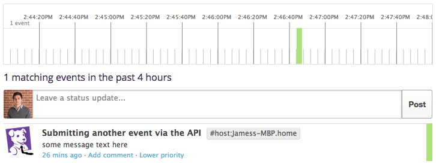
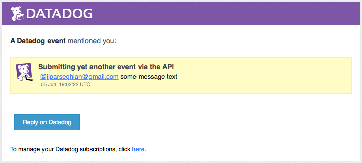
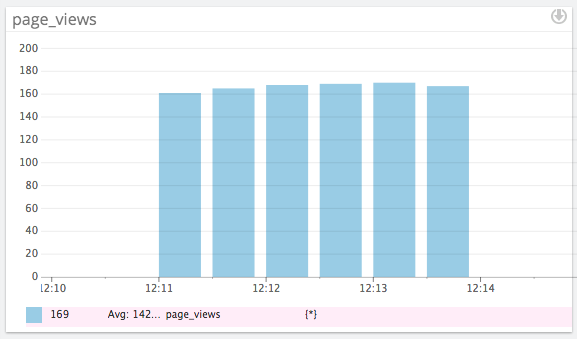
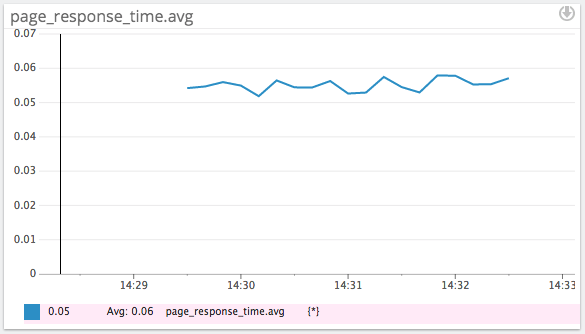
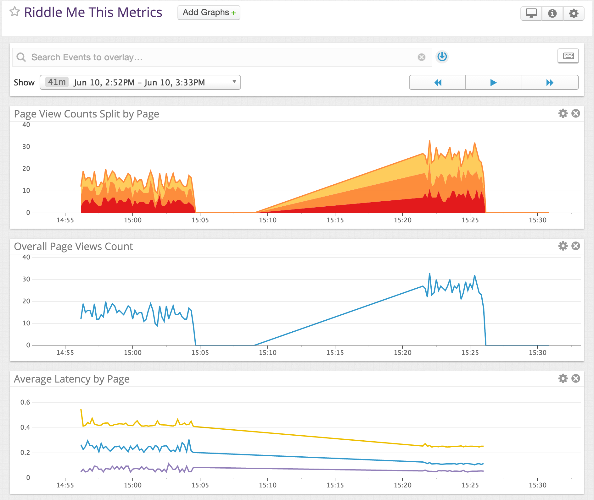
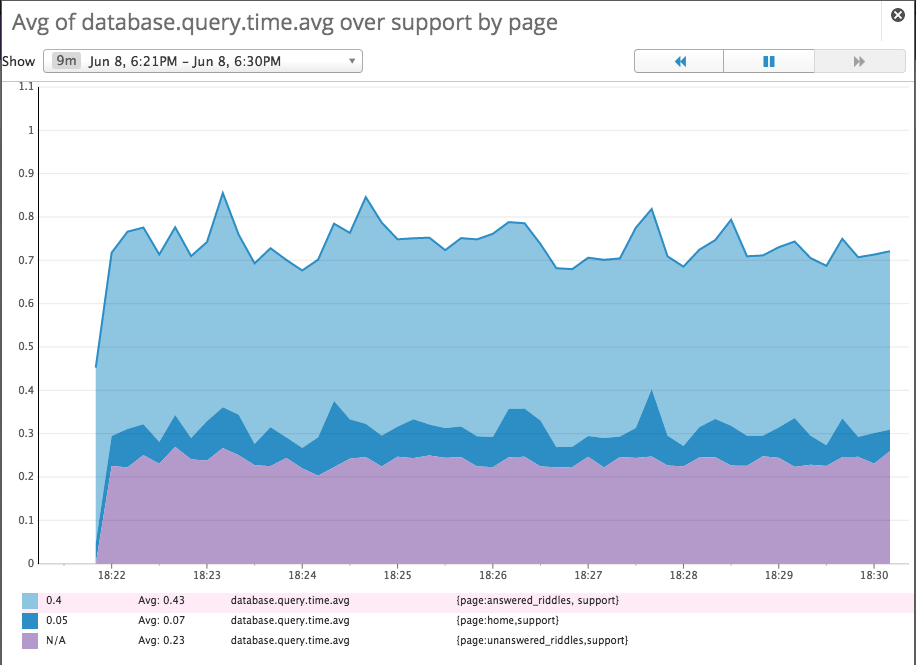
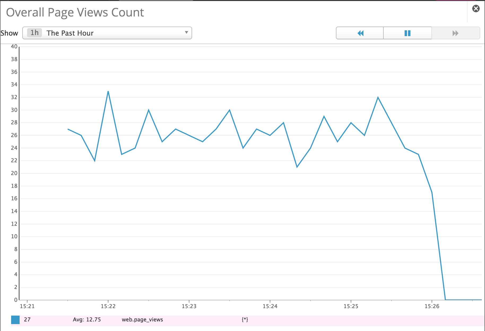
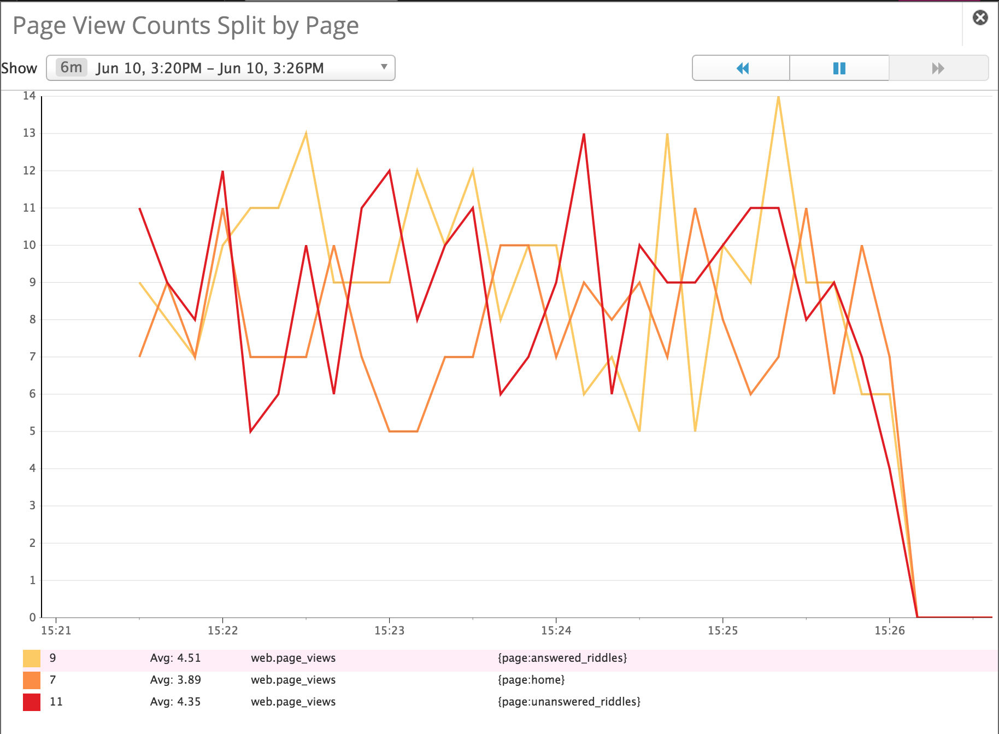
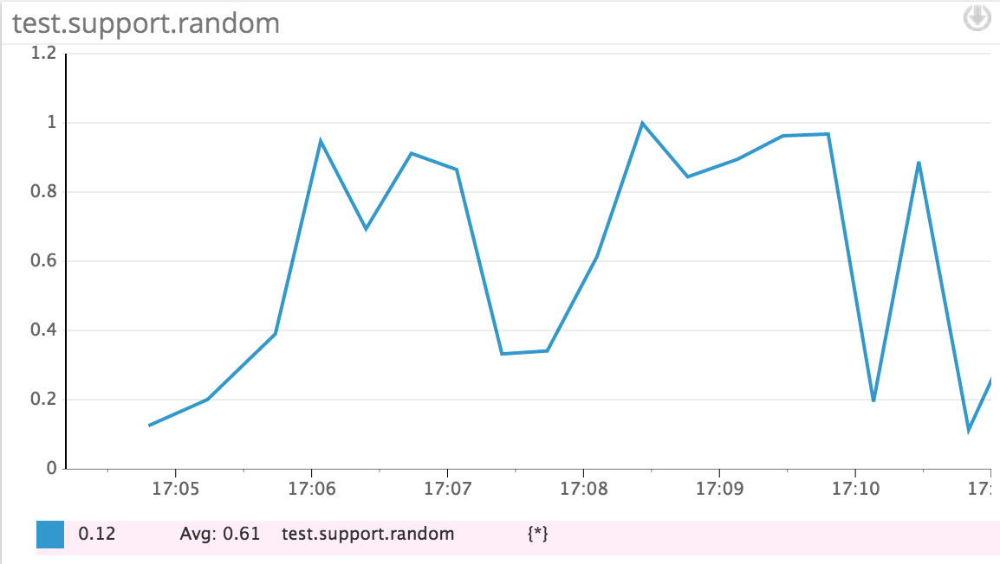

# Level 1

The Agent is a piece of software running on a host machine that collects events and metrics. This data is sent to Datadog where the user can analize the monitoring and performance data and act accordingly.

The Agent can be broken down into three parts:

1. Collector - runs checks on the local machine capturing system metrics such as memory and CPU.
2. Dogstatsd - statsd backend server that custom metrics can be sent to from an application
3. Forwarder - retrieves data from the two components listed above and queues it up to be sent to Datadog.

All of this is controlled by one supervisor process, helping to minimizing overhead.

#### Submit event via the API:

``` ruby

require 'rubygems'
require 'dogapi'

api_key = "some api key hash here"

dog = Dogapi::Client.new(api_key)

dog.emit_event(Dogapi::Event.new('some message text here', :msg_title => "Submitting another event via the API", :alert_type => "success"))

```



#### Event in email inbox

``` ruby

require 'rubygems'
require 'dogapi'

api_key = "some api key hash here"

dog = Dogapi::Client.new(api_key)

dog.emit_event(Dogapi::Event.new('@jjparseghian@gmail.com some message text', :msg_title => "Submitting yet another event via the API", :alert_type => "error"))

```



# Level 2

#### Instrument your code with dogstatsd

I added the dogstatsd-ruby gem to the Gemfile of my rails application and ran a bundle install.

``` ruby
  require 'statsd'

  STATSD = Statsd.new

  def index

    # page logic

    STATSD.increment('page_views')

  end
```

The code above was added to a controller in my application and used to track index page views. I used apache bench to run a simple load test by running this command in the terminal `ab -n 1000 -c 100 http://localhost:3000/`. This simulated 1000 requests to the page in multiples of 100, generating the graph below.



## Create histogram to see latency.

I calculated the latency for the index page using the following code.

``` ruby
  require 'statsd'

  STATSD = Statsd.new

  def index
    start_time = Time.now

    # page logic

    duration = Time.now - start_time

    STATSD.histogram('page_response_time', duration)

  end
```

This is the resulting histogram for average index page response times



#### Bonus: Creative Dashboard


[Dashboard](https://app.datadoghq.com/dash/54495/riddle-me-this-metrics?live=false&page=0&is_auto=false&from_ts=1433962498553&to_ts=1433964598241&tile_size=m)

# Level 3

#### Tag metrics with `support`

In order to add the `support` tag to the metrics I had to designate tags in the options hash as follows.

``` ruby
  STATSD.histogram('page_response_time', duration, :tags => ["support"])
```

#### Tag metrics per page

By adding another string to the tags array in the options hash, I was able tag metrics per page.

``` ruby
  STATSD.histogram('page_response_time', duration, :tags => ["support", "page:home"])
  STATSD.histogram('page_response_time', duration, :tags => ["support", "page:unanswered_riddles"])
  STATSD.histogram('page_response_time', duration, :tags => ["support", "page:answered_riddles"])
```

#### Visualize the latency by page on a graph (using stacked areas, with one color per page)

By running the apache bench on multiple threads. I was able to compare the latency of multiple pages as seen in the graph below



# Level 4

#### Count overall number of page views using dogstatsd counters

The following graph illustrates overall page views.



#### Count the number of page views, split by page

The graph below displays page view counts split by the page.



#### Bonus: Do you know why the graphs are very spiky?

My apache bench load test sent 500 requests in multiples of 10 multiple times per second, because StatsD counters are normalized in per-second units the graphs look very spiky when connecting the varying points. If one person visted a page every second the graph would appear flat.

# Level 5

#### Write an agent check that samples a random value. Call this metric: `test.support.random`

``` python
  import random
  from checks import AgentCheck

  class RandValCheck(AgentCheck):
    def check(self, instance):
      val = random.random()
      self.gauge('test.support.random', val)
```

The above agent check was a simple python script that submitted random values to the `test.support.random` metric. I ran into multiple problems trying to get this to work. At first I realized that did not have the tornado python module installed. When trying to install that I noticed that pip was also not installed. After getting both of those up and running I started experiencing problems with the agent Forwarder. I was able to fix that by restarting my computer and running this command `~/.datadog-agent/bin/agent restart` in the terminal. Once all there agent components were working I was able visualize the data in the graph below.

#### Visualize the new metric on Datadog

