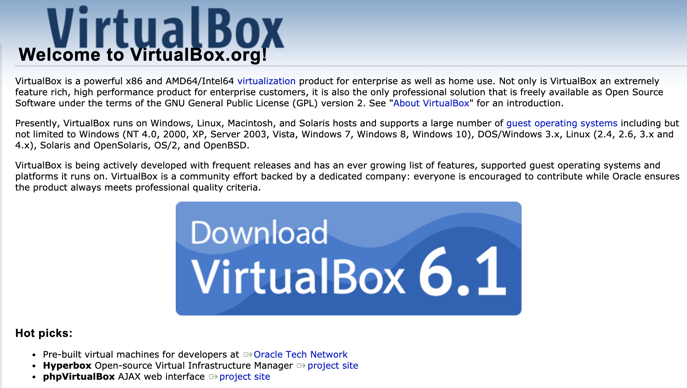
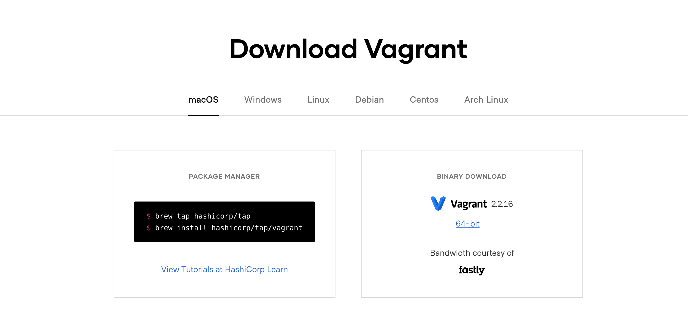
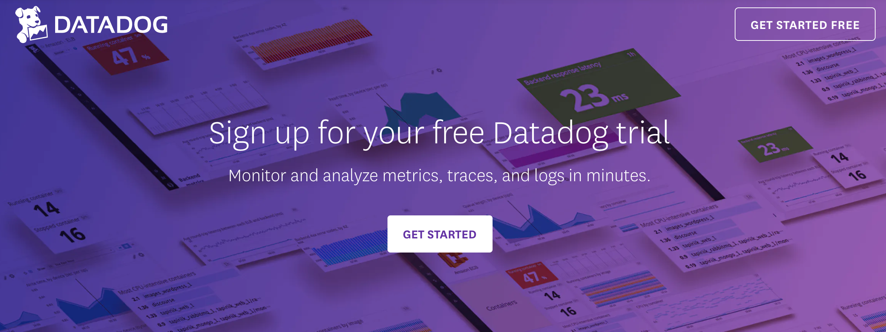
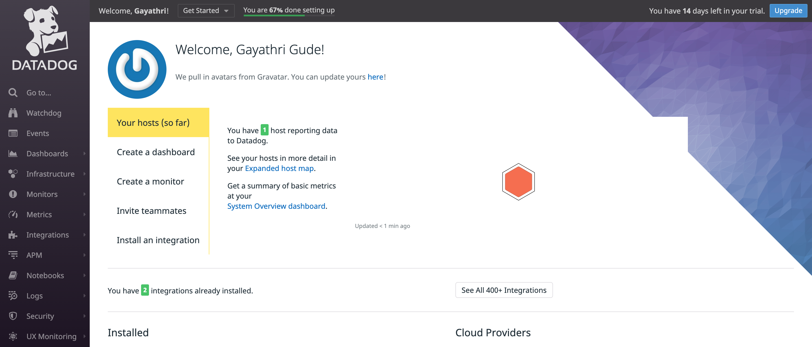
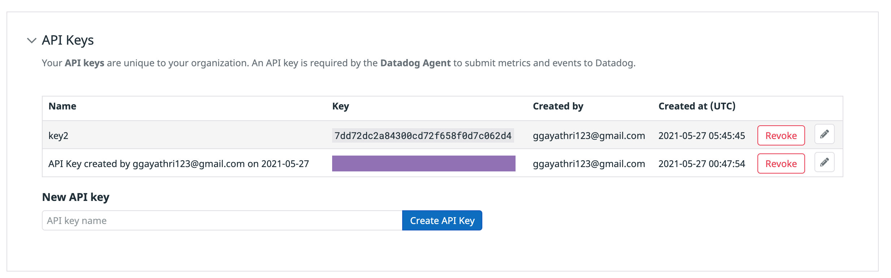
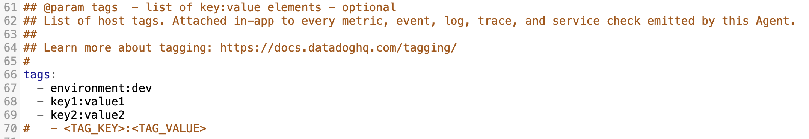
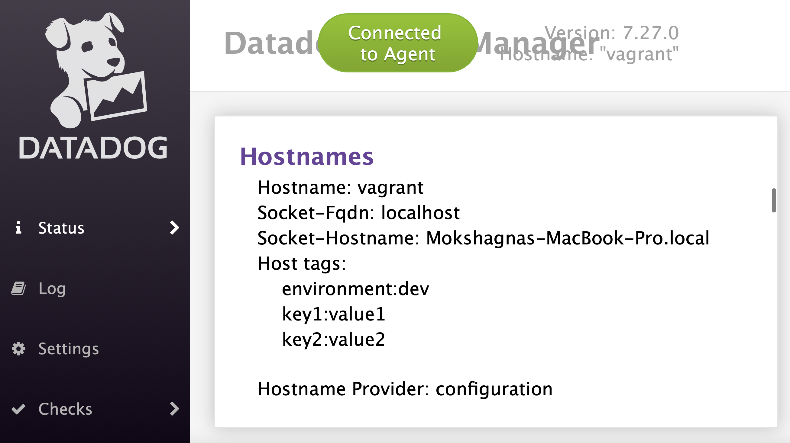
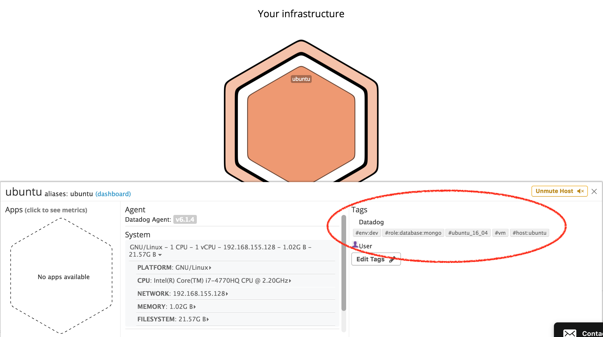

## Submission for Gayathri Gude for Sales/Solutions-Engineering Position

## Prerequisites - Setup the Environment:
I chose to spin up a fresh linux VM via Vagrant. This helped me avoid a lot of dependency issues.
1. First, I installed [VirtualBox 6.1](https://www.virtualbox.org/) :


2. Second, I installed [Vagrant](https://www.vagrantup.com/docs/installation/) :


In order to get this part up and running after installation.. I had to do the following: 
  * Initialize Vagrant: ```vagrant init hashicorp/bionic64```
  * Start the Virtual Machine: ```vagrant up```
  * SSH into the Virtual Machine: ```vagrant ssh```
  * To stop the enviornment: ```vagrant halt```

3. Third, I signed up for the free [Datadog trial](https://www.datadoghq.com/free-datadog-trial/) and installed it to my environment:



After signing up, I needed to install it to my environment. The following command includes a unique API key, which is required by the Datadog Agent to submit metrics and events to Datadog. This key is specified in my Datadog account as well, as shown below the command.     
```DD_AGENT_MAJOR_VERSION=7 DD_API_KEY=7dd72dc2a84300cd72f658f0d7c062d4 DD_SITE="datadoghq.com" bash -c "$(curl -L https://s3.amazonaws.com/dd-agent/scripts/install_mac_os.sh)"```


Here are the commands I used while running the agent locally:
  * Start agent as a service: ```launchctl start com.datadoghq.agent```
  * Stop agent running as a service: ```launchctl stop com.datadoghq.agent```
  * Status of agent service: ```launchctl list com.datadoghq.agent```
  * Launch Gui: datadog-agent ```launch-gui```

## Collecting Metrics:
  * Added tags in the Agent config file(Datadog.yaml). Photos below show the config details, along with the tags shown on the agent GUI page and the Hostmap on the Datadog web application.




  * and show us a screenshot of your host and its tags on the Host Map page in Datadog.
  * Install a database on your machine (MongoDB, MySQL, or PostgreSQL) and then install the respective Datadog integration for that database.
  * Create a custom Agent check that submits a metric named my_metric with a random value between 0 and 1000.
  * Change your check's collection interval so that it only submits the metric once every 45 seconds.
  * Bonus Question Can you change the collection interval without modifying the Python check file you created?
