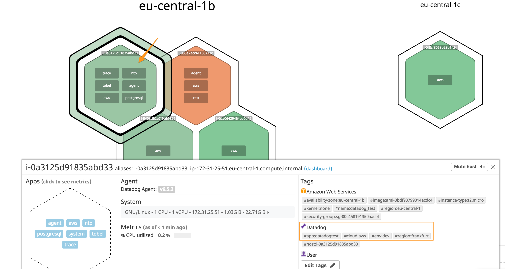
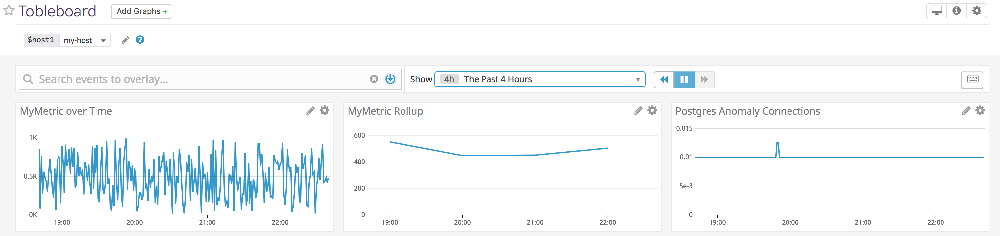
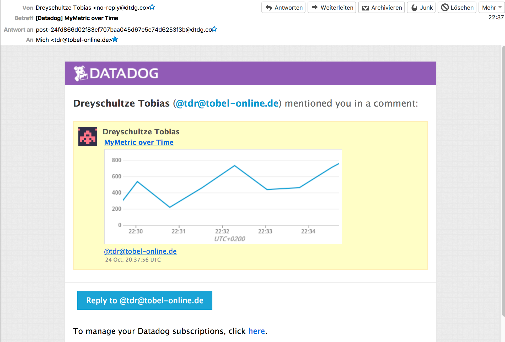
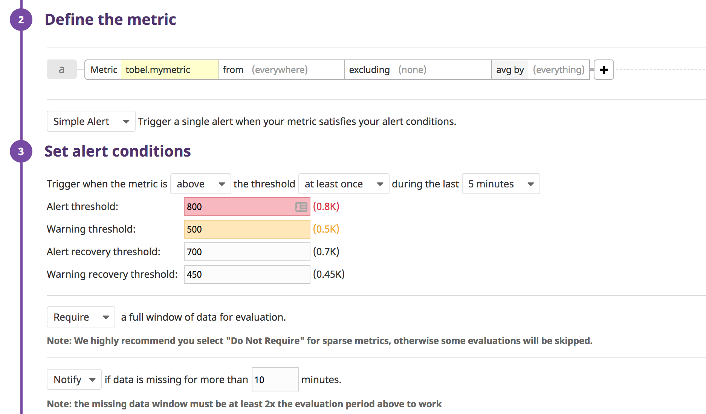
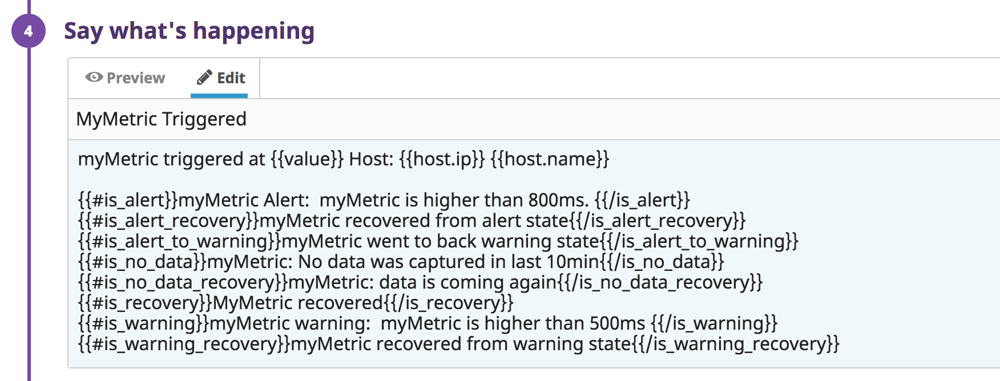
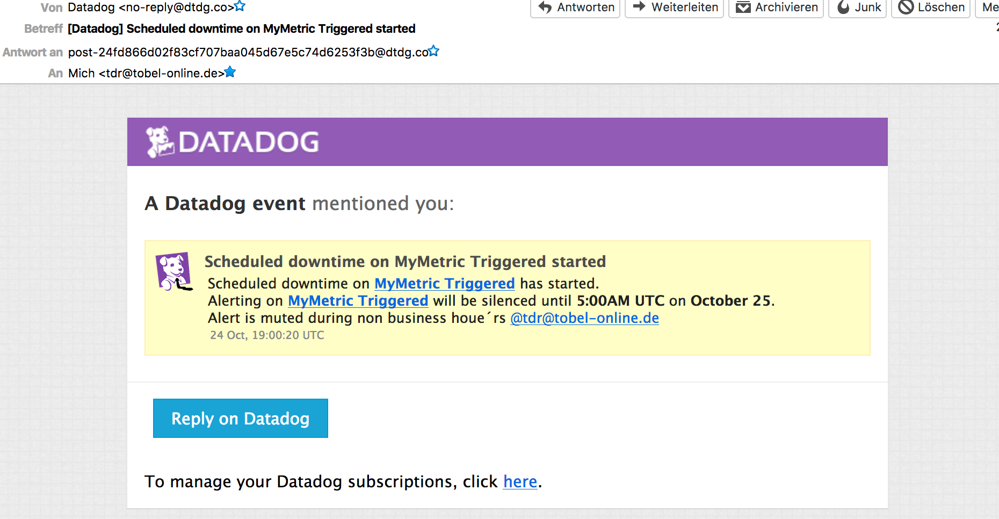
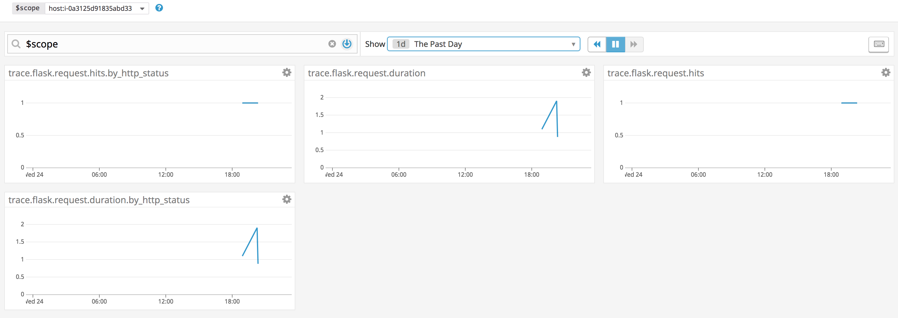
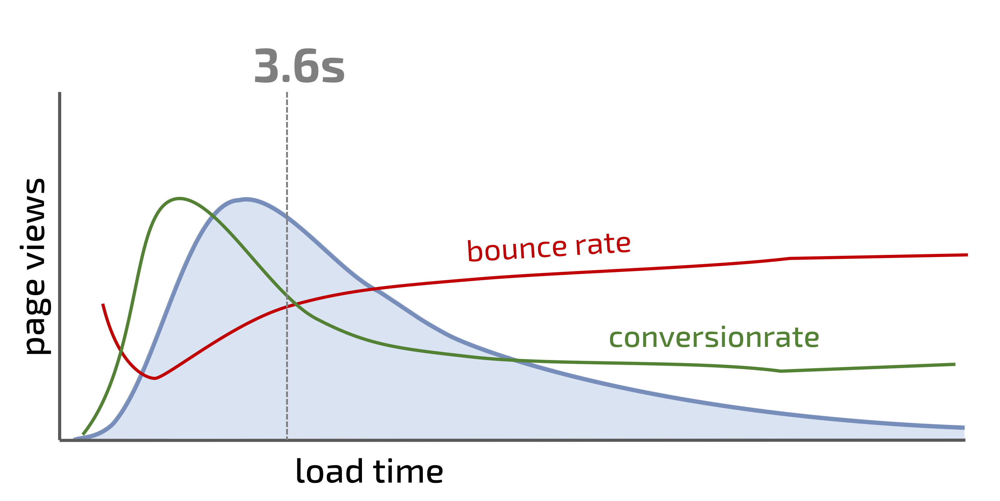

# My answers

## Collecting Metrics:

* Add tags in the Agent config file and show us a screenshot of your host and its tags on the Host Map page in Datadog.

The hos map:

* Install a database on your machine (MongoDB, MySQL, or PostgreSQL) and then install the respective Datadog integration for that database.

Postgres and integration installed.

* Create a custom Agent check that submits a metric named my_metric with a random value between 0 and 1000.

Here is the source code of the custom check:

[Python Check](mycheck.py)

[YAML Config](mycheck.-yaml)

* Change your check's collection interval so that it only submits the metric once every 45 seconds.

Already done, see YAML.

* Bonus Question Can you change the collection interval without modifying the Python check file you created?

Didnt change the Python, configured it via YAML (min_collection_interval: 45) straight away. Another solution would be to create a cron job or similar which calls the check with "udo -u dd-agent -- datadog-agent check mycheck",

## Visualizing Data:
Utilize the Datadog API to create a Timeboard that contains:
* Your custom metric scoped over your host.
* Any metric from the Integration on your Database with the anomaly function applied.
* Your custom metric with the rollup function applied to sum up all the points for the past hour into one bucket
* Please be sure, when submitting your hiring challenge, to include the script that you've used to create this Timeboard.

[APICallScript](curlapi.sh) 
This curl script is not working properly. It throws an error with the anomaly function. This is an open issue, ticket:#176636.

* Once this is created, access the Dashboard from your Dashboard List in the UI:
* Set the Timeboard's timeframe to the past 5 minutes
* Take a snapshot of this graph and use the @ notation to send it to yourself.

* Bonus Question: What is the Anomaly graph displaying?
For a not native speaker it is sometimes to understand the meaning of a question. Is here now an explanation of what is anomaly detection in general? Or what is shown here?
First: With anomaly detection you try to identify and rate rare events to differ them significantly from the majority of historical data.
Second: Since the database is fresh and not used the data generator does not deliver datadog with much data. Based on the existing data, it shouldnt show an anomaly since there is not enough data to rate.

## Monitoring Data
* Warning threshold of 500
* Alerting threshold of 800
* And also ensure that it will notify you if there is No Data for this query over the past 10m.

* Send you an email whenever the monitor triggers.
* Create different messages based on whether the monitor is in an Alert, Warning, or No Data state.
* Include the metric value that caused the monitor to trigger and host ip when the Monitor triggers an Alert state.

* Bonus Question: Since this monitor is going to alert pretty often, you don’t want to be alerted when you are out of the office. Set up two scheduled downtimes for this monitor:
* One that silences it from 7pm to 9am daily on M-F,
* And one that silences it all day on Sat-Sun.
* Make sure that your email is notified when you schedule the downtime and take a screenshot of that notification.

## Collecting APM Data:
* Bonus Question: What is the difference between a Service and a Resource?
* Provide a link and a screenshot of a Dashboard with both APM and Infrastructure Metrics.
* Please include your fully instrumented app in your submission, as well.

The app is not instrumented manually, i used DDTrace to get monitoring data:
ddtrace-run python __init__.py

I did some curls on the web app to generate some data:

* Bonus Question: What is the difference between a Service and a Resource?
Service:
A "Service" is the name of a set of processes that work together to provide a feature set. For instance, a simple web application may consist of two services: a single webapp service and a single database service, while a more complex environment may break it out into 6 services: 3 separate webapp, admin, and query services, along with a master-db, a replica-db, and a yelp-api external service.
These services are defined by the user when instrumenting their application with Datadog. This field is helpful to quickly distinguish between your different processes.

Resource:
A particular query to a service. For a web application, some examples might be a canonical URL like /user/home or a handler function like web.user.home (often referred to as "routes" in MVC frameworks). For a SQL database, a resource would be the SQL of the query itself like select * from users where id = ?
The Tracing backend can track thousands (not millions or billions) of unique resources per service, so resources should be grouped together under a canonical name, like /user/home rather than have /user/home?id=100 and /user/home?id=200 as separate resources. 

## Final Question:
* Datadog has been used in a lot of creative ways in the past. We’ve written some blog posts about using Datadog to monitor the NYC Subway System, Pokemon Go, and even office restroom availability!
* Is there anything creative you would use Datadog for?

My 2 cent: I totally miss end user monitoring. This is the only point where you can decide if a performance is bad and business critical. Question: Why is 800ms a good threshold for an alert? And 500ms for a warning? Based on what are these thresholds defined? On gut feeling? Baselining? 

If you include real user monitoring to the monitoring stack, you can answer this question quite easily. Because if you collect the performance from the enduser perspective, you can directly the see when the user engagement drops. And when the user engagement drops, metrics like bounce rate, conversion rate, revenue, etc. will change dramatically. If you look at the following chart, you can see that with higher load times less people (page views) using the page (blue line). And if you correlate this with a business metric, like bounce rate or conversion rate, you can see how this increase (bounce rate) or decrease (counvesion rate) with higher load times. Here is you can see a direct correlation. And if you know where you your users are happy, you know how your infrastructure, apps and services have to perform.

