# Getting started with Datadog 

This guide is designed to be a quick intro for anyone thinking about trying out Datadog's services. We won't cover everything here, but instead just a few key features that Datadog has. This guide is targeted at audiences with some software engineering experience and assumes a basic knowledge  of using python. We'll cover the basics of setting up an environment, installing the agent and getting some metrics reporting, visualisations and monitors and finally some APM (Application Performance Monitoring)

## Prerequisites - Setup the environment


Before we get started we'll need a simple environment to trial the Datadog agent. Since I've been using AWS for a project lately, I've decided to use EC2 to spin up a simple VM, but you can use a similar approach in any of the other major cloud vendors, spin up a VM locally using virtualbox or similar or even use your own local machine. That said, we would recommend you use Ubuntu 16.04 as it will avoid any dependency issues from the steps in this guide.

To get started head over to the <a href="https://aws.amazon.com/" target="_blank">AWS Console Landing Page</a> and sign up for a free account if you don't already have one. Click into the AWS services list, choose EC2 and click "Launch Instance". 

Search for "Ubuntu" and choose Ubuntu Server 16.04 with "Free tier eligible" under the logo and hit select. It will autoselect the t2.micro instance type. You can hit "Review and Launch" and then "Launch" without changing any settings. If this is your first time in AWS you may be asked to create a security group and an to create a key pair - you can follow the onscreen instructions for this. Once the VM is provisioned, you can hit "Connect" to bring up the connection options - you can use whichever you find easiest.

Next we will install the Datadog agent, the main workhorse (or dog?) of the service. The easiest way to install the agent is to use the one-step install located <A Href="https://app.datadoghq.eu/account/settings#agent/ubuntu" target="_blank">here</a>. Just copy and paste the line starting with DD_AGENT into the terminal connection to your VM and hit enter. In a few moments your VM will show up in the Infrastructure Hostmap [here](href="https://app.datadoghq.eu/infrastructure/map).

## Collecting Metrics

Alright, now we'll get onto the good stuff - lets get some metrics! Well the good news is....that's already happening! The agent will start to pull down some the standard system metrics out of the box as soon as its up and running. However before we go check that out, lets make some changes so we are sure we're looking at the right VM. The config file for the Datadog agent is located at 

`/etc/datadog-agent/datadog.yml`

and you can open it with

`sudo vim /etc/datadog-agent/datadog.yml`

The agent picks up on the hostname that was supplied by AWS  but it is wildly uninteresting and not easily identifiable in a situation where we have hundreds of VMs so lets change it by adding the line

`hostname: 742evergreenterrace`

and lets add some tags so we know what happens on this hostname by adding the line

`tags: ["Homer:true", "Marge:true", "Bart:true", "Lisa:true", "Maggie:true"]`

Finally restart the agent

`service datadog-agent restart`

And now if we go back to the hostmap <a href="https://app.datadoghq.eu/infrastructure/map">here</a> we can see our host with its new exciting naming scheme.

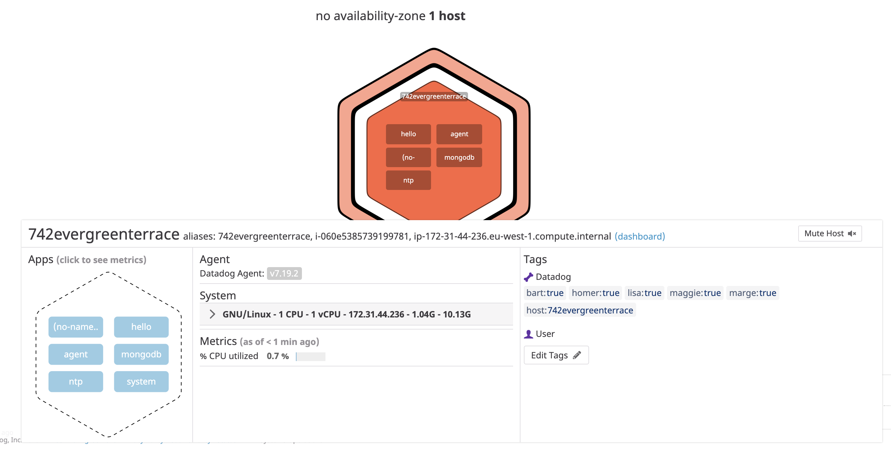

And if we click into the Dashboard List [here](https://app.datadoghq.eu/dashboard) and search for the System Metrics Dashboard we can see some initial metrics from our host like CPU usage, memory usage and network traffic etc.

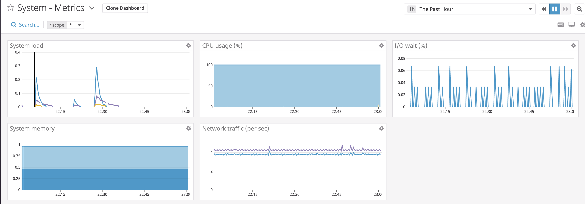


## Integrations
Now Datadog has literally hundreds of integrations for a wide array of tools, software and vendors so we'll just give a brief sample in this guide. One of the most common services any small or large IT system will need is a database. So lets install one on our VM and see what Datadog can tell us about it! I've chosen to install MongoDB as I happened to use it recently, but feel free to try any. MongoDB has some excellent installation instructions <a href="https://docs.mongodb.com/manual/tutorial/install-mongodb-on-ubuntu/">here</a>

Once you've verified your mongoDB instance is up and running, you can click on the "Integrations" button on the sidebar of the Datadog site. Then search for mongoDB and click the logo. Once the panel loads, click the "Configuration" tab and follow the instructions. You must first create a user for the Datadog agent to use, and then specify the metrics in the dedicated mongodb configuration file for Datadog. You will have to enter the port, host (localhost in this instance) and username and password so the agent can access mongoDB. Be sure to scroll to the end of the configuration page and hit "Install Integration". Next restart the agent as we did before by running 

`service datadog-agent restart`

from the console.

In a few short moments some insights from the mongoDB database will start to arrive. If you navigate to "Dashboards" and "Dashboard List" and search for mongoDB you'll find a pre-prepared dashboard which will have current mongoDB metrics. Since you just installed the database, it probably won't be very active but there will still be some metrics. 

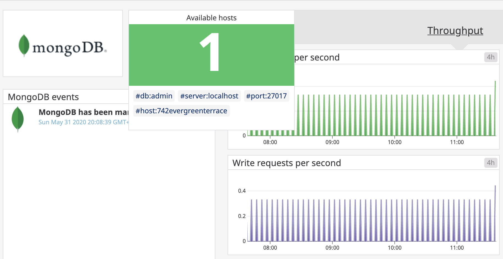

Incidentally, the first time I did this, I had the wrong mongoDB port number in the config file but that was easily resolved. The dashboard showed the host as RED as opposed to GREEN above, helpfully indicating something had gone wrong. I went and had a look at the Datadog agent logs located at

`/var/log/datadog/agent.log`

and where I saw the issue logged as a connection refused. I fixed the config, restarted the agent and all was well.

## Custom Metrics

Let's be honest, even with the significant catalogue of Integrations that Datadog provides, there's no way to cover every need for every user. That's why we have customisability! We'll make a relatively simple custom check here to show the basic approach. Custom checks are done via python programs with an accompanying config file.

You can use the template provided <a href ="https://docs.datadoghq.com/developers/write_agent_check/?tab=agentv6v7">here</a>
to put the basic building blocks in place. Let's mix it up a bit by generating a random number every interval. Take a look at this perfectly cromulent custom check:

`/etc/datadog-agent/checks.d/custom_cromulent.py`

```
from random import seed
from random import randint
# the following try/except block will make the custom check compatible with any Agent version
try:
    # first, try to import the base class from new versions of the Agent...
    from datadog_checks.base import AgentCheck
except ImportError:
    # ...if the above failed, the check is running in Agent version < 6.6.0
    from checks import AgentCheck

# content of the special variable __version__ will be shown in the Agent status page
__version__ = "1.0.0"

class HelloCheck(AgentCheck):
    def check(self, instance):
        value = randint(0, 1000)
        self.gauge('my_metric', value, tags=['donuts:many'])
```

If we need to change the collection interval we can do so by adding some lines int the config file at

`/etc/datadog-agent/conf.d/custom_cromulent.yaml'

```
init_config:

instances:
  - min_collection_interval: 45
```

We can also change the collection interval directly from the Metric Explorer <a href="https://app.datadoghq.eu/metric/summary">here</a> by searching for our metric and hitting the "Edit" button in the "Metadata" section of our metrics summary page.

If we want to take a look at our custom metric we can head to the Metric Explorer [here](https://app.datadoghq.eu/metric/explorer) and search for our metric - "my_metric" in our case.

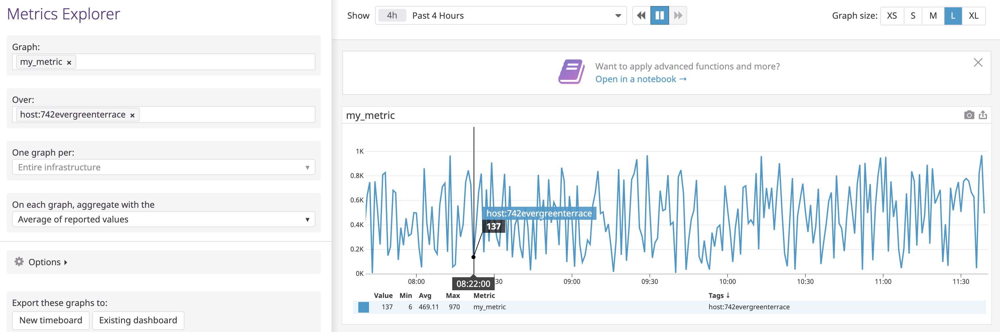

## Visualizing Data

Lets set up a customised dashboard to look at our metrics. We can use the API to create a custom dashboard. The API docs are linked at the end of this document and a sample shell script to create a dashboard is [here](). It contains three graphs, one that simply displays the CPU usage over time on our host, one that shows our custom metric but has the anomaly function applied and finally another also with the custom metric with the rollup function applied. 

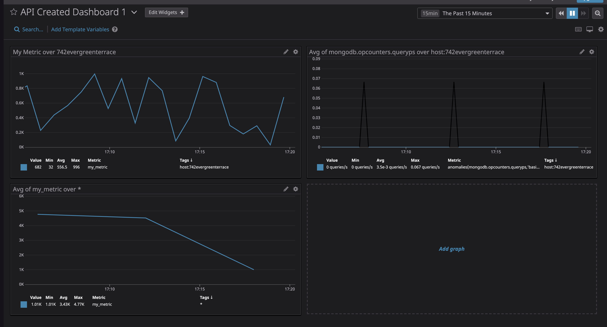

The anomaly function sets a dynamic rolling range of where values of this metric are expected to land. This is set relative to the metric itself as an acceptable width. Anything falling outside this width is considered anomalous. The rollup function allows one to reduce the number of data points in a metric, in this case we've taken the sum off each hour's worth of my custom metric and displayed that on a graph.

## Monitoring Data

Finally we'll explore monitors and alerts in datadog. If you go to the "Monitor" and "New Monitor" menu we can create a new one. Select a metric monitor and leave it at "Threshold Alert" for item 1.

In item 2, define the metric by searching for your custom metric from earlier "my_metric". Normally one can further filter this by host or tag but we only have one host. I selected mine, but it's not required.

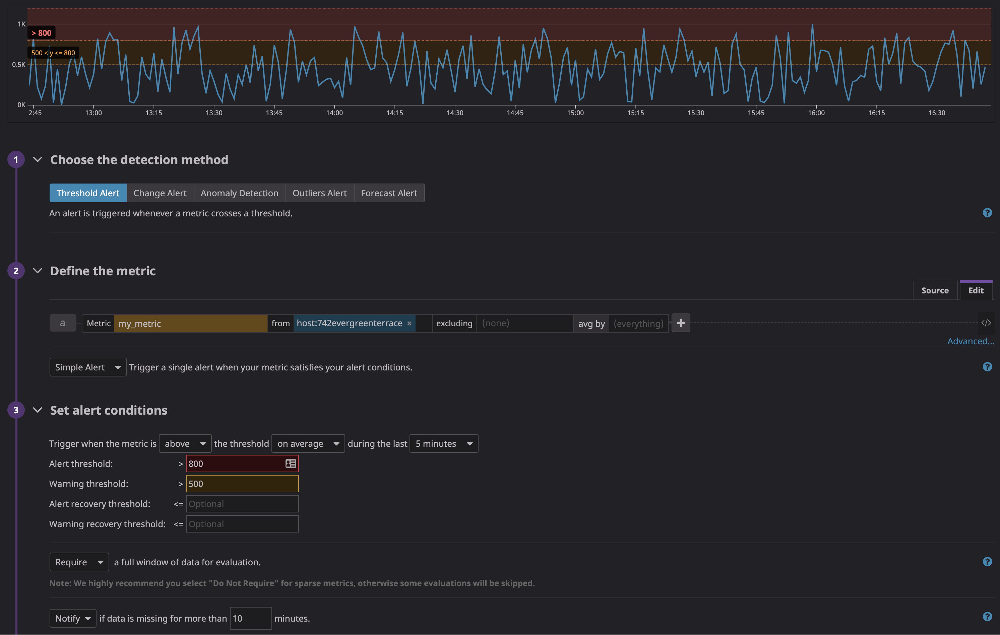

Set the alert threshold  to 800, the warning threshold  to 500 and further down set to "notify" if data is missing for more than 10 mins"

Scrolling further down to the "Say what's happening section" we can customised the message to give specific info based on what triggered the monitor. Enter the following text:

```
{{#is_alert}}ALERT!!!! Your metric from {{host.ip}} is dangerously high! {{/is_alert}} 
{{#is_warning}}Warning!!!! Your metric is worryingly high! {{/is_warning}}
{{#is_no_data}}Something has gone wrong - your metric is reporting no data{{/is_no_data}} 

Your metric is currently at: {{value}} !!!

@xxxxxx@gmail.com
```
This will display text matching the cause of the monitor, it will display the current metric value that triggered the monitor and it specifies who should receive the alert.

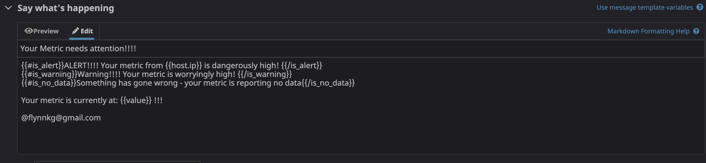

The text above appears as follows when the alert arrives

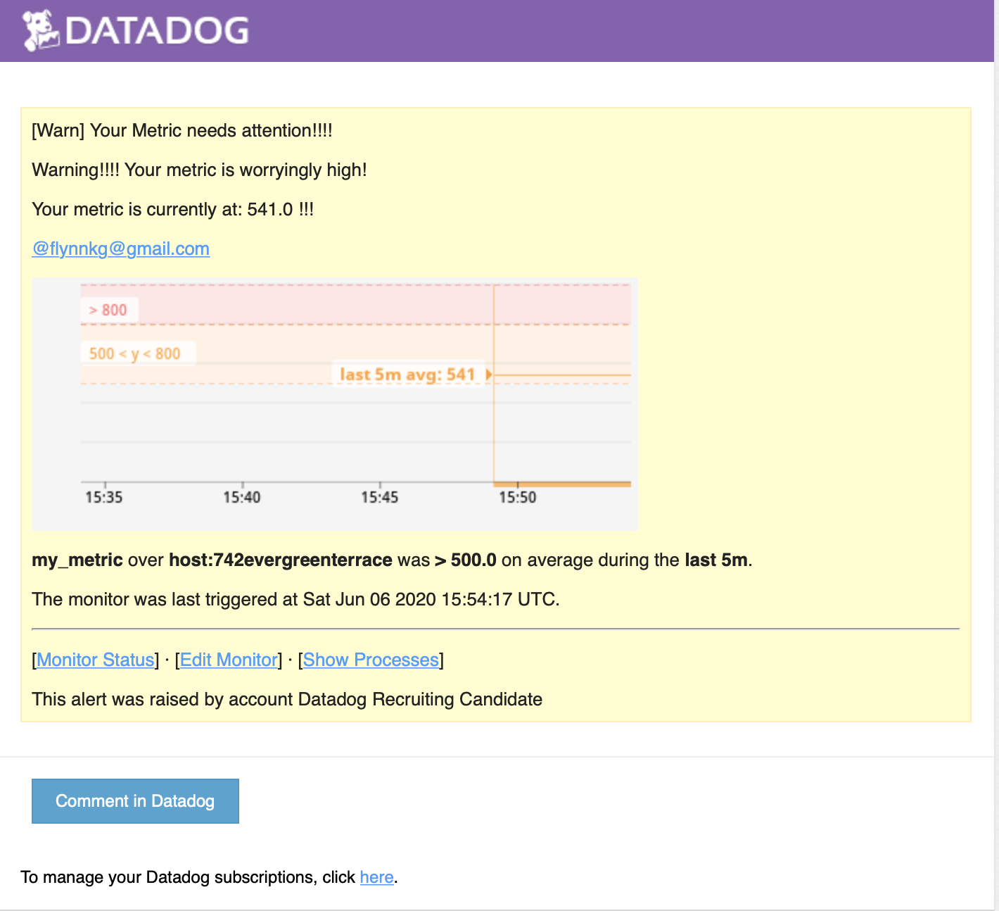

Finally we can set up some downtime schedules so we ensure we are not receiving unwanted or pointless alerts. In this situation we only want alerts during core business hours. So we'll create a downtime schedule that silences the monitor from 1900 to 9am Monday to Friday.

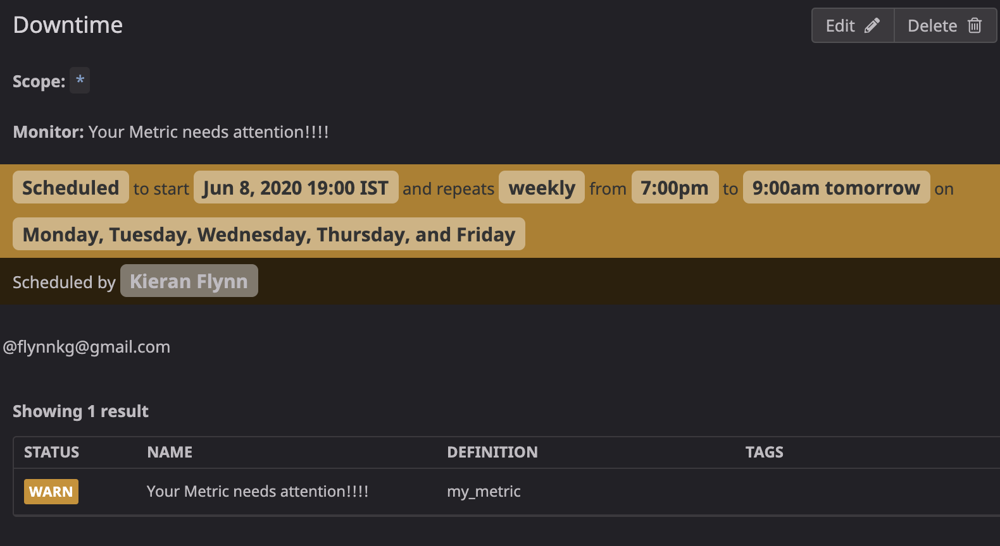

and another that silences it on Saturday and Sunday.

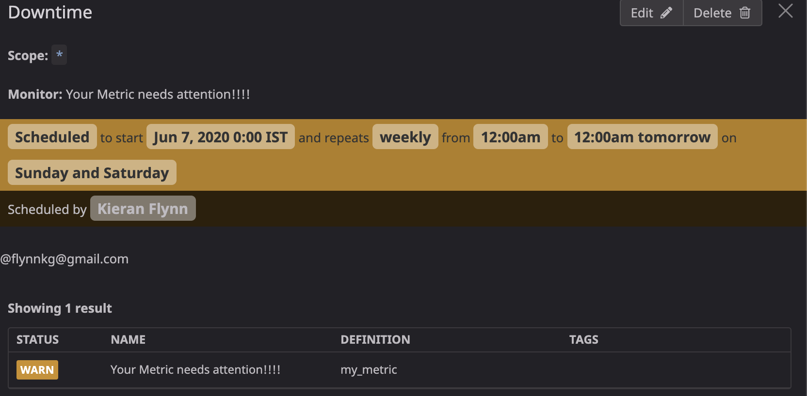

* **Bonus Question**: Since this monitor is going to alert pretty often, you don’t want to be alerted when you are out of the office. Set up two scheduled downtimes for this monitor:

  * One that silences it from 7pm to 9am daily on M-F,
  * And one that silences it all day on Sat-Sun.
  * Make sure that your email is notified when you schedule the downtime and take a screenshot of that notification.

## Collecting APM Data:

Collecting APM data is quite straightforward and again datadog supports APM reporting from a number of different sources. However today we'll focus on python, in keeping with the previous parts of this guide. To get started lets create a new sample python program using the code below. Before running this application be sure to install the dependencies by

`pip install ddtrace`

and

`pip install flask`

if needed.

```python
from flask import Flask
import logging
import sys

# Have flask use stdout as the logger
main_logger = logging.getLogger()
main_logger.setLevel(logging.DEBUG)
c = logging.StreamHandler(sys.stdout)
formatter = logging.Formatter('%(asctime)s - %(name)s - %(levelname)s - %(message)s')
c.setFormatter(formatter)
main_logger.addHandler(c)

app = Flask(__name__)


ddtrace.config.analytics_enabled = True
#this line allows us to view APM Application Analytics in Datadog

@app.route('/')
def api_entry():
    return 'Welcome to Springfield'

@app.route('/api/moes')
def apm_endpoint():
    return 'Welcome to Moe's'

@app.route('/api/powerplant')
def trace_endpoint():
    return 'Welcome to the Power Plant'

if __name__ == '__main__':
    app.run(host='0.0.0.0', port='5050')
```

You can launch this application by running 

`ddtrace-run python apm_python.py`

and in a few moments information will populate into the APM services and APM App analytics pages. We can combine our APM metrics with the system metrics in a single host. In this instance we can clone an existing dashboard (System Metrics) and then export individual graphs from the APM Service view of our application into our new dashboard. 

A service provides access to underlying resources. A resource is an API endpoint or could also be a database or storage. In this example our service is a flask python app but it could just as easily be a java application, go application or a docker containerised service running nodejs for example.

[APM & System Metrics Dashboard](https://p.datadoghq.eu/sb/zj54osoyimwo4gu1-426872776cd5fa7ef45d7602d5d26497)

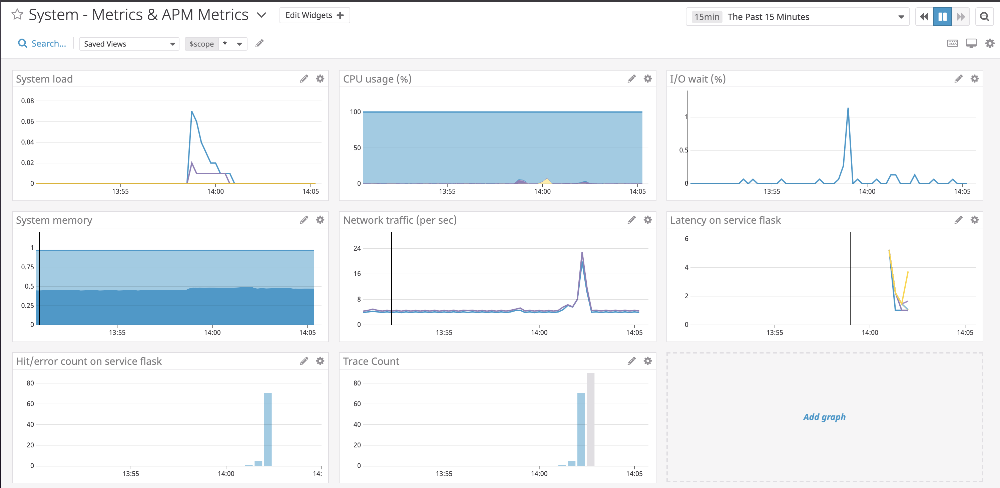

## Datadog - not just for business!

Like most people, the current lockdown has brought out a sudden and renewed interest in DIY and hobbies in the home. I've taken a recent interest in my aquarium, namely the lighting. I built a nice new LED lighting system for it - but there was an issue. It generated a huge amount of heat. This resulted in a number of questions

* Will the light crack under its own heat?
* Will the light heat up the water too much?
* Will the light create extra humidity in the room outside the tank?

To address this, and some other worries about leaks, I am planning to purchase a number of sensors, some wired, some not. All sensor data will be collected on a raspberry pi near the tank and be analysed to understand how the light effects the water temp, humidity etc at different power settings. In addition, water level sensors both in and out of the tank will indicate a leak is in progress.

However - how to track, manage and use all this data? Datadog of course! We've already seen how custom metrics can be easily created. By Forwarding the info into Datadog I can see patterns over long periods and use anomaly detection to gain new insights - for example a faulty air pump is easy to miss (as its silent) but it is dangerous to the inhabitants if not fixed quickly. But anomaly detection will notice the very small variation in temperature from the lack of air flow, and we can create an alert that can notify me of the issue. Similarly, if we detect a rapidly dropping tank water level combined with water detected on the floor - activate ALL THE ALERTS! Leak! Panic! 

But also hopefully disaster averted, through data visibility!


## Useful links

### How to get started with Datadog

* [Datadog overview](https://docs.datadoghq.com/)
* [Guide to graphing in Datadog](https://docs.datadoghq.com/graphing/)
* [Guide to monitoring in Datadog](https://docs.datadoghq.com/monitors/)

### The Datadog Agent and Metrics

* [Guide to the Agent](https://docs.datadoghq.com/agent/)
* [Datadog Docker-image repo](https://hub.docker.com/r/datadog/docker-dd-agent/)
* [Writing an Agent check](https://docs.datadoghq.com/developers/write_agent_check/)
* [Datadog API](https://docs.datadoghq.com/api/)

### APM

* [Datadog Tracing Docs](https://docs.datadoghq.com/tracing)
* [Flask Introduction](http://flask.pocoo.org/docs/0.12/quickstart/)

### Vagrant

* [Setting Up Vagrant](https://www.vagrantup.com/intro/getting-started/)

### Other questions:

* [Datadog Help Center](https://help.datadoghq.com/hc/en-us)
