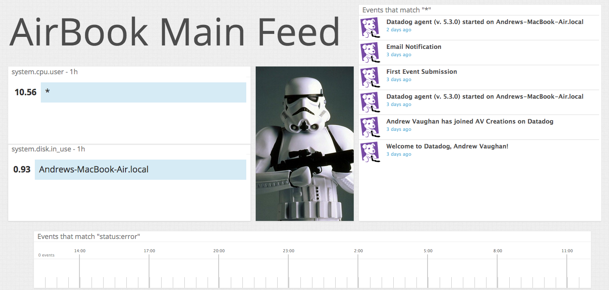

Thank you taking the time to review my coding challenge and I look forward to speaking with members of the team regarding this opportunity.

Obligatory Excitement Gif


### Level 1

* Sign up for Datadog, get the agent reporting metrics from your local machine.


* Bonus question: what is the agent?

The Datadog Agent is a program that collects metrics and events and sends this information to Datadog for analysis.  The Agent serves as the worker for the online portal which displays all the information to the user in easy to use dashboards.

* Submit an event via the API.

Code for initial event creation from API Docs

```ruby
require 'rubygems'
require 'dogapi'


api_key = "f1ef993e5fb3d4d7eddf8bd3be232971"

dog = Dogapi::Client.new(api_key)

dog.emit_event(Dogapi::Event.new("This is the intial setup event for the datadog support engineer hiring challenge", :msg_title => "First Event Submission"))
```
And the screenshot showing successful submission:


* Get an event to appear in your email inbox (the email address you signed up for the account with)

Code for creation of email notification event:

```ruby
require 'rubygems'
require 'dogapi'


api_key = "f1ef993e5fb3d4d7eddf8bd3be232971"

dog = Dogapi::Client.new(api_key)

dog.emit_event(Dogapi::Event.new("Now submitting a second event to showcase the email alert system, @asdvaughan@gmail.com", :msg_title => "Email Notification"))

```

Email screenshot from Gmail:


Datadog Screenshot:


### Level 2

* Take a simple web app ([in any of our supported languages](http://docs.datadoghq.com/libraries/)) that you've already built and instrument your code with dogstatsd. This will create **metrics**.

For this exercise I will be intergrating the code into an application called Hidden Treasures, a Sinatra Geocaching Application that allows users to place digital treasures in the world for their friends to find.

* While running a load test (see References) for a few minutes, visualize page views per second. Send us the link to this graph!

To assist with accessing my code I have created a helper method that will be called withing my controller:

```ruby
    def update_count
      statsd = Statsd.new
      statsd.increment('web.page_views')
    end
```

[Link to the Graph](https://app.datadoghq.com/dash/47296/hidden-treasures?live=true&from_ts=1429664285082&to_ts=1429667885082&tile_size=m)
* Create a histogram to see the latency; also give us the link to the graph

I added a method to Datadog module to assist with adding a histogram of the database latency based off the API Docs.

```ruby
    def update_count
      statsd = Statsd.new
      statsd.increment('web.page_views', :tags => ['support'])
    end

    def latency
      statsd = Statsd.new
      start_time = Time.now
      results = Treasure.all
      duration = Time.now - start_time
      statsd.histogram('database.query.time', duration)
    end
```
[Link to the Graph](https://app.datadoghq.com/dash/47296/hidden-treasures?live=true&from_ts=1429665376561&to_ts=1429668976561&tile_size=m)


* Bonus points for putting together more creative dashboards.

