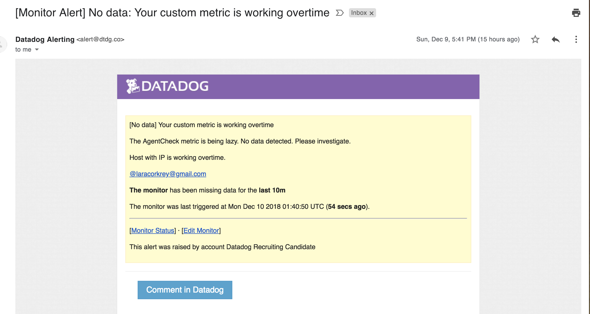
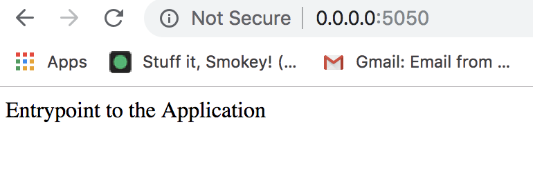
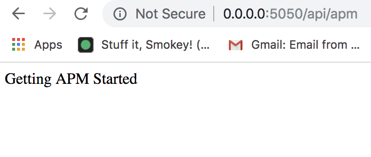
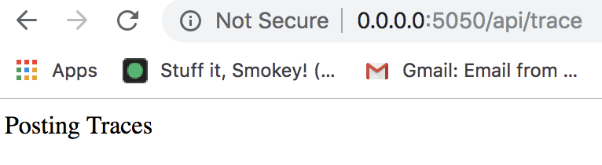
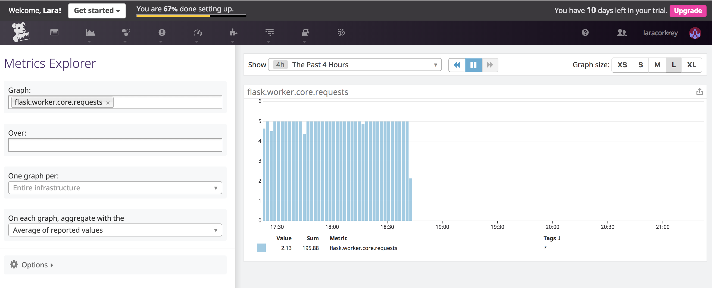
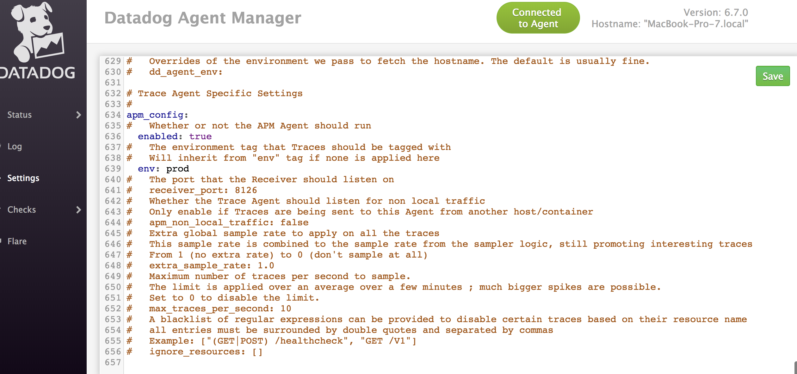
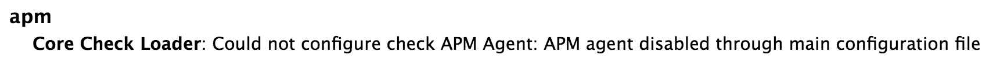

Welcome to my completed Datadog exercise for the Solutions Engineer role!

Seriously, the cutest logo and one of the most fun projects I've had the opportunity to work on.

To kickoff this exercise, I spun up a virtual environment using virtualenv. I chose virtualenv because it's lightweight, Python friendly (which is used extensively with Datadog though Go is the main codebase) and very quick to activate and deactivate. It's also very user friendly.

With my virtual environment running, I downloaded Datadog's Agent Manager and dived into the assignment.

First off was Collecting Metrics. To start, I added tags for my host in the Agent configuration (config) file. Here is a screenshot of my host and its tags on the Host Map page in Datadog.

You can see that the availability zone is San Francisco, where the host is located, and the service is coffee, because this city runs on coffee! Really good coffee, too :)

Next up, I integrated PostgreSQL with Datadog. I choose PostgreSQL because it was installed on my machine for other projects. Integration was a straightforward process with Datadog's integration tools. From my Datadog account, I simply went to integrations and clicked on PostgreSQL. I then walked through the instructions and added a check to my agent to confirm the integration was complete and running as expected. Here are screenshots showing confirmation of the integration and the checks showing everything was humming along nicely.

Then it was time to create a custom Agent check that submits a metric. For this step, I went to datadog-agent/etc/checks.d and created a new file titled mychecks.py. Per the Datadog docs, I also created a corresponding configuration file at datadog-agent/etc/conf.d titled mychecks.yaml. I then added the configuration file to the enabled checks in the Datadog Agent. Here are screenshots of the code and the check status showing everything is working as expected.

Finally, I changed the custom check's collection interval so that it only submits the metric once every 45 seconds.

Bonus! To change the collection interval, I updated the configuration file and not the Python file.

Time to visualize all this beautiful data! For me, feels a bit like eating dessert. A lot of work goes into accurately collecting data, considering edge cases, confounding variables, etc. But what good is all that data if we can't see it to better analyze and understand correlations. Graphs bring data together and display it in easy to understand (and often pretty) pictures to quickly demonstrate what's happening under the hood. There's so much that can be missed without accurate graphs!

Anyhow, I digress. Back to the assignment. Visualizing Data!

I created a Timeboard that contains the following:

1) The custom metric I created scoped over my host.
2) A metric from my integrated PostgreSQL database with the anomaly function applied.
3) My custom metric with the rollup function applied to sum up all the points for the past hour into one bucket.
This is what is looks like!

Finally, I set the Timeboard's timeframe to the past 5 minutes and sent a notation to myself. Here are screenshots of the annotation and the email received. Really cool!

Bonus! Let me explain what the anomaly graph is displaying because these are very important data points.

Anomalies are events that occur outside of a normal/historically expected trend. The anomaly graph displays detections that occur outside of the historically expected trend. When an event doesn't match a prediction, it is an anomaly and will be displayed on the anomaly graph.

Why are these important? They tell us when something might be wrong, might need attention, or maybe trends are changing and our data needs to be updated. Have you ever received a call from your credit card company for suspected fraud? That's an anomaly trigger. A purchased occurred with your credit card that is outside of your normal behavior. Maybe in a different location relative to your day-to-day or an item you don't usually purchase. This unusual behavior triggers an alert much the same as anomalies in Datadog trigger alerts.

Which leads me to the part of the this exercise, monitoring data. For this requirement, I created a new Metric Monitor that watches the average of my custom metric. An alert triggers if activity of the metric reaches or exceeds a threshold in a given time period.

After creating the triggers, I then crafted automatic messages to be sent to the end user, in this case me, notifying me of three events; a warning threshold, an alert threshold and a no data state.

These are screenshots of the monitors and the notice I received via email.

As a bonus, I scheduled two downtimes for these monitors so that I'm notified after business hours or during the weekends. Below are two screenshots, one of the weekday monitor and the other of a notification I received stating the weekend monitor had been created.

Finally, I created an app using Flask with the intent of collecting APM data. Getting the Flask app running and integrated with Datadog was unambiguous. Here are screenshots of the Flask app running on the local host as well as Flask metrics from Datadog.

I did run into bugs trying to integrate the APM which I'll discuss in the challenges section below.

For the final bonus, I'm going to explain the difference between a Service and a Resource.

Services are a set of processes that work together to provide a feature set. Examples of simple featured sets might be a webapp service or a database service. Services are defined by the user when they create their app using Datadog. Services help to quickly distinguish between different processes run by the app.

Resources are a query to a service. For a web app, examples might be a handler or a canonical URL.

Here are two challenges I encountered while completing this exercise.
First, due to time constraints, I was not able to utilize scripts or the Python wrappers to create the Timeboard. In the interest of time, I simply used the Datadog UI to create the Timeboard. I would love to revisit this with more time.

The second challenge I encountered was integrating the APM Agent. Following the Datadog docs, I enabled the APM Agent in the main config files.

Additionally, I successfully [installed ddtrace](https://docs.datadoghq.com/tracing/setup/python/) and used this to instrument my app. Then I configured my environment and restarted my Agent.

However, the Agent status check continued to return a message of "APM Disabled on main config file".

This may be due to an inability to install the Mac APM Agent. Per the [docs](https://github.com/DataDog/datadog-trace-agent), I downloaded the file and ran the command "./trace-agent-darwin-amd64-X.Y.Z -config /opt/datadog-agent/etc/datadog.yaml". The response error I received was "./trace-agent-darwin-amd64-6.7.0: command not found". A [google search](https://github.com/DataDog/datadog-trace-agent/issues/397) showed this was an issue prior to the binaries being provided. I could find no information as to why the issue is persisting. As I continued to attempt to debug, I did find [Datadog documentation for monitoring Flask apps](https://www.datadoghq.com/blog/monitoring-flask-apps-with-datadog/), but again to no avail. I also read through [APM Setup docs](https://docs.datadoghq.com/tracing/setup/?tab=agent630#primary-tags), [Agent configuration docs](https://docs.datadoghq.com/agent/faq/agent-configuration-files/?tab=agentv6#agent-main-configuration-file), as well as [running ddtrace with Flask](http://pypi.datadoghq.com/trace/docs/web_integrations.html#flask). If this were a real work situation, this is the point where I would ask colleagues for help. While it is essential to know how to ask the right questions to conduct focused research, it's equally important to know when it's time for collaboration.

Wow, did I learn a lot during this exercise! Completing each of these assignments fully demonstrated the power of the Datadog platform and how critical the information provided can be to drive businesses and help teams be more efficient and productive. The beauty of Datadog doesn't stop there though. There are a plethora of creative applications for Datadog's platform.   

I'm a very food centric individual, so of course the first creative use for Datadog's platform that comes to mind is a lunch application. Food trucks are popular lunch time destinations in the San Francisco Financial District. However, it is the nature of most food trucks to be mobile. This leaves workers of the FiDi uncertain of where to find their favorite food truck on a given day. A Datadog dashboard would be a brilliant solution to monitor a truck's location.

In order to gather the necessary data, truck owner's would need to give permission to have their GPS location tracked and uploaded to Google Maps. The Google Maps API could be utilized to gather this information and parsed into a Datadog dashboard. That dashboard would lead hungry workers to their favorite food trucks on any day they choose. Bon appetit!
