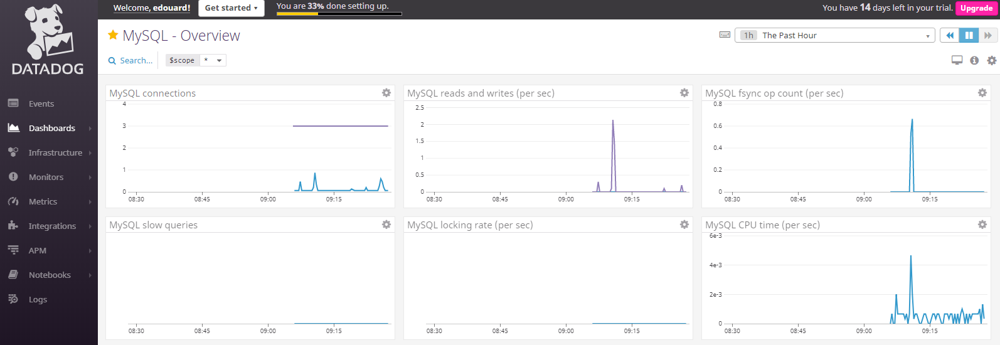
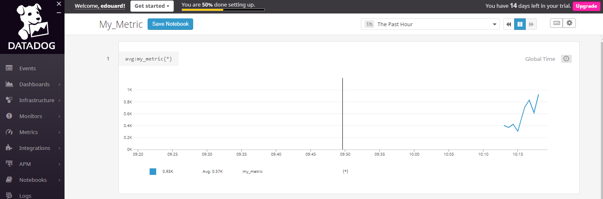
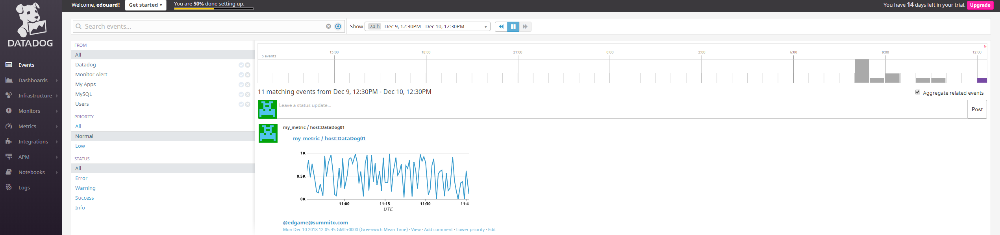
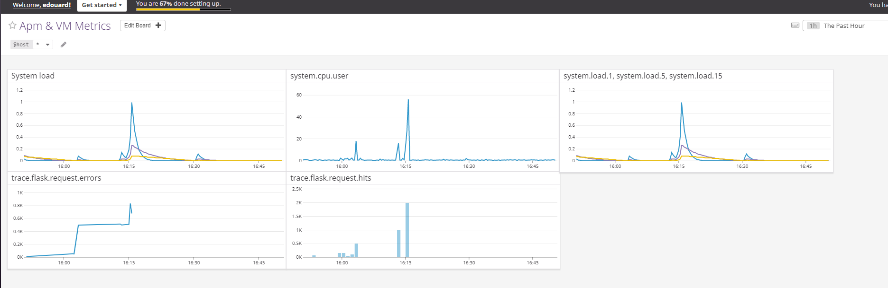

Your answers to the questions go here.

<h1>Collecting Metrics</h1>

I created a Ubuntu 18.04 VM on my local machine using Hyper-V.

<h2>Tags</h2>

I added two tags to the configuration file: datadog.yaml. 
<pre>location:dublin, purpose:hiring_test </pre>
Two files attached: configuration-file-tags.png & host-map-tags.png

<h2>Database</h2>

I installed MySQL and added the integration with the full metrics catalog.
After i checked the status of the agent using : 
<pre>  sudo datadog-agent status </pre>

I installed Apache and PhpMyAdmin in order to generate a few metrics and to be able to visualize it on the Mysql Overview Dashboard.

<h2>Agent Check</h2>

For this part i used the documentation: https://docs.datadoghq.com/developers/write_agent_check/?tab=agentv6#collection-interval

The Scirpt for the Agent Check is a follow: 

<pre>
#checks.d/mymetric.py
from random import uniform

try:
    from checks import AgentCheck
except ImportError:
    from datadog_checks.checks import AgentCheck

# content of the special variable __version__ will be shown in the Agent status page
__version__ = "1.0.0"

class MyMetricCheck(AgentCheck):
    def check(self, instance):
        self.gauge('my_metric', uniform(0, 1000))
</pre>

<pre>
#conf.d/mymetric.py
init_config:

instances:
 - min_collection_interval: 45
 </pre>
 
 <b>sudo datadog-agent check mymetric</b> is giving the following result:
 <pre>
 === Series ===
{
  "series": [
    {
      "metric": "my_metric",
      "points": [
        [
          1544436538,
          244.69564819335938
        ]
      ],
      "tags": null,
      "host": "DataDog01",
      "type": "gauge",
      "interval": 0,
      "source_type_name": "System"
    }
  ]
}
=========
Collector
=========

  Running Checks
  ==============

    mymetric (1.0.0)
    ----------------
        Instance ID: mymetric:5ba864f3937b5bad [OK]
        Total Runs: 1
        Metric Samples: 1, Total: 1
        Events: 0, Total: 0
        Service Checks: 0, Total: 0
        Average Execution Time : 0s
</pre>

Finally i created a notebook showing my_metric.

<h2>Bonus Question:</h2>
It is indeed possible by updating the value of the collection interval in the Yaml file.

<h1>Visualizing Data</h1>

To Create the script i used the <a href="https://docs.datadoghq.com/api/?lang=python#timeboards">documentation</a> and i used the UI as an help to create the queries. The python is available <a href="timeboard.py">here</a>. I just removed the app_key and api_key.
I have not been able to set the set timeframe on 5 minutes. The lowest option that i was able to access was 15 minutes.

I took the snapshot and send it to me. The snapshot appears in the event.

I created the following PHP script to generate requests on the Flask App.
<pre>

 $base = 'http://192.168.0.52:5050';
 $requests = array(
    0 => '/',
    1 => '/api/apm',
    2 => '/api/trace'
);

 for($i = 0; $i <= 1500; $i++){
     $rand = rand(0, 2);
     $url = $base.$requests[$rand];
     echo $i.' ';
     echo $url;
         
    $ch = curl_init(); 
    curl_setopt($ch, CURLOPT_URL, $url); 
    curl_setopt($ch, CURLOPT_RETURNTRANSFER, 1); 
    $output = curl_exec($ch);  
    curl_close($ch); 
 }
 

</pre>

I started by created a timeboard, it seems easier at beginning because i was able to export the graph APM Services. I realise only after that i could not share a timeboard and started over with a screenboard.

Screenshot of the Dashboard.

Link to Dashboard APM & VM Metrics: https://p.datadoghq.com/sb/598f8fce1-8c5ca067c3ab81c735c76aafd32d9a33

