<!-- Header -->
<br />
<p align="center">
  <a href="img/Datadog_logo.png">
    
  </a>

  <h3 align="center">Datadog - Sales Engineer Technical Interview</h3>

  <p align="center">
    Valentin PEREIRA
    <br />
    <a href="https://www.linkedin.com/in/valentin-pereira/"><strong>View on LinkedIn »</strong></a>
    <br />
  </p>
</p>


<!-- Table of contents -->
<details open="open">
  <summary>Table of Contents</summary>
  <ol>
    <li>
      <a href="#setup-the-environment">Setup the environment</a>
      <ul>
        <li><a href="#installing-the-datadog-agent">Installing the Datadog agent</a></li>
      </ul>
    </li>
    <li>
      <a href="#collecting-metrics">Collecting Metrics</a>
      <ul>
        <li><a href="#adding-tags">Adding Tags</a></li>
        <li><a href="#installing-a-database">Installing a database</a></li>
        <li><a href="#creating-custom-agent-check">Creating custom Agent check</a></li>
        <li><a href="#changing-the-collection-interval">Changing the collection interval</a></li>
        <li><a href="#bonus-question">Bonus question</a></li>
      </ul>
    </li>
    <li>
      <a href="#visualizing-data">Visualizing Data</a>
      <ul>
        <li><a href="#display-custom-metric-scoped-over-your-host">Display custom metric scoped over your host</a></li>
        <li><a href="#display-DB-metric-with-anomaly-function-applied">Display DB metric with anomaly function applied</a></li>
        <li><a href="#display-custom-metric-with-rollup-function">Display custom metric with rollup function</a></li>
        <li><a href="#taking-a-snapshot-of-the-dashboard">Taking a snapshot of the Dashboard</a></li>
        <li><a href="#bonus-question">Bonus question</a></li>
      </ul>
    </li>
    <li><a href="#monitoring-data">Monitoring Data</a></li>
    <li><a href="#collecting-apm-data">Collecting APM Data</a></li>
    <li><a href="#final-question">Final Question</a></li>
  </ol>
</details>


<!-- Prerequisites -->
## Setup the environment

To ensure a proper environment for this exercise, and avoid dependency issues, we are using Vagrant to spawn an Ubuntu Virtual Machine with version 18.04.3.

Following the steps detailed on [Vagrant](https://learn.hashicorp.com/collections/vagrant/getting-started) getting-started guide, we simply installed Vagrant and [VirtualBox](https://www.virtualbox.org/), and performed the following steps:

```
vagrant init hashicorp/bionic64
vagrant up
```

Our VM is now running. We then SSH into it using:
```
vagrant ssh
```

### Installing the Datadog agent

Following the installation process after creating a [Datadog account](https://docs.datadoghq.com/), we are installing the Datadog Agent on our Ubuntu VM, using the simple following command:

```
DD_AGENT_MAJOR_VERSION=7 DD_API_KEY=aac12d08c8efaa3d00c0fb61eadfec5f DD_SITE="datadoghq.eu" bash -c "$(curl -L https://s3.amazonaws.com/dd-agent/scripts/install_script.sh)"
```

The agent is now running:


<!-- Collecting Metrics -->
## Collecting Metrics

### Adding tags
To understand more about tags, I headed to the Datadog Documentation, on the page [Getting Started with Tags](https://docs.datadoghq.com/getting_started/tagging/).

By following along, we see that there are different methods to set up tags with your agent. I decided to go with the manual method, for which I needed to locate the Datadog agent configuration files. After checking the [Agent Configuration Files](https://docs.datadoghq.com/agent/guide/agent-configuration-files/?tab=agentv6v7#agent-main-configuration-file), I found that for Ubuntu, it was in:
```
/etc/datadog-agent/datadog.yaml
```
To edit it, I decided to use Vim:
```
sudo vim /etc/datadog-agent/datadog.yaml
```
And added some tags as per the following screenshot:


And restarted the agent service to apply the changes:
```
sudo service datadog-agent restart
```

We can now see the tags in the Datadog dashboard:


### Installing a database

I decided to install MongoDB as this is a database I have worked with in the past. For the installation process, I simply followed the steps written in the [MongoDB Installation Guide](https://docs.mongodb.com/manual/tutorial/install-mongodb-on-ubuntu/).

After installing MongoDB, we start the mongod process and verify that the DB is indeed running:


Based on the Datadog Documentation, [Integration for MongoDB](https://docs.datadoghq.com/integrations/mongo/?tab=standalone):
```
The MongoDB check is included in the Datadog Agent package. No additional installation is necessary.
```

Following the steps described, we then create a read-only user for the Datadog Agent in the admin database:
```
db.createUser({
  "user": "datadog",
  "pwd": "<UNIQUEPASSWORD>",
  "roles": [
    { role: "read", db: "admin" },
    { role: "clusterMonitor", db: "admin" },
    { role: "read", db: "local" }
  ]
})
```

We then access the mongoDB config file:
```
sudo vim /etc/datadog-agent/conf.d/mongo.d/conf.yaml
```
and edit the configuration with the following parameters:
```
init_config:

instances:

  - hosts:
      - localhost

    username: datadog

    password: **********

    database: admin

    options:
      authSource: admin
```

We then restart the Datadog Agent using:
```
sudo service datadog-agent restart
```

Once the integration was added successfully, We can finally observe some of the metrics in the MongoDB - Overview dashboard:


### Creating custom Agent check

Following the Datadog Documentation on [Custom Agent Check](https://docs.datadoghq.com/developers/write_agent_check/?tab=agentv6v7), I created a python file based on the sample one presented in the doc. 

The changed that need to be made from this file are the following:
- Firstly, the hello.world variable is changed to my_metric, according to the exercise.
- Instead of a fixed value, we generate a random value by using: 
```
random.randint(0,1000)
```
- Finally, I added "host:vagrant" in the tags and saved the file.

I then paste this code in "checks.d/agent_check.py" with the command:
```
sudo vim /etc/datadog-agent/checks.d/agent_check.py
```


I am also creating a sequence called instances in "conf.d/agent_check.yaml"

To verify that the check is running, I launched the following command:
```
sudo -u dd-agent -- datadog-agent check agent_check
```

And got the output:


### Changing the collection interval
Still following the documentation, I edit the "conf.d/agent_check.yaml" to change the check's collection interval to once every 45sec (the default being once every 15sec).


We can then observe the metric in a dashboard to see our check_agent from the Datadog platform:


### Bonus question
It is possible to change the collection interval without modifying the Python script by modifying the file "/etc/datadog-agent/conf.d/agent_check.yaml" as shown in the section above.

<!-- Visualizing Data -->
## Visualizing Data

To create a Dashboard using the Datadog API, I decided to use Python. I first headed to the Datadog API Documentation to see what needed to be set up.

I simply ran the following command to install the Datadog API client library for Python on my laptop:
```
pip3 install datadog-api-client
```

The API authenticates us on every call. For this reason, we need an API Key to be sent along with our requests. I then used the GUI to create an API Key:
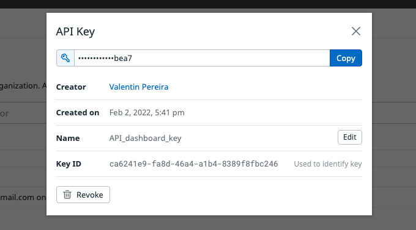

By using Postman and changing the "api_key" variable with the value of our freshly created API Key, we can then run the query to validate the API Key, which returns a valid result as we can see in the following:
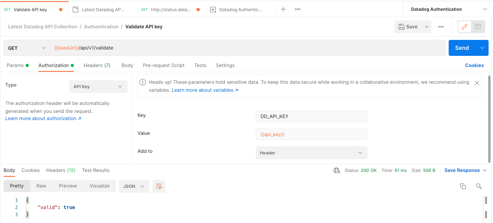

Note that I also had to change the "site" variable to "datadoghq.eu" as my Datadog instance is running on the EU servers.

I then headed to the [Dashboards](https://docs.datadoghq.com/api/latest/dashboards/) page of the API Documentation.

Before trying to write my own python script, I once again used Postman to see what the request looked like and play around with it.
On the first try, I received an error because the body of the request was incorrect. I then headed towards the documentation and copy/pasted one of the examples in the Postman body.

This time, the request was successful: 
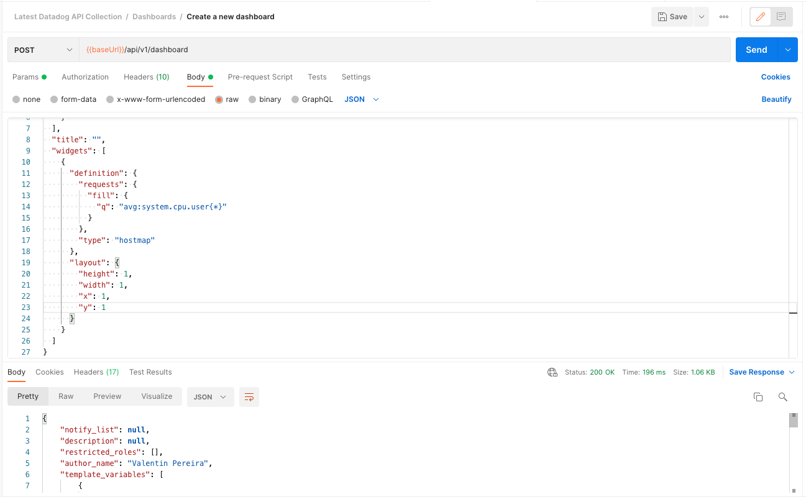

I headed to the Datadog GUI and found my newly created dashboard in the Dashboard List. However, this didn't look very good, and didn't have a name. But at least it worked!
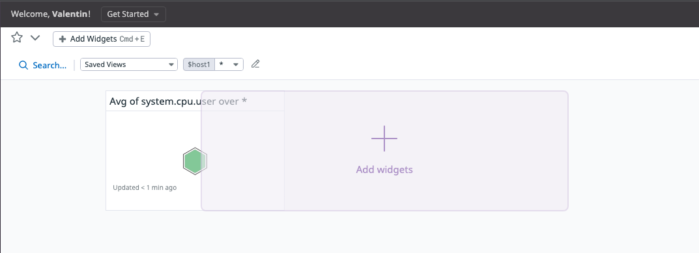

I then decided to write a python script that would allow me to create a much better dashboard than this, using help from the Postman collection as well as the documentation.
For this purpose, I used the code sample from the [Create New Dashboard Documentation](https://docs.datadoghq.com/api/latest/dashboards/#create-a-new-dashboard).
After executing the code, the dashboard was successfully created:
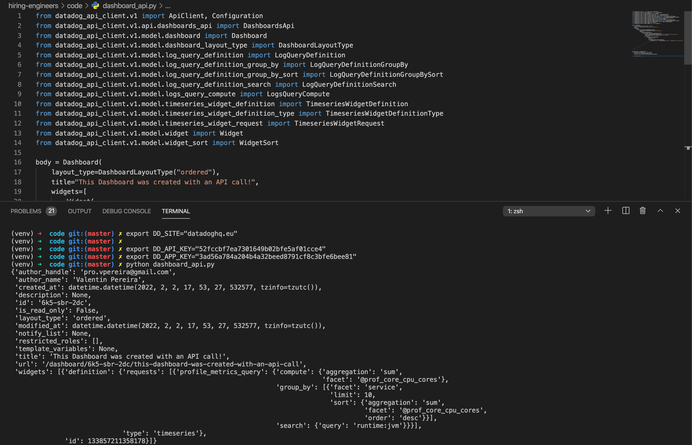

By going through the Dashboard on the GUI and creating a Widget, we can see how to change the parameters of the query to create the widgets according to the Exercise.

For the Exercise, we will use Postman to create these different widgets, allowing us to use the json generated from the GUI to create our query.

### Display custom metric scoped over your host

Following the explanations above, we simply need to add a widget to our widgets array in the json body.

In our case, our widget json looks like the following:

```
    {
     "definition":{
        "title":"my_metric",
        "title_align":"left",
        "show_legend":false,
        "type":"timeseries",
        "requests":[
           {
              "q":"avg:my_metric{host:vagrant}",
              "display_type":"line"
           }
        ]
     },
     "layout":{
        "x":0,
        "y":0,
        "width":6,
        "height":3
     }
    }
```

Here is how it appears on the Datadog platform:
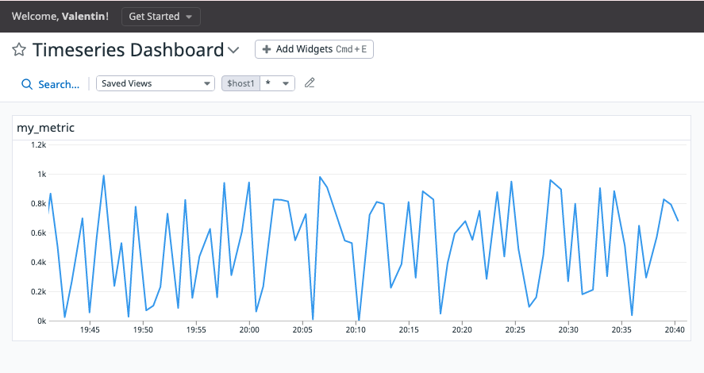

### Display DB metric with anomaly function applied
Using the [Anomaly Monitor Documentation](https://docs.datadoghq.com/monitors/create/types/anomaly/), we can identify when our metric is behaving in a different manner than the previous trends.

In our case, we'll use a metric from the Integration with our MongoDB database. I chose the number of distinct requests that the server is receiving as this can be a good indication of the load on our database. Of course, other relevant parameters could be used such as the number of Read/Writes or the average memory usage. 

Our widget json looks like the following:

```
    {
     "definition":{
        "title":"Anomaly Detection MongoDB",
        "title_align":"left",
        "show_legend":true,
        "legend_layout":"auto",
        "legend_columns":[
            "avg",
            "min",
            "max",
            "value",
            "sum"
        ],
        "type":"timeseries",
        "requests":[
           {
            "style": {
                "palette": "dog_classic",
                "line_type": "solid",
                "line_width": "normal"
            },
            "display_type":"line",
            "response_format":"timeseries",
            "queries":[
                {
                "name":"query1",
                "data_source":"metrics",
                "query":"avg:mongodb.network.numrequestsps{*}"
                }
            ],
            "formulas":[
                {
                "alias":"rows inserted per second",
                "formula":"anomalies(query1, 'basic', 2)"
                }
            ]
           }
        ]
     },
     "layout":{
        "x":6,
        "y":0,
        "width":6,
        "height":3
     }
    }
```

And our dashboard now has the new widget integrated:
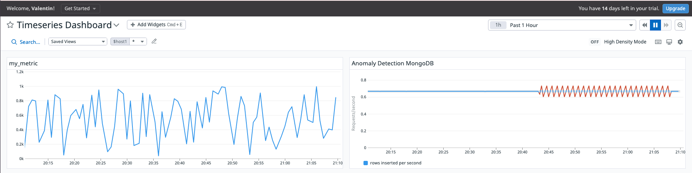

### Display custom metric with rollup function
Using the [Rollup Documentation](https://docs.datadoghq.com/dashboards/functions/rollup/), we can use time aggregation over some metrics. This allows us to aggregate data using a specific method (ex: sum, average, max, etc.) over a defined period of time.

Using the rollup widget over my_metric, our json looks like the following:

```
{
    "definition":{
    "title":"my_metric aggregated over 1h",
    "title_align":"left",
    "show_legend":true,
    "legend_layout":"auto",
    "legend_columns":[
        "avg",
        "min",
        "max",
        "value",
        "sum"
    ],
    "type":"timeseries",
        "requests":[
            {
            "style":{
                    "palette":"dog_classic",
                    "line_type":"solid",
                    "line_width":"normal"
                },
            "display_type":"line",
            "response_format":"timeseries",
            "queries":[
                {
                "name":"query1",
                "data_source":"metrics",
                "query":"avg:my_metric{*}.rollup(sum, 3600)"
                }
            ],
            "formulas":[
                {
                "formula":"query1"
                }
            ]
            }
        ],
    },
    "layout":{
        "x":0,
        "y":3,
        "width":6,
        "height":3
    }
}
```

Finally, the overall dashboard containing the three elements can be observed on Datadog:
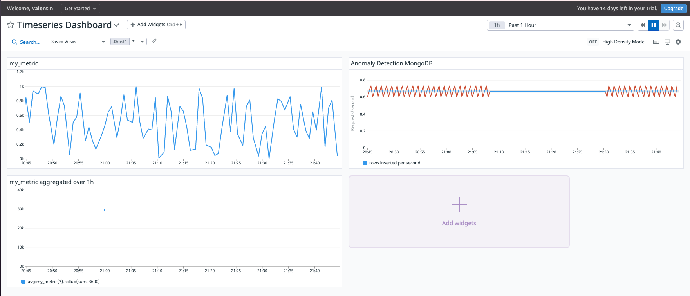

### Taking a snapshot of the Dashboard

The Datadog platform allows us to define a period over which to display our graphs. In our case, we just changed it from 1h to 5min:

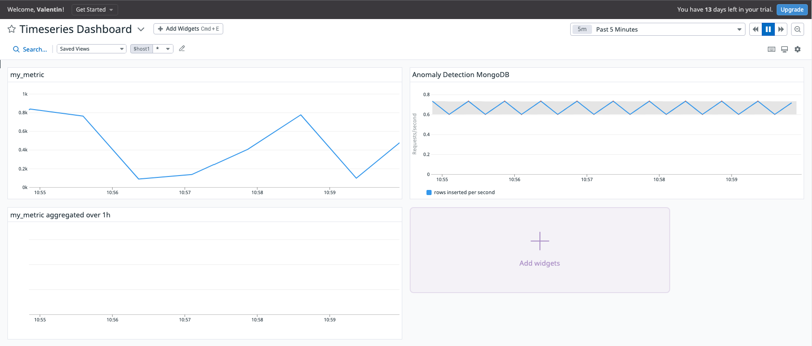

We can now send a snapshot of one specific graph:
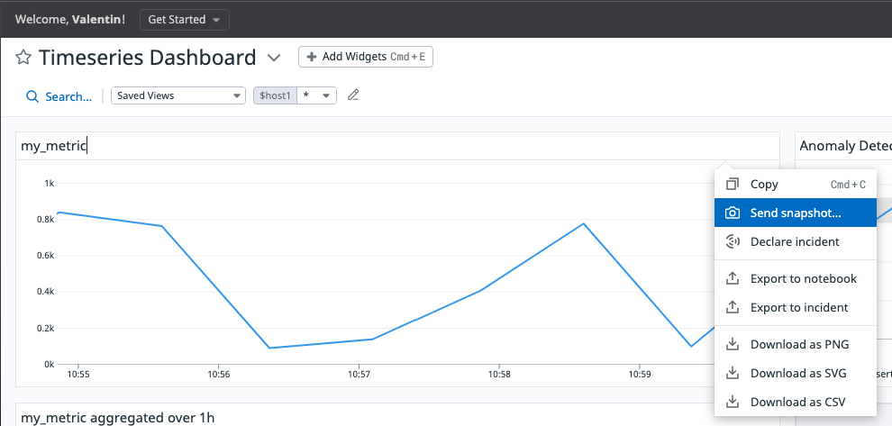

This can also allow us to comment on the graph and send this to the relevant people in the team:
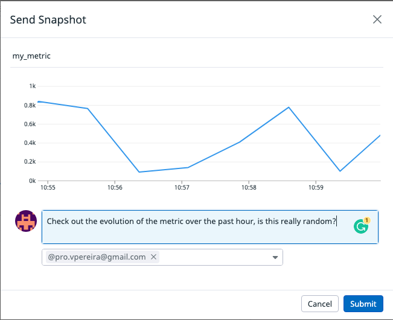

These members can be alerted by email, which already contains all the information allowing for a quicker response time:
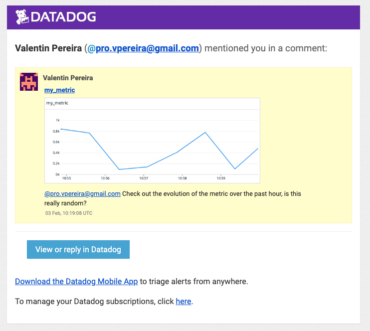


### Bonus Question
Coming back to the [Anomaly Monitor Documentation](https://docs.datadoghq.com/monitors/create/types/anomaly/), we can see that the Anomaly graph is meant to trigger attention when a metric behaves in a different way than how it used to according to past data. This can be useful to quickly identify outliers when a certain metric is supposed to follow a specific pattern.
For instance, this could allow you to spot an unexpected spike in traffic, or CPU usage, which you could then investigate on and correlate with other data from the Dashboard to identify the root cause and potential remediation.

<!-- Monitoring Data -->
## Monitoring Data

ToDo


<!-- Collecting APM Data -->
## Collecting APM Data

ToDo

<!-- Final Question -->
## Final Question

ToDo


