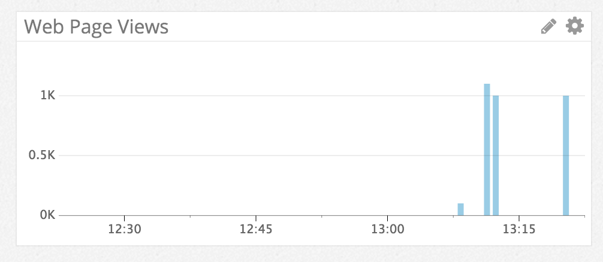
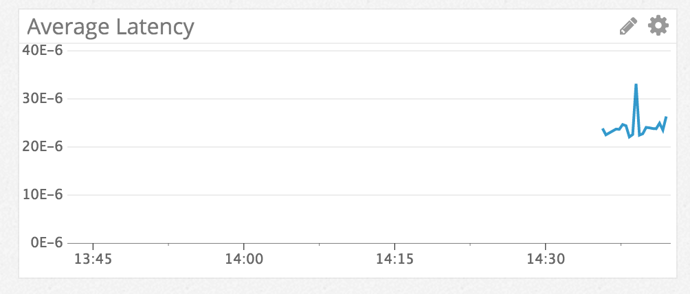
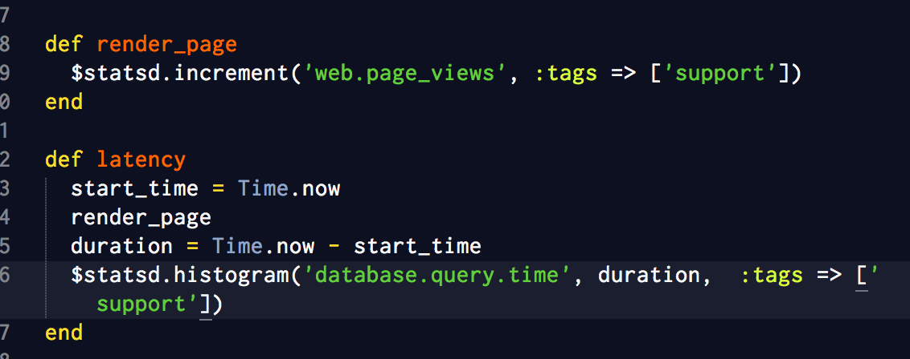

Your answers to the questions go here.

### Level 1

* Sign up for Datadog (use "Datadog Recruiting Candidate" in the "Company" field), get the agent reporting metrics from your local machine.

* Bonus question: what is the agent?

The Agent collects events and metrics to send them back to DataDog for monitoring purposes. The agent has three components - the collector, dogstatsd, and the forwarder. The collector captures system metrics on a local machine like memory and CPU. The dogstatsd is a backend server that collects custom metrics from an app. The forwarder consolidates information from both the collector and dogstatsd to send to DataDog.

* Submit an event via the API.
* Get an event to appear in your email inbox (the email address you signed up for the account with)

### Level 2

* Take a simple web app ([in any of our supported languages](http://docs.datadoghq.com/libraries/)) that you've already built and instrument your code with dogstatsd. This will create **metrics**.
* While running a load test (see References) for a few minutes, visualize page views per second. Send us the link to this graph!

I ran a few load tests from between 100 and 1000 requests, and here's the graph:
[Page Views](https://app.datadoghq.com/graph/embed?token=d9e3121636f7d3d9886f5fd13fe40c2cd0f4b53dac505bb6f21dce508b7b37e9&height=300&width=600&legend=true)

* Create a histogram to see the latency; also give us the link to the graph

[Average Latency](https://app.datadoghq.com/graph/embed?token=6387f0c7caba0fa2e0506dd60cf52e403b5dc263bd4a0daf3f8f40af84e8ccd3&height=300&width=600&legend=true)

* Bonus points for putting together more creative dashboards.

### Level 3

Using the same web app from level 2:
* tag your metrics with `support` (one tag for all metrics)
I've added this code to my application controller:

* tag your metrics per page (e.g. metrics generated on `/` can be tagged with `page:home`, `/page1` with  `page:page1`)
* visualize the latency by page on a graph (using stacked areas, with one color per `page`)