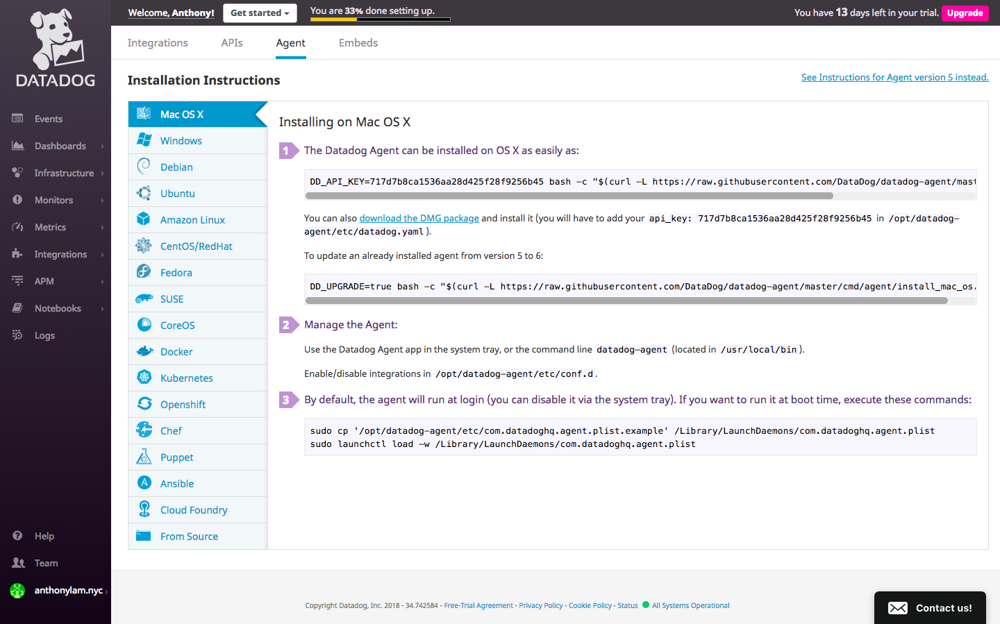
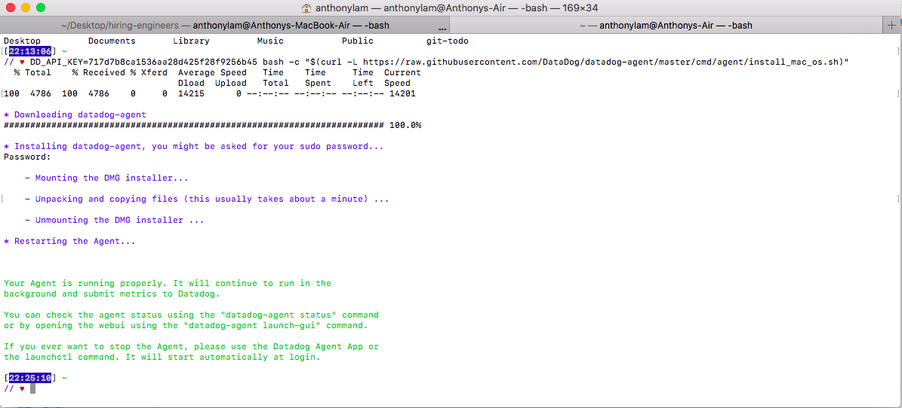
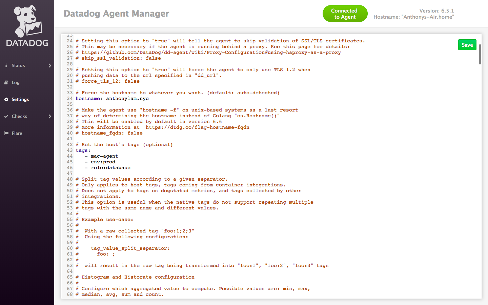
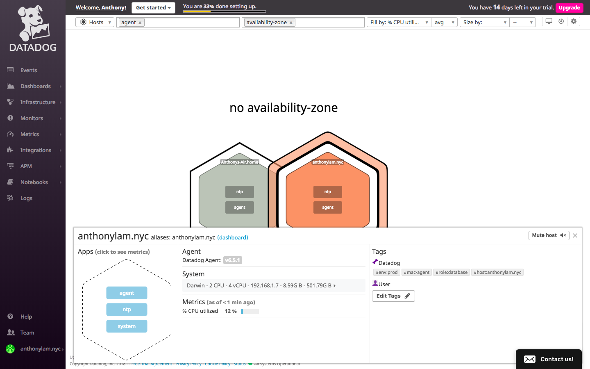
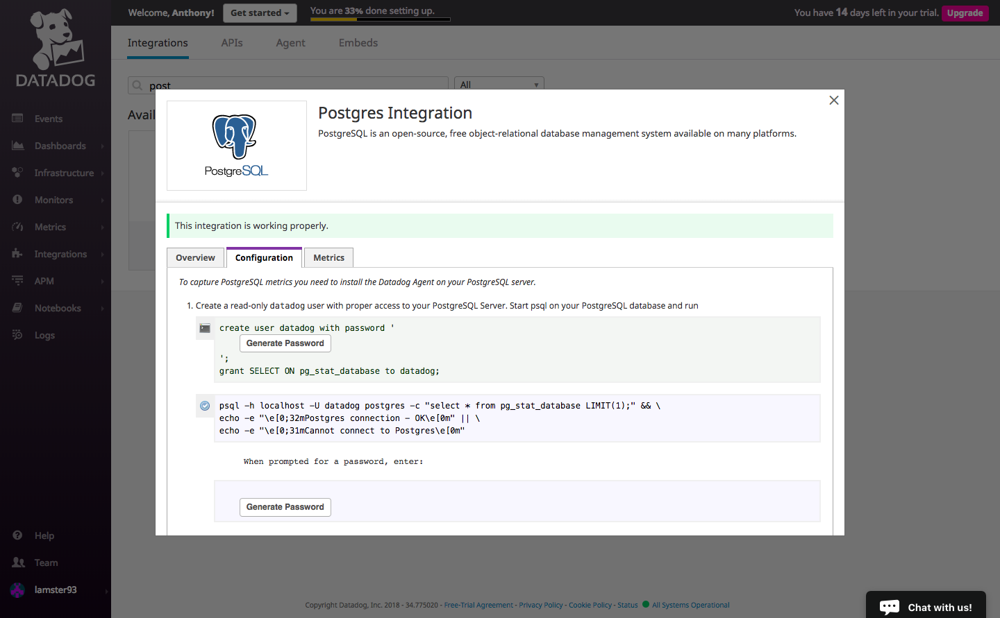
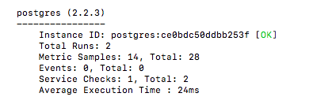
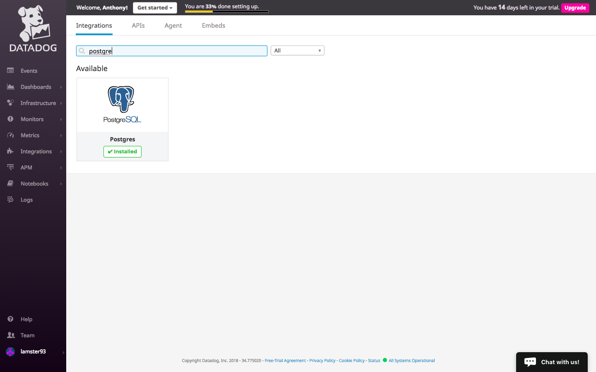

# Anthony Lam -- Solutions Engineer Answers

# Prerequisites - Setup the environment

The operating system used to complete this exercise was MacOS High Sierra Version 10.13.4.
A Linux Ubuntu VM was created using Vagrant and VirtualBox.

Download links:
1. 
2. 

After installing these two programs, run the following commands:
Create a Ubuntu 16.04 VM:
1. `vagrant init ubuntu/xenial64`

Start the VM:
2. `vagrant up`

Use the VM:
3. `vagrant ssh`

After these steps, sign up for a Datadog account 

The Datadog Agent is software that runs on your hosts and collects their events & metrics for you to utilize. More info can be found .

Navigate to the Agent Tab under the Integrations Tab and install the Datadog Agent for Ubuntu.

Install the Datadog Agent in the terminal by running the command in the one-step install. This may take some time.

`DD_API_KEY={YOUR_API_KEY} bash -c "$(curl -L https://raw.githubusercontent.com/DataDog/datadog-agent/master/cmd/agent/install_script.sh)"`

Installation Complete!  

The browser looks like this now. Click Finish to proceed.

# Collecting Metrics

## Add tags in the Agent config file and show us a screenshot of your host and its tags on the Host Map page in Datadog.*

Tags are assigned to hosts and integrations and are very important when it comes to presenting data on dashboards. Tags can represent sizes, roles, and locations. This will be useful for more granular metrics on our dashboards. More info can be found .

1. Using the terminal, navigate to the main directory(`:/`) of the VM.
2. Navigate to `/etc/datadog-agent/datadog.yaml`. This is where a host's tags can be configured.
3. Open the file using an editor. Vim and nano are built in if you do not wish to install one. It can be opened using `sudo nano datadog.yaml`.

Here are the tags I created. Remember to remove the `#`.  

After saving the configurations and restarting the Datadog Agent using `sudo service datadog-agent restart`, I navigated to Host Map tab under Infrastructure in the Datadog Application in my browser.

The host and tags should be visible and look similar to the image below:

## Install a database on your machine (MongoDB, MySQL, or PostgreSQL) and then install the respective Datadog integration for that database.

Let's install a database integration to test out.

I chose PostgreSQL for my database and downloaded it using the following commands:
1. `sudo apt-get update`
2. `sudo apt-get install postgresql postgresql-contrib`

More in-depth use past the installation step can be found .

I navigated to the Integrations Tab, found the PostgreSQL integration, and followed the configuration steps displayed.

1. Creating a user can only be done if you're in the postgres database. To do this, run the command: `sudo -u postgres psql`
2. Use the command: `createuser --interactive  -P` to create a datadog user with the password generated in the installation overview. Exit out using `\q`.
3. Navigate to `/etc/datadog-agent/conf.d/postgres.d`. Open the `conf.yaml.example` file using an editor. Edit the information, add tags, and save as `conf.yaml`!

Here's my conf.d/postgres.yaml file.

I ran a status check by running `sudo datadog-agent status` and the PostgreSQL integration check was successful.

After configuration, I proceeded to install the integration onto the Datadog platform

  
