# Questions

Hi there, my name is Sara Burke. I'm applying for a Solutions Engineer position at DataDog's SF office. Below you'll find my coding challenge answers in roughly the same order as the questions presented in the README file.

## Prerequisites - Setup the environment

I chose to keep the VM simple and follow recommendations to make an Ubuntu VM using Vagrant. I haven't had many opportunities to work with Docker, so I'll try to isolate the learning part of this process to DataDog products.

* Initially, I tried (and failed) to install the DataDog Agent using provisioning within the Vagrantfile and a shell script. My knowledge of setting up Vagrant from scratch with provisions is spotty, particularly in working with keys.

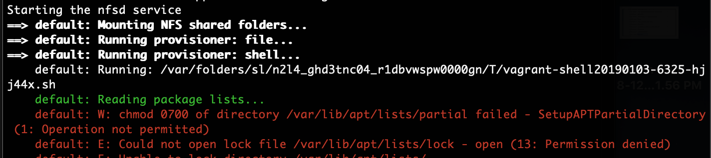

* So instead I'll admit defeat and successfully run the Agent's "easy one-step install" in the shell. I am going to spend more time in the future learning about Vagrantfiles and detailed provisioning/shell scripts.

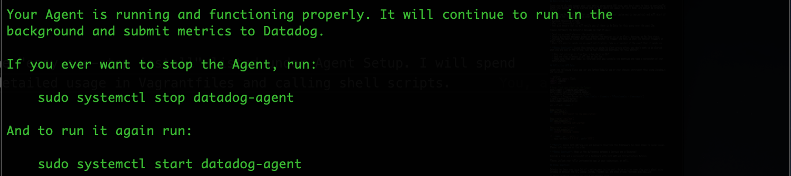

* Great! It's working. Let's move on.

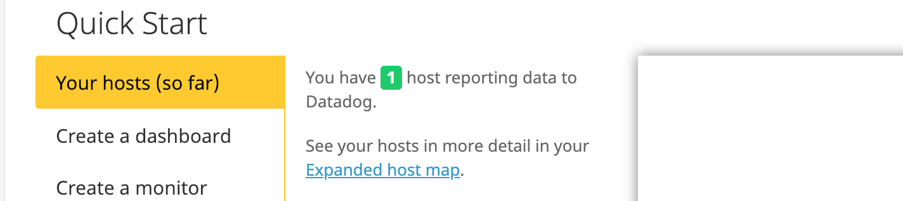

## Collecting Metrics

* I decided to spin up a couple of additional Vagrant instances of Ubuntu (total of one Trusty64, two Xenial64s). This time I successfully used Vagrant's provisioning to install the DataDog Agent on first "Vagrant up". Previously, I must have accidentally included a newline when adding the one-liner-install into the the provisioning file. I have included these [Vagrant related files in the docs folder.](docs/vagrant/)

* I added tags and changed hostnames on the Agent config files across the three VMs and restarted the Agent. Then I discovered that I should have prepended the one-liner-intalls in the provisioning files with "DD_INSTALL_ONLY=true". Since changes can take up to 30 minutes to take full effect, DataDog was recognizing the new hostnames as separate machines. Temporarily, five hosts were displayed instead of three.

* A snippet of some changes that I made to the datadog.yaml are displayed below.

```yaml
# Force the hostname to whatever you want. (default: auto-detected)
hostname: Primary.machine

# ...

# Set the host's tags (optional)
tags:
  - importance:high
  - env:prod
  - role:database
```

* Tag functionality displayed across three VMs on the Host Map.

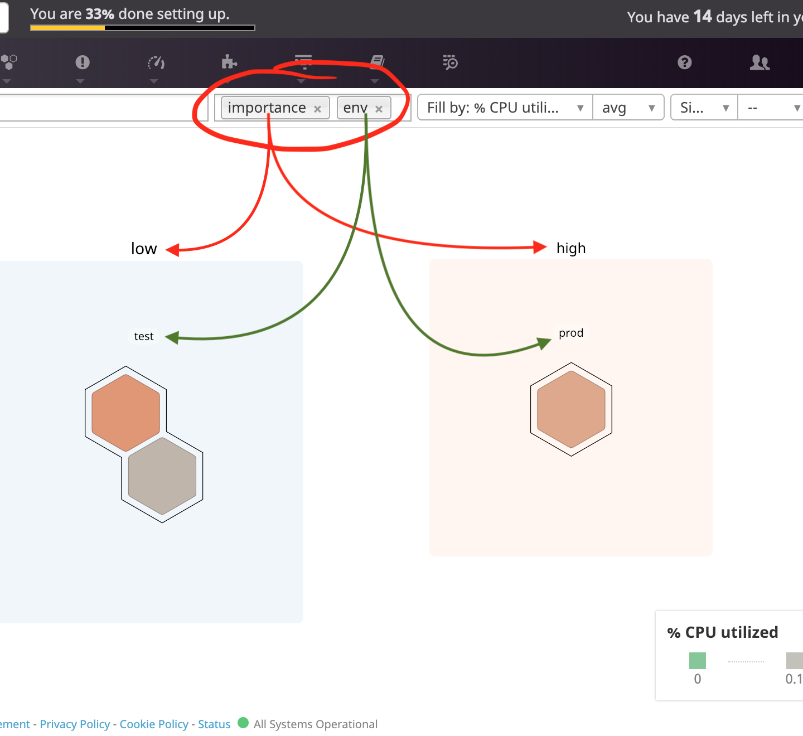

* I installed MySQL using an [installation shell file](docs/vagrant/install.sh) linked to my [Vagrantfile](docs/vagrant/install.sh) provisions with the script snippet below.

```bash
# MySQL ========================
    # Set MySQL Password
    debconf-set-selections <<< "mysql-server mysql-server/root_password password $DBPASSWD"
    debconf-set-selections <<< "mysql-server mysql-server/root_password_again password $DBPASSWD"

    # Install MySQL
    apt-get -y install mysql-server

    # Create a new database
    mysql -uroot -p$DBPASSWD -e "CREATE DATABASE $DBNAME"
```

* I installed the DataDog integration for MySQL via shell and then performed the checks shown below.

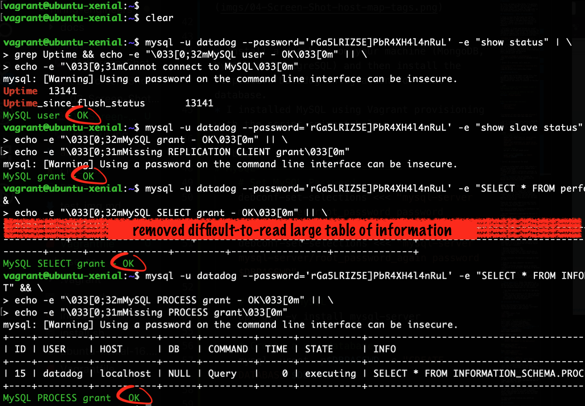

* I also ran datadog-agent status checks for MySQL integration, and confirmed the integration via web GUI.

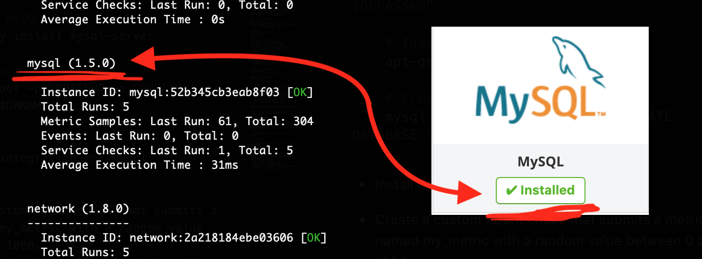

* I created a custom Agent check named my_metric that generated a random int between 0 and 1000 in Python. Displayed below are the code snippets, with comments trimmed, to make this check function properly.

[my_metric python file:](docs/datadog/my_metric.py)
```python
import random

for jj in range(1):
    my_metric = random.randint(0, 1001)

try:
    from checks import AgentCheck
except ImportError:
    from datadog_checks.checks import AgentCheck

__version__ = "1.0.0"

class my_metric_check(AgentCheck):
    def check(self, instance):
            self.gauge('my_metric', random.randint(0, 1001))

```

[my_metric yaml file:](docs/datadog/my_metric.yaml)
```yaml
instances: [{}]
```

* Here is a screen shot of a successful Agent check on my_metric.

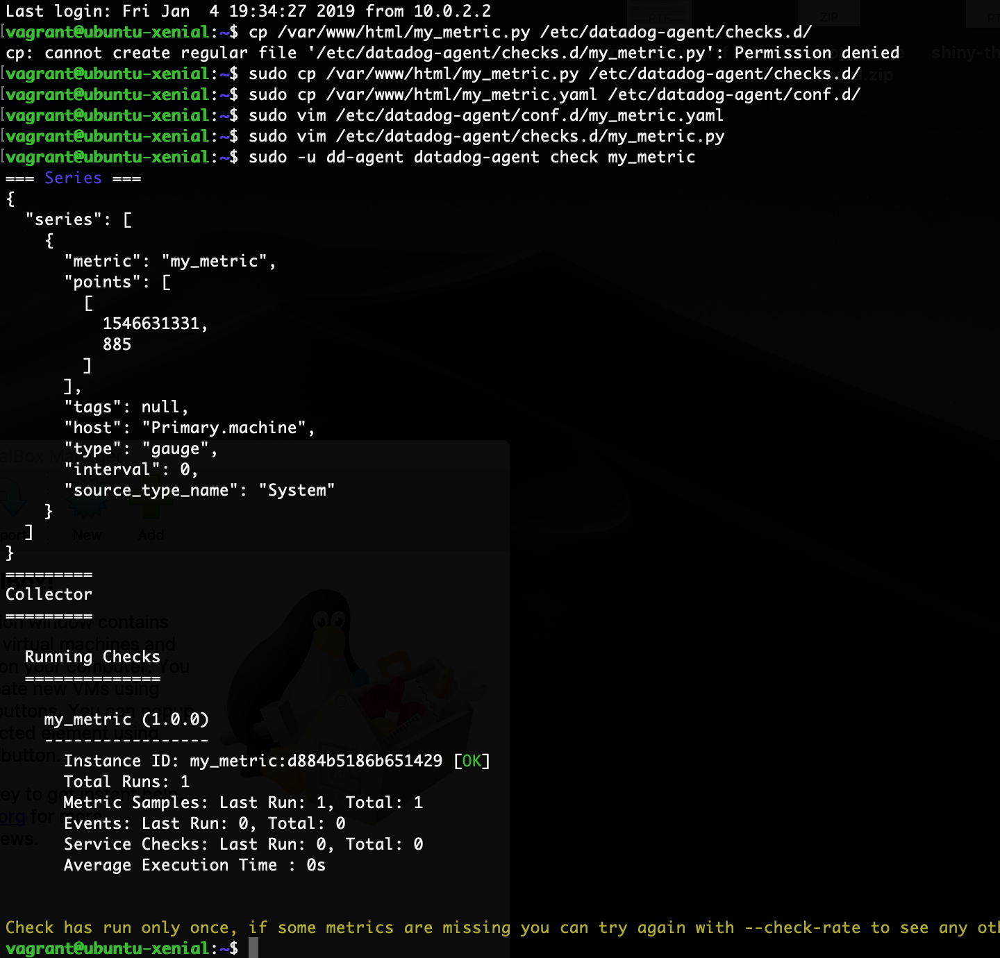

* I changed my_metric's collection interval to once every 45 seconds by changing the [my_metric.yaml](docs/datadog/my_metric.yaml) file to contain the following code snippet.

```yaml
# instances: [{}]

init_config:

instances:
  - min_collection_interval: 45
```

* **Bonus Question** Can you change the collection interval without modifying the Python check file you created?
  * Yes, interval collection can be changed within the metric's yaml file as shown in the last step.

## Visualizing Data

* This timeboard was created with this [API-timeboard.py](docs/datadog/API-timeboard.py) script I created. Completing this task took longer than I expected in looking through the API docs. So, I used the GUI for creating graphs to generate JSON so I could better understand the structure of the requests, which helped give me additional perspective.

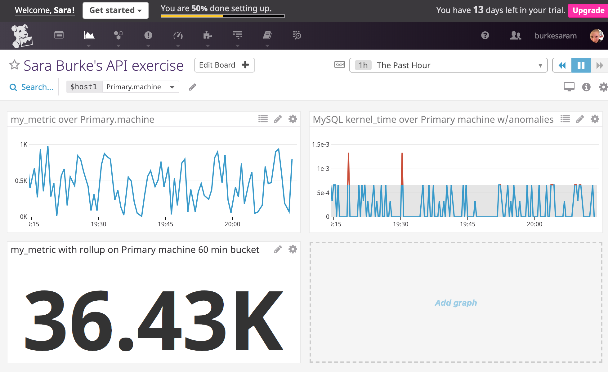

* In this screen shot, I've shortened the Timeboard's timeframe to the last 5 minutes, taken a snapshot, and used the @ notation to send it to myself.

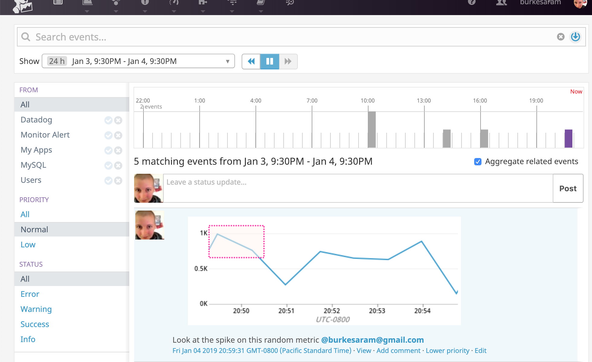

* **Bonus Question**: What is the Anomaly graph displaying?
  * My Anomaly graph is showing the MySQL kernel_time which displays the percentage of CPU time spent in kernel space by MySQL. The anomaly part of this graph displays grey shading over the visualization showing the expected behavior based on previous data.

## Monitoring Data

* I created a new metric monitor for my_metric. Here's a screen shot of the monitor and a listing of settings.
  * Warn for value > 500 at 5 mins
  * Alert for value > 800 at 5 mins
  * No data at 10 mins

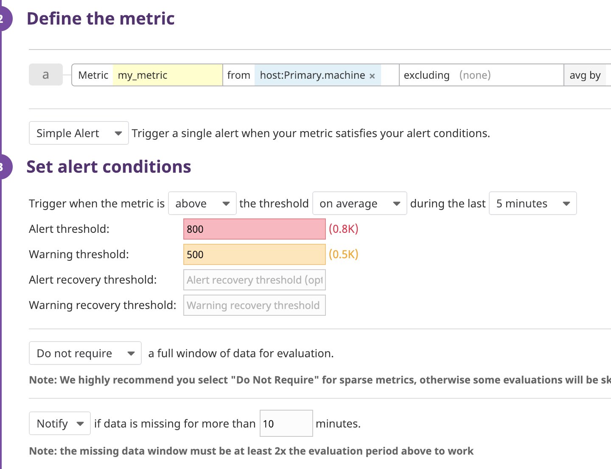

* Here's a screen shot of one of the emails that the monitor sent me followed by the email template.

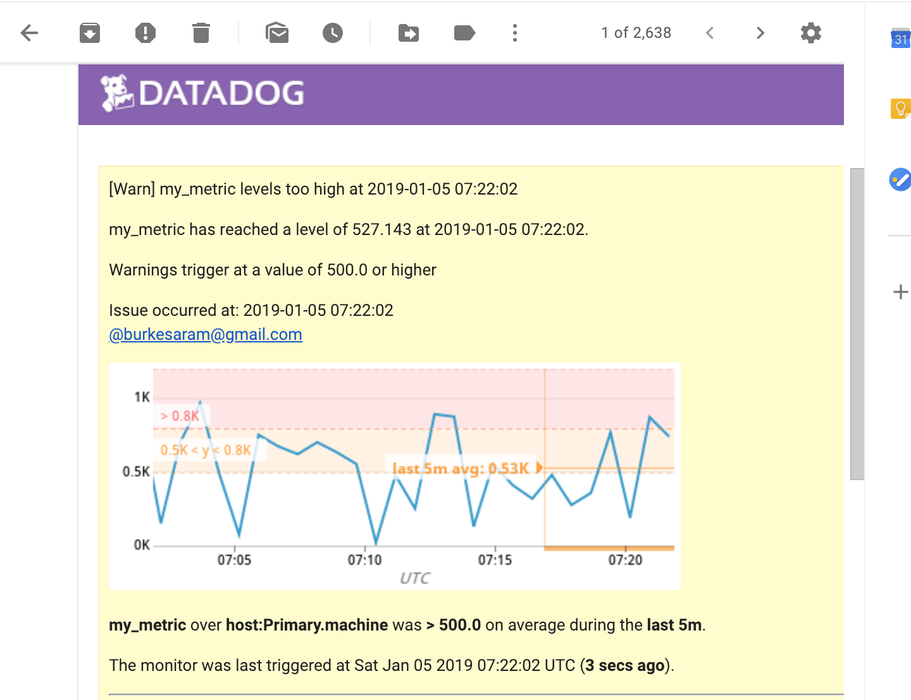

```none
TITLE: my_metric {{#is_no_data}}has no data{{/is_no_data}}{{^is_no_data}}levels too high{{/is_no_data}} at {{last_triggered_at}}

BODY:
my_metric has reached a level of {{value}} at {{last_triggered_at}}.

{{#is_warning}}Warnings trigger at a value of {{warn_threshold}} or higher{{/is_warning}}
{{#is_alert}}Alerts trigger at a value of {{threshold}} or higher{{/is_alert}}
{{#is_no_data}}No data has been detected for at least 10 minutes{{/is_no_data}}

Issue occurred at: {{last_triggered_at}} 
 @burkesaram@gmail.com
```

* Potential bug: (Sat, Jan 5 2019, ~10-11AM PST) Cannot properly scroll on edit modal in Manage Downtime tab. Initial steps: Under the Manage Downtime tab (Layer 1, main-page), select an existing scheduled downtime(Layer 2, opens right-hand-slideout), select the edit button (Layer 3, opens edit-modal).
  * This didn't appear to be an issue last night (Fri, Jan 4 2019, ~11PM PST) when I was editing downtimes.
  * 2015 macbook pro trackpad will not scroll the L3:edit-modal.
    * Position of cursor does not change behavior.
  * Using up/down arrow keys changes selection on list of existing scheduled downtimes on the L1:main-page. Right-hand slideout appropriately changes information according to selected scheduled downtime.
  * Spacebar and shift+spacebar DOES properly scroll L3:edit-modal.
  * [esc] properly exits edit modal.
    * Trackpad scrolling now functions properly, including typical scrolling behavior based on cursor position for macOS devices. i.e. with L2:right-hand-slideout open, cursor over L2:right-hand-slideout result in no scrolling. Cursor over L1:main-page scrolls L1:main-page.
  * Reloading and shift+command+R do not resolve the issue.
  * I don't have screen recording software, so visually documenting the bug is difficult on my end.

* **Bonus Question**: Since this monitor is going to alert pretty often, you don’t want to be alerted when you are out of the office. Set up two scheduled downtimes for this monitor:

  * Below are screen shots showing scheduled downtime for weekdays from 7pm to 9am.

  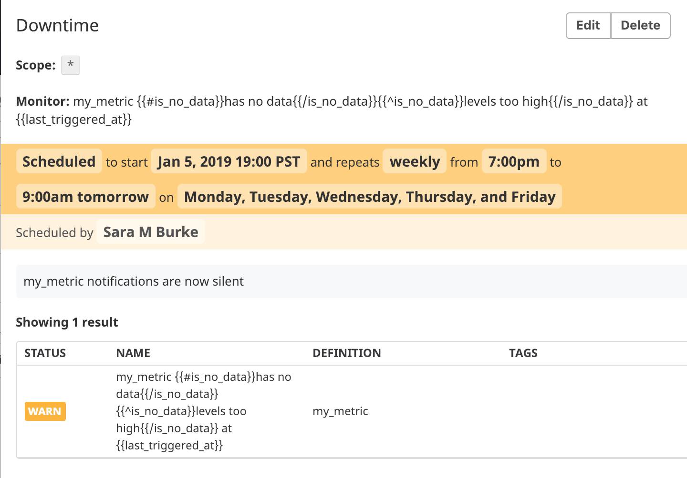

  * And another downtime scheduled for the entirety of Saturday and Sunday.

  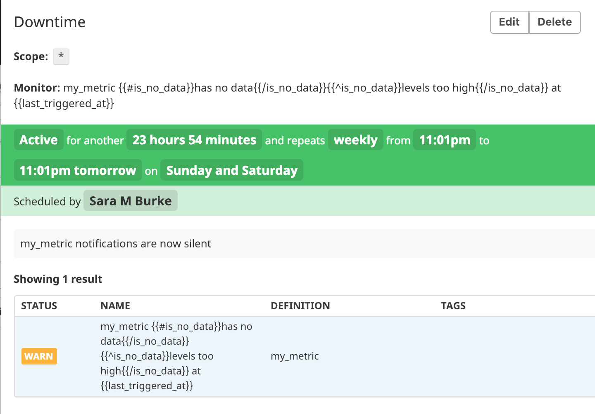

  * Last but not least, a screen shot of the notification showing that downtime has started for this monitor.

  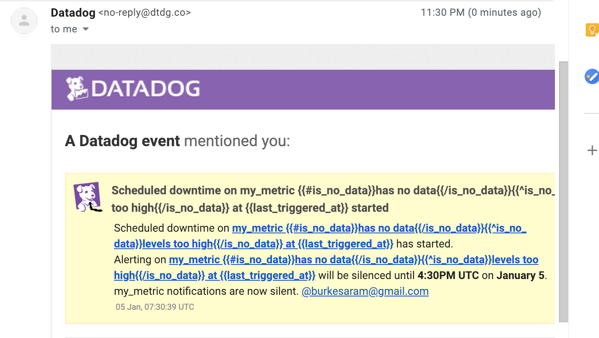

## Collecting APM Data

Given the following Flask app (or any Python/Ruby/Go app of your choice) instrument this using Datadog’s APM solution:

```python
from flask import Flask
import logging
import sys

# Have flask use stdout as the logger
main_logger = logging.getLogger()
main_logger.setLevel(logging.DEBUG)
c = logging.StreamHandler(sys.stdout)
formatter = logging.Formatter('%(asctime)s - %(name)s - %(levelname)s - %(message)s')
c.setFormatter(formatter)
main_logger.addHandler(c)

app = Flask(__name__)

@app.route('/')
def api_entry():
    return 'Entrypoint to the Application'

@app.route('/api/apm')
def apm_endpoint():
    return 'Getting APM Started'

@app.route('/api/trace')
def trace_endpoint():
    return 'Posting Traces'

if __name__ == '__main__':
    app.run(host='0.0.0.0', port='5050')
```

* **Note**: Using both ddtrace-run and manually inserting the Middleware has been known to cause issues. Please only use one or the other.

* **Bonus Question**: What is the difference between a Service and a Resource?

Provide a link and a screen shot of a Dashboard with both APM and Infrastructure Metrics.

Please include your fully instrumented app in your submission, as well.

## Final Question

Datadog has been used in a lot of creative ways in the past. We’ve written some blog posts about using Datadog to monitor the NYC Subway System, Pokemon Go, and even office restroom availability!

Is there anything creative you would use Datadog for?

## Instructions

If you have a question, create an issue in this repository.

To submit your answers:

* Fork this repo.
* Answer the questions in answers.md
* Commit as much code as you need to support your answers.
* Submit a pull request.
* Don't forget to include links to your dashboard(s), even better links and screen shots. We recommend that you include your screen shots inline with your answers.
