//TODO: add a table of contents with links to question sections.
## Prerequisites - Setup the environment
Originally for this challenge I decided to set up my environment with Vagrant. I'm on a Windows 10 home OS I've used Vagrant before and really enjoyed it and I figured why not.
However, after setting up and making a vagrant box to share I decided to switch to AWS' cloud Linux vm. I've always wanted to try EC2 and running my vm on their cloud would save me space, cpu and work installing postgres.
 
-- You can still read about how I set up my vagrant [here](vagrantSetup.md)

### Setting up AWS Linux
Log into aws 
Navigate to the EC2 Dashboard from the Services drop down menu and Launch an Instance.
From there follow the directions on the Quick Start screen.
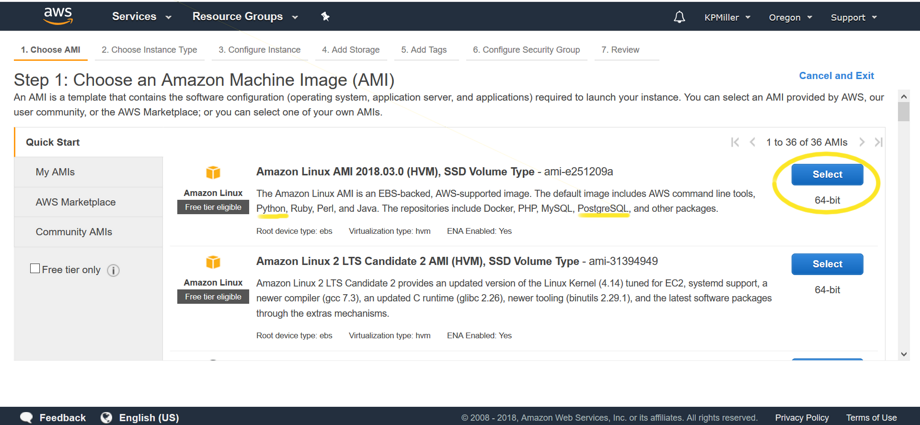 
I chose the first option for my AMI because it came with Python and Postgres preloaded.

Next option was to chose the Instance type. 
Since this is a light tutorial the free tier t2 Micro should be more than fine.
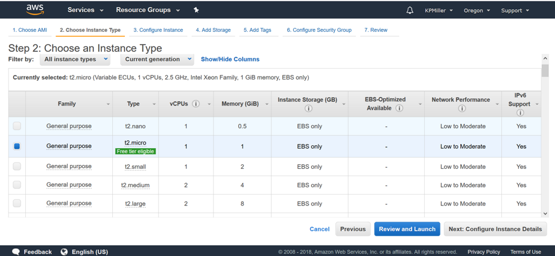
Finally before my vm is created I created and downloaded a new key pair so that I can ssh into my vm from my local machine.
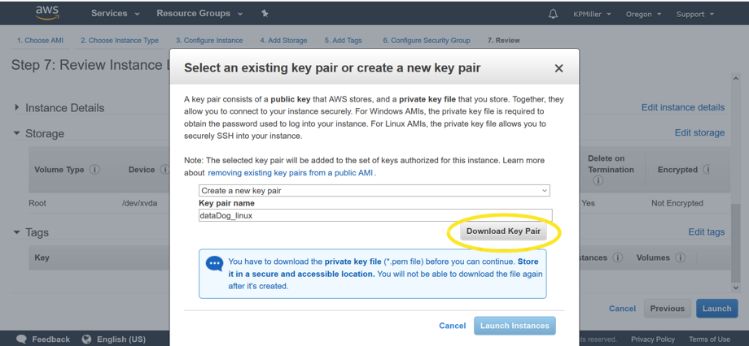

From here I had two ways I could access my VM from windows. 
Either through puTTy or through ssh in the Windows Sub-Linux(WSL). I'll be using the latter.

In the bash shell use the `chmod` command to make sure your private key file isn't publicly viewable
`chmod 400 /path/my-key-pair.pem`

Use the ssh command to connect to the instance. You specify the private key (.pem) file and user_name@public_dns_name. For example, if you used an Amazon Linux AMI, the user name is ec2-user. 
`sudo ssh -i /path/my-key-pair.pem ec2-user@ec2-198-51-100-1.compute-1.amazonaws.com`
you can find the public DNS address on your dashboard 
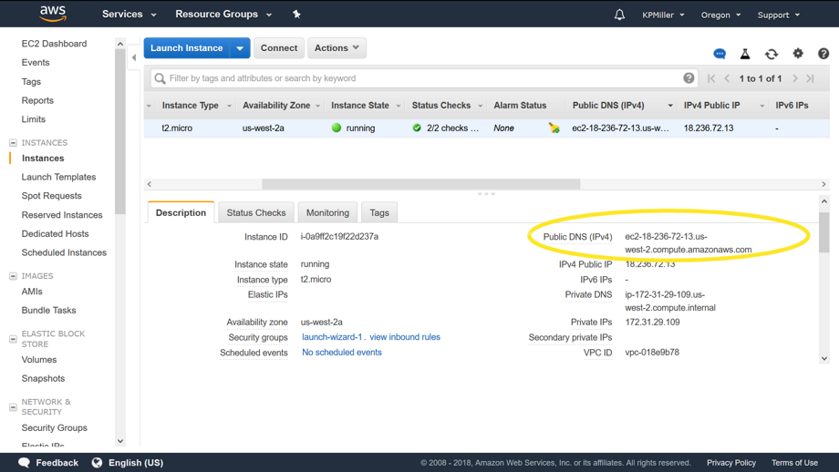

__warning: without `sudo` I got an 'unprotected private key file' error__
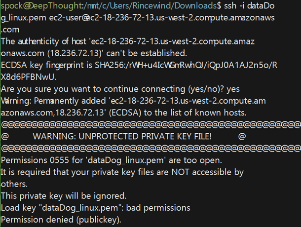

SUDO!

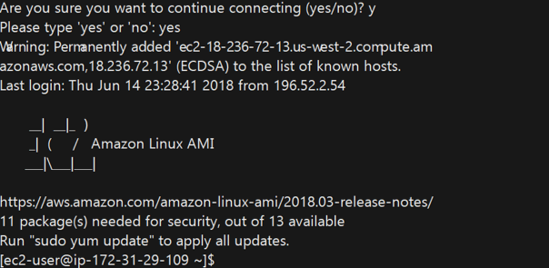

Success!!

## Collecting Metrics:

I installed the Datadog agent on Ubuntu with the easy one step install `DD_API_KEY=1852b8c40afd989d5e512340f1a0d3c8 bash -c "$(curl -L https://raw.githubusercontent.com/DataDog/datadog-agent/master/cmd/agent/install_script.sh)"`
//TODO: insert picture of agent output
Agent v6 installed successfully and is running.
 
### Adding Tags to the Agent file:
I navigated over to the agent config file located at `/etc/datadog-agent/datadog.yaml` (note: agent v6 will be a `.yaml` file and v5 is `.conf`)

I checked out the `datadog.yaml.example` and the `datadog.yaml` too see how to format my tags. It looks like these files start off identical by default but it'll be good to have an unchanged example copy if I needed to ever revert back. 
I uncommented the tags on `datadog.yaml` file and added a few of my own and saved.

    # Set the host's tags (optional)
     tags:
       - mytag
       - crystalball
       - env:dev
       - role:database:postgres
       
I went onto my dashboard to see if my tags were there and didn't see any. I checked the dogs and didn't see another step requiring a restart. So then I tried to check the agent's config with ` sudo datadog-agent configcheck`
I got the following error:

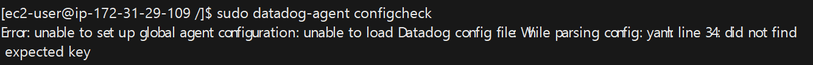


    
I went beck to investigate my yaml file. I see my api key is in there and not commented out on top. Since I am able to see my host on the dashboard but just not my new tags I started to doubt this is the kind of key it was referring too.
I went over to line 34 and it is my tags settings. After a quick search I found that some people have solved a similar error in other programs with indentation. I fixed the indentation in the file.

That solved the  agent config check error! However, the actual output wasn't helpful after all.
So, I decided to try restarting the agent thinking maybe the service should restart whenever you change the config file.

 It wasn't until I went to filter on the hostmap dashboard that I noticed My tags showed up.
    
   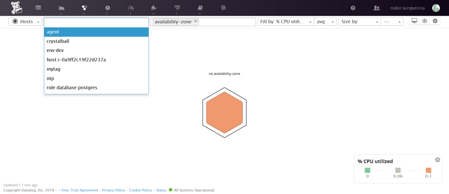
    
Yay!
- [X]  Add tags in the Agent config file and show us a screenshot of your host and its tags on the Host Map page in Datadog.

### Integrating the database:
One of the benefits of using AWS is that Postgres is that it has postgres packages you can readily install onto their instances. 
Run `sudo yum list postgres*` to see available packages 
I'm going to pick their newest available and run `sudo yum install postgresql96-server` to install postgres from amazon's maintained packages. 

After Postgres is installed I initialized my first database and started the postgres server.
        
        sudo ../../etc/init.d/postgresql96 initdb
        sudo ../../etc/init.d/postgresql96 start

Then I created a role for ec2-user:

    sudo -u postgres createuser --superuser $USER
    createdb $USER

At this point the  `psql` command works.

I went to the integrations menu on my datadog dashboard and selected PostgresSQL to install

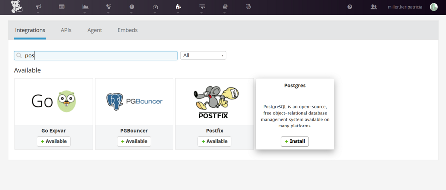

I followed the directions on the 'configurations' tab.
and got an indent auth failure when trying to verify my new datadog user. 


I looked up what proper permissions should be set for postgres on ec2.

I couldn't find the config file in it's usual spot but i found it's location with the following commands:
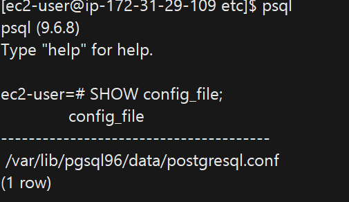


but That wasn't the correct config file. So then I tried this:

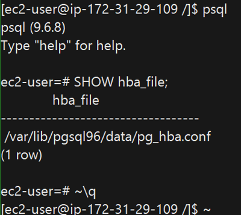

and opened that path in a text editor: `sudo vim /var/lib/pgsql96/data/pg_hba.conf`
That was the right one. 
changed this:

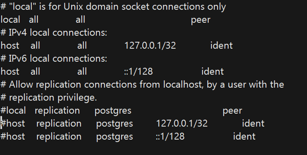

to this:


I changed it to how I usually have my config file set up if I were on Vagrant or my regular windows os.
trouble shooting online also suggested changing a setting in the original config file I found to allow localhost connection. 

Open `sudo vim  /var/lib/pgsql96/data/postgresql.conf` 

change this:

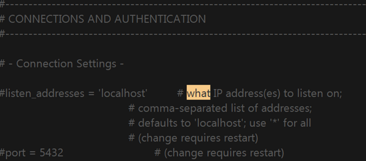

to this:

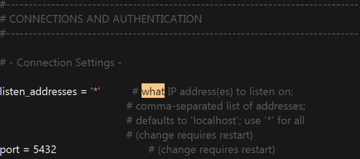

and restart postgres: `sudo ../../etc/init.d/postgresql96 restart`

just to be safe I'm going to delete the datadog user I made and start again from the directions. 
in PSQL:

    ec2-user=# revoke SELECT ON pg_stat_database from datadog;
    ec2-user=# DROP ROLE datadog;
 
Alright, datadog role is valid.

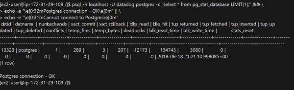

I went to edit my postgres config yaml file but only found `conf.yaml.example` there so I copied it.

`sudo cp conf.yaml.example conf.yaml`

and changed it according to the directions...

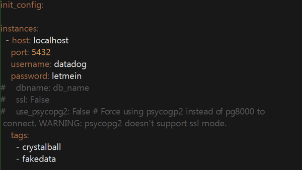

`sudo initctl restart datadog-agent`

Verify install:

`sudo datadog-agent stats`

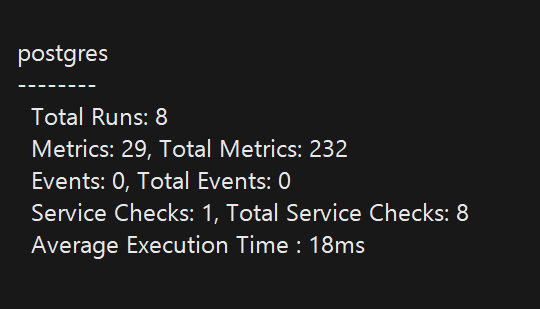 

and finally click 'Install Integration' to install it on your Datadog Dashboard.

- [X]  Install a database on your machine (MongoDB, MySQL, or PostgreSQL) and then install the respective Datadog integration for that database.

### Creating a custom Agent check:
For this section I'll be following the datadog docs for [writing your first check](https://docs.datadoghq.com/developers/agent_checks/)

Checks are made of two files, a python file and a yaml configuration file. They must have the same name and they are placed in two specific folders.
    
    # python file goes in:
    /etc/datadog-agent/checks.d
    # yaml file goes in:
    /etc/datadog-agent/conf.d

So I'll start off making those two files `mycheck.py` and `mycheck.yaml` and placing them in their folders.
I modeled my agent check to the Hello world example and kept it very simple:

my initial `mycheck.yaml`:

    init_config:           
                           
    instances:             
        [{}]               

my initial `mycheck.py`:

    import random
    from checks import AgentCheck
    
    class RandomCheck(AgentCheck):
        def check(self, instance):
            rand_num = random.randint(1, 1000)
            self.gauge('my_metric', rand_num)
            
(_Note:_ custom python libraries have to be manually installed. However I didn't need to do that with random since it is part of the standard library.)

I ran the check with `sudo -u dd-agent datadog-agent check mycheck`

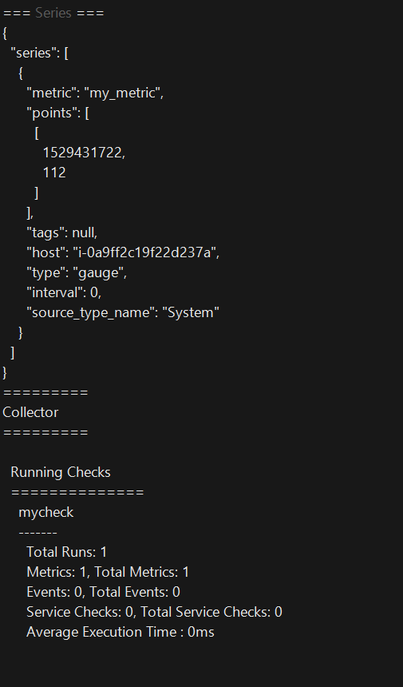

- [X]  Create a custom Agent check that submits a metric named my_metric with a random value between 0 and 1000.

### Changeing the collection interval
To change the metric collection interval I could either edit `mycheck.py` and hardcode it into the check or I can use the `mycheck.yaml` file to configure settings.
I think keeping configurations separate would be the best practice because even though my check is very small now a more complicated check could easily bury these settings.

I updated `mycheck.yaml`:

    init_config:
    
    instances:
        - min_collection_interval: 45

restarted the agent `sudo initctl restart datadog-agent`

I wasn't sure how to check how often mycheck is running but I believe this worked because when I run `sudo datadog-agent status` and checkout the running checks in the output I can see that mycheck is running less frequently than all of the other default metrics

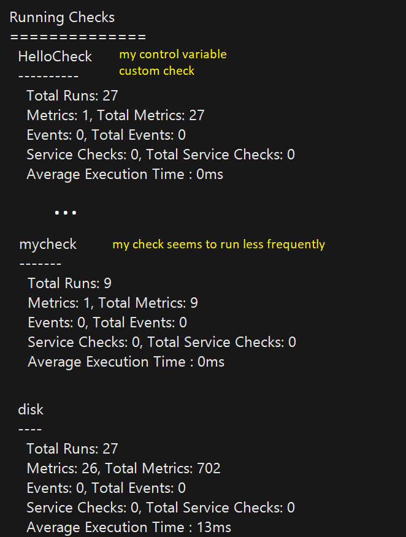
     
- [X]  Change your check's collection interval so that it only submits the metric once every 45 seconds.
 
### BONUS
- [X]  **Bonus Question** Can you change the collection interval without modifying the Python check file you created?

## Visualizing Data:

Utilize the Datadog API to create a Timeboard that contains:

* Your custom metric scoped over your host.
* Any metric from the Integration on your Database with the anomaly function applied.
* Your custom metric with the rollup function applied to sum up all the points for the past hour into one bucket

Please be sure, when submitting your hiring challenge, to include the script that you've used to create this Timeboard.

Once this is created, access the Dashboard from your Dashboard List in the UI:

* Set the Timeboard's timeframe to the past 5 minutes
* Take a snapshot of this graph and use the @ notation to send it to yourself.
* **Bonus Question**: What is the Anomaly graph displaying?

## Monitoring Data

Since you’ve already caught your test metric going above 800 once, you don’t want to have to continually watch this dashboard to be alerted when it goes above 800 again. So let’s make life easier by creating a monitor.

Create a new Metric Monitor that watches the average of your custom metric (my_metric) and will alert if it’s above the following values over the past 5 minutes:

* Warning threshold of 500
* Alerting threshold of 800
* And also ensure that it will notify you if there is No Data for this query over the past 10m.

Please configure the monitor’s message so that it will:

* Send you an email whenever the monitor triggers.
* Create different messages based on whether the monitor is in an Alert, Warning, or No Data state.
* Include the metric value that caused the monitor to trigger and host ip when the Monitor triggers an Alert state.
* When this monitor sends you an email notification, take a screenshot of the email that it sends you.

* **Bonus Question**: Since this monitor is going to alert pretty often, you don’t want to be alerted when you are out of the office. Set up two scheduled downtimes for this monitor:

  * One that silences it from 7pm to 9am daily on M-F,
  * And one that silences it all day on Sat-Sun.
  * Make sure that your email is notified when you schedule the downtime and take a screenshot of that notification.

## Collecting APM Data:

Given the following Flask app (or any Python/Ruby/Go app of your choice) instrument this using Datadog’s APM solution:

```python
from flask import Flask
import logging
import sys

# Have flask use stdout as the logger
main_logger = logging.getLogger()
main_logger.setLevel(logging.DEBUG)
c = logging.StreamHandler(sys.stdout)
formatter = logging.Formatter('%(asctime)s - %(name)s - %(levelname)s - %(message)s')
c.setFormatter(formatter)
main_logger.addHandler(c)

app = Flask(__name__)

@app.route('/')
def api_entry():
    return 'Entrypoint to the Application'

@app.route('/api/apm')
def apm_endpoint():
    return 'Getting APM Started'

@app.route('/api/trace')
def trace_endpoint():
    return 'Posting Traces'

if __name__ == '__main__':
    app.run(host='0.0.0.0', port='5050')
```

* **Note**: Using both ddtrace-run and manually inserting the Middleware has been known to cause issues. Please only use one or the other.

* **Bonus Question**: What is the difference between a Service and a Resource?

Provide a link and a screenshot of a Dashboard with both APM and Infrastructure Metrics.

Please include your fully instrumented app in your submission, as well.

## Final Question:

Datadog has been used in a lot of creative ways in the past. We’ve written some blog posts about using Datadog to monitor the NYC Subway System, Pokemon Go, and even office restroom availability!

Is there anything creative you would use Datadog for?
