# Sean Clarke for Datadog :dog: :file_folder: - Solutions Engineer Technical Exercise

## Prerequisites - Setting Up the Environment

I created a Ubuntu 12.04 VM using [Vagrant](https://www.vagrantup.com/downloads.html) with [VirtualBox](https://www.virtualbox.org/wiki/Downloads). Once you've downloaded both of these onto your local system, you can follow the instructions [here](https://www.vagrantup.com/intro/getting-started/) to get started.

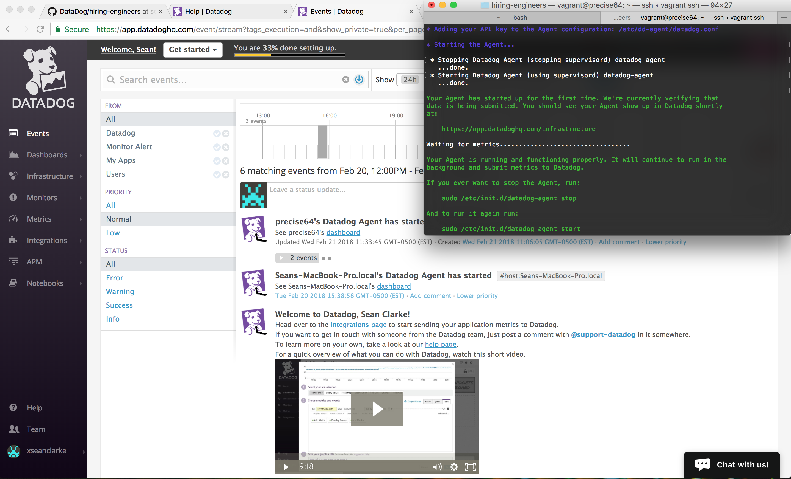

### For reference, my setup flow:

  - Create clean Vagrant VM: `vagrant init hashicorp/precise64`

  - Start and Enter the VirtualBox: `vagrant up` & `vagrant ssh` respectively.

  - (*If necessary*) Resolve Guest Additions Mismatch: `vagrant plugin install vagrant-vbguest`

  - To Avoid Dependency Issues, Update & Upgrade All Local Packages: `sudo apt-get update && sudo apt-get upgrade`

  - Install Curl: `sudo apt-get install curl`

  - Install Datadog Agent: `DD_API_KEY=YOUR_API_HERE bash -c "$(curl -L https://raw.githubusercontent.com/DataDog/datadog-agent/master/cmd/agent/install_script.sh)"`

## Collecting Metrics

1. In order to modify the agent tags we need to access the config file. On Ubuntu this is found at:
`/etc/datadog-agent/datadog.yaml`.

*To find the spefic location for your system please refer to this [guide](https://docs.datadoghq.com/agent/basic_agent_usage/)*.

So we can simply run: `sudo nano /etc/datadog-agent/datadog.yaml`(agent v6) or `/etc/dd-agent/datadog.conf`(agent v5) and modify the file as you see here: 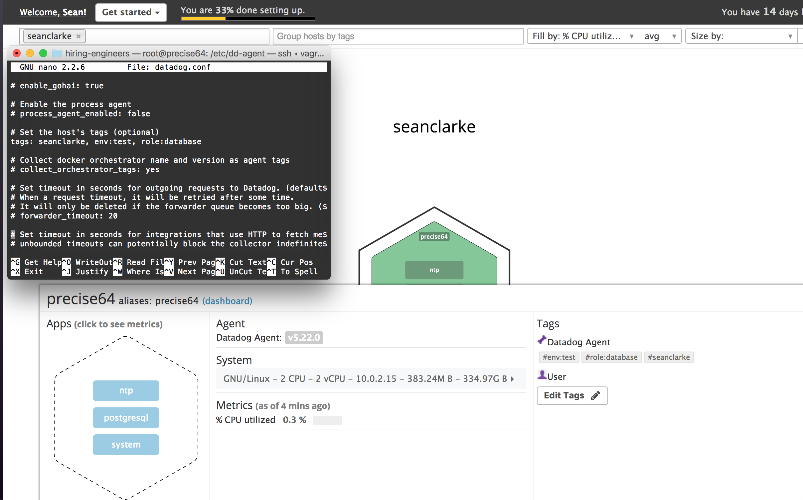

2. Let's Install Postgres and Configure the Integration:
  *The full list of integrations can be found [here](https://docs.datadoghq.com/integrations/). To follow the configure steps, once logged in navigate to the [Integrations Section](https://app.datadoghq.com/account/settings#integrations)*
  * So first we'll install it: `sudo apt-get install postgresql`
  * Then start the server: `sudo service postgresql start`
  * Log into postgres with the default 'postgres' user: `sudo -u postgres psql postgres`
  * You should see a prompt like so `postgres=#` - This means you are interacting with the server
  * With this prompt you can begin to follow the instructions in the Datadog Integration section, which look like this: `create user datadog with password 'password_goes_here';`
  `grant SELECT ON pg_stat_database to datadog;`
  * Quit the server `/q`, run the given command, and enter the same password as above when prompted:
  ```
  psql -h localhost -U datadog postgres -c "select * from pg_stat_database LIMIT(1);"  
   && echo -e "\e[0;32mPostgres connection - OK\e[0m" || \ ||  
  echo -e "\e[0;31mCannot connect to Postgres\e[0m"
  ```
  * Create a postgres.yaml config file: `sudo nano /etc/datadog-agent/conf.d/postgres.yaml` *note: this file doesn't exist, however a postgres.yaml.example file does, if you'd prefer you can duplicate this file and simply remove the # comment on the portion indicated in the config guide. Again, config locations can be via your agent [here](https://docs.datadoghq.com/agent/basic_agent_usage/)*
  * Insert / Or Uncomment the following:
  ```
  init_config:

  instances:
     -   host: localhost
         port: 5432
         username: datadog
         password: password_goes_here
         tags:
              - optional_tag1
              - optional_tag2
  ```
  * Restart the Datadog Agent and Run the Info Command: `sudo service datadog-agent restart` && `sudo datadog-agent status`

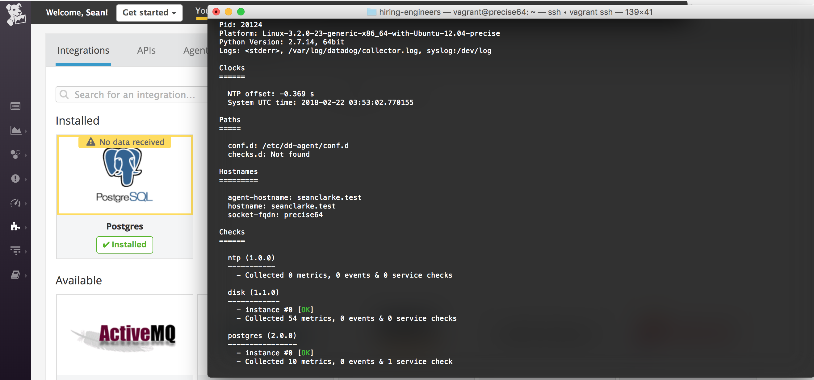

3. Let's Create a Custom Agent Check:
  * We will create our check in the **checks.d** folder, which lives in your Agent root, in this case **/etc/datadog-agent/checks.d**. So `sudo nano /etc/datadog-agent/checks.d/mycheck.py` and "Create a custom Agent check that submits a metric named my_metric with a random value between 0 and 1000.":
  ```
  from checks import AgentCheck
  from random import randint

  class MyMetric(AgentCheck):
    def check(self, instance):
      self.gauge('mycheck.val', randInt(0,1000))
  ```
 

4. Let's Set the Collection Interval to 45 Seconds:
* To do so we will modify the minimum collection interval in our corresponding .yaml file for our custom agent, found in **/etc/datadog-agent/conf.d**, as follows:
```
  init_config:
      min_collection_interval: 45

  instances:
      [{}]
```
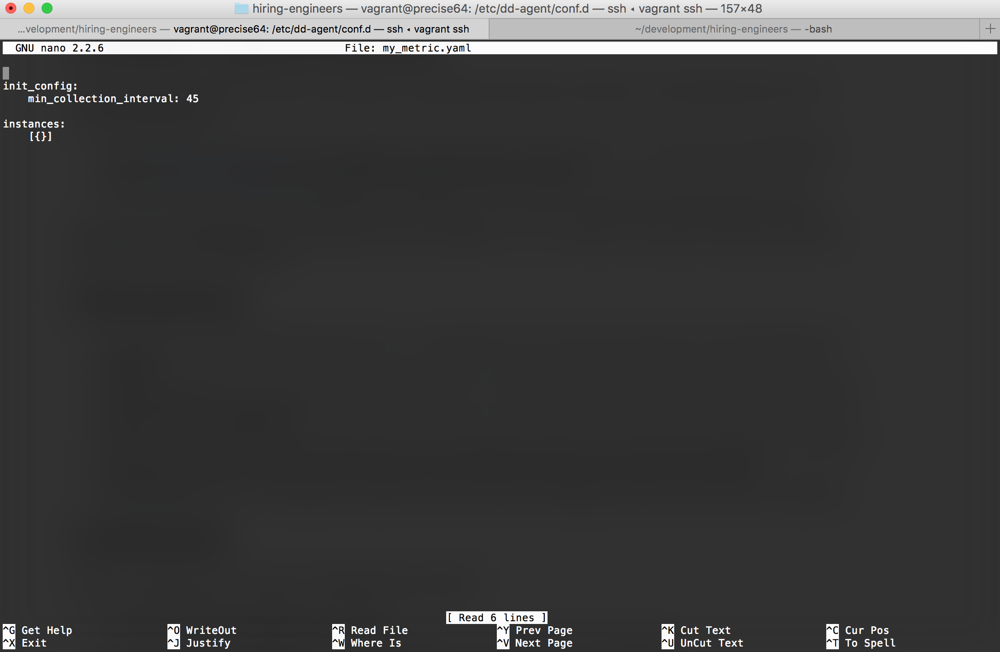

5. BONUS QUESTION: Yes, in fact you can change the minimum collection interval of the check directly through the corresponding .yaml file. However, in the even the agent defines a value lesser, that value will take precedence.

## Visualizing Data

1. Let's Use the API to Create a Timeboard:

* To do this we can create a python file to submit JSON to the API. The code is as follows:
```
from datadog import initialize, api

options = {
    'api_key': 'API_KEY',
    'app_key': 'APP_KEY'
}

initialize(**options)

title = "Aint No Timeboard Like the Present"
description = "A timeboard of mymetric."
graphs = [
  {
    "definition": {
      "events": [],
      "requests": [{
          "q": "anomalies(sum:postgresql.rows_returned{host:seanclarke.test}, 'basic', 2)"
      }],
      "viz": "timeseries"
  },
  "title": "Graph: Postgres"
},
{
  "definition": {
      "events": [],
      "requests": [{
          "q": "sum:mycheck.val{host:seanclarke.test}.rollup(sum,3600)"
      }],
      "viz": "timeseries"
  },
  "title": "Graph: My Metric (Rollup)"
}
]

read_only = True
api.Timeboard.create(title=title,
                   description=description,
                   graphs=graphs,
                   read_only=read_only)

```

1. We can view the Created Timeboard at our Dashboards list. Here we have our Timeboard with (Custom Metric + Anomaly Func. + Rollup Function) - 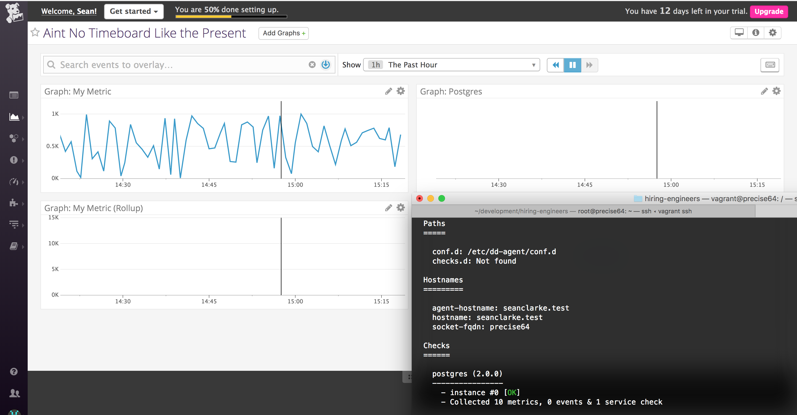

2. By Modifying the Dropdown Menu we can view the Timeboard in the span of the last 5 Minutes, A Day, Week, and more. For our example we've chosen to see the last 5 minutes. - 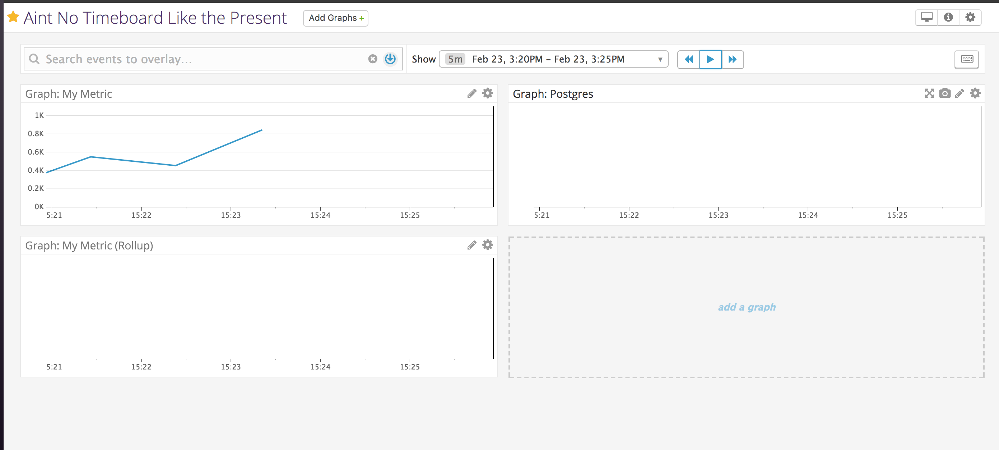

3. We Can Email Ourselves the Timeboard by navigation to the Events Tab and typing the following into the post section:
`@myemail.com @timeboard_name` - 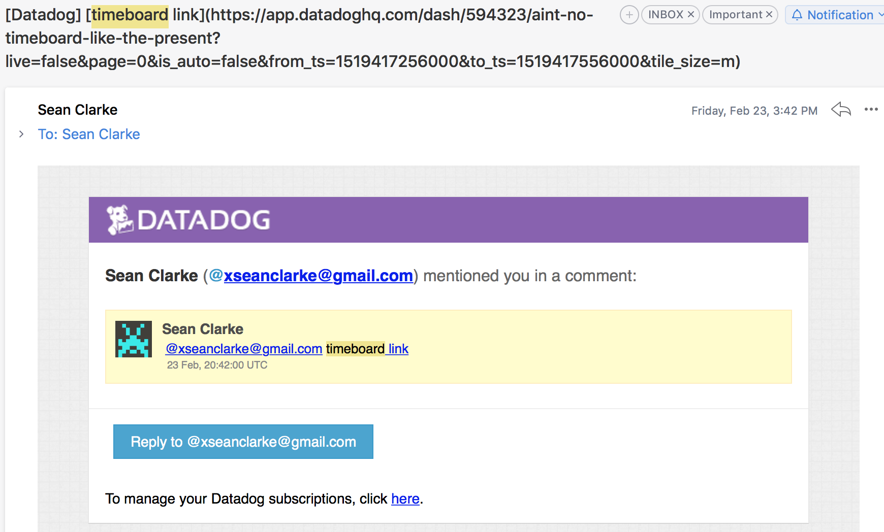

4. BONUS QUESTION: The anomaly graph is used to display cases in which the metrics extend beyond the general accepted range. Essentially, in the event of an anomaly, or unusual behavior, the user will be able to track the occurance.

## Monitoring Data

1. By Navigating to the Monitor Section in the Datadog App, we can create custom Metric Threshold Alerts. Let's set an monitor for a Warning at 500, Alert at 800, and No Data Notice after 10 minutes without data. Configuration for this looks like the following: 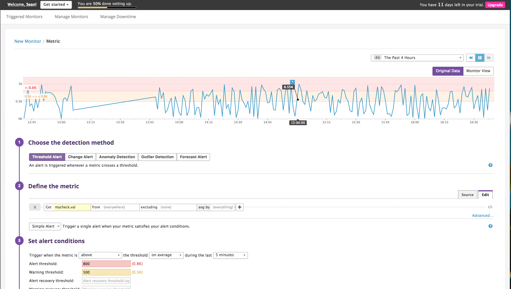

In order to have emails sent to us (in the event we're not constant staring at our Datadog monitor drooling in awe of that gorgeous UI :heart_eyes:) we can do the following: 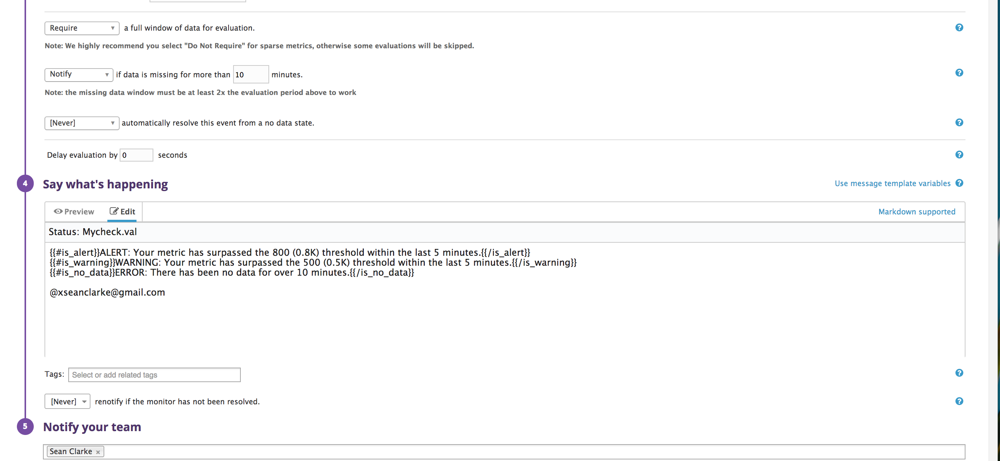

2. Warning Threshold (500) - 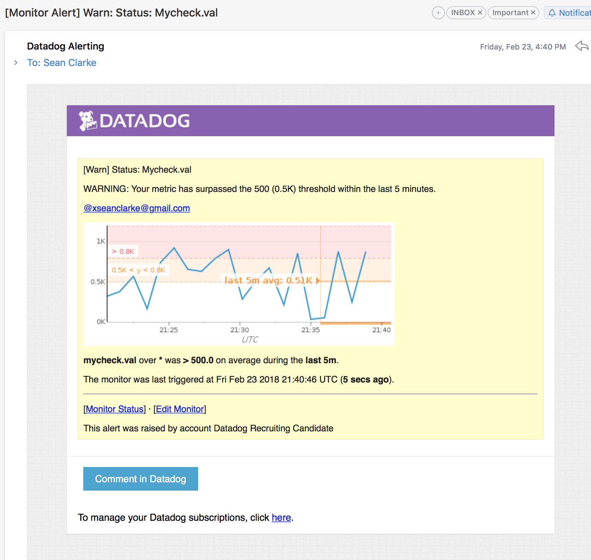

3. Alert Threshold (800) - 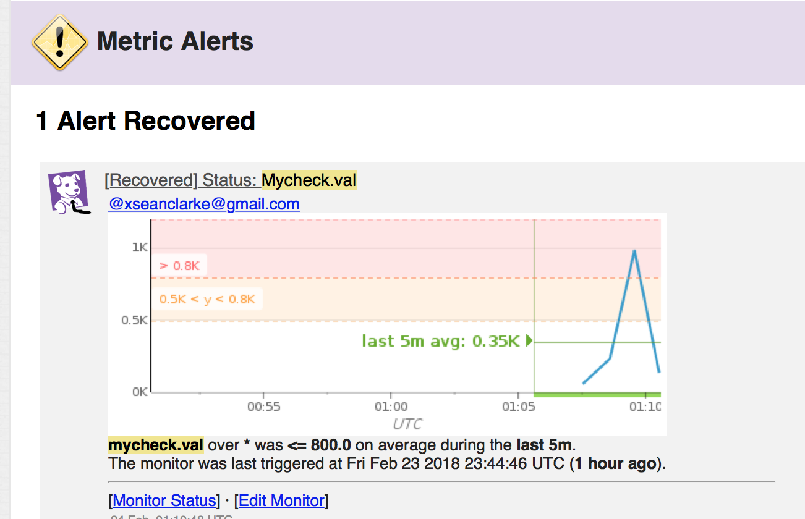

4. No Data 10 Min+ - 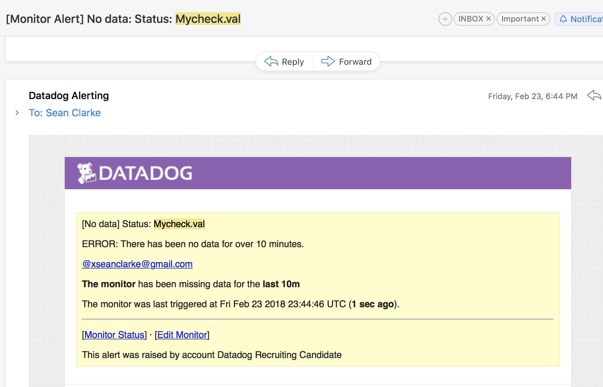

### We can also go ahead and set downtimes for the weekend and in between the workday during the week.

5. BONUS QUESTION: We can schedule the downtime like so: 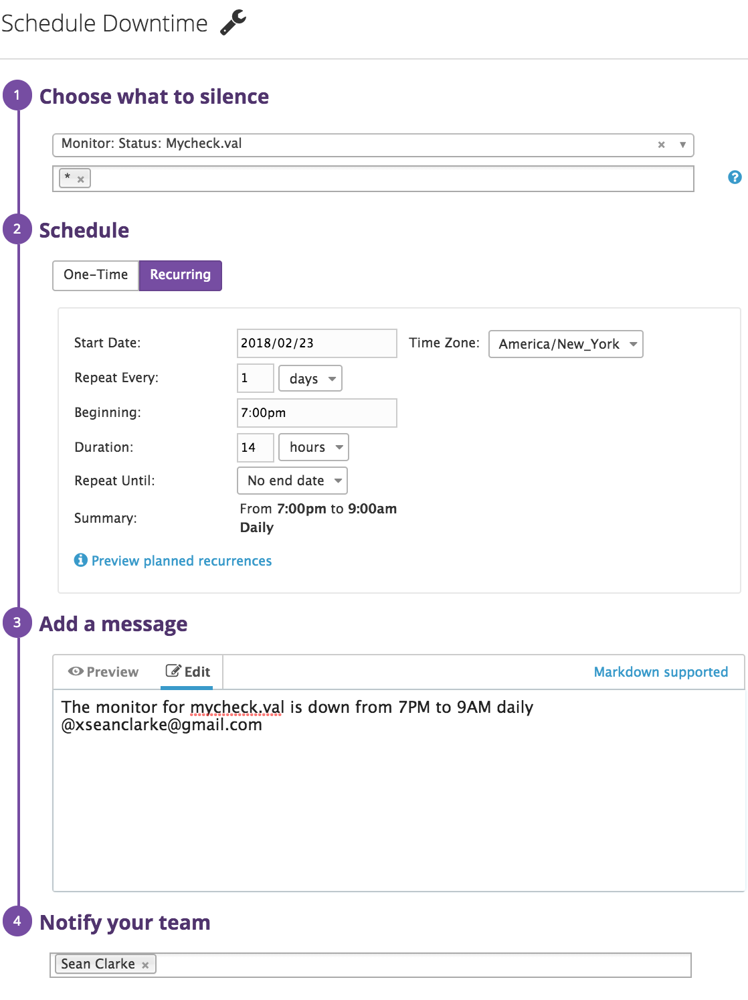 With this completed we can expect to see emails like so:

  * Weekday Downtime Email - 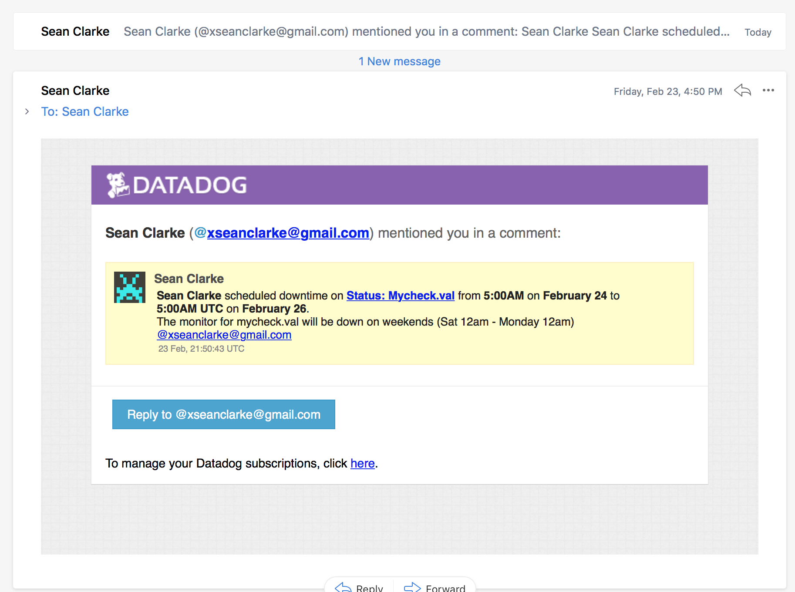

  * Weekend Downtime Email - 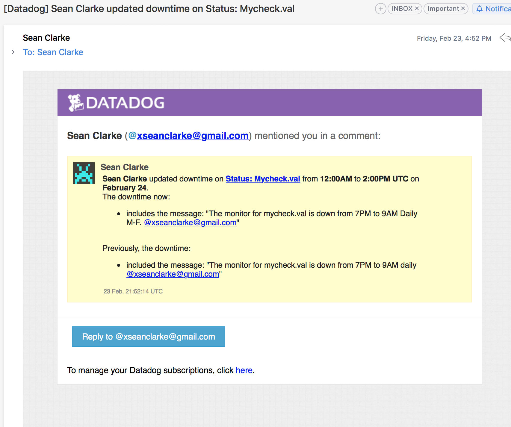

## Collecting APM Data

- In order to collect APM data, I proceeded through the steps above and then included the provided flask application as my_app.py in my root directory, and in another attempt my vagrant/ directory:
```
from flask import Flask
import logging
import sys

# Have flask use stdout as the logger
main_logger = logging.getLogger()
main_logger.setLevel(logging.DEBUG)
c = logging.StreamHandler(sys.stdout)
formatter = logging.Formatter('%(asctime)s - %(name)s - %(levelname)s - %(message)s')
c.setFormatter(formatter)
main_logger.addHandler(c)

app = Flask(__name__)

@app.route('/')
def api_entry():
    return 'Entrypoint to the Application'

@app.route('/api/apm')
def apm_endpoint():
    return 'Getting APM Started'

@app.route('/api/trace')
def trace_endpoint():
    return 'Posting Traces'

if __name__ == '__main__':
    app.run()
```

Prior to this step I ran into a variety of issues with Pip, most expressly that the version of pip that comes installed on the VM is 1.0 (absolutely archaic). Because of this, Pip is unable to install much of anything, let alone update itself as PyPi has disabled non HTTPS access. The only manner that allowed me to work around this was to specify the target url in the install command itself and specify https as so:
`pip install -U pip -i https://pypi.python.org/simple/`
- Not only would this uninstall the old version of pip but it allowed me to install pip 9.0.1. I personally feel the community at large could benefit greatly from improved official documentation from Vagrant and VM regarding this - such a necessary solution shouldn't merely be limited to a lucky google search.

- Having solved this, I come to the point you see in the screenshot below, where-in my flask application is running but there is no response from the the Datadog application. To the best of my understanding, with port forwarding the host machine should be aware / have access to the processes of the VirtualMachine and yet such is not the case.

1. APM Enabled - 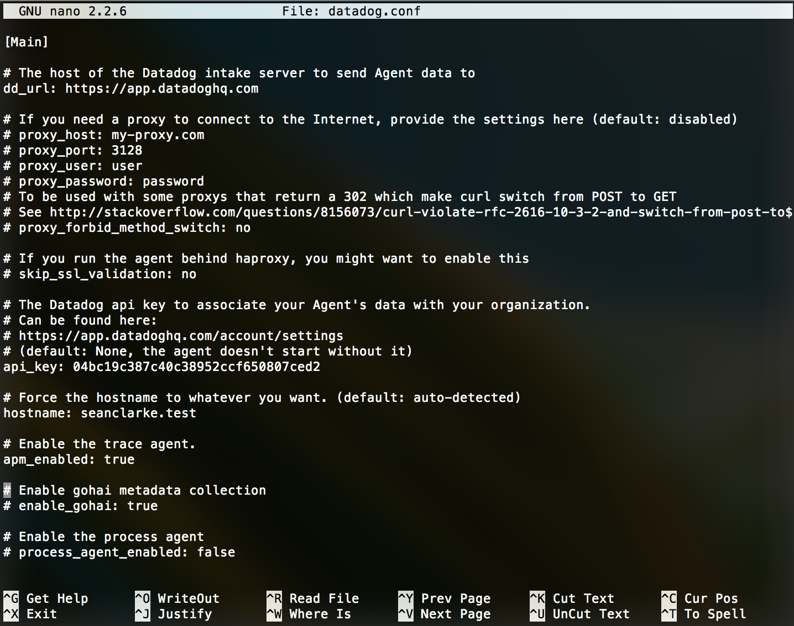

2. DDtrace Running (No APM):
  i) 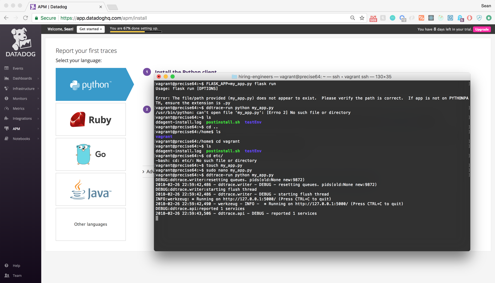
  ii) 

- Upon revisiting the issue I began to encounter an error **socket.error: [Errno 98] Address already in use**. This prompted me to look into the case that perhaps I was unknowingly running a previous VM on my machine. To Investigate I used the command `vagrant global-status` and realized I was running a a VM in a since deleted directory. Targeting it directly, I issues a `vagrant destory` with it's specfic ID, followed up by deleting it via the VirtualBox GUI, and `—-prune`-ing the list. Regardless of these efforts I still face this issue on a fresh install.

- All things considered, I found this exercise thoroughly enjoyable and spent the majority of my efforts battling some quirks of Pip, VM, and the like. Beyond these issues, the process of getting up and running with Datadog was an absolute breeze. I'm thoroughly confident that such issues can certainly be avoided and remedied and I am very much insistent on doing just that in future efforts.

3. Bonus Question: A service implies an orchestrated effort designed to accomplish a specific goal, wherein a resource might be used to aide in this goal or other efforts. By nature, a resource an is much more ancillary in nature while a service aims to provide a suite of resources with a targeted application.

## Final Question:

"A lover of all things music, I would love to work with a platform such as Soundcloud in perhaps providing artists will greater feedback regarding users interactions with their tracks. For instance: A timestamp at which point a song was paused to isolate portions of a song that could be improved upon (provided there is a highly concentrated portion)."
