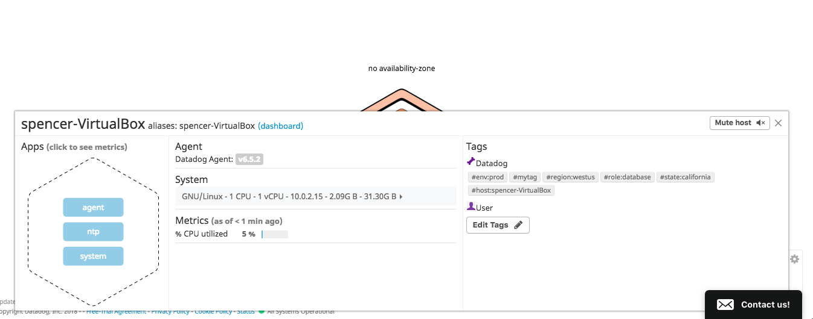
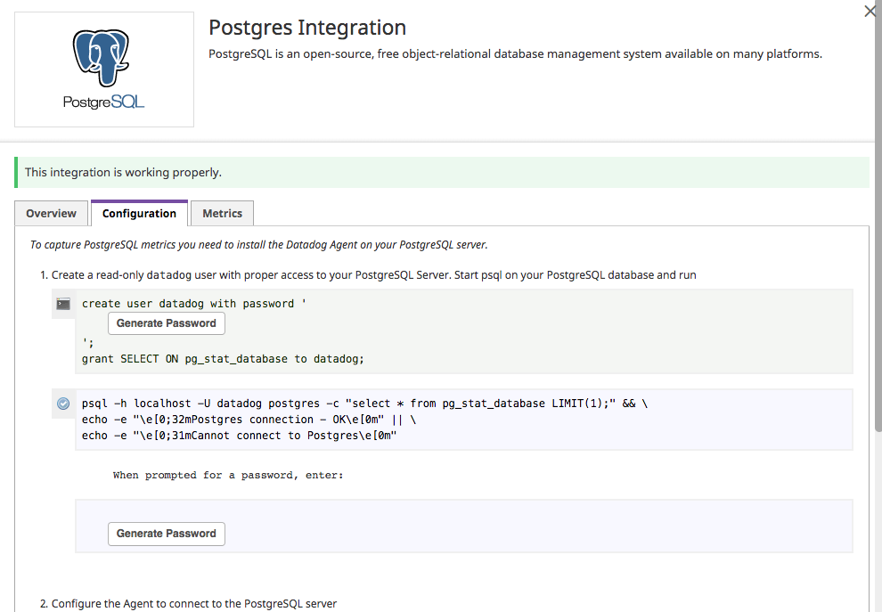
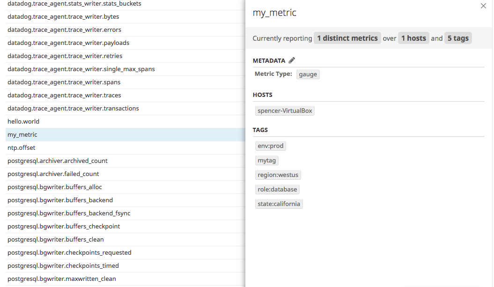

Your answers to the questions go here.
COLLECTING METRICS:
# Add tags in the Agent config file:

# from datadog-agent/datadog.yaml:
# Set the host's tags (optional)
tags:
   - mytag
   - env:prod
   - role:database
   - region:westus
   - state:california

<!-- Install a database on your machine (MongoDB, MySQL, or PostgreSQL) and then install the respective Datadog integration for that database. -->

# from datadog-agent/conf.d/postgres.d/conf.yaml:
init_config:

instances:
  - host: spencer-VirtualBox
    port: 5432
    username: datadog
    password: sumner
    # dbname: films
    # ssl: False
    # use_psycopg2: False # Force using psycogp2 instead of pg8000 to connect. WARNING: psycopg2 doesn't support ssl mode.
    tags:
      - optional_tag1
      - optional_tag2

# I also modified the postgresql.conf file to set the listening address to all:

# from /etc/postgresql/9.5/main/postgresql.conf:

# ...

# - Connection Settings -

listen_addresses = '*'		# what IP address(es) to listen on;
					# comma-separated list of addresses;
					# defaults to 'localhost'; use '*' for all
					# (change requires restart)
port = 5432				# (change requires restart)

# ...

# I also had issues with IPv6, so I modified the pg_hba.conf file

# from /etc/postgresql/9.5/main/pg_hba.conf:
# ...

# "local" is for Unix domain socket connections only
local   all             all                                     peer
# IPv4 local connections:
host    all             all             127.0.0.1/32            md5
# IPv6 local connections:
host    all             all             ::1/128                 md5
# Allow replication connections from localhost, by a user with the
# replication privilege.
#local   replication     postgres                                peer
#host    replication     postgres        127.0.0.1/32            md5
#host    replication     postgres        ::1/128                 md5
# Added a line to catch all incoming connections
host     all             all             0.0.0.0/0               md5

<!-- Create a custom Agent check that submits a metric named my_metric with a random value between 0 and 1000. -->

# created a file datadog-agent/checks.d/metric.py:

import random

from checks import AgentCheck

class MetricCheck(AgentCheck):
    def check(self, instance):
        data = random.randint(0, 1000)
        self.gauge('my_metric', data)

# Also created a corresponding conf file, /conf.d/metric.yaml:

init_config:

instances:
    [{}]

<!-- Change your check's collection interval so that it only submits the metric once every 45 seconds. -->

# from datadog-agent/checks.d/metric.py:

import random
import time
from checks import AgentCheck

class MetricCheck(AgentCheck):

    def check(self, instance):
        starttime = time.time()
        data = random.randint(0, 1000)
        while True:
            self.gauge('my_metric', data)
            time.sleep(45.0 - ((time.time() - starttime) % 60))

Visualizing Data:
<!-- Utilize the Datadog API to create a Timeboard that contains:
Your custom metric scoped over your host.
Any metric from the Integration on your Database with the anomaly function applied.
Your custom metric with the rollup function applied to sum up all the points for the past hour into one bucket -->

# Api call built in Postman:

POST /api/v1/dash?api_key='<MY_API_KEY>';
application_key='<MY_APP_KEY>'
Host: app.datadoghq.com
Content-Type: application/json
Cache-Control: no-cache
Postman-Token: e7c5d50e-da78-e19c-0cbe-a8fca047107d

{
      "graphs" : [{
          "title": "Another Custom Timeboard",
          "definition": {
				"requests": [
    				{
    					"q": "avg:my_metric{host:spencer-VirtualBox}",
    					"type": "line",
    					"style": {
    						"palette": "dog_classic",
        					"type": "solid",
        					"width": "normal"
    					 },
    					"conditional_formats": [],
    					"aggregator": "avg"
    				},
    				{
    					"q": "anomalies(avg:postgresql.table.count{host:spencer-VirtualBox}, 'basic', 2)",
    					"type": "line",
    					"style": {
        					"palette": "dog_classic",
        					"type": "solid",
        					"width": "normal"
    					}
    				},
    				{
    					"q": "avg:my_metric{host:spencer-VirtualBox}.rollup(sum)",
    					"type": "line",
    					"style": {
    						"palette": "dog_classic",
        					"type": "solid",
        					"width": "normal"
    					}
					 }
				],
  "viz": "timeseries",
  "autoscale": true,
  "xaxis": {}
},
          "viz": "timeseries"
      }],
      "title" : "Custom Timeboard",
      "description" : "A dashboard with my custom metric.",
      "template_variables": [{
          "name": "host1",
          "prefix": "host",
          "default": "host:my-host"
      }],
      "read_only": "True"
    }

    

# Bonus Question: What is the Anomaly graph displaying?

# great ?

Monitoring Data:
<!-- Create a new Metric Monitor that watches the average of your custom metric (my_metric) and will alert if it’s above the following values over the past 5 minutes:-->

<!-- Bonus Question: Since this monitor is going to alert pretty often, you don’t want to be alerted when you are out of the office. Set up two scheduled downtimes for this monitor:

One that silences it from 7pm to 9am daily on M-F,
And one that silences it all day on Sat-Sun.
Make sure that your email is notified when you schedule the downtime and take a screenshot of that notification. -->

Collecting APM Data:

https://app.datadoghq.com/apm/service/rails-chores-v-000/rack.request?start=1539636470679&end=1539640070679&paused=false&env=prod&isMonitorPanelOpened=false

#Bonus question: What is the difference between a Service and a Resource?

A Service is a set of processes that work together. like a webapp service and a database service.  A Resouce is a particulat query to a service, as in a query on a database.

#Final Question: What creative thing would you do with datadog?

I've been thinking lately of a way to monitor the electric grid in order to maximize potential energy efficiency and perhaps achieve carbon neutral electric generation.  One big challenge to leaving fossil fuels behind is that 100% renewable generation and storage are subject to the variabilities of the weather.  If we could monitor weather patterns and cloud cover on a granular level as they work thier way around the globe, perhaps we could eliminate the 'unknown' factor and be able to manage a comprehensive renewable energy service. 
