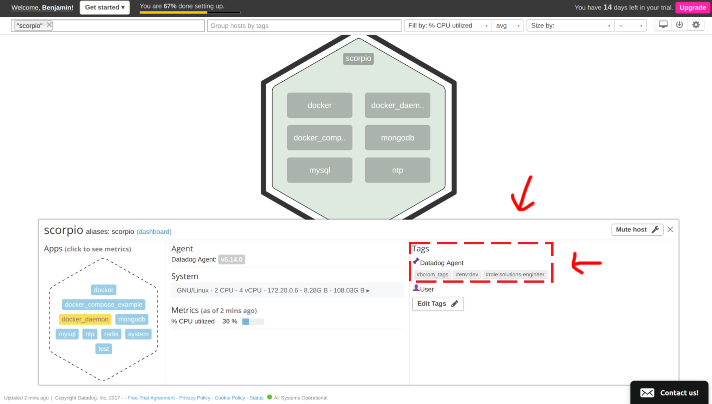
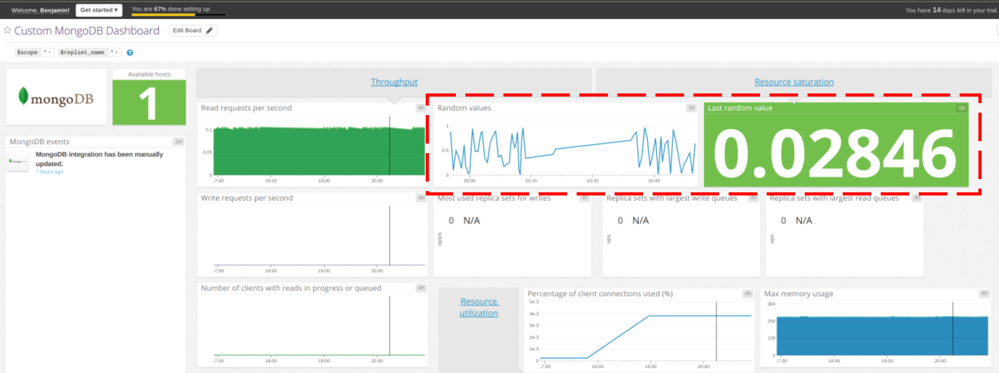
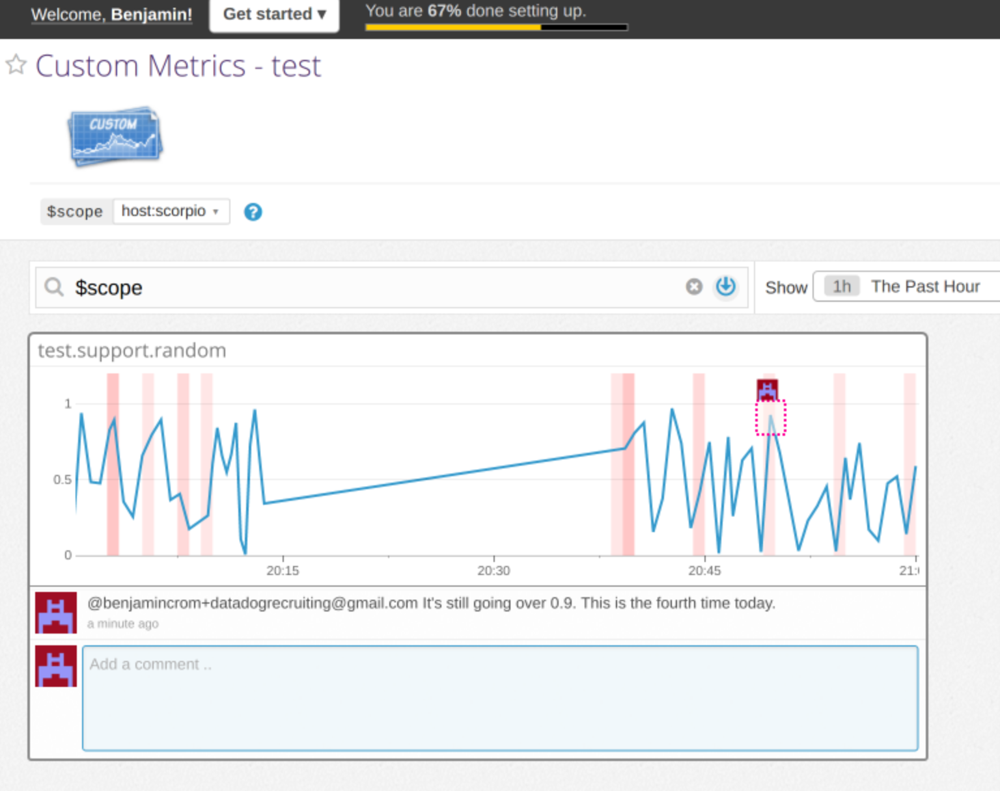

Your answers to the questions go here.

# Answers by Stephen Roe

Candidate for Solution Engineer in London

*my hobby github account is p6steve, email is stephen.john.roe@gmail.com*

*link to this repo provided by Nick Elwell*

## Prerequisites

My personal setup...

1. My home laptop is OSX, could spin up Docker on that machine, but...
2. I already have a LAMP build (Ubuntu 18.04 / Apache2 / mysql / PHP, Python) live on AWS to run Wordpress - so let's instrument that with the DataDog Agent and connect from OSX as client

### Sign Up for DataDog, Install Agent & Connect

Just used `> sudo DD_AGENT_MAJOR_VERSION=7 DD_API_KEY=7b108d7...`  That was smooth!



### Get the Agent Reporting Metrics from your (local) Machine

Successful initial report from DD agent on app.datadoghq.eu webpage.

## Collecting Metrics

### Adding tags to the DD Agent config file

`tags:
    - "<p6steve_build>:<1.0>"
    - "<p6steve_url>:<henleycloudconsulting.co.uk>"
    - "<p6steve-ssl>:<on>"`
    
*rather an unusual yaml format!*

### Screenshot of Host with Tags



### Adding MySQL Integration

Adding user & validating...
`mysql: [Warning] Using a password on the command line interface can be insecure.
Uptime	353341
Uptime_since_flush_status	353341`

Tweaking privileges...
`issing REPLICATION CLIENT grant\033[0m"
mysql: [Warning] Using a password on the command line interface can be insecure.
MySQL grant - OK`

Adjusting `/etc/datadog-agent/conf.d/mysql.d/conf.yaml` per docs -- couple of WARNings on sudo service datadog-agent status

`WARN | (pkg/collector/python/datadog_agent.go:118 in LogMessage) | mysql:deae8cbf193a8b9a | (mysql.py:956) | Privilege error or engine unavailable accessing the INNODB status tables (must grant PROCESS): (1227, 'Access denie...` ... oops looks like I forgot to grant process on innodb (probably forgot to FLIUSH PRIVILEGES;)- FIXED

Here is a dashboard with MySQL...



### Custom Agent check

1. First step - clone and run the documented example - no joy. Try running with python3 directly...

`ubuntu@ip-172-31-25-233:/etc/datadog-agent/checks.d$ python3 *.py
  File "metrics_example.py", line 3
    from datadog_checks.base import AgentCheck
    ^
IndentationError: unexpected indent`

Ah, made an indentation error - FIXED!   `Done running check metrics_example`

2. Second step - tweak the code

Please also see as committed file my_metric.py

```
import random
  
from datadog_checks.base import AgentCheck

__version__ = "1.0.0"

class MyClass(AgentCheck):
    def check(self, instance):
        self.gauge(
            "my_metric.gauge",
            random.randint(0, 1000),
            tags=["env:dev","metric_submission_type:gauge"],
        )
```

3. Third step - change the collection interval to 45s

Please also see as committed code file my_metric.yaml

```
init_config:
  
instances:
  - min_collection_interval: 45
```


