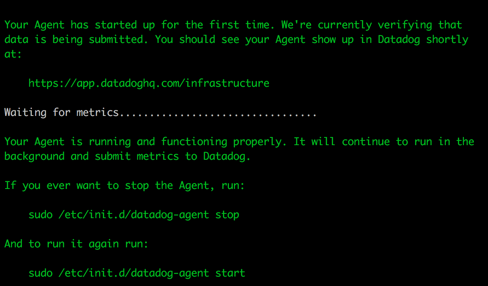
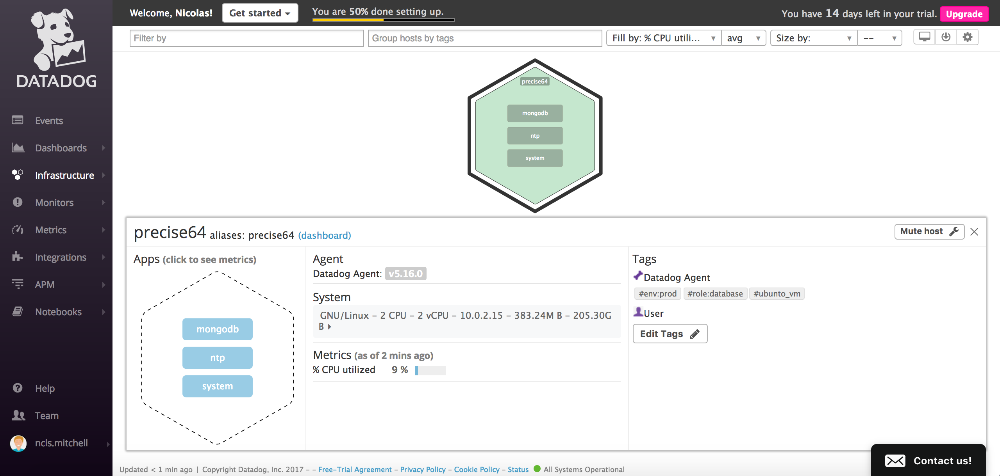
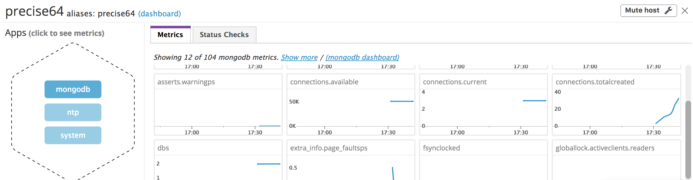
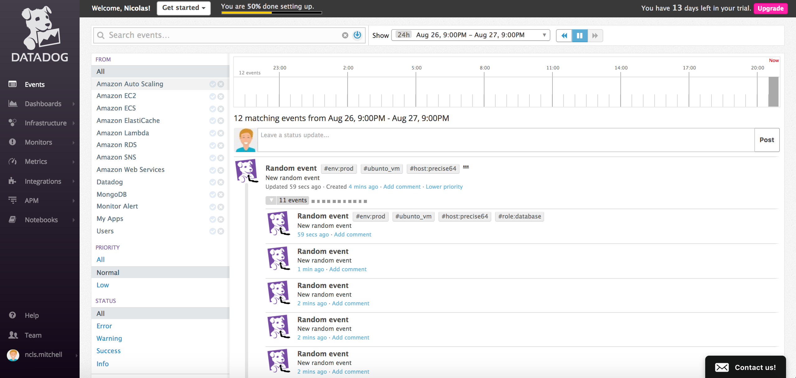
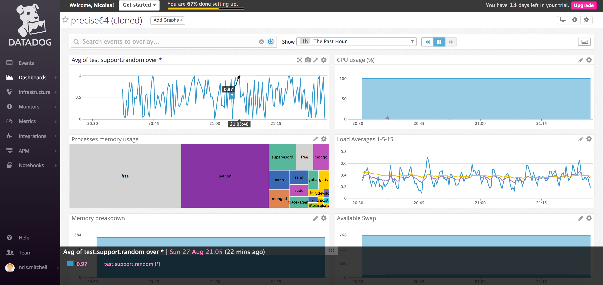
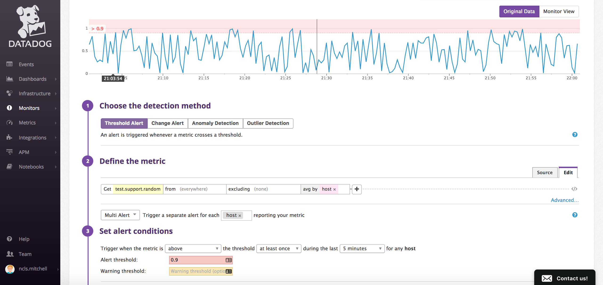
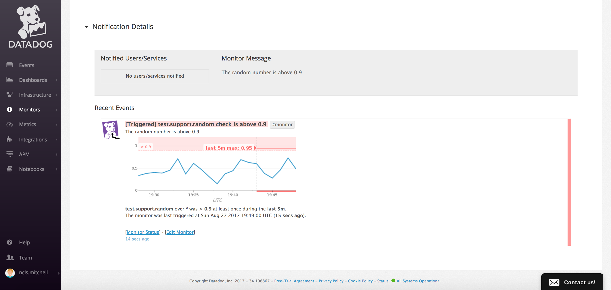
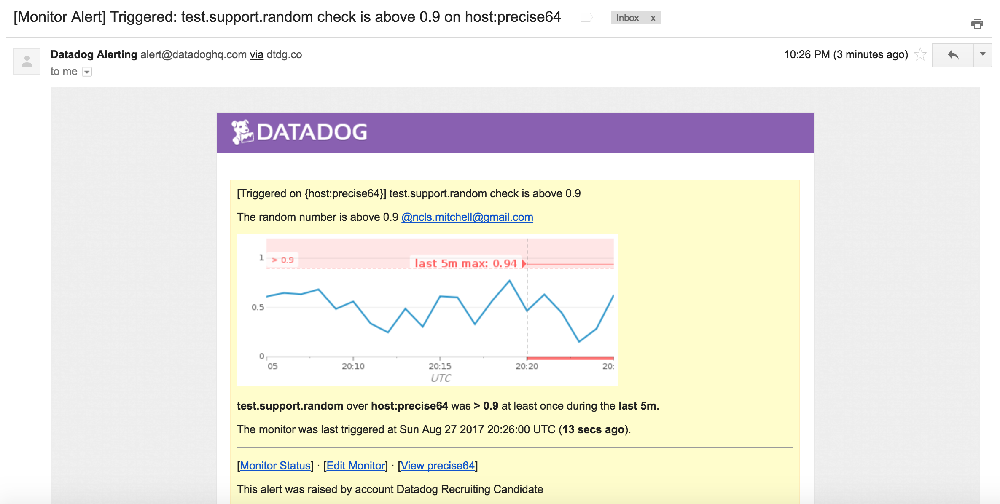
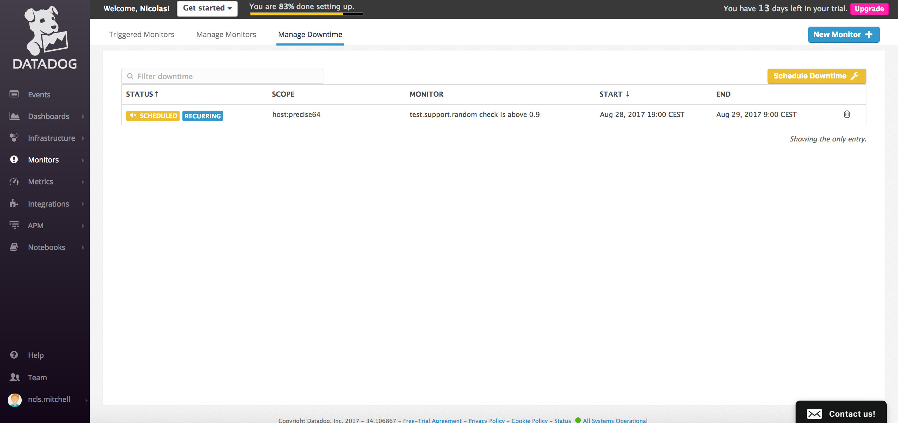

### Level 1 - Collecting your Data

1. Agent initialization

2. *Bonus:* What is the Agent?
This is a daemon that is executing tasks in the background such as:
- collecting data
- sending data to the datadog cloud platform

3. Host map:

4. MongoDB integration:

5. The Agent check code is located in the `check` repository:

---

### Level 2 - Visualizing your Data

1. Cloned dashboard with `test.support.random` metrics:

2. *Bonus:* What is the difference between a TimeBoard and a ScreenBoard?
- A timeboard is a real-time dashBoard
- A ScreenBoard is intended to show metrics over a selected period of time.

---

### Level 3 - Alerting on your Data

1. Random alert settings on all hosts (*Bonus*):

2. Received alert and email:

3. *Bonus:* Downtime settings

