# Datadog/Hiring-Engineers by Lucas Kamakura

## Setting up my environment

Datadog offers you an entire suite of platforms (Windows, Mac OS X, Docker, Ubuntu, etc.) to integrate with its agent. So, since I'm more comfortable with Linux environments, I decided to spin up an Ubuntu 18.04 virtual machine via Vagrant. I followed the steps outlined [here][1]1 to set up my Vagrant vm, and the [steps outlined in the Datadog UI][1]2 to set up my datadog-agent in Ubuntu.

[1]: <https://app.datadoghq.com/account/settings#agent/ubuntu> "Ubuntu DD-agent"
[2]: https://www.vagrantup.com/intro/getting-started/ "Vagrant setup"

Then, to install the datadog-agent in my Ubuntu vm, I ran the following command taken from the Datadog app integrations tab linked above:

    DD_AGENT_MAJOR_VERSION=7 DD_API_KEY=<REDACTED> DD_SITE="datadoghq.com" bash -c "$(curl -L [https://s3.amazonaws.com/dd-agent/scripts/install_script.sh](https://s3.amazonaws.com/dd-agent/scripts/install_script.sh))"

In the [integrations tab][3]3 you'll find specific instructions for the platform of your choice.

[3]: <https://app.datadoghq.com/account/settings#agent/ubuntu> "Ubuntu DD-agent"

After setting these up I wanted to check on my new host, so I navigated to the [host map][4]4 tab in the Datadog app.

[4]: https://app.datadoghq.com/infrastructure/map?fillby=avg%3Acpuutilization

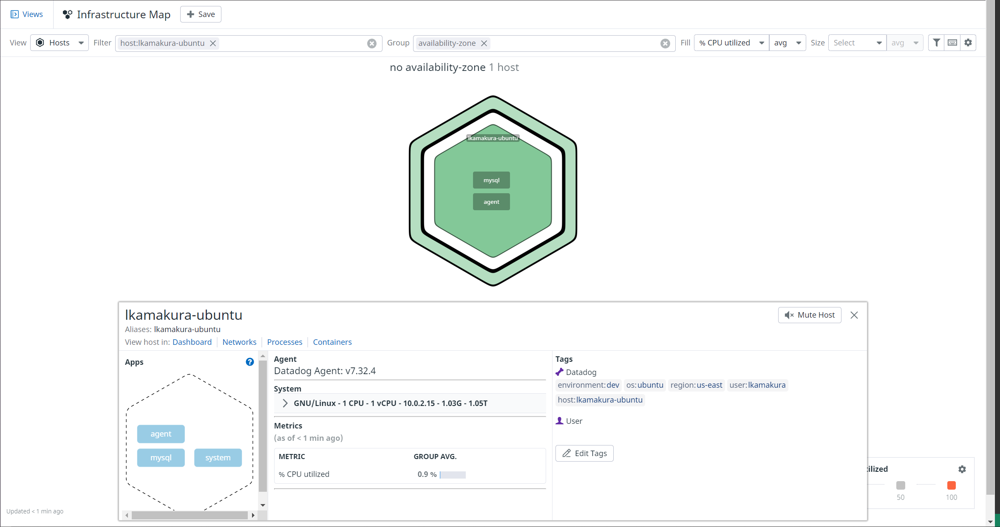

It's looking nice and healthy, so let's begin collecting some metrics!

## Collecting Metrics

Since we can have a multitude of hosts to monitor at once, it's important to be able to aggregate them via [tags][5]5. Tags are your way of observing aggregate performance across several hosts, and also further narrowing down on specific elements. They are important when it comes to filtering for, monitoring, and troubleshooting a specific service.

[5]: https://docs.datadoghq.com/getting_started/tagging/ "Tag docs"

First I wanted to identify my host, so I navigated to the dd-agent directory (`/etc/datadog-agent`) in my virtual machine and gave it a name in my `datadog.yaml` file. 

Then I wanted to give my host some tags to help me aggregate it with other hosts running on the same OS (*Ubuntu*), managed by the same users (*me*), in the same region (*us-east*), and under the same development environment (*trivially chose "dev"*).

With my new tags in place, I set up some other hosts to test out the filtering function. Here we can see all three of my hosts, including the other two that I don't want right now.

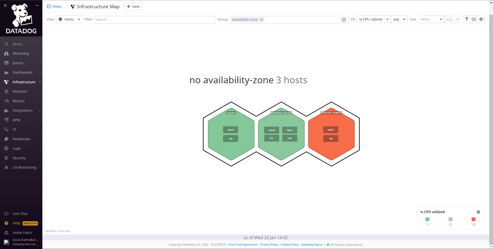

But once I filtered them out by *user* we can see that only the one that matters show up:

Now that we can identify our host using tags, I wanted to start sending some metrics to Datadog to visualize them in the UI. In order to do so, we can install a database service of our choice for us to monitor. 

MySQL is a very popular open-source database service and it is included in Ubuntu's default repository, making it my go-to choice when dealing with Ubuntu VMs.

Following the steps outlined [Ubuntu's documentation][6]6 I went ahead and installed the database with the command below:

    sudo apt update
    sudo apt install mysql-server
    

[6]: https://ubuntu.com/server/docs/databases-mysql

Then I connected to MySql to test my installation:

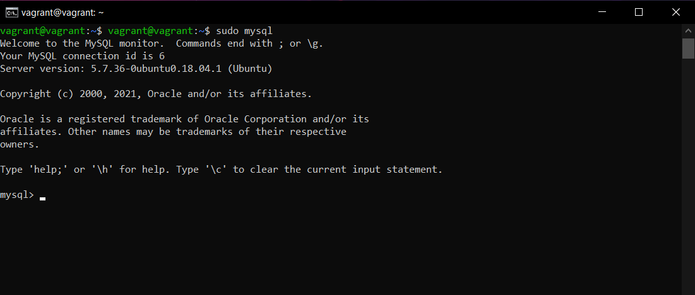

Now that we have MySQL installed in our machine, we have to connect it to the datadog service so it can begin collecting metrics. Unsurprisingly, MySQL is alredy integrated into our Datadog Agent package, making our lives much easier. 

However, we need to give our agent the necessary permissions to access our database for security purposes. In order to do so we can follow the steps to create a datadog user outlined in the [integrations/mysql][7]7 tab in our Datadog UI.

[7]: https://app.datadoghq.com/account/settings#integrations/mysql

First we create the user (we're using MySQL 5.7) and give it a password:
    
    mysql> CREATE USER 'datadog'@'%' IDENTIFIED BY '<UNIQUEPASSWORD>';
    Query OK, 0 rows affected (0.00 sec)

Then let's check if it was created successfully by running this `"Select User, Host from mysql.user;"` query:

and running the provided snippet from the integrations tab:

    mysql -u datadog --password=<UNIQUEPASSWORD> -e "show status" | \
    grep Uptime && echo -e "\033[0;32mMySQL user - OK\033[0m" || \
    echo -e "\033[0;31mCannot connect to MySQL\033[0m"

Great, seems like everything is in place! Now let's give our datadog user a couple more permissions to monitor our data:

    mysql> GRANT REPLICATION CLIENT ON *.* TO 'datadog'@'%' WITH MAX_USER_CONNECTIONS 5;
    Query OK, 0 rows affected, 1 warning (0.00 sec)

    mysql> GRANT PROCESS ON *.* TO 'datadog'@'%';
    Query OK, 0 rows affected (0.00 sec)

    mysql> GRANT SELECT ON performance_schema.* TO 'datadog'@'%';
    Query OK, 0 rows affected (0.00 sec)

From the [MySQL Documentation][8]8:

[8]:https://dev.mysql.com/doc/refman/8.0/en/privileges-provided.html

 - `GRANT REPLICATION` allows the datadog user to monitor the status of our master DB and its logs.

 - `GRANT PROCESS` allows it to control access to information about statements being executed by the MySQL sessions.

 - `GRANT SELECT` just lets our user run a SELECT statement on the DB of choice

Now, to finalize metric collection, let's navigate to our configuration directory for our mysql integration at `/etc/datadog-agent/conf.d/mysql.d` and add a yaml config file named `conf.yaml`. Then, add the following snippet to the config file:

Finally, let's restart our agent and check the status of the connection between our agent and our database by running

    sudo service datadog-agent restart
    sudo datadog-agent status

    mysql (7.0.1)
    -------------
      Instance ID: mysql:d9b1bb9a3acaf075 [OK]
      Configuration Source: file:/etc/datadog-agent/conf.d/mysql.d/conf.yaml
      Total Runs: 48
      Metric Samples: Last Run: 165, Total: 7,872
      Events: Last Run: 0, Total: 0
      Service Checks: Last Run: 1, Total: 48
      Average Execution Time : 27ms
      Last Execution Date : 2022-01-26 22:26:33 UTC (1643235993000)
      Last Successful Execution Date : 2022-01-26 22:26:33 UTC (1643235993000)
      metadata:
        flavor: MySQL
        version.build: unspecified
        version.major: 5
        version.minor: 7
        version.patch: 36
        version.raw: 5.7.36+unspecified
        version.scheme: semver

Seems like we're good to go!

Now that we've succesfully connected our agent to our DB, let's set it aside for a bit and work on creating a simple check for us to monitor in the Datadog UI.

Following the steps outlined in the [Custom agent checks docs][9]9 let's navigate to `/etc/datadog-agent/checks.d` and create a python Agent check called `my_check.py` that continuously submits a metric with a random value between 0 and 1000:

[9]:https://docs.datadoghq.com/developers/write_agent_check/?tab=agentv6v7

*This Python script is included in this repo.*

 Also, let's create in our configuration directory (`/etc/datadog/conf.d`) an almost empty `my_check.yaml` config file for our agent that only includes:

     instances: [{}]

Now, if we navigate to the [Metrics page][10]10 in the UI, we can search for our `my_check` custom metric and visualize the data coming in real time:

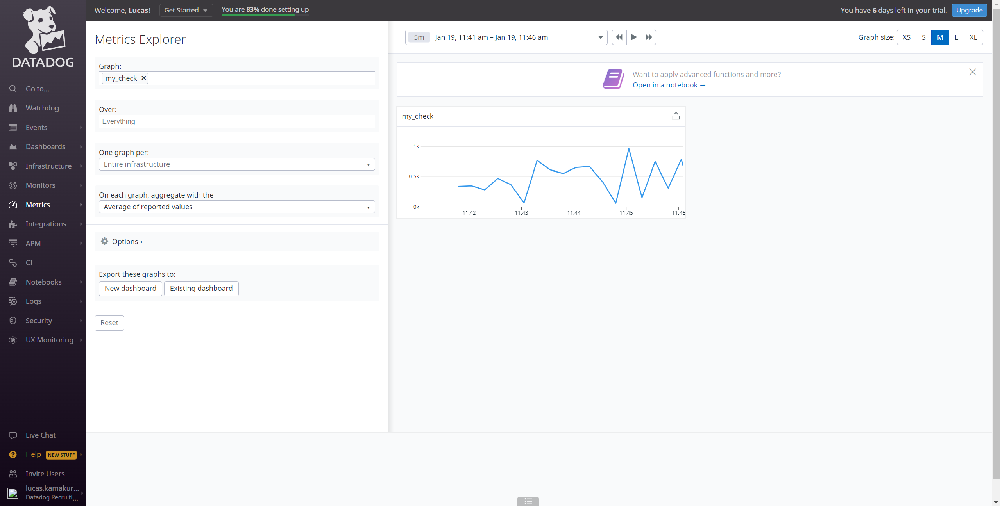

[10]:https://app.datadoghq.com/metric/explorer?from_ts=1643233314521&to_ts=1643236914521&live=false&tile_size=m&exp_agg=avg&exp_row_type=metric

The metric seems to be coming in intervals of 15-25 seconds. What if we'd like to change that cadence? Then we have two options: either modify our python script (which wouldn't be difficult in this case since it's very simple, but in the future it might be much more complex!) OR we could update our `my_check.yaml` file to look like this:

The cadence in which datadog now collects the metric is **at most** every 45 seconds.

Here is our graph after setting the 45s interval and restarting the agent:

## Visualizing Data

We are now collecting some data from our virtual machine. But that's not enough, and I'd like to be able to better visualize it. Using the Datadog's API let's create a [Timeboard][11]11 that contains:

[11]:https://docs.datadoghq.com/dashboards/timeboards/

 - A timeseries with the `my_check` custom metric scoped over the `lkamakura-ubuntu` host

 - A timeseries calculating how many inserts were done in MySQL over time

 - A timeseries with the rollup function applied over the `my_check` custom metric for the past hour

From Datadog's official [Dashboard API Documentation][12]12 we can look at all the endpoints that are available to us. In this case I'm interested in making a POST to `https://api.datadoghq.com/api/v1/dashboard` in order to create our Timeboard. We can also use Datadog's public workspace in [Postman][13]13 to better manipulate and visualize our request to include all the features we want in our Timeboard.

[12]:https://docs.datadoghq.com/api/latest/dashboards/

[13]:https://www.postman.com/datadog/workspace/datadog-s-public-workspace/collection/7274195-66ef21d8-e159-4d7d-8ded-c511e1abe189?ctx=documentation

As I'm comfortable using curls to work with APIs, a `.sh` file will be my tool of choice for making the request.

First we'll go to Datadog's public workspace in Postman and look at what a POST request to our endpoint looks like:

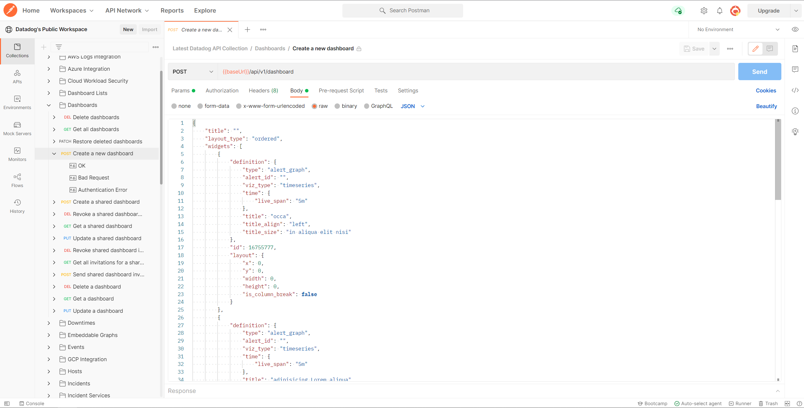

Then we can modify the body of this request to change what our Timeboard will look like, and what it will display. 

Dashboards are composed of [widgets][14]14, where each widget represents some type of data visualization. In this case, we'll be using [timeseries][15]15 widgets for our Timeboard.

[14]:https://docs.datadoghq.com/dashboards/widgets/

[15]:https://docs.datadoghq.com/dashboards/widgets/timeseries/

Since there is quite a number of parameters we could change in our request, we'll only go over the more important ones:

    title: "where we name our dashboard"

    type: "where we make it into a timeseries to display our data over time"

    "requests":[
               {
                  "q":"avg:my_check{*}", #which metric will be displayed
                  "display_type":"line" #to display our metric as a line
               }

This is what the `my_check` timeseries widget ended up looking like:

    "widgets":[
      {
         "id":6211391627065367,
         "definition":{
            "title":"my_check Timeseries",
            "title_size":"16",
            "title_align":"left",
            "show_legend":false,
            "type":"timeseries",
            "requests":[
               {
                  "q":"avg:my_check{*}",
                  "display_type":"line"
               }
            ]
         },
         "layout":{
            "x":0,
            "y":0,
            "width":4,
            "height":2
         }

Using the API we can also set up a widget to look for a specific metric coming from our previous MySQL integration, and also apply functions over these metrics. For example, we could apply a [rollup][19]19 function over our widget above to aggregate all of the data in periods of 1 hour. This rollup function can sum, min, max, count, or avg the metric over that period.

[19]:https://docs.datadoghq.com/dashboards/functions/rollup/#pagetitle

Now, once we have all the settings we want for our timeboard, we'll need to gather our API key from the Datadog app, and create an APPLICATION key especifically for this metric, both to be used in our request to the API. This can be done so [here][16]16.

[16]:https://app.datadoghq.com/organization-settings/application-keys

The bash script I used to create this Timeboard is included in this repo as `my_dashboard.sh` and the logs are in `my_dashboard.log`. I redacted my DD-API and DD-APPLICATION keys for security.

We can then navigate to the [Dashboard list][17]17 page and see what our new Timeboard looks like with all the metrics we included. This is where we can also choose the timeframe for our graphs:

[17]:https://app.datadoghq.com/dashboard/lists

- 5 minutes interval:

- 1 hour interval:

We can also send [snapshots][18]18 of our new timeseries to our teammates using what's called @ notation:

[18]:https://docs.datadoghq.com/metrics/explorer/#snapshot

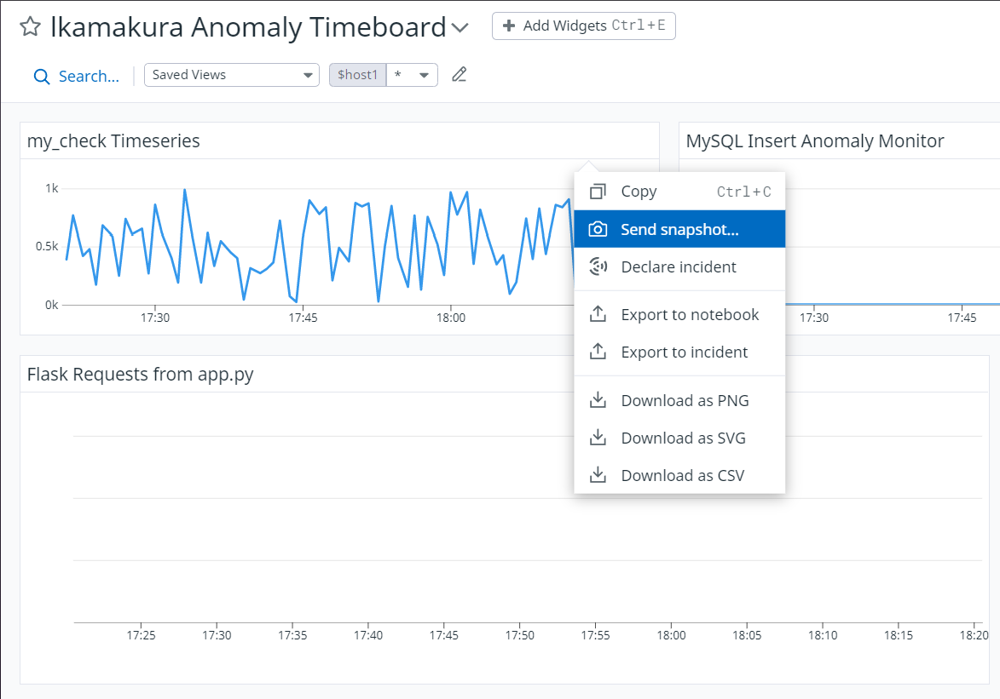

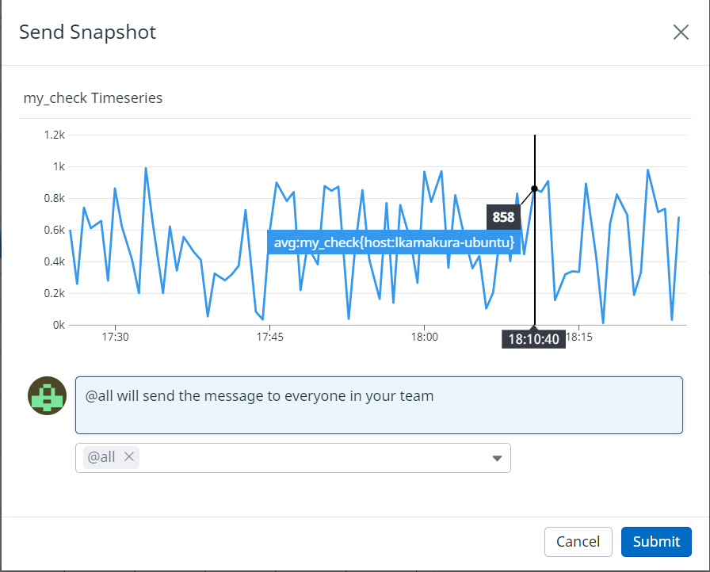

Here's what the email with the snapshot looks like:

What is the Anomaly graph displaying?
> The anomaly graph identifies when a metric is behaving differently than it has in the past, taking into account trends, seasonal day-of-week, and time-of-day patterns.

This is an excerpt taken from https://docs.datadoghq.com/monitors/create/types/anomaly/. In this snapshot we can see a red spike in the mySQL Insert Anomaly Monitor, which I created by suddenly performing multiple inserts over a small period of time, triggering the anomaly monitor.
 
## Monitoring Data

Now that we have some data to visualize in Datadog, it's time to add some monitoring to it (just in case something goes wrong). Let's monitor our `my_check` metric.

To [monitor][20]20 the `my_check` custom metric, let's create a monitor in the [Monitors tab][21]21 with the following specifications:

[20]:https://docs.datadoghq.com/monitors/

[21]:https://app.datadoghq.com/monitors/manage

 - Define the metric to be `my_check` over the `lkamakura-ubuntu` host
 - Set a warning threshold of 500
 - Set an alert threshold of 800
 - Set it to notify the team if there is no data for `my_check` over the last 10 minutes

Now we'll be warned if `my_metric` goes over an average of 500 over the last 5 minutes, and be alerted if it goes over an average of 800 over the last 5 minutes.

Using a number of different [variables][22]22 in our message, we can configure it to be different depending on whether a notification is a **warning** or an **alert**:

[22]:https://docs.datadoghq.com/monitors/notify/variables/?tab=is_alert

Here are the messages I received via e-mail when a warning or alert would trigger:

Warning:

Alert:

In order to give our team a break from all these status notification e-mails, we can also set up some [downtime][24]24, in the [Manage Downstimes tab][23]23, during after-work hours and weekends (keep in mind the hours in the email are in UTC, but **2:00PM UTC** is **9:00AM EST**):

[23]:https://app.datadoghq.com/monitors/downtimes?q=active%3Atrue%20automuted%3Afalse&sort=-start_dt

[24]:https://docs.datadoghq.com/monitors/notify/downtimes/?tab=bymonitorname

7pm to 9am daily on M-F downtime:

Sat-Sun all day downtime:

Phew! No more warnings every 5 minutes during my free time!

## Collecting APM Data

We've now looked at collecting metrics from our agent, graphing those metrics into nice-looking dashboards, and setting up monitoring and alerts. Now let's say we'd like to collect some data from a microservice application, how would we do that?

Introducing [Datadog's Application Performance Monitoring][25]25 (APM for short): 

    Datadog APM & Continuous Profiler gives deep visibility into your applications with out-of-the-box performance dashboards for web services, queues, and databases to monitor requests, errors, and latency.

[25]:https://docs.datadoghq.com/tracing/

In order to set up APM, let's follow the steps outlined in the [Datadog APM Docs][26]27.

[27]:https://docs.datadoghq.com/tracing/setup_overview/setup/python/?tab=containers

First things first I set up an environment using the Python package manager Anaconda, which can be set up following the steps in their [docs][27]26.

[26]:https://docs.conda.io/projects/conda/en/latest/user-guide/tasks/manage-environments.html

Then, we'll need `pip` which is another Python package installer.

    conda install pip

*make sure you have at least pip version 18.0.0 or greater*

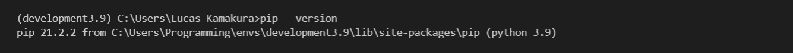

Then we install ddtrace using pip:

    pip install ddtrace

And check if it's properly installed:

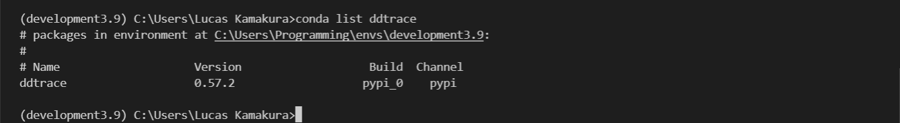

Our app (`app.py` in this repo) will be a simple web application using a RESTful API with only an entry and 2 endpoints; `"api/apm"` and `"api/trace"`. In order to run it we'll also need `Flask`, which is a micro web framework used for Python web development.

    conda install flask

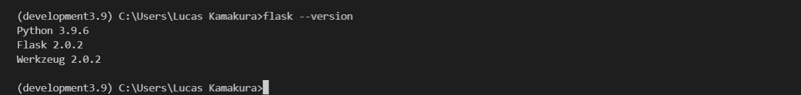

Now we'll need inject ddtrace directly into our app by adding this code block below to the top of our python file. It's what will allow our datadog-agent to monitor our requests.

    from  ddtrace  import  config, patch_all
    
    ## Manually injecting the Middleware ##
    config.env = "dev"
    config.service = "app"
    config.version = "0.1"
    patch_all()

This is what it should look like:

    from  ddtrace  import  config, patch_all
    
    ## Manually injecting the Middleware ##
    config.env = "dev"
    config.service = "app"
    config.version = "0.1"
    patch_all()
    
    from  flask  import  Flask
    import  logging
    import  sys
    
    main_logger = logging.getLogger()
    main_logger.setLevel(logging.DEBUG)
    c = logging.StreamHandler(sys.stdout)
    formatter = logging.Formatter('%(asctime)s - %(name)s - %(levelname)s - %(message)s')
    c.setFormatter(formatter)
    main_logger.addHandler(c)
    
    app = Flask(__name__)
    
    @app.route('/')
    def  api_entry():
    	return  'Entrypoint to the Application'
    
    @app.route('/api/apm')
    def  apm_endpoint():
    	return  'Getting APM Started'
    
    @app.route('/api/trace')
    def  trace_endpoint():
    	return  'Posting Traces'
    	
    if  __name__ == '__main__':
    	app.run(host='0.0.0.0', port='5050')`

Then we update the `datadog.yaml` file to enable `apm_config`, so that we can start using APM to monitor our application:

Finally, let's run our script and initiate our web app:

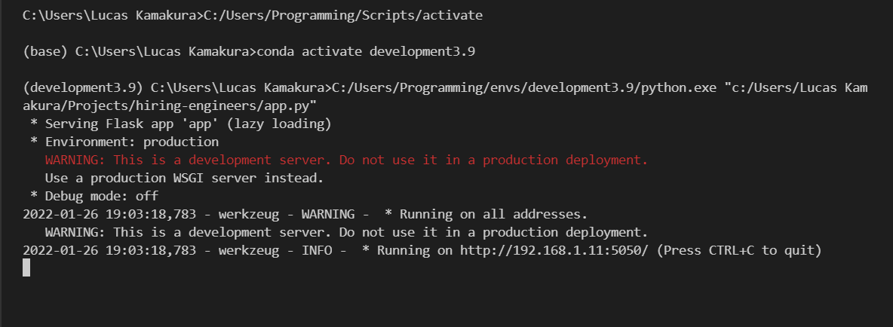

Now if we go to `localhost:5050` in our browser of choice, we should see our web app running:

And as we make requests around the API endpoints `localhost:5050/api/apm` and `localhost:5050/api/trace` we can see activity in the [APM UI][28]28:

[28]:https://app.datadoghq.com/apm/home?env=dev

Finally, if we use what we learned from the visualizing and monitoring sections on our new APM metrics, we can add them to our initial Timeboard! Here is the Timeboard with all the metrics (including the number of requests to our web app) being collected:

## Final Question

> Datadog has been used in a lot of creative ways in the past. We’ve written some blog posts about using Datadog to monitor the NYC Subway System, Pokemon Go, and even office restroom availability!
> 
> Is there anything creative you would use Datadog for?

I’ve always been a big fan of competitive video games, my favorite at the moment is League of Legends. Given the game's complex nature there are thousands of metrics that can be analyzed and monitored throughout a match, and these are publicly available through [Riot Games' API][29]29.

[29]:https://developer.riotgames.com/

For some personal projects I explored a lot of their API and I found out that it provides us with an ocean of real time information on matches. Datadog could be used to create a tool to monitor a match (be it player scores, team resources, player position on the map, etc.) in real time and provide possible courses of actions based on the match state.

Additionally, the developer team at Riot could use Datadog to visualize macro trends in their game and identify outliers when it comes to certain characters (how much they're played, their win rate, their ban rate, etc.) and use Datadog's tool to provide balance insights into the game. 

I created a little walkthrough of their API in `riot_client.py` where I go over how to obtain data from Riot, and what type of data can be obtained. For the second purpose, I included 2 json files in this repo. `frame_interval.json` and `event_interval.json` will help better visualize the sheer amount of information that can be obtained from endpoints like this one, and how Datadog could be used to study and build upon all that data!
s
# Thank you

I know it's been long, but thank you for taking the time to look over this assessment. I had lots of fun working on it, and the more I learned about Datadog's product, the more I wanted to become a part of Datadog's team. Once again thank you, and goodbye.

## References

Please see `references.md` for a list of all references.

