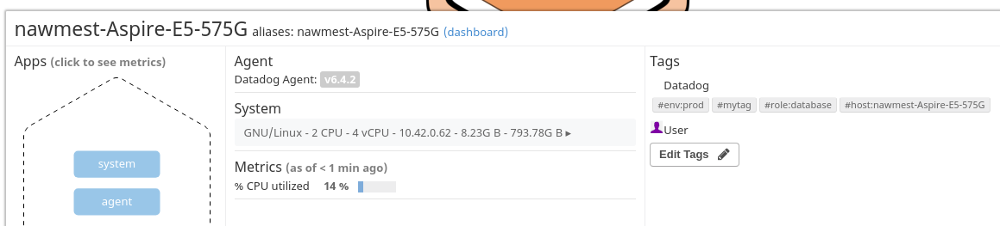
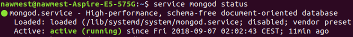
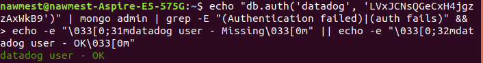
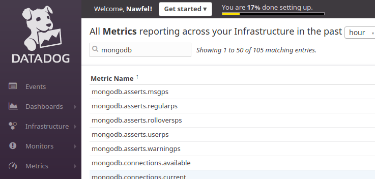
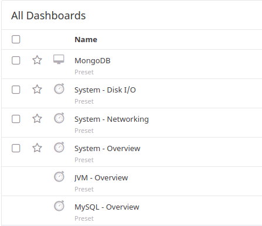

# Nawfel Mestoui - DataDog Technical Test

## Prerequisites - Setup the environment
I am using my current OS, Ubuntu 17.10 to complete this exercise.
</img>
### Installing Datadog agent
After sign in to Datadog, I did <a href="https://app.datadoghq.com/account/settings#agent/ubuntu">install Datadog agent</a> for Ubuntu:
</img>

## [](https://github.com/DataDog/hiring-engineers/tree/solutions-engineer#collecting-metrics)Collecting Metrics:

### Add tags in the Agent config file
After updating the configuration file `/etc/datadog-agent/datadog.yaml`, we can see the host and the new tags from Host Map page in Datadog:
</img>

### Installing Datadog integration for MongoDB
In my current machine I have already MongoDB Community Edition v3.6.6, <a href="https://docs.mongodb.com/manual/tutorial/install-mongodb-on-ubuntu/">here are instructions to install it on Ubuntu</a>

To check if the database is active:
`service mongod status`
</img>

In order to install Datadog integration for MongoDB, I followed the instuctions from this <a href="https://app.datadoghq.com/account/settings#integrations/mongodb">page</a>:

After adding a read-only user administrator for datadog (to collect complete server statistics),
and after running verification commands from the instructions page, I get this result:
</img>

The second part of the integration is to configure the Datadog Agent to connect to my MongoDB instances, for that I need to update the configuration file `/etc/datadog-agent/conf.d/mongo.yaml`

After restarting Datadog service, I can check that MongoDB is well Integrated:

By typing "mongoDb" in the <a href="https://app.datadoghq.com/metric/summary"> metrics summary page</a>, we can see all the MongoDb metrics.
</img>

And also if we check the <a href="https://app.datadoghq.com/dashboard/lists">dashboard list page <a/> we can see that MongoDb is present in the list:
</img>

### Creating a custom Agent check
To have a custom Agent check, I have to create 2 files: `my_check.yaml` in `/etc/datadog-agent/conf.d/` and the pyhton script `my_check.py` in `/etc/datadog-agent/checks.d/`

#### my_check.yaml
```
init_config:
	min_collection_interval: 45
instances:
    [{}]
 ```   
min_collection_interval can be added to the init_config section to help define how often the check should be run globally, in this case it's set to 45.

##### my_check.py
```
from checks import AgentCheck

import random, time

class HelloCheck(AgentCheck):

    def check(self, instance):
        self.gauge('my_metric',random.randint(0, 1000)
```
The check class inherits from AgentCheck and send a gauge of a random number for the metric 'my_metric' on each call.

