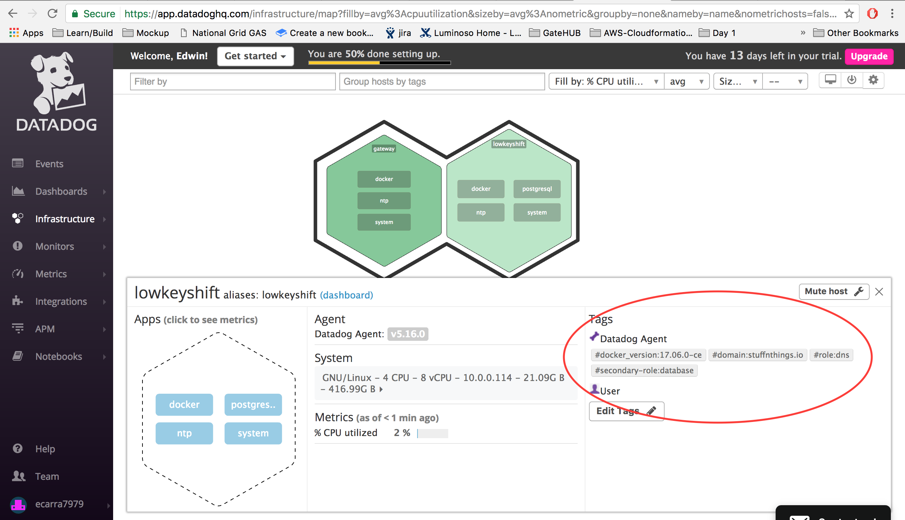
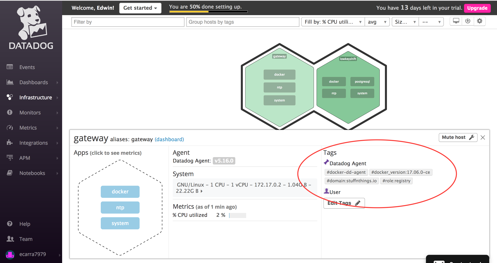
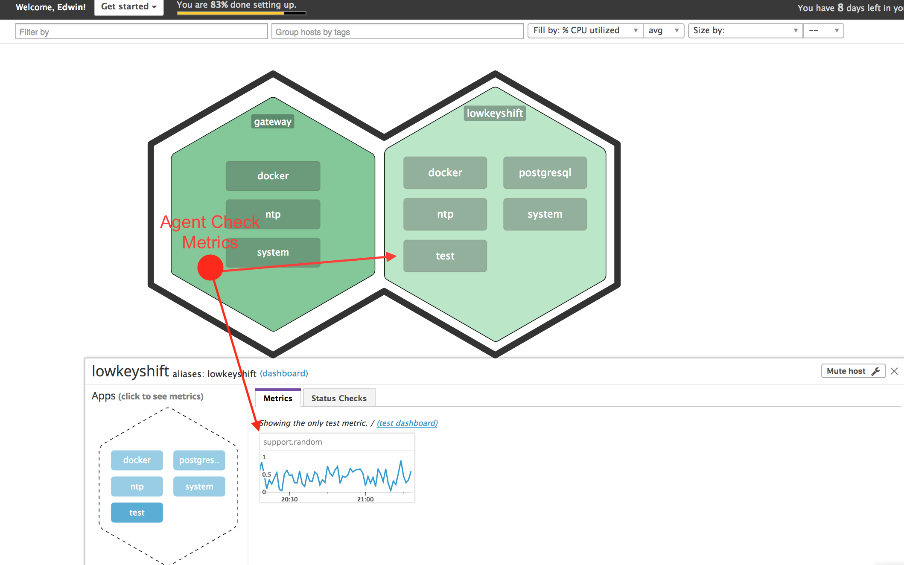
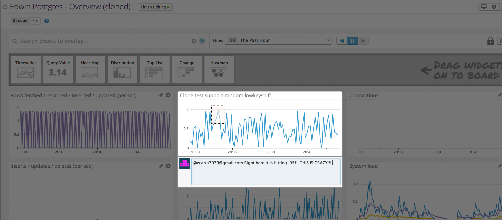
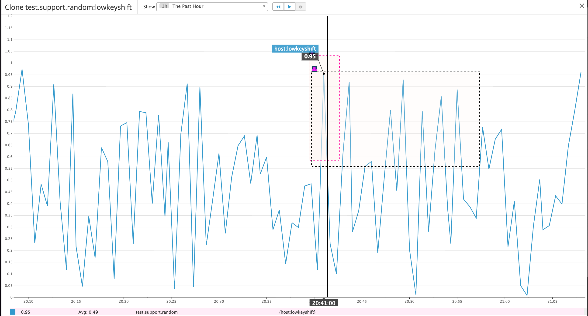
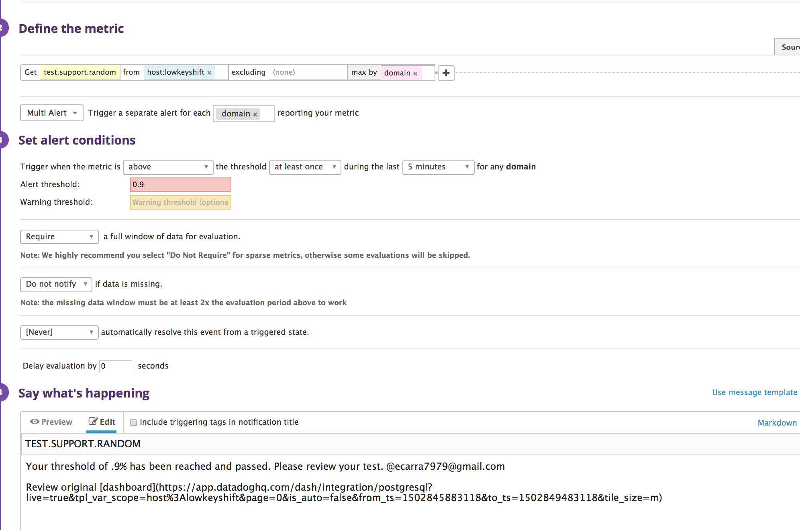
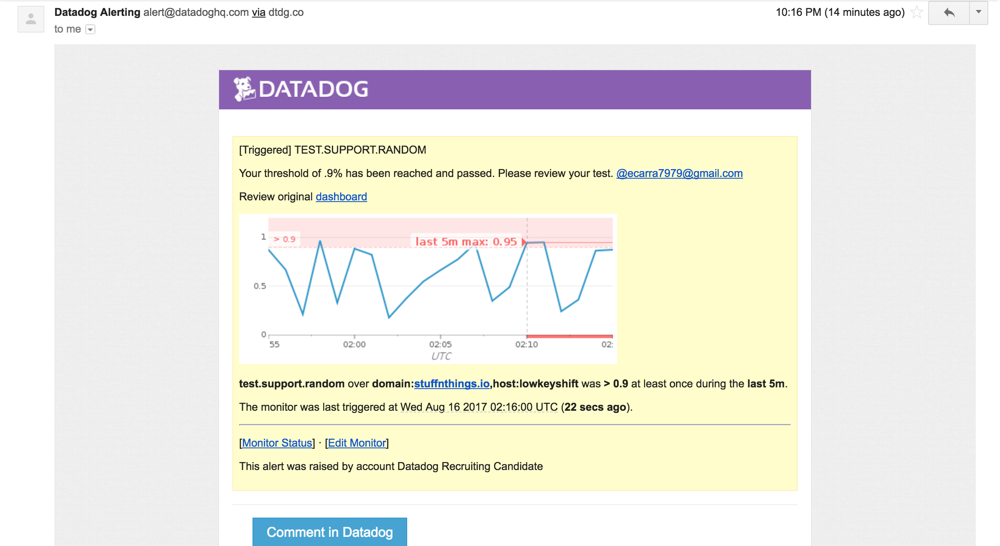

## Table of Contents

- [Launching an Ubuntu VM](#launching-an-ubuntu-vm)
- [Collecting Your Data](#collecting-your-data)
  - [Installing Datadog-Agent on Ubuntu](#installing-datadog-agent-on-ubuntu)
    - [Installing an Agent Directly](#installing-an-agent-directly)
    - [Launching a Docker Container](#installing-and-launching-a-docker-continer)
  - [Tagging Your VM](#tagging-your-vm)
  - [Installing & Monitoring PostgreSQL](#installing--monitoring-postgresql)
  - [Writing a Custom Agent Check](#writing-a-custom-agent-check)
- [Visualizing Data](#visualizing-data)
  - [PostgreSQL Dashboard](#postgresql-dashboard)
- [Alerting on your Data](#alerting-on-your-data)
  - [Creating a Monitor with Bonus Points](#create-a-monitor-with-bonus-points)
  - [Email Screenshot](#email-screenshot)
- [Conclusion](#conclusion)
- [Bonus Questions](#bonus-questions)
- [Found Syntax Errors](#found-syntax-errors)


# Launching an Ubuntu VM

[KVM](https://wiki.qemu.org/Features/KVM) also known as Kernel Virtual Machine is a Linux kernel module that allows a user space program to utilize the hardware virtualization features of various processors.

To install KVM on Ubuntu follow the link below:

[Install KVM](https://www.cyberciti.biz/faq/installing-kvm-on-ubuntu-16-04-lts-server/)

Once KVM is installed here is a small script that will install the latest version of the Ubuntu LTS iso. Then begin creating the Ubuntu vm with memory=1GB, cpu=1, and storage=15GB. To complete the install a vnc window will appear. Follow the Ubuntu guided install to finish building your vm.

```cd /var/lib/libvirt/boot/ && \
sudo wget https://www.ubuntu.com/download/server/thank-you?version=16.04.3&architecture=amd64 && \
sudo virt-install \
--virt-type=kvm \
--name=ubuntu_xenial \
--ram=1024 \
--vcpus=1 \
--os-variant=ubuntu \
--virt-type=kvm \
--hvm \
--cdrom=/var/lib/libvirt/boot/ubuntu-16.04.3-server-amd64.iso \
--network=bridge=br0,model=virtio \
--network=bridge=br1,model=virtio \
--graphics vnc \
--disk path=/var/lib/libvirt/images/ubuntu_xenial.qcow2,size=15,bus=virtio,format=qcow2
```

# Collecting Your Data

## Installing Datadog-Agent on Ubuntu

### Installing an Agent Directly
Datadog can be installed on most operating systems distributions available today. You can find the list of supported operating systems and their installation guides [here](https://app.datadoghq.com/account/settings#agent).

There is a quick setup one-line install for each operating system platform. As an example the Ubuntu one-line will resemble the code below. Of course remember to change the API Key to your own.

`DD_API_KEY={Insert Your API Key} bash -c "$(curl -L https://raw.githubusercontent.com/DataDog/dd-agent/master/packaging/datadog-agent/source/install_agent.sh)"`

### Launching Agent in Docker Container

The Datadog-agent can also be added to existing docker deployments. Reasons for using a docker container apposed to directly installing the agent are speed, compatibility and easy of deploy. You can view this docker datadog-agent's dashboard [here](https://app.datadoghq.com/screen/integration/docker?tpl_var_scope=host%3Agateway).

At times it is much faster to pull a docker image that is set up to meet the monitoring requirements to a specific host or set of hosts you wish to monitor. Introducing a Datadog-agent container to a swarm configuration will make deploying and monitoring your docker stack a simple push button solution.

* You can get a copy of the official Datadog docker image with the following command.
`docker pull datadog/docker-dd-agent`

* Then once you have the imaged pulled go ahead and run it. Remember to change the API_KEY to your key.

``` docker run -d --name dd-agent \
  -v /var/run/docker.sock:/var/run/docker.sock:ro \
  -v /proc/:/host/proc/:ro \
  -v /sys/fs/cgroup/:/host/sys/fs/cgroup:ro \
  -v /opt/dd-agent-conf.d:/conf.d:ro \
  -e API_KEY={Insert Your API Key} \
  -e SD_BACKEND=docker \
  -e TAGS=docker-dd-agent,domain:stuffnthings.io,role:registry \
  datadog/docker-dd-agent
  ```

* If those manual options don't see viable on a daily bases, try launching the docker container using [docker-compose](https://docs.docker.com/compose/install/). Just change directories to the datadog_docker/ and run the command below.

`docker-compose up -d`

### Quick Docker Explanation
* First the line `docker run -d --name dd-agent` will detach the container and then print the container's id and name the running container **dd-agent**.

* The next four lines are volume mappings. They map paths on the host to paths in the container.
  - `-v /var/run/docker.sock:/var/run/docker.sock:ro` This is the unix socket used to communicate with the daemon located within the container.

  - `-v /proc/:/host/proc/:ro \` This mapping is key to giving the agent all the data from the host it is supposed to auto discover. One key piece of information is the hostname that is found at **/proc/sys/kernel/hostname:gateway**.

  - `-v /sys/fs/cgroup/:/host/sys/fs/cgroup:ro \` This will map the container to use the cgroup of the host. You can find information about memory and cpu usage here. This will be mapped as read only.

  - `-v /opt/dd-agent-conf.d:/conf.d:ro \` Here is the integration conf.d for the datadog-agent.

* The final three lines are environment variables that fill in entries of the datadog.conf file. API key, tags, and autodiscovery configuration insertions.

## Tagging Your VM

Tags make collecting, searching, filtering, and grouping hosts and their metrics to your monitoring easy. You can assign tags to your hosts by using the UI (User Interface), API, directly in your datadog.conf file and tags are also assigned through inheritance from an integration (e.g. #docker_version:17.06.0-ce is pulled from a docker integration).

In these examples tags were assigned using the recommended method of directly modifying the datadog.conf.

##### Qemu-KVM Ubuntu:

Highlighted with a red circle are the tags that were manually modified in the datadog.conf file.


##### Agent Container on Ubuntu:

In this example there was an environment variable introduced during the creation of the docker images. The docker environment variable allows the use of substitution within the datadog.conf. You can trigger the `TAGS` variable just how it is explained in the [Installing and Launching a Docker Container](#installing-and-launching-a-docker-continer).

Highlighted with a red circle you can see the tags that were introduced during the docker run command.


## Installing & Monitoring PostgreSQL
Rather than installing PostgreSQL manually you can use the install script located here at [scripts/install_postgresql.sh](scripts/install_postgresql.sh).

This script covers all the various areas such as:
1. Postgresql installation
2. Creation of a database, user and alteration of the user's permissions
3. Testing user connection
4. Dynamically writting the postgres.yaml file

Lines 74 & 86 may need to be tab indented before running script. This is dependent on the settings being used by the editor. I recommend you turn off any "tab to space" modifiers you may have enabled.

## Writing a Custom Agent Check
Learning to use the checks() python library to write this simple custom agent was easy grasp. Thanks to [Datadog's Documentation](https://docs.datadoghq.com/guides/agent_checks/) I was able to quickly find `self.gauge()` and learn of its uses.

```
#!/bin/env python3
from random import random
from checks import AgentCheck


class RandomTest(AgentCheck):

    def check(self, instance):
        self.gauge('test.support.random', random())
```


## Visualizing Data

Cloned PostgreSQL dashboard and replicated the test.support.random custom agent check.


### PostgreSQL Cloned Dashboard
You can view the cloned dashboard by clicking [here](https://app.datadoghq.com/dash/341722/edwin-postgres---overview-cloned?live=true&page=0&is_auto=false&from_ts=1502849549762&to_ts=1502853149762&tile_size=m)
During the @notify and annotation around my passed threshold of .90%.




## Alerting on your Data

### Creating a Monitor with Bonus Points

Using multi-alert is perfect for configuring monitoring on a wide range of hosts by using tags.
Notice the link to the old dashboard added in with markdown.


### Email Screenshot
This is the notification email sent when the .90 threshold is triggered.


# Conclusion
This project was one of the most fun technical assessments I have ever worked on. It opened my eyes to how robust and easy to use Datadog software can be. I'm really eager to receive more complicated problems that can really push my limits to the next level.


# Bonus Questions
> Bonus question #1: In your own words, what is the Agent?

An agent is a service that is constantly collecting data. The data the agent is collecting can vary, but is mostly metric data such as physical disk information (i.e mount name, type, size, used, free, total), system information (i.e hostname, OS version, up time), Memory Status (i.e used, free, total), etc. Periodically the Datadog agent will send this data to your private Datadog centralized service.

In my own words the Datadog agent is a "secret agent" out in the field collecting information Datadog "HQ" can keep tabs on difference hosts "targets". So if the target goes rogue (triggers a threshold) the agent will alert HQ so that it can alert the special forces to secure the target.

> Bonus question #2: What is the difference between a timeboard and a screenboard?

TimeBoard metrics and event graphs are always kept in sync by time. These types of graphs are great for being able to look back at what time an event or alert occurred to aid in troubleshooting. They are also form fitted to a layout. Sharing these graphs can be done by editing them and getting an iFrame of just the graph to be shared.

ScreenBoards display various types of data such as host up time or storage thresholds. Anytime you see live displays of graphs and metrics in an IT office you can thank ScreenBoards. ScreenBoards allow for a mixture of widgets and timeframes that are drag & drop to make it easy and customizable. Sharing a ScreenBoard can be done much more publicly generating a public URL. This will generate a URL which gives a live and read-only access to just the contents of that ScreenBoard.

> Bonus question #3: Since this monitor is going to alert pretty often, you don't want to be alerted when you are out of the office. Set up a scheduled downtime for this monitor that silences it from 7pm to 9am daily. Make sure that your email is notified when you schedule the downtime and take a screenshot of that notification.

# Documentation syntax errors

##### Currently
`psql -h localhost -U datadog postgres -c "select * from pg_stat_database LIMIT(1);"
 && echo -e "\e[0;32mPostgres connection - OK\e[0m" || \ ||
echo -e "\e[0;31mCannot connect to Postgres\e[0m"`

There are two mistakes in this script that tests the connection of the read only user "datadog" in a PostgreSQL integration.
1. There is no trailing `\` at the end of the first line. This will cause the first line to complete without executing the '&&' that ties the lines together. Normally this wouldn't be a problem if the script was on a single line, but to make this truely copy & paste friendly the trailing `\` is really necessary.
2. The next error here is on the second line. The `|| \ ||` will fail. You can't test to see if an OR will fail to another OR. The solution is to remove the `||` at the end.

##### Should be
`psql -h localhost -U datadog postgres -c "select * from pg_stat_database LIMIT(1);" \
 && echo -e "\e[0;32mPostgres connection - OK\e[0m" || \
echo -e "\e[0;31mCannot connect to Postgres\e[0m"`

This is as it should be, truly copy & paste friendly.
