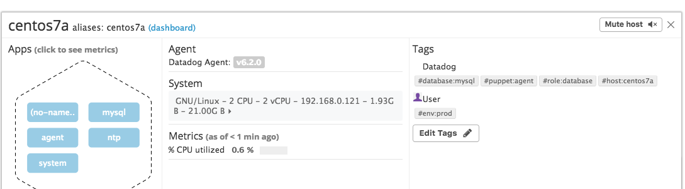
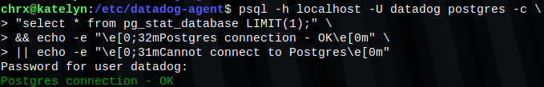
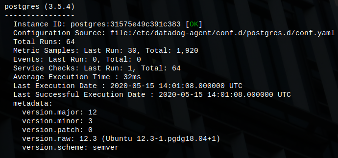
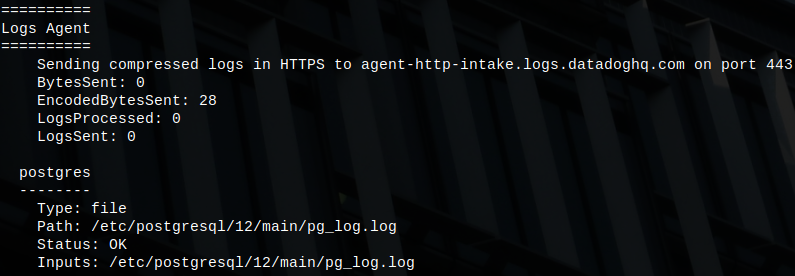
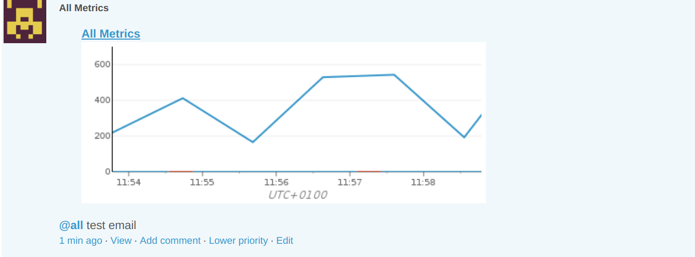
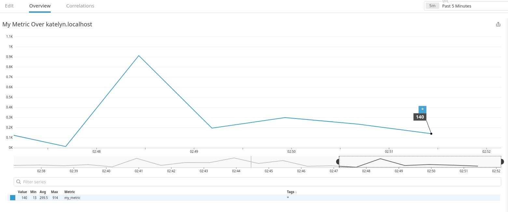
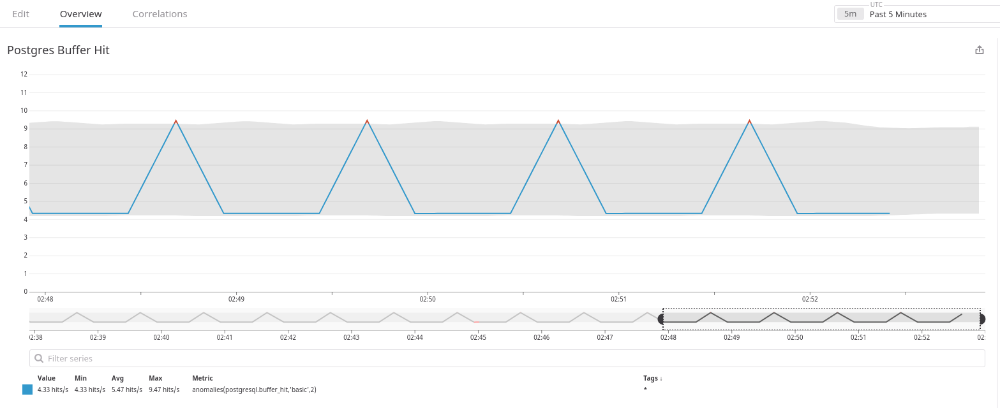
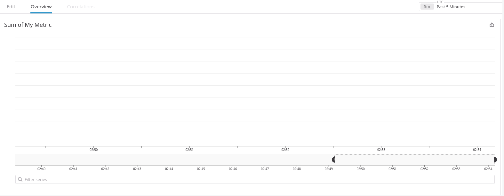
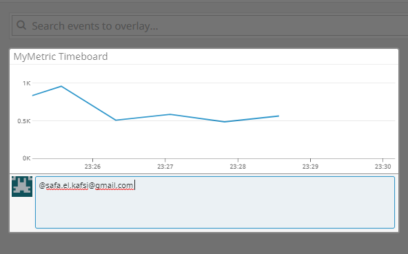
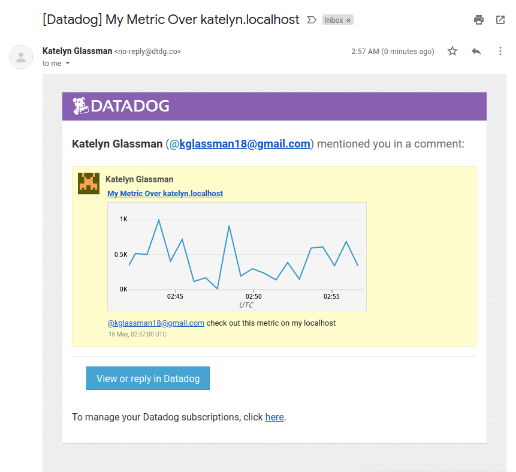

# Prerequisites

To begin this exercise, I had to choose an appropriate environment to model Datadog’s functionality that's feasible within the confines of my Chromebook running ChromeOS. I opted to dual-boot my machine to run [GalliumOS](https://galliumos.org/), a lightweight Linux distribution based on Xubuntu, partitioned alongside the ChromeOS. From my new VM, I was easily able to sign up for Datadog and begin running the agent.  

# Collecting Metrics 
Next, I added the below tags into the tags section of my agent configuration file to add some more details on my machine.

```
## @param tags  - list of key:value elements - optional
#
tags:
   - environment:dev
   - chassis:desktop
   - os:galliumos3.1
   - kernel:linux4.16.18
```

Here is my host, named `katelyn.localhost`, and its tags, shown bottom right, on the Host Map page in Datadog.



Then I opted to download a PostgreSQL database on my machine and install the corresponding Datadog integration to begin collecting those metrics and logs.  After creating user `datadog` and granting the role `pg_monitor` to that user,  here is a verification of the correct permissioning on my PostgreSQL database:



To make this integration more meaningful, I wanted to allow for metric collection and log integration.  To do so, I altered my `postgres.d/conf.yaml` configuration file to point to my host/port and to configure logging, shown here: 
```
instances:

    ## @param host - string - required
    ## The hostname to connect to.
    #
  - host: katelyn.localhost

    ## @param port - integer - required
    ## Port to use when connecting to PostgreSQL.
    #
    port: 5432

    ## @param user - string - required
    ## Datadog Username created to connect to PostgreSQL.
    #
    username: datadog

    ## @param pass - string - required
    ## Password associated with the Datadog user.
    #
    password: *******

    ## @param dbname - string - optional - default: postgres
    ## Name of the PostgresSQL database to monitor.
    #
    dbname: datadog
```
```
logs:
 - type: file
   path: "/etc/postgresql/12/main/pg_log.log"
   source: postgresql
   service: pslogservice
```

and altered my machine's `postgresql.conf` file to configure logging, shown here:

```
logging_collector = on                          # Enable capturing of stderr and csvlog
                                                # into log files. Required to be on for
                                                # csvlogs.
                                                # (change requires restart)

# These are only used if logging_collector is on:
log_directory = 'pg_log'                        # directory where log files are written,
                                                # can be absolute or relative to PGDATA
log_filename = 'pg.log'                         # log file name pattern,
                                                # can include strftime() escapes
log_file_mode = 0644                            # creation mode for log files
```

After a quick change to `logs_enabled: true` in my Datadog agent configuration file, my setup was ready to begin log collection. 

The output of a call to `sudo datadog-agent status`, shown below, verifies that the PostgreSQL integration and logging is functioning.  





Click [here](https://github.com/kmglassman/hiring-engineers/blob/kmglassman-answers-test/conf-files/postgres.d_conf.yaml) for my full `postgres.d/conf.yaml` file and [here](https://github.com/kmglassman/hiring-engineers/blob/kmglassman-answers-test/conf-files/postgresql.conf) for my full `postgresql.conf` file.  

I then introduced my own metric to begin tracking over my host.  I created a new check called `custom_check` from the script `custom_check.py`, which can be found [here](https://github.com/kmglassman/hiring-engineers/blob/kmglassman-answers-test/scripts/custom_check.py).  To change the check's collection interval without modifing this Python file, I altered the check configuration file, `custom_check.yaml`, as shown below:
```
init_config:

instances:
  - min_collection_interval: 45
```

Now, my check is up and running as expected, submitting a random value between 0 and 1000 every 45 seconds.  

# Visualizing Data

Next, I used the Datadog API to generate some visualizations in the form of a Timeboard.  The script I used can be found [here](https://github.com/kmglassman/hiring-engineers/blob/kmglassman-answers-test/scripts/timeboard.py).  Some highlights of the script:
* I set the paremeters for my three timeseries visualizations each within the `widgets` parameter.
* I prompt for a title and a description of the Timeboard to be created.
* I then pass my API key and app key and make the connection.

Voila! Here is the view of my new timeboard, Katelyn's Timeboard, upon creation with this script:



Here are each of my visuals after I set the timeframe to the last 5 minutes.

My custom metric scoped over katelyn.localhost:

My Postgres buffer hit:

And the sum of my custom metric in buckets of one hour, which does not appear an informative visual at this timeframe:


I took a snapshot of my virst visual here and wrote a notification for myself:


And confirmed receipt to my Gmail:



