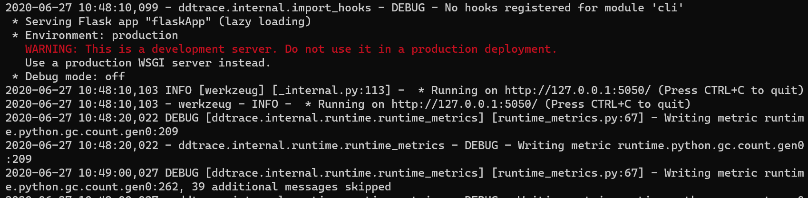
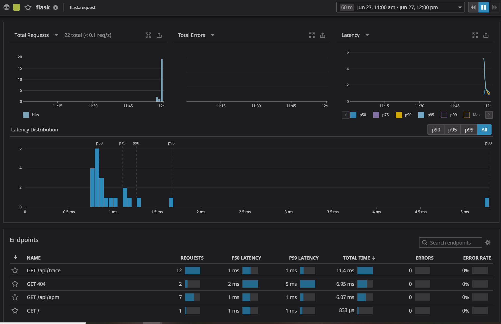
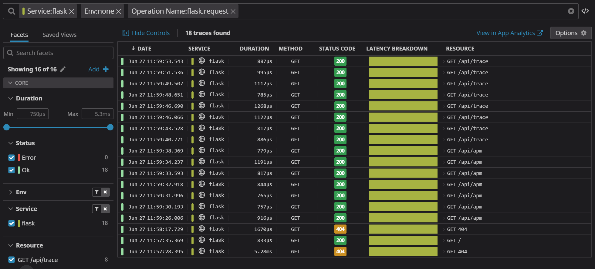
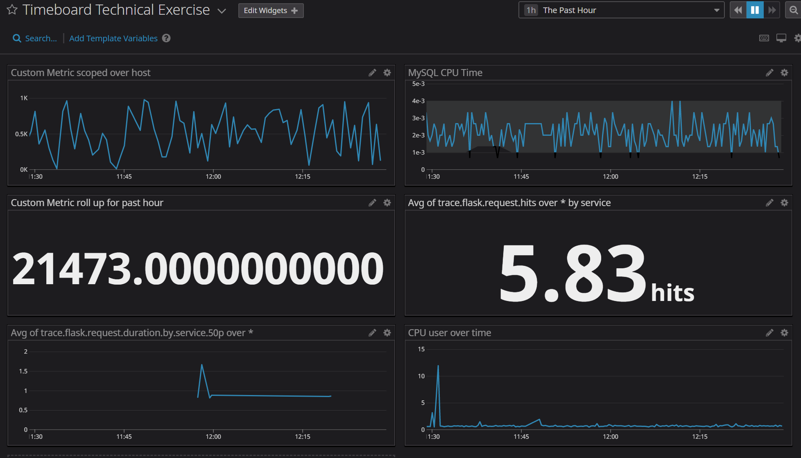

```       
       .-'`   `'-.
   _,.'.===   ===.'.,_
  / /  .___. .___.  \ \
 / /   ( o ) ( o )   \ \                                            _
: /|    '-'___'-'    |\ ;                                          (_)
| |`\_,.-'`   `"-.,_/'| |                                          /|
| |  \             /  | |                                         /\;
| |   \           /   | | _                              ___     /\/
| |    \   __    /\   | |' `\-.-.-.-.-.-.-.-.-.-.-.-.-./`   `"-,/\/ 
| |     \ (__)  /\ `-'| |    `\ \ \ \ \ \ \ \ \ \ \ \ \`\       \/
| |      \-...-/  `-,_| |      \`\ \ \ \ \ \ \ \ \ \ \ \ \       \
| |       '---'    /  | |       | | | | | | | | | | | | | |       |
| |               |   | |       |    Datadog - Mihai    | |       |
\_/               |   \_/       | | | | | | | | | | | | | | .--.  ;
                  |       .--.  | | | | | | | | | | | | | | |  | /
                   \      |  | / / / / / / / / / / / / / /  |  |/
                   |`-.___|  |/-'-'-'-'-'-'-'-'-'-'-'-'-'`--|  |
            ,.-----'~~;   |  |                  (_(_(______)|  |
           (_(_(_______)  |  |                         ,-----`~~~\
                    ,-----`~~~\                      (_(_(_______)
                   (_(_(_______)

```
# Prerequisites - Setting up the environment

- [x] Spinned up an Azure Ubuntu VM and connected to it.


- [x] Installed the Datadog agent


# Collecting Metrics

- [x] Edited the datadog.yaml file, added the tags, restarted the Datadog Agent.


- [x] Installed the MySQL database on the VM, created the datadog database user and gave it the necessary rights according to this integration documentation: https://docs.datadoghq.com/integrations/mysql/ Created a conf.yaml file and updated the necessary configurations. Restarted the MySQL database and the Datadog agent to enable MySQL monitoring.


- [x] Created a file in conf.d folder named my_metrics.yaml


- [x] Created a file in checks.d folder named my_metrics.py and added the following code as suggested here: https://docs.datadoghq.com/developers/write_agent_check/?tab=agentv6v7


- [x] Restarted the agent after which it was possible to monitor 'my_metrics' using either 'sudo service datadog-agent status' or the Metrics Explorer:


- [x] Updated the collection interval in the 'my_metrics.yaml' file to submit the metrics once every 45 seconds: 


**Bonus question**: Yes, it is possible to modify the collection interval without modifying the Python file by modifying the configuration file as it was executed above. It's also possible to modify the collection interval using the UI.

# Visualizing Data:

- [x] Created an API and Application key through the Datadog portal and wrote a script that collected the following metrics:
* Custom metric from the exercise earlier
* Percentage of CPU time spent in user space by MySQL annomalies
* Custom metric's roll up for the past hour


```
from datadog import initialize, api

options = {
    'api_key': '67923c3202becb1bf292d7055535373f',
    'app_key': 'd0acbe013adbcb3a5d416a623a983abd9cc6cc73',
    'api_host': 'https://api.datadoghq.eu'
}

initialize(**options)

title = 'Timeboard Technical Exercise'
widgets = [{
    'definition': {
        'type': 'timeseries',
        'requests': [
            {'q': 'avg:my_metrics{host:datadogmain}'}
        ],
        'title': 'Custom Metric scoped over host'
    }
},

{
    'definition': {
        'type': 'timeseries',
        'requests': [
            {'q': "anomalies(avg:mysql.performance.user_time{host:datadogmain}, 'basic', 3)"}
        ],
        'title': 'MySQL CPU Time'
    }
},

{
    'definition': {
        'type': 'query_value',
        'requests': [
            {'q': 'avg:my_metrics{host:datadogmain}.rollup(sum,3600)'}
        ],
        'title': 'Custom Metric roll up for past hour'
    }
}


]


layout_type = 'ordered'
description = 'A dashboard with memory info.'
is_read_only = True
notify_list = ['user@domain.com']


api.Dashboard.create(title=title,
                     widgets=widgets,
                     layout_type=layout_type,
                     description=description,
                     is_read_only=is_read_only,
                     notify_list=notify_list)
```
- [x] Executed the Python script:


- [x] The new dashboard appeared in the list:


- [x] Set the Timeboard's timeframe to the past 5 minutes:


- [x] Took a snapshot of the graph and annotated myself


**The Dashboard can be visualised here**: https://p.datadoghq.eu/sb/9fytqflfopx31kcm-6ff4e2824402fe5b64a8640310f3f40b

**Bonus question**: The Anomaly graph leverages the anomaly detection algorithm which determines when a metric behaves differently compared to the past. In the context of this exercise, the anomaly graph was applied to the percentage of CPU time spent in user space by MySQL and it allows to monitor anomalies within the boundary that I set (3). Any behaviour that doesn't align with the usual patterns will be highlighted to me.

# Monitoring Data:

- [x] Created a New Monitor that monitors the custom metric 'my_metrics' with the following settings:
* Warning threshold of 500
* Alerting threshold of 800
* And also ensured that it will notify me if there is No Data for this query over the past 10 minutes.


- [x] Configured monitor's message so it will:
* Send me an email whenever the monitor triggers.
* Create different messages based on whether the monitor is in an Alert, Warning, or No Data state.
* Included the metric value that caused the monitor to trigger and host IP when the Monitor triggers an Alert state.


**Bonus question**: Set up two scheduled downtimes for this monitor:

* One that silences it from 7pm to 9am daily on M-F


* And one that silences it all day on Sat-Sun.


* Email downtime notification (please igonore the difference in time compared to the screenshot above, I am currently in a different timezone):


# Collecting APM Data:

- [x] PIP Installed Flask and DDTrace on the VM, configured datadog.yaml to enable APM collection. Updated the host in the Flask app code and executed it using ddtrace command (couldn't install DDTrace without updating Cython and Python tools first):

```
from flask import Flask
import logging
import sys

# Have flask use stdout as the logger
main_logger = logging.getLogger()
main_logger.setLevel(logging.DEBUG)
c = logging.StreamHandler(sys.stdout)
formatter = logging.Formatter('%(asctime)s - %(name)s - %(levelname)s - %(message)s')
c.setFormatter(formatter)
main_logger.addHandler(c)

app = Flask(__name__)

@app.route('/')
def api_entry():
    return 'Entrypoint to the Application'

@app.route('/api/apm')
def apm_endpoint():
    return 'Getting APM Started'

@app.route('/api/trace')
def trace_endpoint():
    return 'Posting Traces'

if __name__ == '__main__':
    app.run(host='127.0.0.1', port='5050')
```



- [x] Hit the API endpoint a few times using curl and generated some access data. Upon opening the APM section in the Datadog portal, the Services and Traces pages were populated:





- [x] APM and Infrastructure Metrics in one Timeboard:



**The Dashboard can be visualised here**: https://p.datadoghq.eu/sb/9fytqflfopx31kcm-6ff4e2824402fe5b64a8640310f3f40b

**Bonus question**: 

A service represents a set of processes that do the same job - such as a web framework or database (source: https://docs.datadoghq.com/tracing/visualization/service/)

Whilst a resource is a particular action for a given service, usually an individual endpoint or query (source: https://docs.datadoghq.com/tracing/visualization/resource/)

In the context of this exercise, an example of a service is the flask app from above which sends traces to Datadog APM whilst a resource is an API endpoint such as api/apm.

# Final Question:

- [x] Scenario #1: Sustainability Metrics

Datadog can be leveraged in a way that would allow organisations to make sustainability conscious decisions and reduce their carbon footprint. For example, companies already use Datadog to collect metrics from across different cloud providers such as AWS, Azure and GCP - this cloud consumption data can be used in order to create a custom metric that would measure scope 3 type carbon emissions which are the responsibility of the company that uses the cloud service. Scope 3 emissions are indirect activities from outside the company which aren't under control of the cloud provider such as the internet service provider broadband and it's the type of emissions that could be reduced by the company using the cloud service.

In order to make this possible, a Datadog integration can be created with the Microsoft Sustainability Calculator (https://appsource.microsoft.com/en-us/product/power-bi/coi-sustainability.sustainability_dashboard) which quantifies the carbon impact of each Azure subscription over a period of time and its datacenters. As a result, the Azure metrics collected in Datadog could be used to create a dashboard and monitor which would track the carbon emissions and how successful the decarbonization efforts are. A similar Business Intelligence tool can be created to gather AWS and GCP data where Datadog in turn can provide tracking information for the carbon footprint.


- [x] Scenario #2: Cattle Health Monitoring

The Datadog Agent is lightweight which means that it could be installed across most hardware platforms, in addition Datadog allows cost efficiency at scale through Logging without Limits that enables companies with large device fleets to take advantage of the reduced cost. Particular emphasis can be put on farms that use IoT devices to monitor their animals such as Japanese farmers with wagyu cattle. The wagyu cows wear collars which monitor for how long a cow is lying, standing, how much they're drinking and how often they're eating. This data can be collected in a Datadog Dashboard where each individual cow can be displayed as a host and custom monitoring metrics can be assigned for health analysis purposes such as body mass index - farmers can be alerted if cows reach fat levels which are too low or too high or anomalies algorithm can be applied to track cow behaviour that doesn't align with the usual patterns.
