<html>

<head>
<meta http-equiv=Content-Type content="text/html; charset=shift_jis">
<meta name=Generator content="Microsoft Word 14 (filtered)">

</head>

<body bgcolor=white lang=JA link=navy vlink=maroon style='line-break:strict'>

<h3>Level 0
(optional) - Setup an Ubuntu VM</h3>

&nbsp;

<b>Answer/Step
Performed:</b>

&nbsp;

-&nbsp;&nbsp;&nbsp;&nbsp;&nbsp;&nbsp;
A
Ubuntu instance has been created from AWS using Free Tier:

&nbsp;

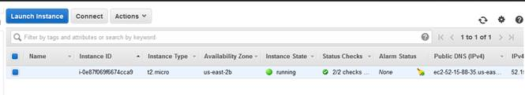 

-&nbsp;&nbsp;&nbsp;&nbsp;&nbsp;&nbsp;
Verified
that I'm able to login using putty

&nbsp;

&nbsp;

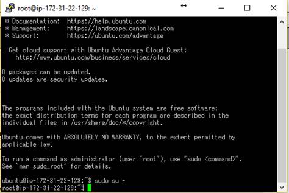 

<h3>Level 1 -
Collecting your Data</h3>

&middot;&nbsp;&nbsp;&nbsp;&nbsp;&nbsp;
Sign up
for Datadog (use &quot;Datadog Recruiting Candidate&quot; in the
&quot;Company&quot; field), get the Agent reporting metrics from your local
machine. 

&nbsp;

<b>Answer/Step Performed: </b>

<b>&nbsp;</b>

-&nbsp;&nbsp;&nbsp;&nbsp;&nbsp;&nbsp;
Registered
with Datadog:

&nbsp;

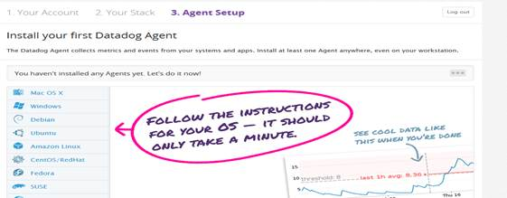 
&nbsp;

&nbsp;

-&nbsp;&nbsp;&nbsp;&nbsp;&nbsp;&nbsp;
Installed
agent using command:

DD_API_KEY=3ef3530e6f6685bc45562e92f4927545
bash -c &quot;$(curl -L <a
href="https://raw.githubusercontent.com/DataDog/dd-agent/master/packaging/datadog-agent/source/install_agent.sh">https://raw.githubusercontent.com/DataDog/dd-agent/master/packaging/datadog-agent/source/install_agent.sh</a>)&quot;

&nbsp;

-&nbsp;&nbsp;&nbsp;&nbsp;&nbsp;&nbsp;
Verified
that Agent is successfully installed:

&nbsp;

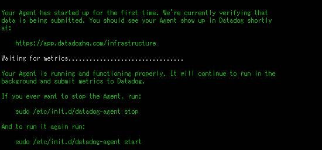 

&nbsp;

&middot;&nbsp;&nbsp;&nbsp;&nbsp;&nbsp;
Bonus
question: In your own words, what is the Agent? 

&nbsp;

<b>Answer/Step Performed: </b>

<b>&nbsp;</b>

-&nbsp;&nbsp;&nbsp;&nbsp;&nbsp;&nbsp;
Monitoring
agents are a type of agent software that observes and reports on computer
equipment or hosts. Monitoring agents are often used to monitor complex
computer networks to predict when a crash or some other defect may occur.

&nbsp;

-&nbsp;&nbsp;&nbsp;&nbsp;&nbsp;&nbsp;
For the
Context of Datadog, Agent is a piece of software that runs on the target
monitoring host, which collect events and metrics and send it to the main
server, which is able to analyze the collected data.

&nbsp;

-&nbsp;&nbsp;&nbsp;&nbsp;&nbsp;&nbsp;
&nbsp;

&middot;&nbsp;&nbsp;&nbsp;&nbsp;&nbsp;
Add
tags in the Agent config file and show us a screenshot of your host and its
tags on the Host Map page in Datadog. 

&nbsp;

<b>Answer/Steps performed:</b>

&nbsp;

-&nbsp;&nbsp;&nbsp;&nbsp;&nbsp;&nbsp;
Added
tags below in file: 

<table cellpadding=0 cellspacing=0>
 <tr>
  <td width=50 height=0></td>
 </tr>
 <tr>
  <td></td>
  <td></td>
 </tr>
</table>

 
/etc/dd-agent/datadog.conf 

&nbsp;

-&nbsp;&nbsp;&nbsp;&nbsp;&nbsp;&nbsp;
Restarted
the Agent: sudo /etc/init.d/datadog-agent restart

&nbsp;

-&nbsp;&nbsp;&nbsp;&nbsp;&nbsp;&nbsp;
Verified that the instanced appeared in
Host Map page in Datadog:

&nbsp;

https://app.datadoghq.com/infrastructure/map?fillby=avg%3Acpuutilization&amp;sizeby=avg%3Anometric&amp;groupby=none&amp;nameby=name&amp;nometrichosts=false&amp;tvMode=false&amp;nogrouphosts=false&amp;palette=green_to_orange&amp;paletteflip=false&amp;host=342212537

&nbsp;

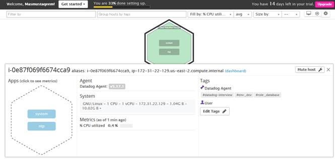 

&nbsp;

&middot;&nbsp;&nbsp;&nbsp;&nbsp;&nbsp;
Install
a database on your machine (MongoDB, MySQL, or PostgreSQL) and then install the
respective Datadog integration for that database. 

&nbsp;

Answer/Steps performed:

-I have chosen MySQL and
executed below command to install:

sudo apt-get update

sudo apt-get install mysql-server

sudo mysql_secure_installation

&nbsp;

-&nbsp;&nbsp;&nbsp;&nbsp;&nbsp;&nbsp;
Once
installed, MySQL has been started with below command:

sudo systemctl start mysql

&nbsp;

-&nbsp;&nbsp;&nbsp;&nbsp;&nbsp;&nbsp;
In
order to integrate MySQL with Datadog, below steps was performed:

&nbsp;

Run command:

sudo mysql -u root -p -e &quot;CREATE
USER 'datadog'@'localhost' IDENTIFIED BY 'password';&quot;

sudo mysql -u root -p -e &quot;GRANT
REPLICATION CLIENT ON *.* TO 'datadog'@'localhost' WITH MAX_USER_CONNECTIONS
5;&quot;

&nbsp;

sudo mysql -u root -p -e &quot;GRANT
PROCESS ON *.* TO 'datadog'@'localhost';&quot;

sudo mysql -u root -p -e &quot;GRANT
SELECT ON performance_schema.* TO 'datadog'@'localhost';&quot;

&nbsp;

-&nbsp;&nbsp;&nbsp;&nbsp;&nbsp;&nbsp;
Password
has been edited in mysql.yaml config file in conf.d folder of Datadog Agent

&nbsp;

-&nbsp;&nbsp;&nbsp;&nbsp;&nbsp;&nbsp; Restarted the agent:

sudo
/etc/init.d/datadog-agent restart

&nbsp;

-&nbsp;&nbsp;&nbsp;&nbsp;&nbsp;&nbsp; Check
the info command:

sudo /etc/init.d/datadog-agent
info

&nbsp;

-&nbsp;&nbsp;&nbsp;&nbsp;&nbsp;&nbsp; Verified
that MySQL matrices are collected as
below:

&nbsp;

&nbsp;

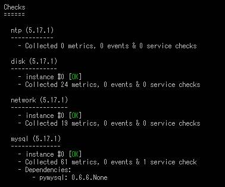 

&nbsp;

&middot;&nbsp;&nbsp;&nbsp;&nbsp;&nbsp;
Write a
custom Agent check that samples a random value. Call this new metric: test.support.random 

&nbsp;

<b>Answer/Steps performed:</b>

<b>&nbsp;</b>

-&nbsp;&nbsp;&nbsp;&nbsp;&nbsp;&nbsp;
Created
file called random-val.yaml in /etc/dd-agent/conf.d

&nbsp;

Code:

&nbsp;

 

-&nbsp;&nbsp;&nbsp;&nbsp;&nbsp;&nbsp;
Created
file called random-val.py in /etc/dd-agent/check.d

&nbsp;

Code:

&nbsp;

&nbsp;

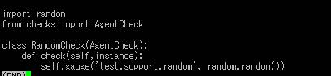 

-&nbsp;&nbsp;&nbsp;&nbsp;&nbsp;&nbsp;
Verified
that the the Random Checks is listed in info

&nbsp;

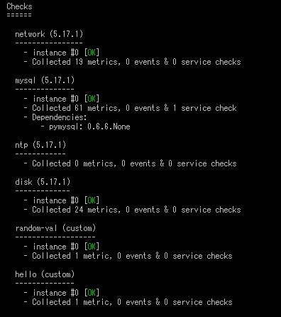 

<h3 style='margin-top:0mm;margin-right:0mm;margin-bottom:0mm;margin-left:36.0pt;
margin-bottom:.0001pt'>Level
2 - Visualizing your Data</h3>

&middot;&nbsp;&nbsp;&nbsp;&nbsp;&nbsp;
Since
your database integration is reporting now, clone your database integration
dashboard and add additional database metrics to it as well as your test.support.random metric from the custom
Agent check. 

&nbsp;

<b>Answer/Steps performed:</b>

<b>&nbsp;</b>

-&nbsp;&nbsp;&nbsp;&nbsp;&nbsp;&nbsp;
Cloned
as below:

-&nbsp;&nbsp;&nbsp;&nbsp;&nbsp;&nbsp;
&nbsp;

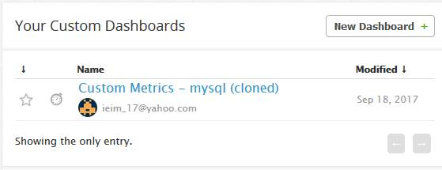 

URL: <a
href="https://app.datadoghq.com/dash/359676/custom-metrics---mysql-cloned?live=true&amp;page=0&amp;is_auto=false&amp;from_ts=1505739311344&amp;to_ts=1505742911344&amp;tile_size=m">https://app.datadoghq.com/dash/359676/custom-metrics---mysql-cloned?live=true&amp;page=0&amp;is_auto=false&amp;from_ts=1505739311344&amp;to_ts=1505742911344&amp;tile_size=m</a>

&nbsp;

-&nbsp;&nbsp;&nbsp;&nbsp;&nbsp;&nbsp;
Added
database metrics as well as test.random.metric:

&nbsp;

&nbsp;

&middot;&nbsp;&nbsp;&nbsp;&nbsp;&nbsp;
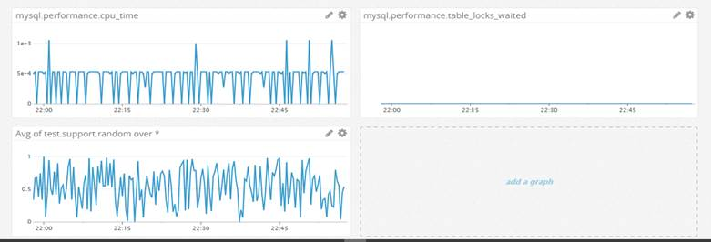 
Bonus question: What
is the difference between a timeboard and a screenboard? 

&nbsp;

<b>Answer/Steps performed:</b>

<b>&nbsp;</b>

TimeBoards

&nbsp;

&nbsp;&nbsp;&nbsp; All
graphs are always scoped to the same time:

&nbsp;

&nbsp;&nbsp;&nbsp; Graphs
will always appear in a grid-like fashion. This makes them generally better for
troubleshooting and correlation. Graphs from a TimeBoard can be shared
individually

&nbsp;

ScreenBoards 

&nbsp;

&nbsp;&nbsp;&nbsp; These
are flexible, far more customizable and are great for getting a high-level look
into a system. They are created with drag-and-drop widgets, which can each have
a different time frame.

&nbsp;&nbsp;&nbsp;
ScreenBoards can be shared as a whole live and as a read-only entity, whereas
TimeBoards cannot

&nbsp;

&middot;&nbsp;&nbsp;&nbsp;&nbsp;&nbsp;
Take a
snapshot of your test.support.random graph and draw a box
around a section that shows it going above 0.90. Make sure this snapshot is
sent to your email by using the @notification 

<b>&nbsp;</b>

<b>Answer/Steps performed:</b>

&nbsp;

-&nbsp;&nbsp;&nbsp;&nbsp;&nbsp;&nbsp;
A marker
has been added to show y equal or greater than 0.9:

&nbsp;

-&nbsp;&nbsp;&nbsp;&nbsp;&nbsp;&nbsp;
From
the screenshot function, a rectangle has been drawn to show the area
corresponding to value above 0.9 and notification is sent to user’s email as
below:

&nbsp;

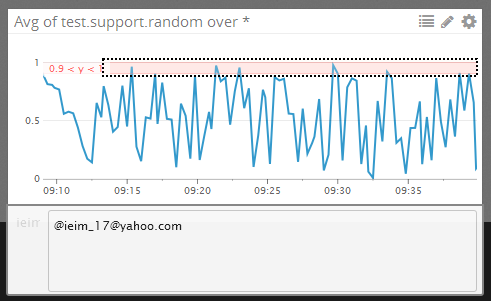

&nbsp;

<h3 style='margin-left:48.0pt'>Level
3 - Alerting on your Data</h3>

Since you've
already caught your test metric going above 0.90 once, you don't want to have
to continually watch this dashboard to be alerted when it goes above 0.90
again. So let's make life easier by creating a monitor.

<ul type=disc>
 <li class=MsoNormal>Set
     up a monitor on this metric that alerts you when it goes above 0.90 at
     least once during the last 5 minutes</li>
</ul>

<b>Answer/Steps
performed:</b>

-&nbsp;&nbsp;&nbsp;&nbsp;&nbsp;&nbsp;
An
alert has been configured as below:

&nbsp;

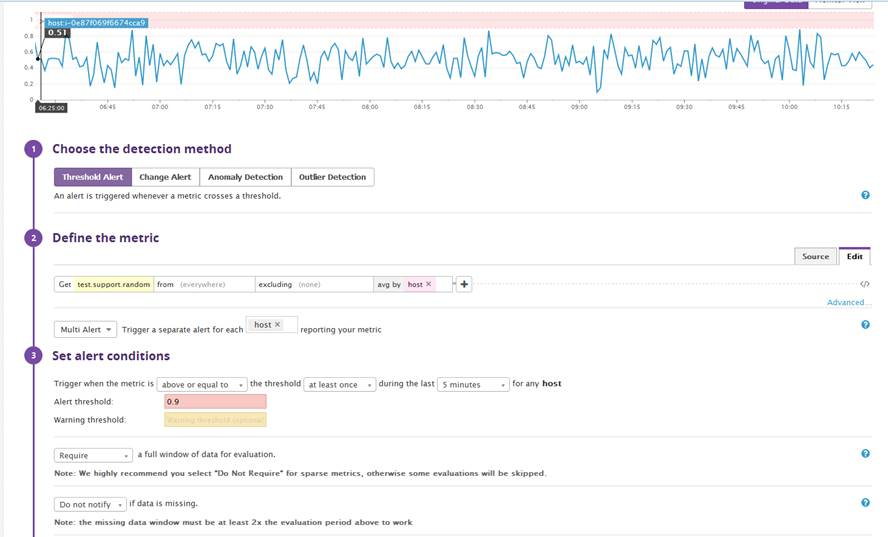

&nbsp;

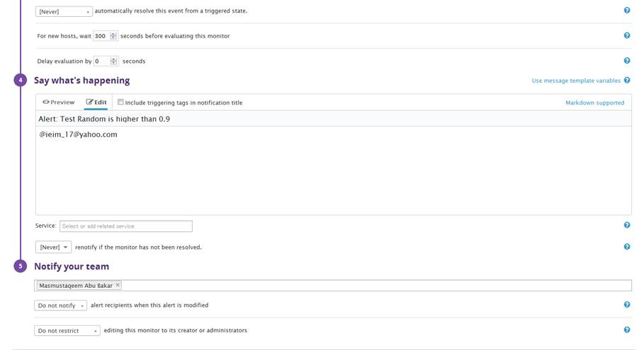

&nbsp;

<ul type=disc>
 <li class=MsoNormal>Bonus
     points: Make it a multi-alert by host so that you won't have to recreate
     it if your infrastructure scales up.</li>
</ul>

&nbsp;

<b>Answer/Steps
performed:</b>

-&nbsp;&nbsp;&nbsp;&nbsp;&nbsp;&nbsp;
Multi-alert
configured as below:

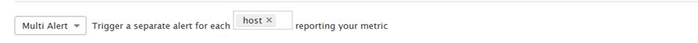

<ul type=disc>
 <li class=MsoNormal>Give
     it a descriptive monitor name and message (it might be worth it to include
     the link to your previously created dashboard in the message). Make sure
     that the monitor will notify you via email.</li>
</ul>

&nbsp;

<b>Answer/Steps
performed:</b>

<b>&nbsp;</b>

-&nbsp;&nbsp;&nbsp;&nbsp;&nbsp;&nbsp;
Name
and message has been configured as below:

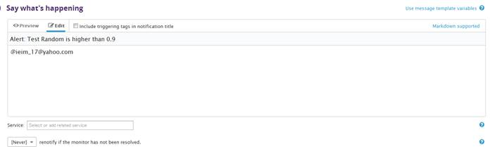

&nbsp;

&nbsp;

<ul type=disc>
 <li class=MsoNormal>This
     monitor should alert you within 15 minutes. So when it does, take a
     screenshot of the email that it sends you.</li>
</ul>

&nbsp;

<b>Answer/Steps
performed:</b>

<b>&nbsp;</b>

-&nbsp;&nbsp;&nbsp;&nbsp;&nbsp;&nbsp;
Verified
that E-mail is received once threshold is reached:

&nbsp;

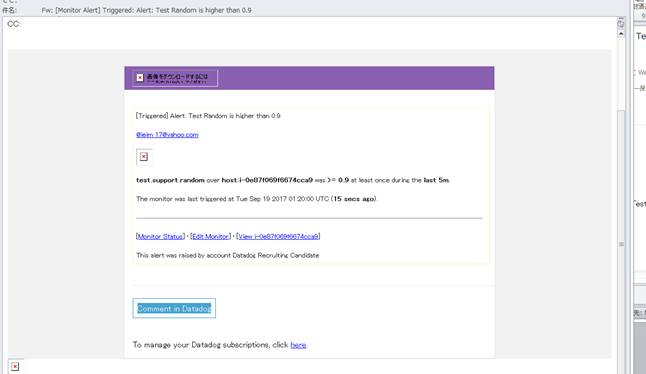

&nbsp;

<ul type=disc>
 <li class=MsoNormal>Bonus:
     Since this monitor is going to alert pretty often, you don't want to be
     alerted when you are out of the office. Set up a scheduled downtime for
     this monitor that silences it from 7pm to 9am daily. Make sure that your
     email is notified when you schedule the downtime and take a screenshot of
     that notification.</li>
</ul>

&nbsp;

<b>Answer/Steps
performed:</b>

<b>&nbsp;</b>

-&nbsp;&nbsp;&nbsp;&nbsp;&nbsp;&nbsp;
Downtime
has been scheduled as below from Monitors&agrave;Manage
Downtime:

&nbsp;

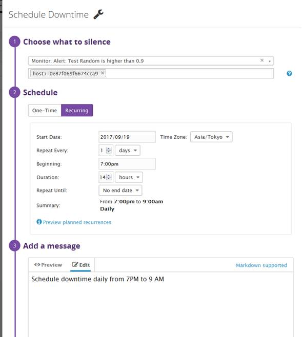

&nbsp;

</body>

</html>
