			

## The Exercise

**Antonio Farias - Datadog Recruiting Candidate**

Thank you for this opportunity! This was a fun way to learn about Datadog.

If any questions, do contact me at antonio0farias@gmail.com or (484) 326-6373.

I set up a Vagrant VM running Ubuntu 18.04 LTS 64-bit, and installed the Datadog  agent on it.

## Collecting Metrics:

After installing the agent on my host,
I installed tags in my `/etc/datadog-agent/datadog.yaml` file.
I added tags at the agent level, to reflect:
- a host name
- the dev environment
- device
- networking information (I added `host.name` and `host.ip` properties after the screenshot below was taken)
- a service level tag that I could use across resources and components. I made use of service level tags later on, to specify feature levels and to get a service map working.

Docs: https://docs.datadoghq.com/getting_started/tagging/
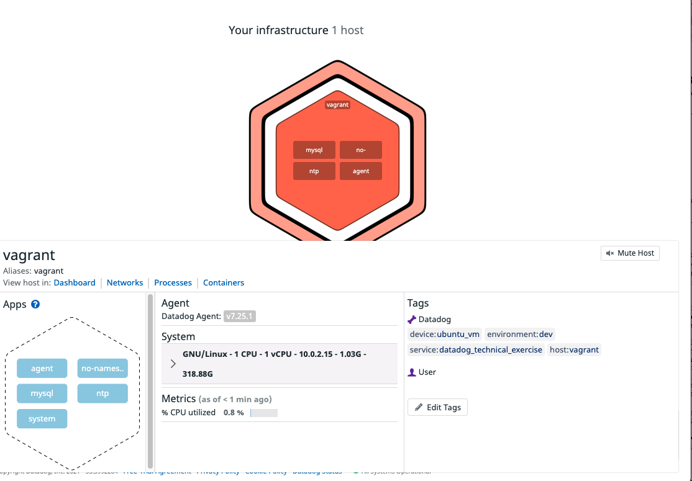

After that, I installed a MySQL database and checked that the Datadog integration was working correctly with the database, using <code>sudo service datadog status</code>.

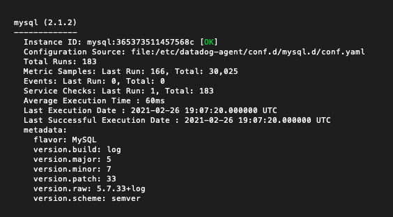

I tested a few inserts into a "pet" table I created, to double check that I could see some useful variables in a Datadog Dashboard - like in my MySQL row reads Timeboard below.

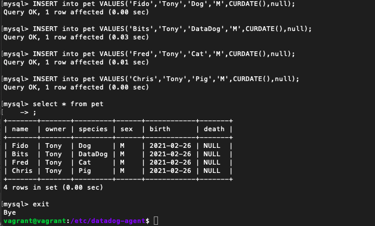

I then created a script to setup a custom metric called my_metric, outputting a random value between 0 and 1000. This can be set up by creating a custom script under `/etc/datadog-agent/checks.d/`. See my script below, also found under `supporting_code/custom_metric.py`.
Note that for configuration of the custom check, a yaml file with the same name must also be created under `/etc/datadog-agent/conf.d/custom_metric.yaml`.

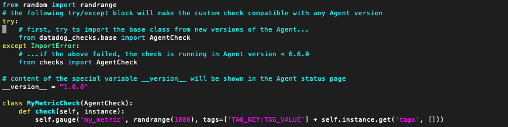

I then used the status check to verify that this custom_metric is being collected.

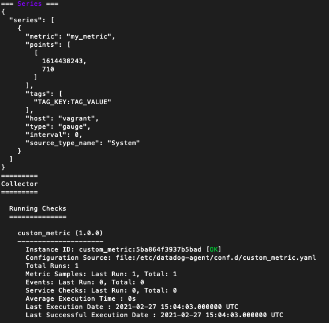

I decided to specify the custom collection interval directly in config, see below.

**Bonus Question:** Can you change the collection interval without modifying the Python check file you created?

Yes, this is specified at the instance level in `conf.d/custom_metric.yaml`. It can be specified as seen below.

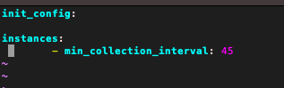

## Visualizing Data:

In the next step, I set up a Timeboard with three different widgets displayed below: 
-  my custom my_metric 
-  my reads from the MySQL database, which I can trigger using a select query
-  the sum of my_metric values, rolled into hourly buckets (a discrete roll-up, not a moving window rollup)

The script used to generate this Timeboard can be found under `supporting-code\createDatadogDashboard.py`.

**A note on using the script:** for passing variables where required into the monitoring  script, I used the python `decouple` library - simply create a `.env` file with the variables needed (API keys, passwords, etc).

From this code, we get the Timeboard below:
- https://p.datadoghq.com/sb/zihnin4jchh3f8ll-b67134136b85b549ceeaa18434445171

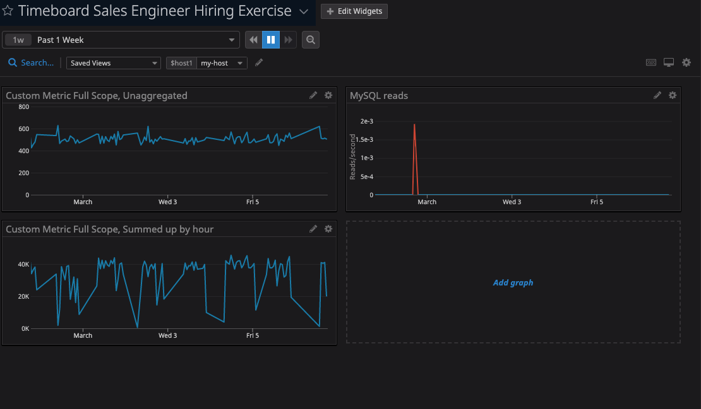

Here's a view of the Timeboard for 5 minutes duration (not on the hour, so a datapoint for the my_metric doesn't show):

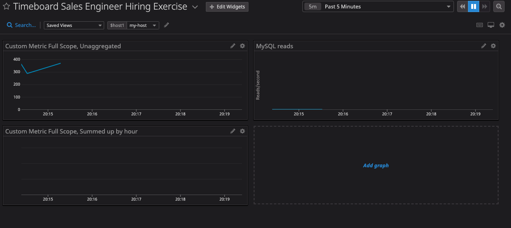

- https://docs.datadoghq.com/api/latest/dashboards/ 
There is a minor bug in the Python code example for the request API. There is a reference to saved_view, but the variable should be named saved_views. The example code in the docs errors out with `NameError: name 'saved_view' is not defined`
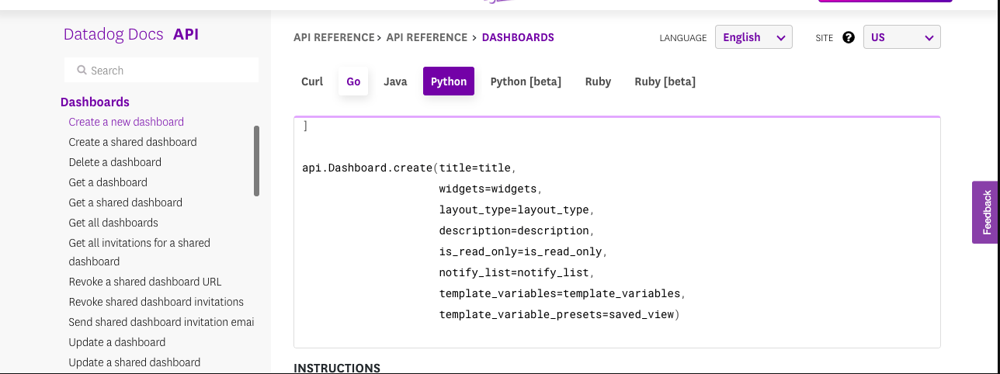

**Bonus Question**: What is the Anomaly graph displaying?

Per the Datadog docs, the anomaly function makes a forecast based on prior values of the time series (i.e., an ARIMA style forecast).

In my particular implementation, with the parameters I passed in, the anomaly function flags anything that is two standard deviations or more from the usual value of the timeseries.

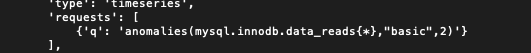

Since row reads for this DB are generally 0 (I requested reads only sporadically), values of a few reads per second show up as an anomaly.
Were this DB to start having a few reads per second more consistently, they would not show up as anomalies anymore (ie, the anomaly function adapts to the trend of the data patterns recently).

## Monitoring Data

I set up the notification using the Monitor UI, though I did see there was an API for it. Since it wasn't requested, and monitor setup is often one-off and custom,
the UI felt like a better way to do the job :).

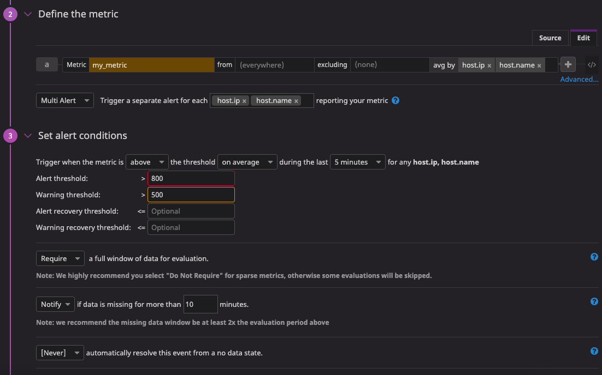
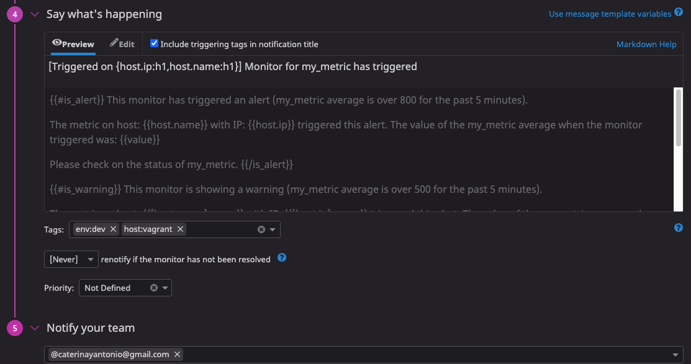

- Alert message
  - `{{#is_alert}}
This monitor has triggered an alert (my_metric average is over 800 for the past 5 minutes). 
The metric on host: {{host.name}} with IP: {{host.ip}} triggered this alert.
The value of the my_metric average when the monitor triggered was: {{value}}
Please check on the status of my_metric.
{{/is_alert}} `

- Warn message
  - `{{#is_warning}}
This monitor is showing a warning (my_metric average is over 500 for the past 5 minutes).
The metric on host:  {{[host.name].name}}   with IP: {{[host.ip].name}}  triggered this alert.
The value of the my_metric average when the monitor triggered was: {{value}}
No action needed at the moment.
{{/is_warning}}`

- No data message
  - `{{#is_no_data}}
This monitor has not received any data for the past 10 minutes. Please check on the status of {{[host.name].name}}, and on
the output of this metric.
{{/is_no_data}} `

Then I triggered the notifications for the three different notification types.
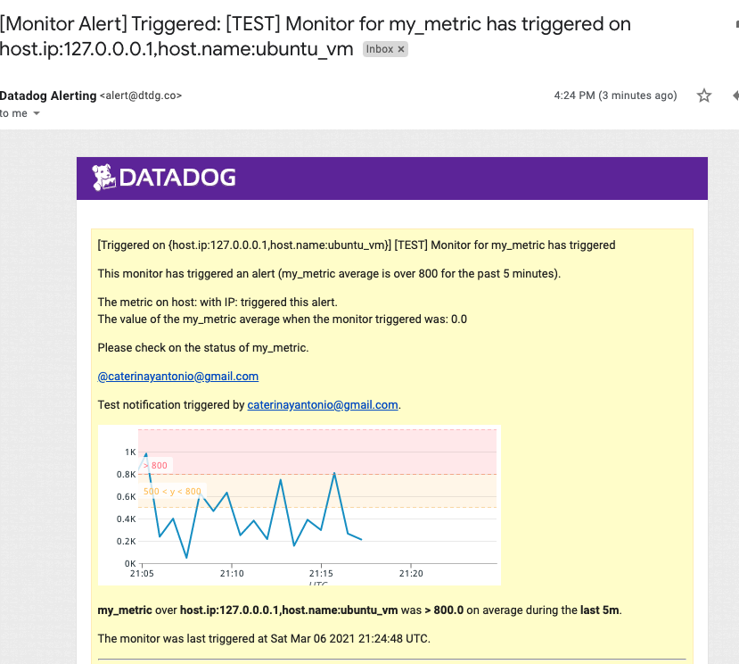
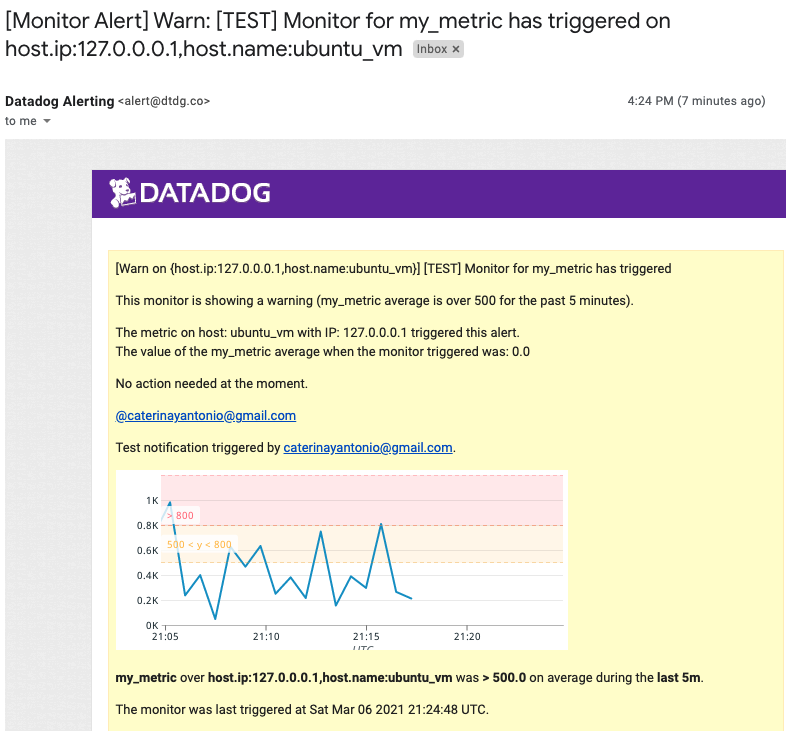

Later on, I recorded some examples of real, triggered notifications:

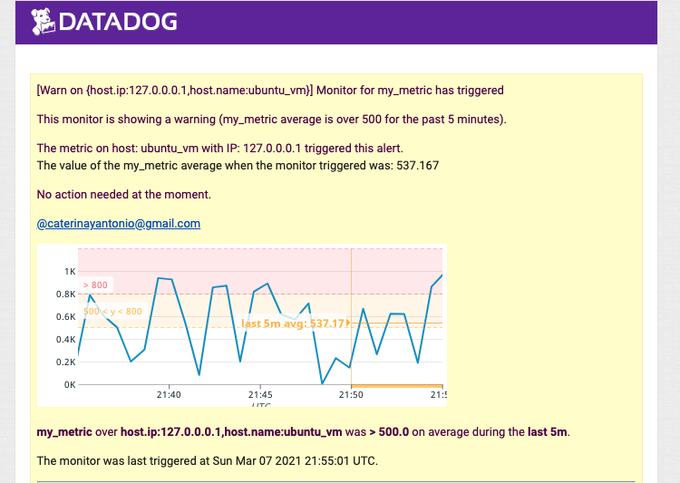
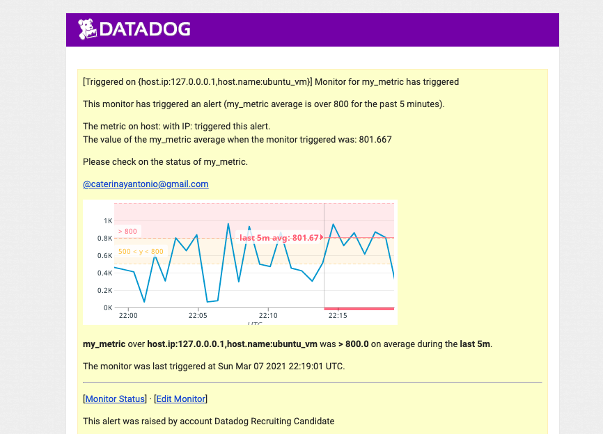

**Bonus Question**: Since this monitor is going to alert pretty often, you don’t want to be alerted when you are out of the office. Set up two scheduled downtimes for this monitor.

I set up both of these notifications and took the screenshots below:

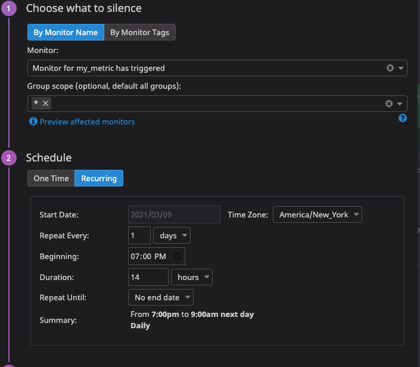
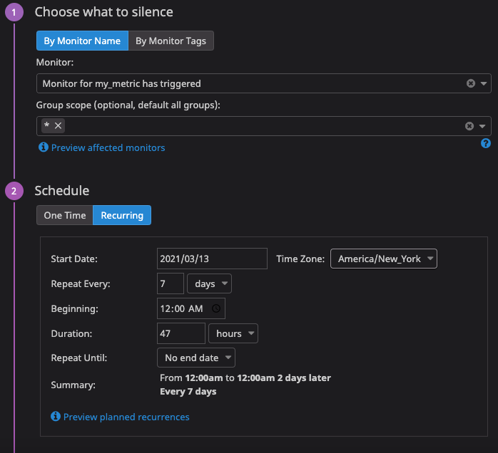

Which generated these notifications:

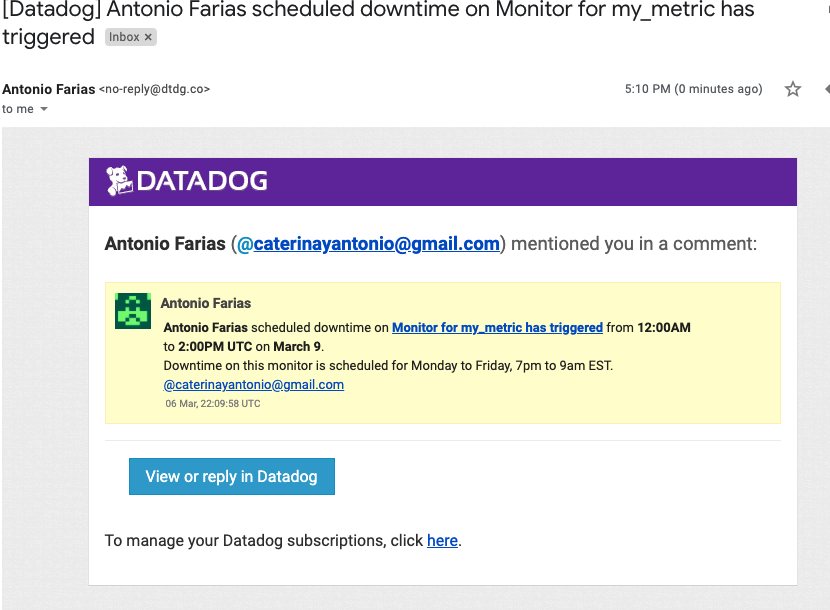
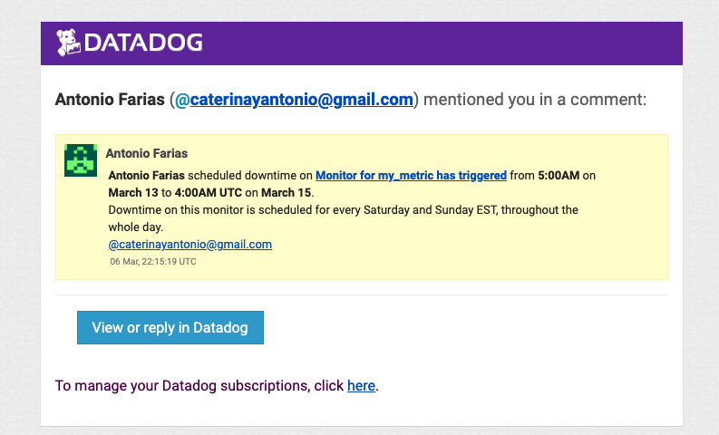

## Collecting APM Data:

Though I read about using the Python middleware API, I prefer to instrument automatically with ddtrace-run, which is how I would instrument something that was production-ready.

#### Running the script 

Make sure you use Python 3.6+ to run the below. The .env file used prior would also apply here.

The script is under `/supportingCode/apmApp.py` and was run using `DD_ENV="dev" DD_SERVICE="datadog_technical_exercise" DD_VERSION="1.0" DD_PROFILING_ENABLED=true DD_LOGS_INJECTION=true ddtrace-run python3 apmApp.py`.

To the Python script, I added an endpoint that makes a select query call to my earlier pet database table, in order to measure the performance of the database call and to play around with the Service Map feature.

The database endpoint can be accessed using the below:

`curl http://0.0.0.0:5050/api/db/getall `

I also added logging in the other endpoints that were provided, and a logger that sends logs to a tcp port. With this I could get my logs in Datadog.

In order to get this work, I had to enable logging at the agent level and set a `conf.d/python.d/conf.yaml` file as seen below:

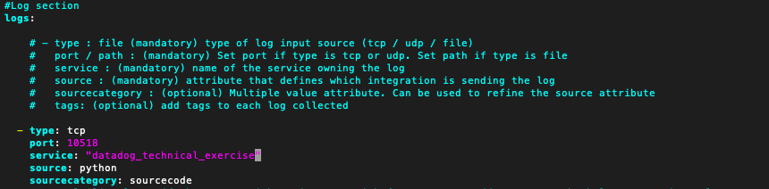

These are the endpoints that log out:

`curl http://0.0.0.0:5050/api/trace/ `

`curl http://0.0.0.0:5050/api/apm/ `

I hit the trace endpoint to generate the logs below:

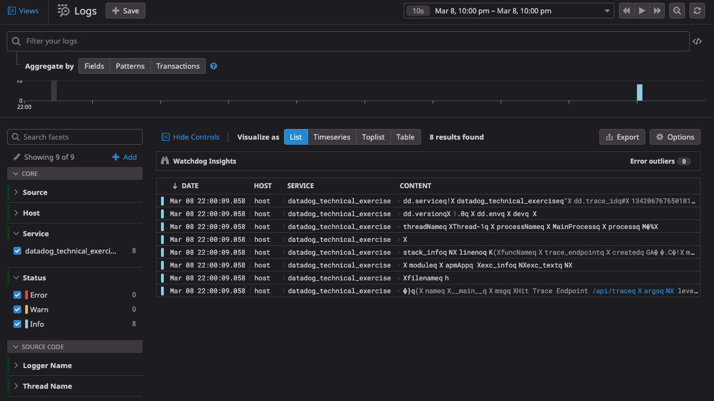

I also tagged my running flask server and the MySQL database (in its conf.d config file), in order to play around with the service map feature.
This allowed me to get a view of my test app, with the ability to drill down into the performance of individual resources. I included a view of this service map in the Dashboard I created. Note that I switched the service name from flask-exercise to datadog_technical_exercise, halfway through, in order to match my host service tag, for Infrastructure metrics.
 
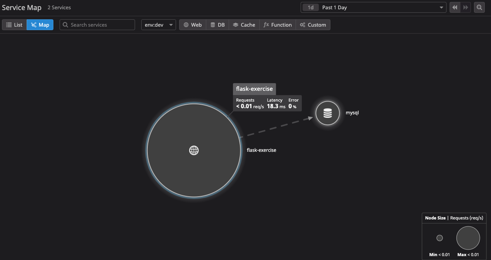

See below for a Dashboard of APM and Infrastructure metrics:

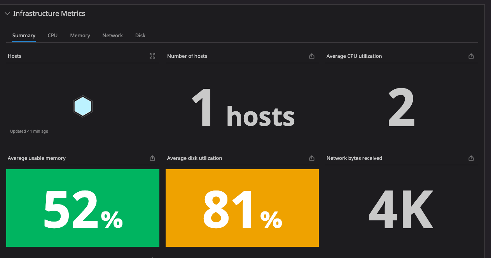
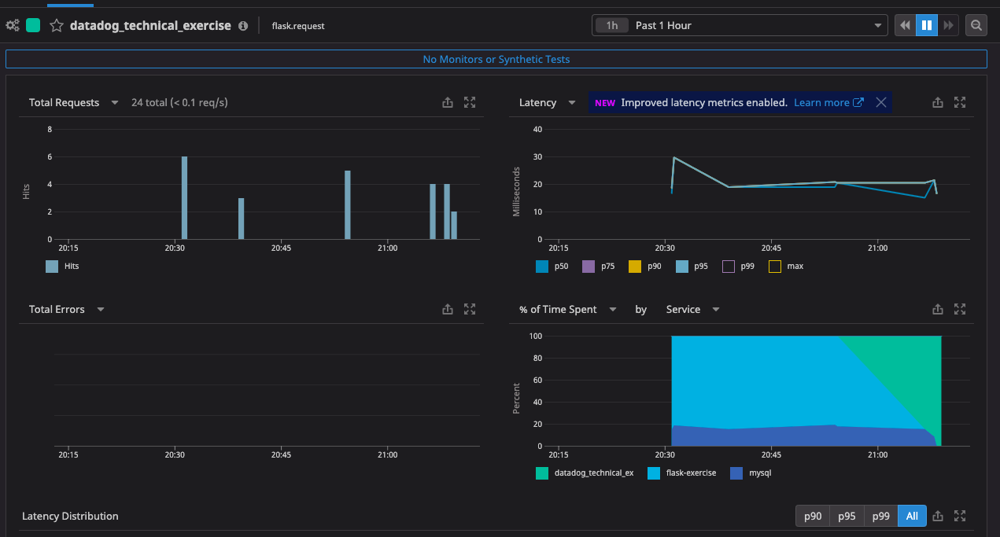

https://p.datadoghq.com/sb/zihnin4jchh3f8ll-e31eefbba8dcd1538ea6d0192c50a65e
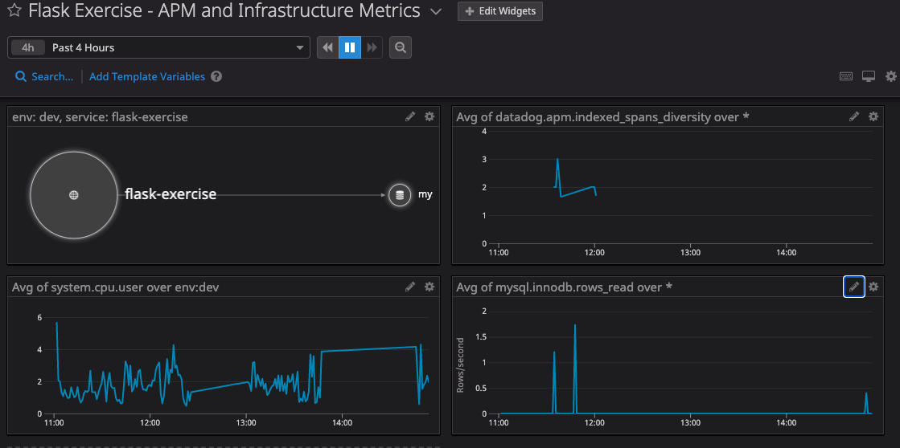

* **Bonus Question**: What is the difference between a Service and a Resource?

Per the Datadog docs:

* A service represents a grouping of endpoints and queries, geared around a particular domain. Its definition within Datadog is similar to the definition of the builiding blocks in a micro-services architecture. For example, in my Flask setup, my Flask App is considered a service, as shown by the below service list feature.
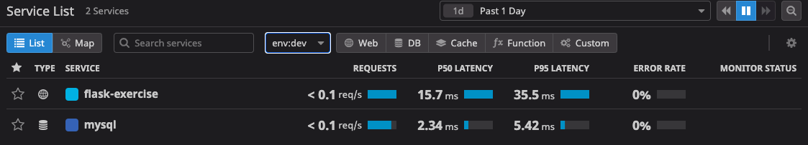
* A resource is a particular action for a given service (typically an individual endpoint or query). For example, the endpoint that triggers the query to the pet table of my database is a resource.
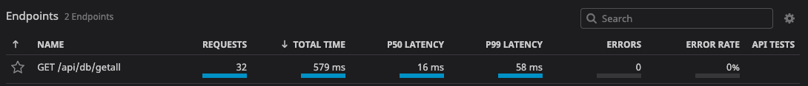

## Final Question:

Theoretically, any distributed system that could be instrumented for measurement and transparency could use Datadog.

 Datadog is a useful tool for measuring variables, tagging different services to make groupings, and then analyzing those grouped variables in a human-readable way.

One application that seems interesting to me is monitoring and correlating the weather and birds, a nerdy quarantine hobby of mine (in 2020, I saw 93 unique species of birds). 
One of the best ways to view birds, is to attract them using a backyard feeder. Many of these were in my family’s backyard in Massachusetts, on a balcony feeder. I would like to correlate certain weather patterns with the appearance of particular birds at the backyard feeder.

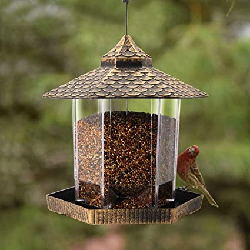

Here’s what a system design for this could look like, to illustrate how I think Datadog could be used to solve the problem:

1. Set up sensor devices: they would need to be hooked up to an OS where you can install the Datadog agent. Have a thermometer measuring temperature, another device measuring humidity, and a device to measure the incidence of light (photo_incidence) on the balcony.

2. Tag all of these as one service. Across a larger property (ie a park), we could also have a tag with a geo-tag, if you had different instances of a measuring setup.

3. Set up a bird feeder with sensors at its access points, with a camera to capture images of the bird accessing the feeder. When the bird feeder is accessed, log this as an event, with an associated image link. You can use Datadog APM to register this event.
 It would be great if we could identify the bird from the images using AI - it seems like the best systems still have some trouble, so this may involve some manual tagging at the moment.
 From Datadog’s perspective it does not make a difference whether the bird is manually identified, we can log the associated event with the time stamp of observation, once the bird is identified.
 Lastly, capture this bird event as a list of **bird_sighting**.
To avoid multiple events from the bird, we could clean the data or aggregate events within Datadog, using the aggregation feature.

4. Set up a Timeboard plotting **temperature**, **humidity**, and **photo_incidence**.

5. We now have a searchable Timeboard! We can search for particular **bird_sighting** event, filtered by particular logged out features. We can overlay these events on the weather patterns from step 4.
 
With this tool we can now try to correlate particular bird-sightings, in almost real-time, with weather patterns. Here's one hypothesis to test:

Dark-eyed juncos are known as snowbirds, because they appear around the time of the first snowfall. But does the data actually validate this?

Can we correlate the appearance of these birds, with snow, or with a temperature drop? Or would we have to add in additional measured variables? Unlike other systems that purely measure historical correlation, Datadog allows us to monitor in real-time - a large number of dark-eyed juncos on a hot day would be an anomaly, and our system could flag it!
