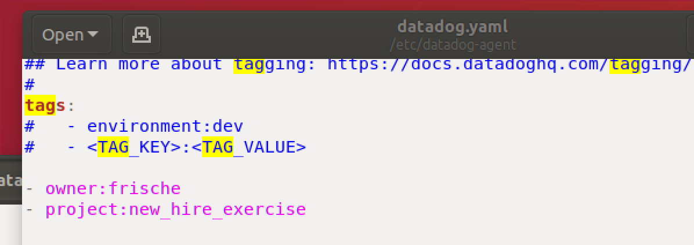
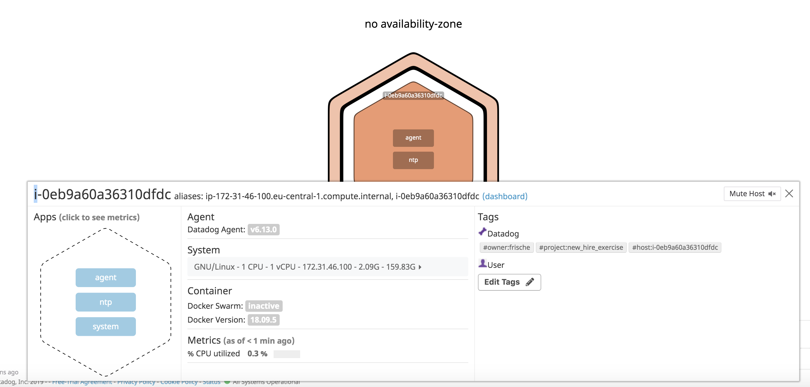

# Prerequisites - Setup the environment

I started a Ubuntu 18.04 server on AWS.

I then installed the Datadog agent on this Ubuntu server with the command:

DD_API_KEY=<MY_API_KEY> bash -c "$(curl -L https://raw.githubusercontent.com/DataDog/datadog-agent/master/cmd/agent/install_script.sh)"

# Collecting Metrics

## Add tags in the Agent config file and show us a screenshot of your host and its tags on the Host Map page in Datadog

Finally I added some example tags to the /etc/datadog-agernt/datadog.yaml file.

Screenshot of agent YAML file and host map on Datadog UI:

Screenshot of host map in Datadog UI:

