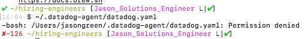
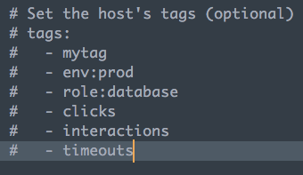
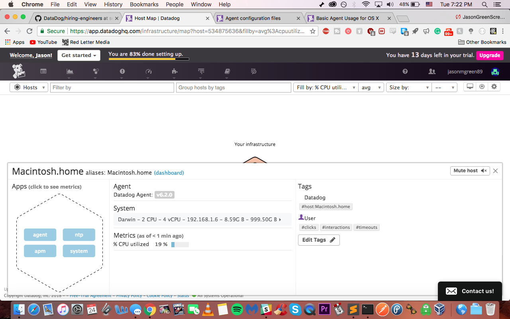

Your answers to the questions go here.

##Collecting Metrics:
1. Add tags in the Agent config file and show us a screenshot of your host and its tags on the Host Map page in Datadog:
    * After trying to open the config file, I was met with "permission denied"
    several times. 

Shortly after, I managed to open the yaml file.
Here are my edits to the yaml file and the tags on the Host Map page

2.  Install a database on your machine (MongoDB, MySQL, or PostgreSQL) and then install the respective Datadog integration for that database.

I'm using PostgreSQL on my Mac with the corresponding Datadog integration.

3. Create a custom Agent check that submits a metric named my_metric with a random value between 0 and 1000.

##Visualizing Data:

