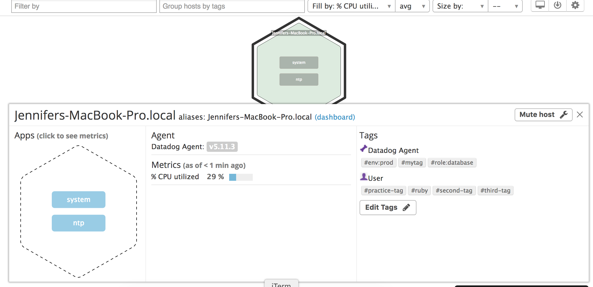
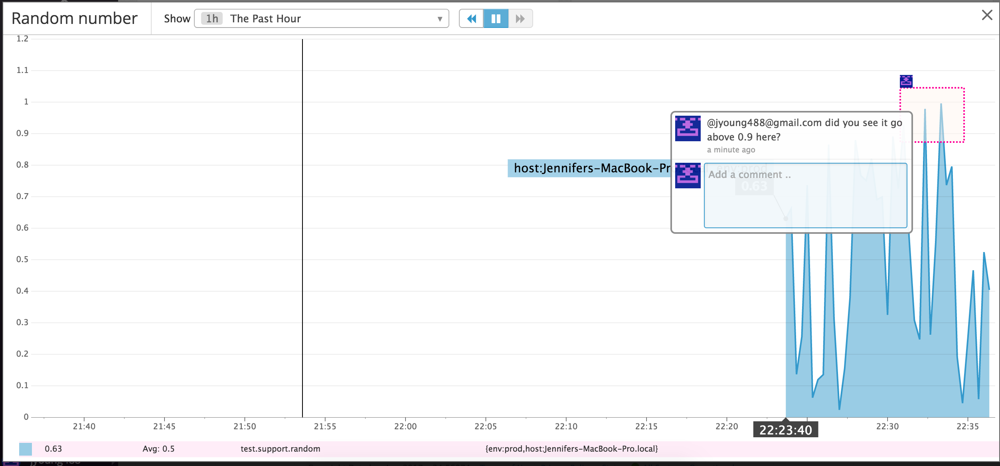
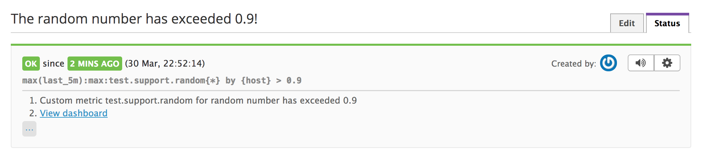
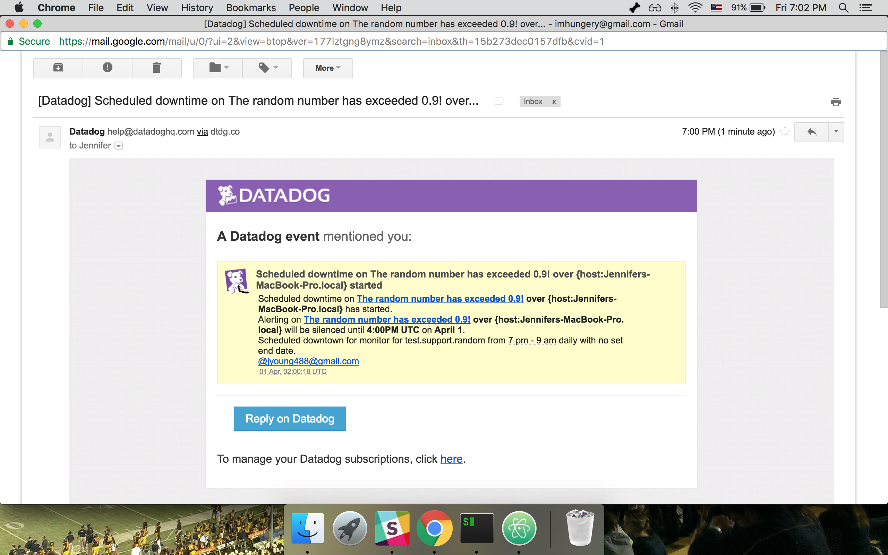

# DataDog Support Engineer Challenge

## Level 1 - Collecting Your Data
* Bonus Question: An agent is the program that runs on a customer's local machine to track performance and metrics. It then consolidates and packages the data to send to DataDog.

* 

## Level 2 - Visualizing Your Data
* Bonus Question: A timeboard is useful for troubleshooting and grabbing a snapshot of the systems for a certain period. The graph layout can't be customized since they're all shown together. The screenboard is more customizable and flexible for showing a high-level overview of the system. It can also incorporate widget and can be shared in real-time as a read-only.

* 

## Level 3 - Alerting on Your Data
* Monitor created: 

* Downtime scheduled: 

* Email alert from monitor: 
