Prerequisites - Setup the environment
You can utilize any OS/host that you would like to complete this exercise. However, we recommend one of the following approaches:

TASK #1A: You can spin up a fresh linux VM via Vagrant or other tools so that you don’t run into any OS or dependency issues. Here are instructions for setting up a Vagrant Ubuntu VM. We strongly recommend using minimum v. 16.04 to avoid dependency issues.

ANSWER #1A: 

Brief Explanation:
Vagrant is one of the automated provisioning tool to quickly spin up virtual machines.
I spun up 2 VMs by customizing the Vagrant configuration file. I planned them for Web and Database Servers.
I use the Ubuntu/Xenial64 (v. 16.04).

Steps:
-	Download Vagrant
-	Download Virtual Box
-	Install Vagrant
-	Install Virtual Box
- Within the Windows command prompt, I ran:
PS C:\HashiCorp\Vagrant\bin> .\vagrant.exe init ubuntu/xenial64
Before deploying the VMs, I edited the Vagrantfile for creating 2 VM boxes.

config.vm.define "web" do |web|
    web.vm.box = "ubuntu/xenial64"
  end

 config.vm.define "db" do |db|
    db.vm.box = "ubuntu/xenial64"
  end

PS C:\HashiCorp\Vagrant\bin> .\vagrant.exe up

Reference:
https://www.vagrantup.com/intro/getting-started/index.html

TASK #2: Then, sign up for Datadog (use “Datadog Recruiting Candidate” in the “Company” field), get the Agent reporting metrics from your local machine.

ANSWER #2:

Brief Explanation:
I signed up to Datadog.com and get the download link for datadog agent.
DD_API_KEY=32f8a12f62e1275f6369ffc379b1ee82 bash -c "$(curl -L https://raw.githubusercontent.com/DataDog/datadog-agent/master/cmd/agent/install_script.sh)"
I used both one-step install and step-by-step installn on my 2 VMs

Steps:
- Login to my VM boxes
- Run the script, this is the brief output:

root@sg-web-01:~# DD_API_KEY=32f8a12f62e1275f6369ffc379b1ee82 bash -c "$(curl -L https://raw.githubusercontent.com/DataDog/datadog                                                                                                           -agent/master/cmd/agent/install_script.sh)"
  % Total    % Received % Xferd  Average Speed   Time    Time     Time  Current
                                 Dload  Upload   Total   Spent    Left  Speed
100 11382  100 11382    0     0  14941      0 --:--:-- --:--:-- --:--:-- 14937
* Installing apt-transport-https
* Installing the Datadog Agent package
* Adding your API key to the Agent configuration: /etc/datadog-agent/datadog.yaml
* Starting the Agent...
Your Agent is running and functioning properly. It will continue to run in the background and submit metrics to Datadog.
If you ever want to stop the Agent, run:
     systemctl stop datadog-agent
And to run it again run:
     systemctl start datadog-agent

Reference:
https://app.datadoghq.com/account/settings#agent/ubuntu

Collecting Metrics:

TASK #3: Add tags in the Agent config file and show us a screenshot of your host and its tags on the Host Map page in Datadog.

ANSWER #3:

Brief Explanation
Tags are the most useful identification to Datadog objects / metrics. Tags can be used for data aggregation / colaboration and filter, dashboard customization, monitor and alert and many more.
Using tags increase efficiency and productivity in Datadog web user experience for different user personas. 

Steps:
- edit /etc/datadog-agent/datadog.yaml
- I added the tags.
- Restart datadog agent agent
- Go to Infrastructure host map.

Snapshots:
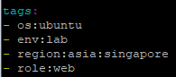
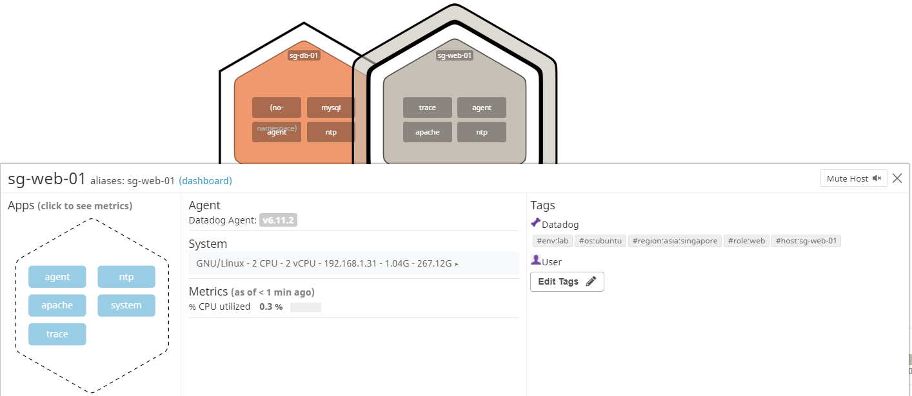
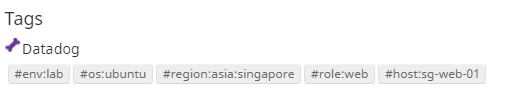

Reference:
https://docs.datadoghq.com/tagging/

TASK #4: Install a database on your machine (MongoDB, MySQL, or PostgreSQL) and then install the respective Datadog integration for that database.

ANSWER #4: 

Brief Explanation:
I install mysql and integrating it to Datadog and display on Host map and Overview dashboard.
Turning on the mysql integration automatically collects 61 mysql performance metrics.
Some of them are presented automatically into the MYSQL Overview dashboard.
IMO, one of the best feature on this overview dashboard, if I hover my cursor into one particular widget to look for specific metric, the other widget is displaying the same exact point on the same time widows.
This will significantly reduce the time to correlated data based on time series on different metrics.

Steps:
- On VM sg-db-01
- Install from Ubuntu repository with “apt-get Install mysql-server”
>sudo apt-get install mysql-server
- Created datadog username and password for datadog integration. As of now, I granted all permission to datadog user but only for localhost access which will be done by the Datadog agent.
mysql> CREATE USER 'datadog'@'localhost' IDENTIFIED WITH mysql_native_password by '<UNIQUEPASSWORD>';

- Grant permission
mysql> GRANT REPLICATION CLIENT ON *.* TO 'datadog'@'localhost' WITH MAX_USER_CONNECTIONS 5;
mysql> GRANT PROCESS ON *.* TO 'datadog'@'localhost';

- Modified: /etc/datadog-agent/conf.d/mysql.d/conf.yaml
- I added logs monitoring as well.
- Edit datadog-agent.yaml

sudo vi /etc/datadog-agent/datadog-agent.yaml
logs_enabled: true

[task4-mysqld-conf-yaml.txt](task4-mysqld-conf-yaml.txt)

- Go to Host map sg-db-01

Snapshots:
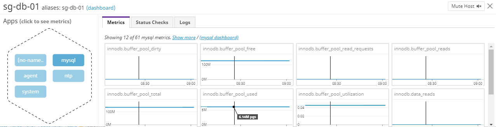
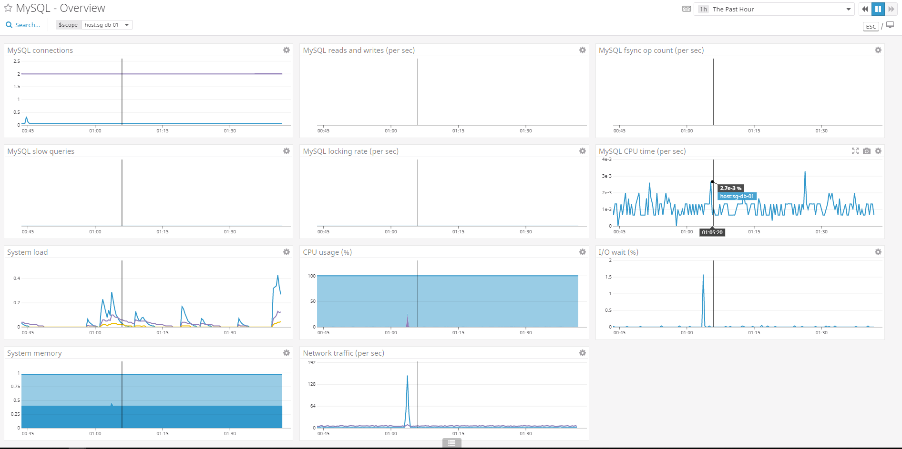

Reference:
https://docs.datadoghq.com/integrations/mysql/

TASK #5: Create a custom Agent check that submits a metric named my_metric with a random value between 0 and 1000.

ANSWER #5:

Brief Explanation:
This is a simple random number generator between 0 and 1000 with python script that will be collected by the agent. 
The use case is limitless. I can use it for collecting non-default metric that produced by the script.
There are different kind of metric type such as Gauge and Rate, this will differentiate how the metric gets collected. Gauge will be collected as the current metric shows up from the script. Rate is used for collecting the delta between collection intervals.
I’m using Gauge in this script because I want to get the current random number.
Rate can be used if the number if increasing, so I want to get the rate to know how much it gets increased for each collection.

Steps:
- Created python script

Snapshots:

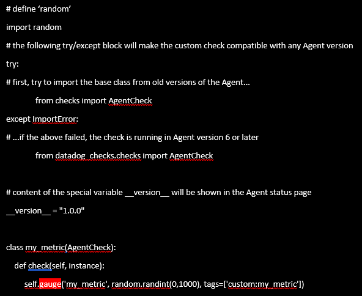

Ref:
https://datadog.github.io/summit-training-session/handson/customagentcheck/

TASK #6: 
Change your check's collection interval so that it only submits the metric once every 45 seconds.

ANSWER #6:

Brief Explanation:
At first, I added time wait to the python script to generate the random number within 45 seconds
Then I realized, I can simply change the default minimum collection interval is 15 seconds in the YAML file. This is configurable for each instance of application integration with the Datadog agent. 
I also found another way to change the interval by editing the individual Metric metadata under Datadog Web UI Menu: Metrics > Summary and find “my_metric” metrics.

Steps:
- Create python script /etc/datadog-agent/check.d/my_metric.py (answer-task6-pic1.png)
- Create yaml script /etc/datadog-agent/conf.d/my_metric.yaml as follows:
    init config:
    instances:
      [{}]
      
Bonus Question: 
Can you change the collection interval without modifying the Python check file you created?
Answer: 
Change the YAML file as below:

init_config:
instances:
    [{
        min_collection_interval: 45
     }]

Snapshots:
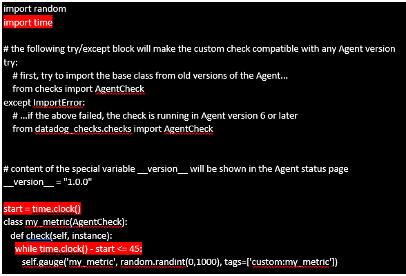
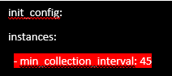
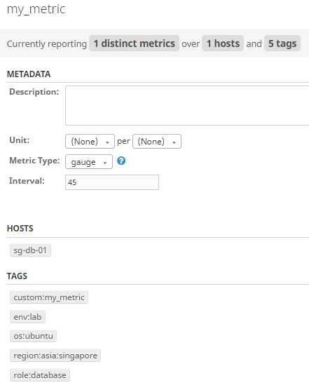

 Reference:
 https://docs.datadoghq.com/developers/metrics/custom_metrics/
 
 Visualizing Data:
Utilize the Datadog API to create a Timeboard that contains:

TASK #7: Display your custom metric scoped over your host.

ANSWER #7:

Brief Explanation:
The host agent that has been integrated with the custom metric quite immediately after the restart in Task 6.
I can correlate this metric easily among other metrics in the hostmap to help pinpointing some related issues with that host.
I created 1 timeboard dashboard with 3 main widgets for the custom metric.
- Widget1: host map to show the host map
- Widget2: query (answer-task7-pic2.png) to display the last metric from the custom script
- Widget3: historical graph (answer-task7-pic3.png) to display the historical graph of the metric

Steps:
- Go to Host Map and look for new my metric on the Host
- Build a new timeboard and display 3 widgets for my metric
- Dashboard widgets can be seen here: answer-task7-json1.txt

Snapshots:
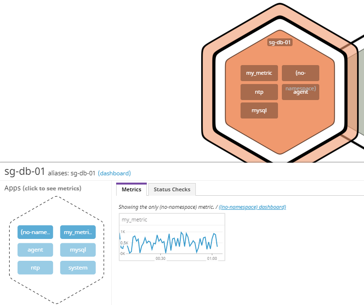
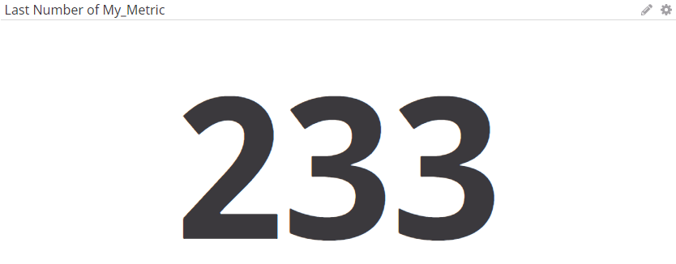
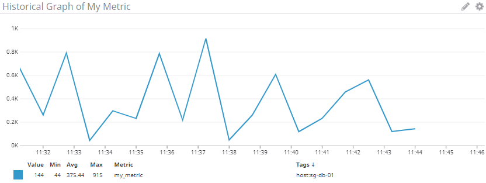

Scripts:
[task7-json1.txt](task7-json1.txt)

Reference:
https://docs.datadoghq.com/getting_started/#dashboards

TASK #8:
Display any metric from the Integration on your Database with the anomaly function applied.
Bonus Question: What is the Anomaly graph displaying?

ANSWER #8:

Brief Explanation:
Anomaly graph is very useful to identify metrics outside the norm. It is displayed based on the width gap of the standard graph. By default, the width factor is 2, if Datadog detects graph that’s wider than 2, it will be considered as anomaly behavior. 
I think anomaly can represent to know the uncommon. The use case for anomaly doesn’t always mean bad, example: if I have a burst of my sales revenue out of the norm; that could be one of the best thing that can happen.

The graph below is showing some anomaly out of the standard line in blue.
I can trace when the anomaly occurred based on the timestamp and I might be able to correlate this anomaly with other metrics that happen on the same time line.

Steps:
- On the timeboard dashboard, at one time series widget
- Go to function > Algorithms > Anonmalies to display anomaly graph
 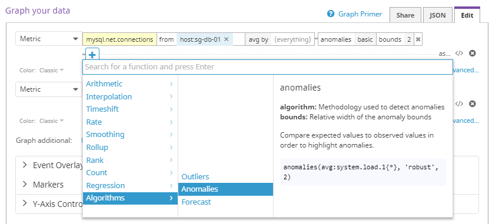
- Change the time period of the graph and start seeing the anomaly
 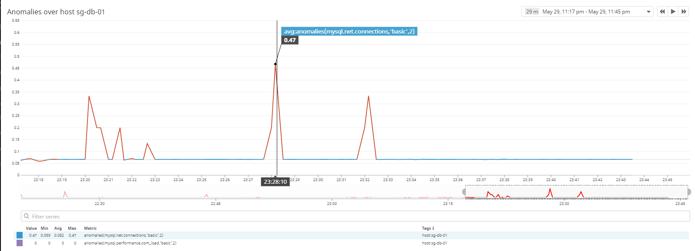

Json script:
[task8-json1.txt](task8-json1.txt)

Reference:
https://docs.datadoghq.com/graphing/functions/algorithms/#anomalies

TASK #9:    
Display your custom metric with the rollup function applied to sum up all the points for the past hour into one bucket

ANSWER #9:

Brief Explanation:
Roll up function is used for aggregating / summarizing data points within 1 time period e.g: hourly, daily. There are 4 roll up summary:
-	Minimum: to display only the lowest data point
-	Maximum: to display only the highest data point
-	Average: to display the average calculation of total data points divided by number of data points that got collected during that period.
-	Sum: to display the total amount of data from each data point.

Steps:
- Create time series widget and change the function to roll up with 3600 seconds (1 hour)

Snapshots:

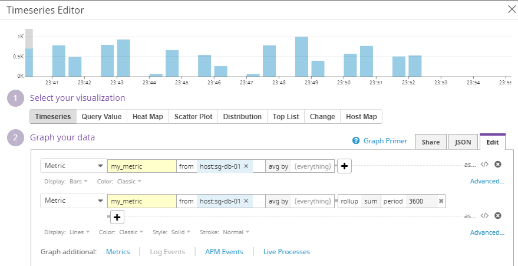
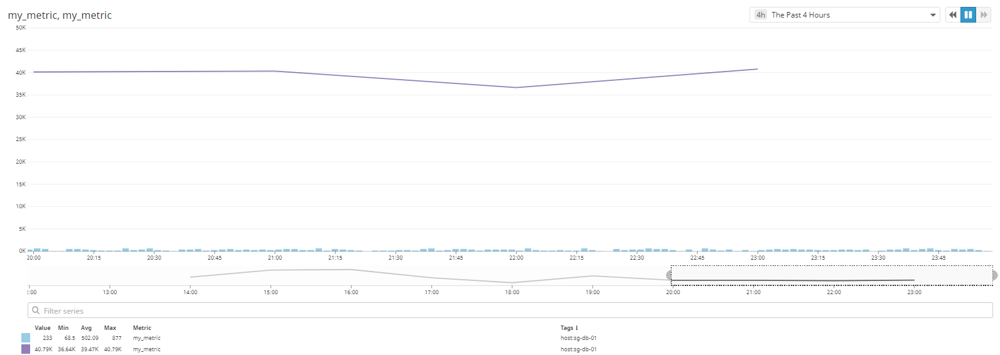

[task9-json1.txt](task9-json1.txt)

References:
https://docs.datadoghq.com/graphing/functions/rollup/

TASK #10: 
Set the Timeboard's timeframe to the past 5 minutes. Take a snapshot of this graph and use the @ notation to send it to yourself. 

ANSWER #10:

Brief Explanation:
When I'm spotting some issues or anomaly within any time period, I can simply zooming into time series data.
Datadog metrics are stored with 1 second granularity, I will not miss any problem spot.
Next, I can annotate the graph and send email. I'm not going to lose my important evidence.

Steps:
- Highlight the graph and drag it to get 5 minutes coverage
- CLick on the graph and select annotate
- Use the @ signn to send email

Snapshots:

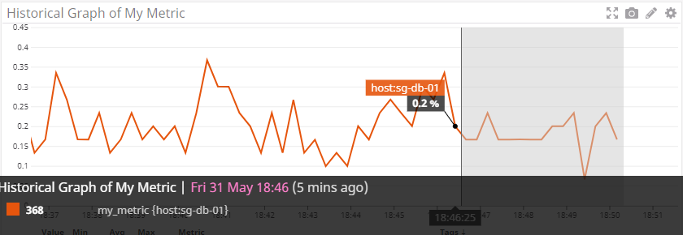
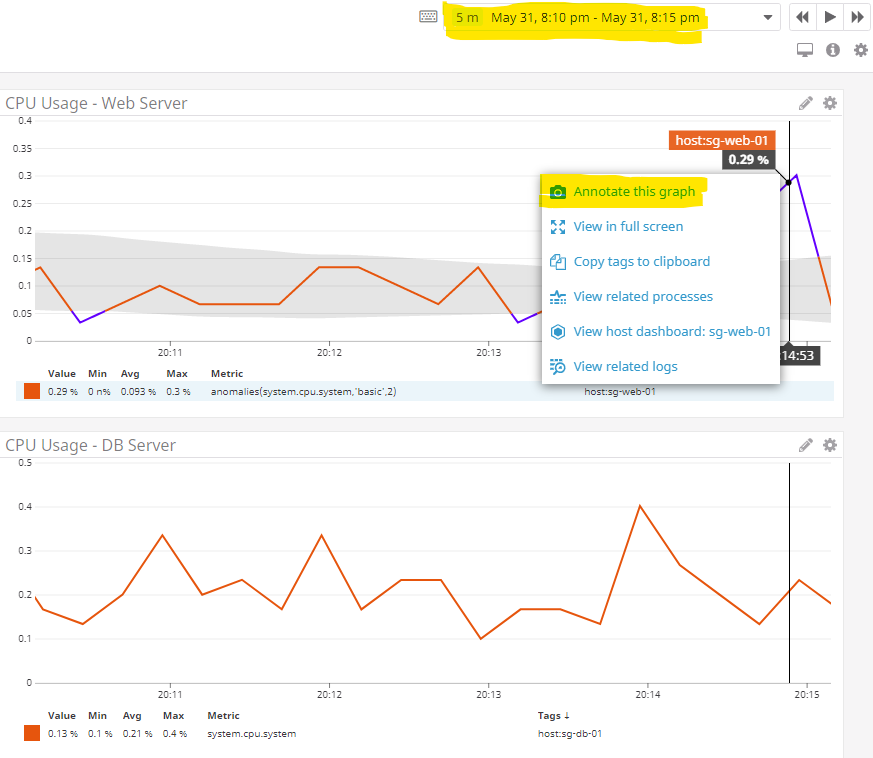
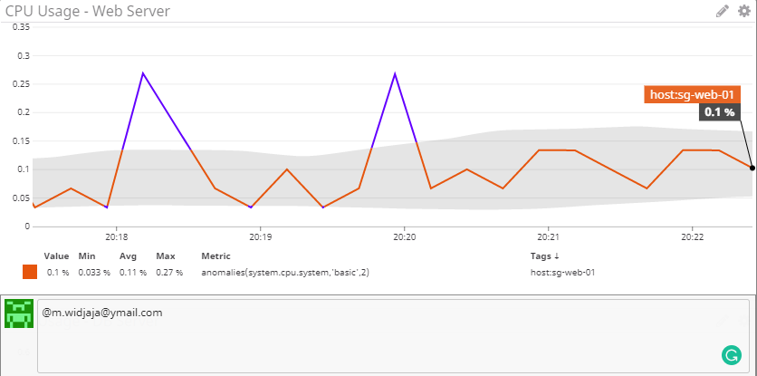

Reference:
https://docs.datadoghq.com/graphing/faq/what-is-the-granularity-of-my-graphs-am-i-seeing-raw-data-or-aggregates-on-my-graph/

Monitoring Data
Since you’ve already caught your test metric going above 800 once, you don’t want to have to continually watch this dashboard to be alerted when it goes above 800 again. So let’s make life easier by creating a monitor.

TASK #11: 
Create a new Metric Monitor that watches the average of your custom metric (my_metric) and will alert if it’s above the following values over the past 5 minutes:
•	Warning threshold of 500
•	Alerting threshold of 800
•	And also ensure that it will notify you if there is No Data for this query over the past 10m.

ANSWER #11:

To be on top of my problem, I need to be proactive. I might be able to spot any problem if I'm starring at the screen but that's making me unproductive. I just need to let Datadog to monitor everything for me and send me email whenever there are problems.
I would like to get notified when my metrics beyond threshold level, but I also dont want to be bother when they happen for a short period. just a burst.
When my metric is not showing up or get collected, I would like get notified as well because would normally mean something is down.

Steps:
- Go to New Monitor and Select Metric type
- Define the conditional metric and the matching hosts or tags
- Configure the Warning (Yellow) threshold as 500 and Alert (Red) threshold as 800.
- Alert condition is above or equal to
- During the last 5 minutes
- Configure if data missing for 10 minutes

Snapshot

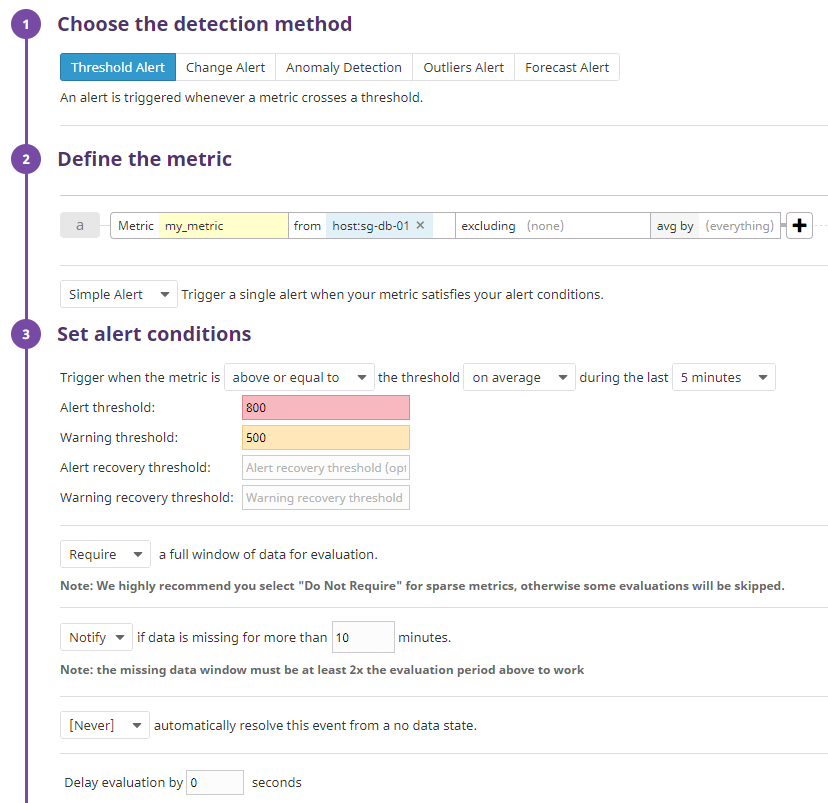

Reference:
https://docs.datadoghq.com/api/?lang=python#monitors

TASK #12: 
Please configure the monitor’s message so that it will:
•	Send you an email whenever the monitor triggers.
•	Create different messages based on whether the monitor is in an Alert, Warning, or No Data state.
•	Include the metric value that caused the monitor to trigger and host ip when the Monitor triggers an Alert state.

ANSWER #12

Brief Explanation:
After defining the right condition to monitor the threshold, I would need to make sure they come me accurately.
I configure the alert subject, which is normally, a brief description about what and where the alert from.
Then, the alert detail, to provide more information about what, where, why and when the alert gets triggered.
Last, I can use some variable to automatically match the alert condition and the detail.

Steps:
- Configure the alert message subject. 
- Configure the alert body message.
- Configure alert variable 

Snapshot:

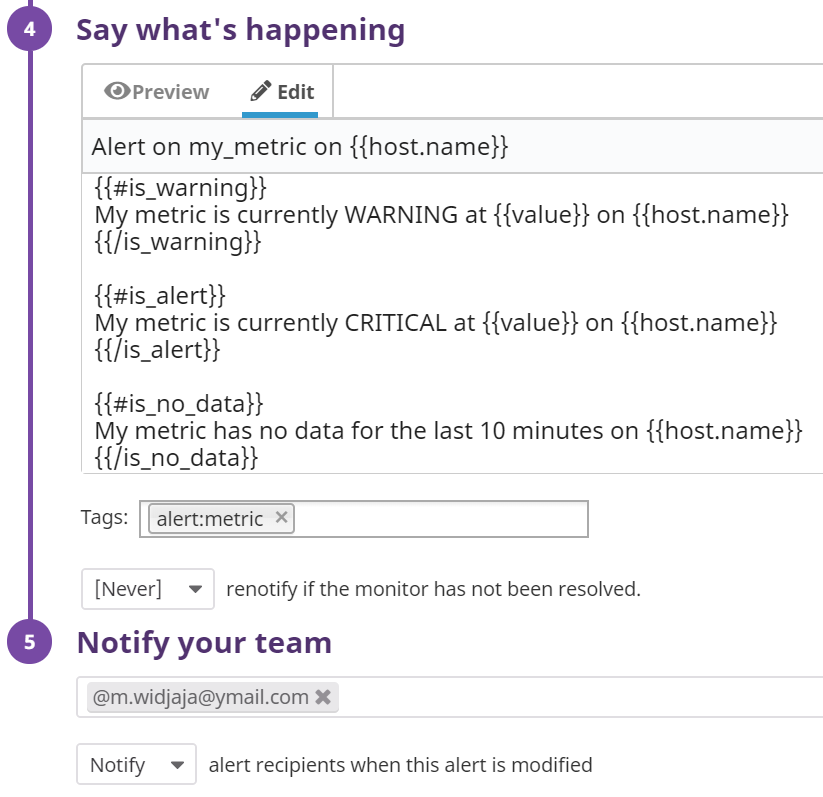

Reference:
https://docs.datadoghq.com/monitors/notifications/?tab=is_alertis_warning#variables

TASK #13: 
When this monitor sends you an email notification, take a screenshot of the email that it sends you.

ANSWER #13:

I got received the alert message with the automatic graph display embedded into the message.
This will quickly identify why this alert was triggered.

Snapshot:

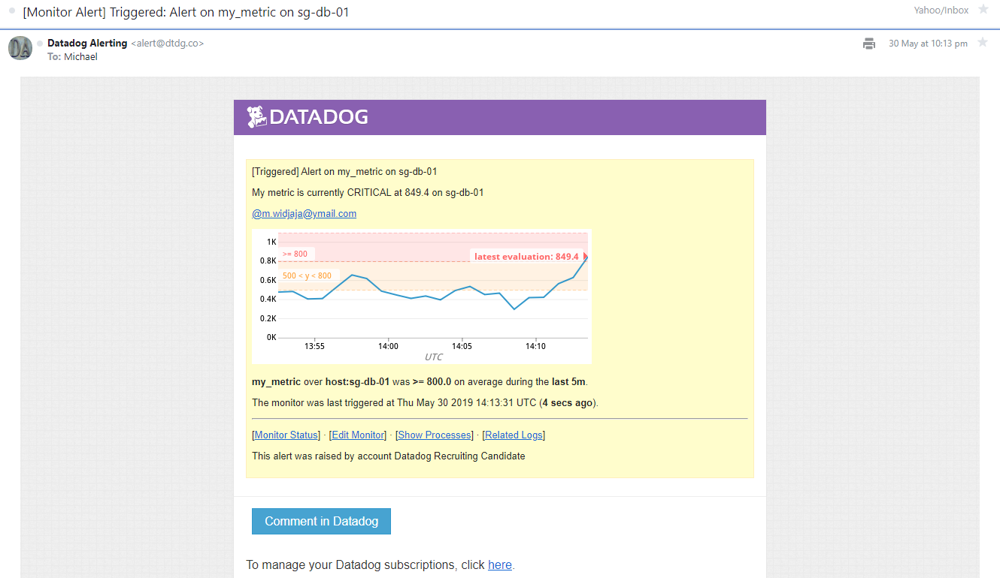

TASK #14:
Bonus Question: Since this monitor is going to alert pretty often, you don’t want to be alerted when you are out of the office. Set up two scheduled downtimes for this monitor:

ANSWER #14:

The only option to do this, it seems by creating recurring non-peak hours to suppress my alerts.
This is actually used during maintenance windows, to reduce false alarm. 
- One that silences it from 7pm to 9am daily on M-F

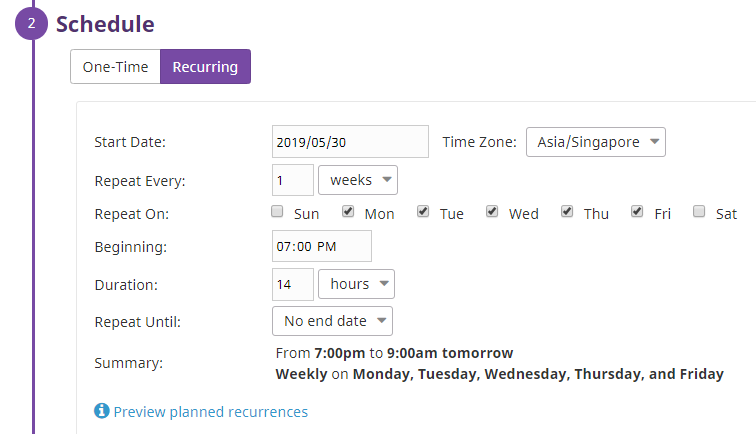

- And one that silences it all day on Sat-Sun

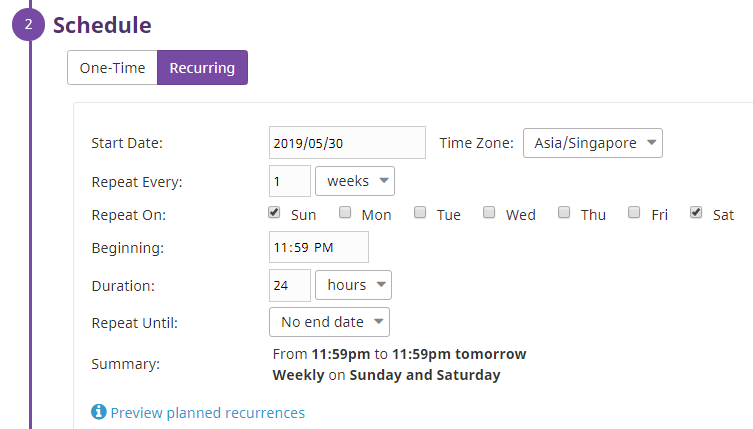

Reference:
https://docs.datadoghq.com/monitors/downtimes/

Collecting APM Data:

TASK #15:
Given the following Flask app (or any Python/Ruby/Go app of your choice) instrument this using Datadog’s APM solution:
•	Note: Using both ddtrace-run and manually inserting the Middleware has been known to cause issues. Please only use one or the other.
Provide a link and a screenshot of a Dashboard with both APM and Infrastructure Metrics.
Please include your fully instrumented app in your submission, as well.

ANSWER #15

Brief Explanation:
APM is the monitoring and management of performance and availability of applications. APM strives to detect and diagnose complex application performance problems to maintain high level of service. APM is commonly used for Web Application.

APM closely monitor performance metrics defines by user experience of the application like average response time under peak hours.
APM will be able to triage performance issue that related to hybrid infrastructure that runs the application.
Last, APM will be able to trace problem and find the root cause through analyzing transactions, queries and error codes.

Steps:
- PHPMYADMIN application is running on Apache Server (sg-web-01) and MySQL database (sg-db-01)
- installed datadog-php-tracer.deb on sg-web-01

vagrant@sg-web-01:/etc/datadog-agent$ sudo apt-get install ddtrace

-	enable APM in Datadog.yaml

enabled: true

-	edited PHP.ini with extension and ddtracer wrapper

extension=ddtrace.so
ddtrace.request_init_hook =/opt/datadog-php/dd-trace-sources/bridge/dd_wrap_autoloader.php

-	adding the linux environment variables

Public URL:
- https://p.datadoghq.com/sb/x04kigxjnn4olmb7-4678ad177b65508402a0ec3d7ac7a322

Dashboard Explanation
I categorized my dashboard into 4 sections as follows:
- Application Performance => display high level application performance metrics like Web and Database Request / Duration
- Infrastructure => display the resource consumption on application and database server
- Problem Tracing => display high level problem like SLAO/SLA, Triggered Alarm and Log Statistic
- Anomalies and Forecasts => would be used for planning and prevention of future problem and knowing the unknown

Snapshot:

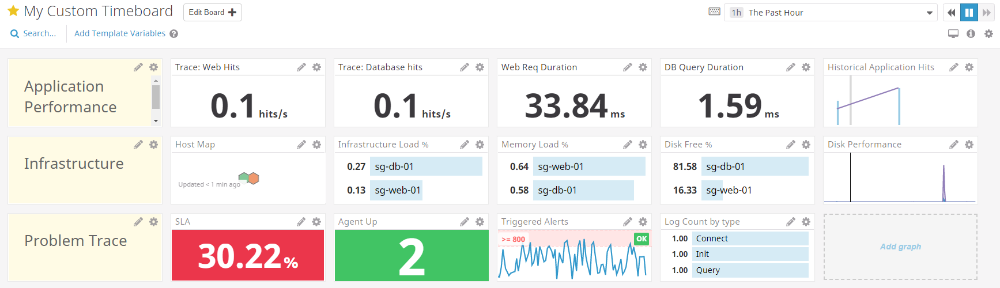
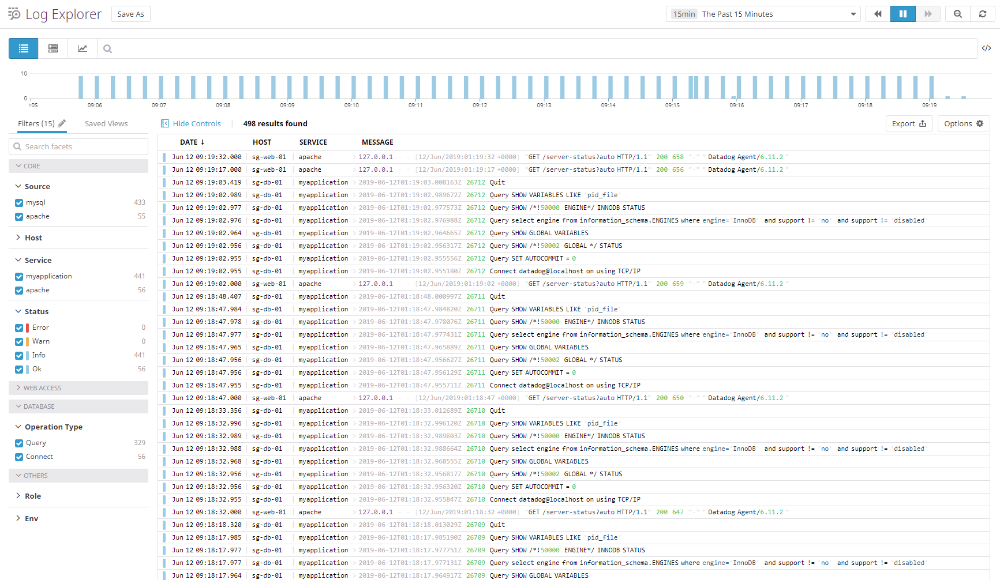

TASK #16:
Bonus Question: What is the difference between a Service and a Resource?

ANSWER #16: 
A Service is a set of application processes that run together for the same purpose. It is developed, deployed, managed and maintained for specific business application. Performance of a service shows high level application health e.g: total request, total error, overall application latency

A Resource is an activity that run on a single service. A single service can run a span of resources.
The performance of a resource represents closely to the problem with detail information, e.g: with the high latency that happening, what activity that causing it.

Final Question:
Datadog has been used in a lot of creative ways in the past. We’ve written some blog posts about using Datadog to monitor the NYC Subway System, Pokemon Go, and even office restroom availability!

TASK #17: Is there anything creative you would use Datadog for?

ANSWER #17:

There are many different solutions in the market that are able to find current and historical problems but there might be less that have good insight to find hidden or yet-to-be-seen issues.

By leveraging on machine learning technology with some anomaly detection and forecasting analysis and go deeper with events/logs correlation across hyrid infrasture and application, DataDog should be able to solve complex application and infrastructure issues.

Apart from that, in most cases, some people will still ask "what else can you do?"
If DataDog could alwyas adopt fast enough to the common trend using its platform and framework, it should bring significant values to everyone.

These are some sample interesting business cases:

- I would like to analyze my revenue generating application with DataDog platform. If I see a burst in sales numbers, I'd like to see the pattern and repeat the success.
- On the other hand, if I see my sales is declining every day, I need prevent it not to go down further. I need to correlate against other data.

Technical use cases:
- I would to use Datadog to provide analytical feedback to the devops team, where people spend most of the time in the application or where they spend much less time.
- I would like Datadogs to count the number of downloads, visitors, likes and dislikes to my business websites and articles.
