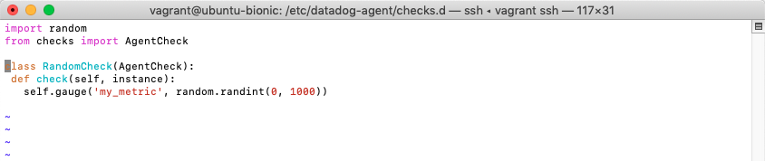

My answers to the questions go here.
## Table of Contents
* [Setting Up the Environment](#setting-up-the-environment)
* [Collecting Metrics](#collecting-metrics)
* [Visualizing Data](#visualizing-data)
* [Monitoring Data](#monitoring-data)
* [Collecting APM Data](#collecting-apm-data)
* [Final Question](#final-question)

<a name="setting-up-the-environment"/>

## Prerequisites - Setting Up the Environment
1. First, I spinned up a fresh linux Ubuntu VM via Vagrant on Virtual Box on my Mac. I followed these steps: https://medium.com/devops-dudes/how-to-setup-vagrant-and-virtual-box-for-ubuntu-20-04-7374bf9cc3fa
2. Next, I signed up for Datadog (used “Datadog Recruiting Candidate” in the “Company” field). 
3. And installed the Datadog Agent on the  Vagrant Box by running this command for ubuntu:  
```DD_AGENT_MAJOR_VERSION=7 DD_API_KEY=########## DD_SITE="datadoghq.com" bash -c "$(curl -L https://s3.amazonaws.com/dd-agent/scripts/install_script.sh)"```  
I removed the key for security purposes.
4. Finally, got the Agent reporting metrics from my local machine:
 </img>

<a name="collecting-metrics"/>

## Collecting Metrics
1. Added tags in the Agent config file and here is the screenshot of the host and its tags on the Host Map page in Datadog.
 </img>
 </img>
 </img>

2. Installed PostgreSQL on the Vagrant machine and then installed the respective Datadog integration for that database.
    - Added the public GPG key:  
    ```wget -O - https://www.postgresql.org/media/keys/ACCC4CF8.asc | sudo apt-key add -```
    - Created a file with the repository address:  
    ```echo deb http://apt.postgresql.org/pub/repos/apt/ precise-pgdg main | sudo tee /etc/apt/sources.list.d/postgresql.list```
    - To install PostgreSQL I ran:  
    ```sudo apt-get update```   
    ```sudo apt-get install postgresql-9.3 postgresql-contrib-9.3```
    - After installing PostgreSQL, I ran the following command to create a user for Datadog in the database.  
    ```create user datadog with password ‘######’;```
3. Created a script file and a config file in order to create a custom metric and send it to Datadog servers through the Agent.

</img>

After ```mymetric.py``` was created ```~/.datadog-agent/checks.d/mymetric.py``` added the following to the file:

</img>

Then I created ```mymetric.yaml ~/.datadog-agent/conf.d/mymetric.yaml``` and added the code below.

</img>

After I restarted the Agent.
</img>

On the Datadog dashboard, I went to ```Metrics > Explorer```, and searched for my custom metric.
The Agent was running the collector in intervals of 15–20 seconds.

4. To change my check’s collection interval I edited the config file ```~/.datadog-agent/conf.d/mymetric.yaml``` and changed the ```min_collection_interval``` globally to the interval of 45 seconds.

</img>

    And restarted the Agent again.
</img>

5. **Bonus Question:** Can you change the collection interval without modifying the Python check file you created?
   **Answer:** Yes, the interval can be set by changing the instance description in the ```yaml``` file, like this:
```
    init_config:
            min_collection_interval: 45
    instances:
    [{}]
```

<a name="visualizing-data"/>

## Visualizing Data
1. This board was created using the PostMan API editor.
 </img>
To create my dashboard I used the content of this curl command:
    ```
    curl --location --request POST 'https://api.datadoghq.com/api/v1/dashboard' \
    --header 'Content-Type: application/json' \
    --header 'Cookie: DD-PSHARD=217' \
    --header 'DD-API-KEY: xxxxxxxxxxxxxxxxxxxxxxxxxx' \
    --header 'DD-APPLICATION-KEY: xxxxxxxxxxxxxxxxxxxxxxxxxx' \
    --data-raw '{
        "title": "Dev.Zarudnaya Hourly Anomalies",
        "description": "A custom agent check configured to submit a metric named `my_metric` with a random value between 0 and 1000.",
        "layout_type": "ordered",
        "is_read_only": false,
        "widgets": [
            {
                "definition": {
                    "type": "timeseries",
                    "title": "my metric timeseries",
                    "requests": [
                        {
                            "q": "my_metric{host:datadog.dev.zarudnaya.info}"
                        }
                    ]
                },
                "layout": {
                    "x": 0,
                    "y": 0,
                    "width": 4,
                    "height": 2
                }
            },
            {
                "definition": {
                    "type": "timeseries",
                    "title": "Postgres Sql Return Rows Anamolies",
                    "requests": [
                        {
                            "q": "anomalies(sum:postgresql.rows_returned{host:datadog.dev.zarudnaya.info}, '\''basic'\'', 5)"
                        }
                    ]
                },
                "layout": {
                    "x": 4,
                    "y": 0,
                    "width": 4,
                    "height": 2
                }
            },
            {
                "definition": {
                    "type": "timeseries",
                    "title": "Sum of my metric points per hour",
                    "requests": [
                        {
                            "q": "sum:my_metric{*}.rollup(sum, 3600)"
                        }
                    ]
                },
                "layout": {
                    "x": 8,
                    "y": 0,
                    "width": 4,
                    "height": 2
                }
            }
        ]
    }'
    ```

2. Once this was created, I accessed the Dashboard from the Dashboard List in the UI:
   ##### My Hourly Timeboard
    </img>

3. The sum of my metric is grouped into hours (per instructions) so it did not show properly in a 5 minute time span. I expanded the time period on the widget and included a snapshot here.
     </img>

    [Hourly Anomalies Dashboard Link](https://p.datadoghq.com/sb/ab7cb560-3783-11ec-9ab2-da7ad0900002-6fcd0e111c4fd4be11af2203756fb0b8)

4. Took a snapshot of this graph and used the @ notation to send it to myself. The email notice included a thumbnail, and also buttons that take you directly to the item in the Datadog panel.
     </img>

5. **Bonus Question:** What is the Anomaly graph displaying?  
   **Answer:** The Anomaly graph presents suspicious behaviour. I stressed PostgreSQL and made the tables list, thus, causing it to perform in a certain way. The graph provides a visualization of this performance as it relates to PostgreSQL.

<a name="monitoring-data"/>

## Monitoring Data
#### Create a New Metric:
1. From Datadog dashboard ```Monitors > New Monitor > Metric Monitor > Metric``` I defined the specs for ```my_metric``` based on the requirements.
    - Changed the metric to the custom metric ``my_metric``.
    - Changed the warning threshold to 500.
    - Changed the alerting threshold to 800.
    - Ensured notifications for No Data past 10 minutes.

#### Monitor Metrics:
 </img>
 </img>

#### Configure the Monitor's Message:
2. I configured the monitor message with below settings:
 </img>

#### Monitor Message Email Notifications
3. Created different messages based on whether the monitor is in an Alert, Warning, or No Data state.

#### Alert:  
 </img>

#### Warning:  
 </img>

#### Missing Data:  
 </img>

**Bonus Question:** Since this monitor is going to alert pretty often, you don’t want to be alerted when you are out of the office. Set up two scheduled downtimes for this monitor:  
#### Downtime Settings: 
1. From Datadog dashboard ```Monitors > Manage Downtime``` clicked 'Schedule Downtime':  

 </img>

2. Created a recurring downtime for days of the week and weekends. I used EST since this is my time zone and Datadog HQ time zone.  
#### Downtime Weekday Settings:
 </img>

#### Downtime Weekend Settings:
 </img>

<a name="collecting-apm-data"/>

## Collecting APM Data
1. For this exercise I created a basic **To Do** Flask app on my Vagrant VM using this command:  
```pip install Flask```, for the database I used Flask-SQLAlchemy using this command:
```pip install Flask-SQLAlchemy```.

2. Created a ```venv``` environment for the Flask app on the Vagrant machine. I installed DDtrace module using this command:  
```pip install ddtrace``` and enabled APM in the Datadog ```yaml``` file:   

 </img>

3. Injected ```ddtrace``` in the ```app.py```:
```
from flask import Flask, render_template, request, redirect, url_for
from flask_sqlalchemy import SQLAlchemy
from ddtrace import tracer

app = Flask(__name__)

app.config['SQLALCHEMY_DATABASE_URI'] = 'sqlite:///db.sqlite'
app.config['SQLALCHEMY_TRACK_MODIFICATIONS'] = False
db = SQLAlchemy(app)

class Todo(db.Model):
    id = db.Column(db.Integer, primary_key=True)
    title = db.Column(db.String(100))
    complete = db.Column(db.Boolean)

@app.route("/")
def home():
    todo_list = Todo.query.all()
    return render_template("base.html", todo_list=todo_list)

@app.route("/add", methods=["POST"])
@tracer.wrap("flask.request", service='flask', resource="POST /add", span_type='web')
def add():
    title = request.form.get("title")
    new_todo = Todo(title=title, complete=False)
    db.session.add(new_todo)
    db.session.commit()
    return redirect(url_for("home"))

@app.route("/update/<int:todo_id>")
def update(todo_id):
    todo = Todo.query.filter_by(id=todo_id).first()
    todo.complete = not todo.complete
    db.session.commit()
    return redirect(url_for("home"))

@app.route("/delete/<int:todo_id>")
def delete(todo_id):
    todo = Todo.query.filter_by(id=todo_id).first()
    db.session.delete(todo)
    db.session.commit()
    return redirect(url_for("home"))

if __name__ == "__main__":
    db.create_all()
    app.run(debug=True)
    app.run(host='0.0.0.0', port='5000')
```
4. I ran this command to start tracking APM logs:  
```DD_SERVICE="app" DD_ENV="dev" DD_LOGS_INJECTION=true ddtrace-run python3 app.py```

 </img>

5. In order for my Flask app on port 5000 to run I modified the agent port to 5050:  

 </img>

My To Do App on the browser:  
 </img>

APM dashboard on Datadog website:  

 </img>

6. Created some entries in my To Do APP and it is showing on the APM Dashboard:  

 </img>

#### Dashboard with both APM and Infrastructure Metrics:  
 </img>
[Dashboard APM link](https://p.datadoghq.com/sb/ab7cb560-3783-11ec-9ab2-da7ad0900002-b486ce8c5579c41542cd9f0d78eed153)

7. **Bonus Question:** What is the difference between a Service and a Resource?  
   **Answer:** Services are the building blocks of modern microservice architectures. A service groups together endpoints. 
   A resource is an action given to a service, such as a query to a database or an endpoint. 
   [Reference](https://docs.datadoghq.com/tracing/visualization/#pagetitle)

<a name="final-question"/>

## Final Question
Datadog has been used in a lot of creative ways in the past. We’ve written some blog posts about using Datadog to monitor the NYC Subway System, Pokemon Go, and even office restroom availability!

Is there anything creative you would use Datadog for?

**Answer:** Datadog can be used in many creative ways ([Datadog in the wild: 5 fun projects](https://www.datadoghq.com/blog/datadog-in-the-wild-5-fun-projects/)). In this pandemic times lots of people are dependent on medical equipment. For example, medical systems could use Datadog monitoring to ensure that they are functioning correctly in case of an emergency or an unforeseen event and alert for any anomalies. 


 


    


