# Prerequisites - Setup the environment
[x] You can spin up a fresh linux VM via Vagrant Ubuntu VM 

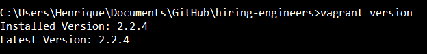

# 1. Collecting Metrics

### Tasks

    [x] Installed MySQL and integrated with Datadog
    [x] Create custom Agent Check (my_metric) with random value between 0 - 1000
    [x] Submit metric once every 45 seconds (Bonus: change w/o modifying Python check file)

### Screenshots
Host Map and Configuration

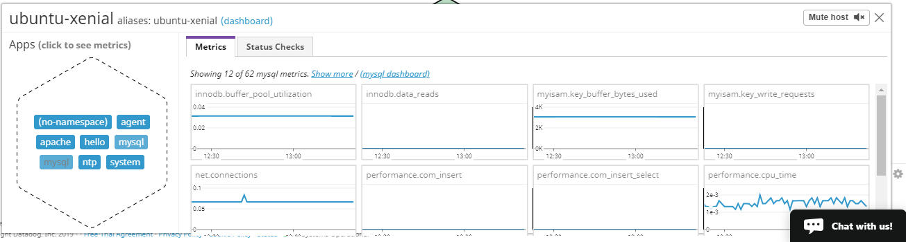
### Host Map

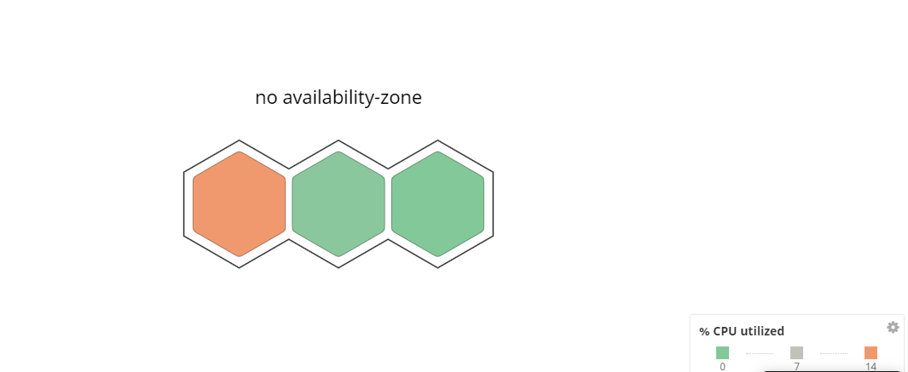
### Host Map 2

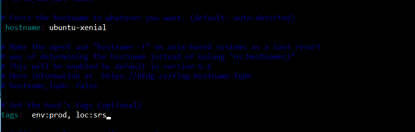

### MySQL Integration

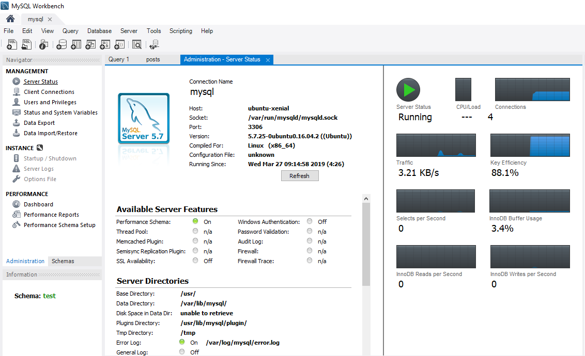

### MySQL Integration MySql agent check

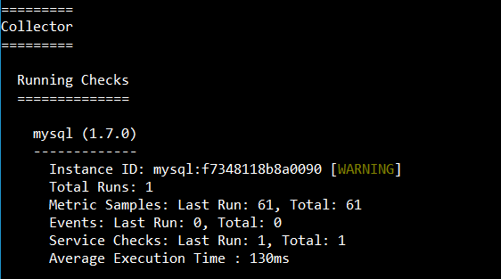

### Agent Check my_metric

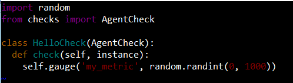

### my_metric yaml

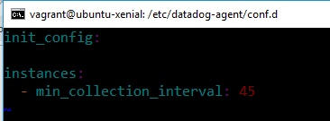

### Questions
Can you change the collection interval without modifying the Python check file you created?
**Answer: Yes. It is configured the min_collection_interval setting to 45 on configuration file /etc/datadog-agent/conf.d/my_metric.yaml.**

# 2. Visualizing Data
### Tasks
    [x] With the Datadog API, create a Timeboard that contains:
    [x] Custom metric (my_metric)
    [x] Database metric w/ anomaly function
    [x] Custom metric w/ rollup function applied to sum up all points for past hour into 1 bucket
    [x] Access Dashboard from Dashboard List in UI:
    [x] Set Timeboard's timeframe to past 5 mins

[Datadog API Script creating Timeboard](scripts/timeboard.py)

  ### Screenshots
  
  #### Timeboard
  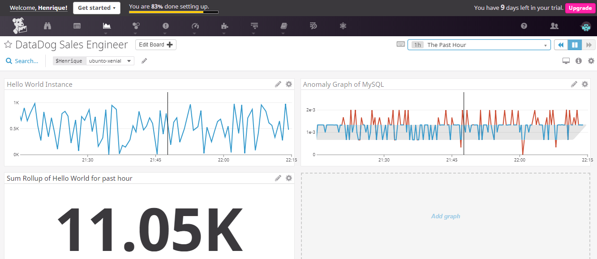
 
  #### Graph w/ @ notation to send self  
  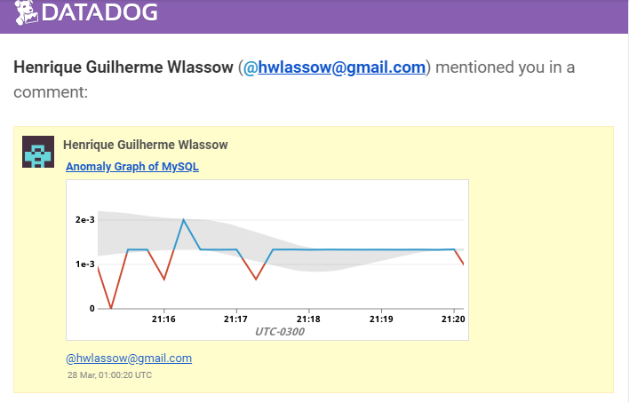
  
  ### Questions
   What is the anomaly graph displaying?  
   Answer: **Anomaly detection is designed to assist with visualizing and monitoring metrics that have predictable patterns.The Anomaly graph reveals the anomalies that happens when MySQL database makes commits and show that it is above the trends.**

   # 3. Monitoring Data
  ### Tasks
    [x] Create a new Metric Monitor that watched my_metric and will alert if it's above the following values for the past 5 mins   
    [x] Warning threshold of 500  
    [x] Alerting threshold of 800  
    [x] Notify if there is No Data for the past 10m  
    [x] Configure monitor's message so that it will:   
    [x] Send an email whenever a monitor triggers  
    [x] Create different messages based on warning, alert, no data  
    [x] Include metric value and host IP on Alert  
    [x] Bonus: Schedule 2 downtimes     
            - 7pm - 9am (M - F)   
            - All day Sat and Sun  
  
  ### Screenshots

  #### Monitoring Data
  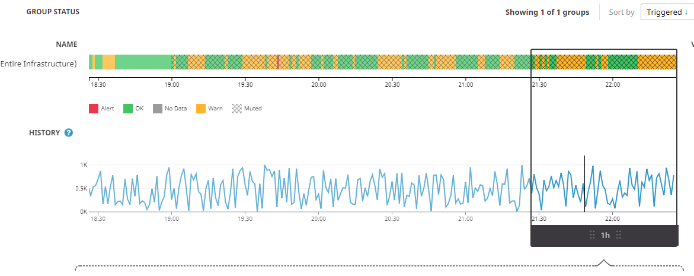
  
  #### Monitor Alert
  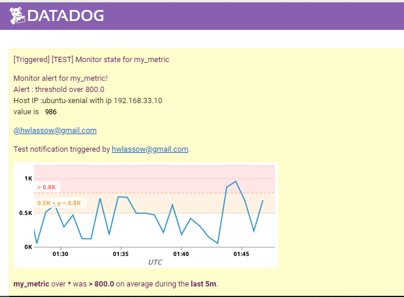
  
  #### No Data Alert
  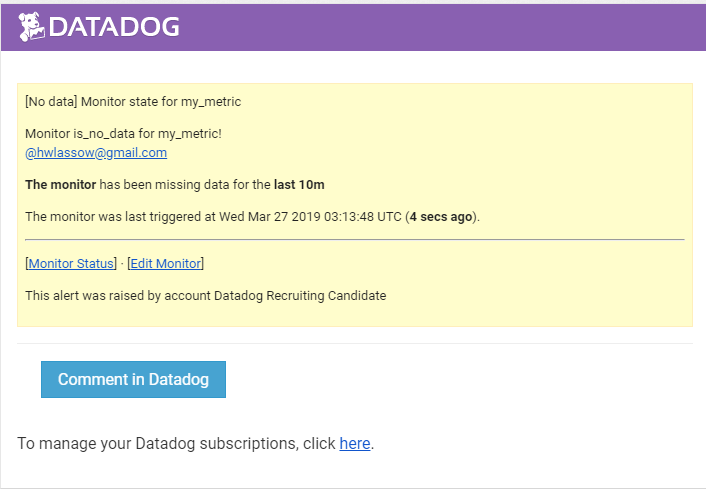
  
  #### Downtime (Bonus)
  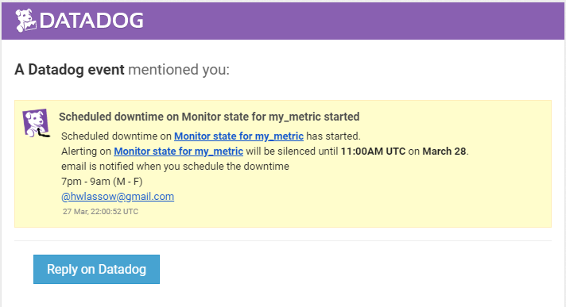 

  # 4. Collecting APM Data   
Given an app use Datadog’s APM solution   
Provide a link and a screenshot of a Dashboard with both APM and Infrastructure Metrics.

[Dashboard Link](https://p.datadoghq.com/sb/ov0483fsnj4ruvv8-bbe1d97bcb9454657c24cb9a41719c1d)

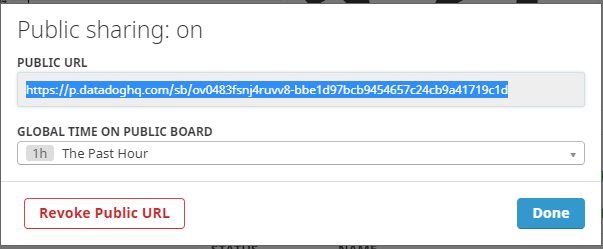

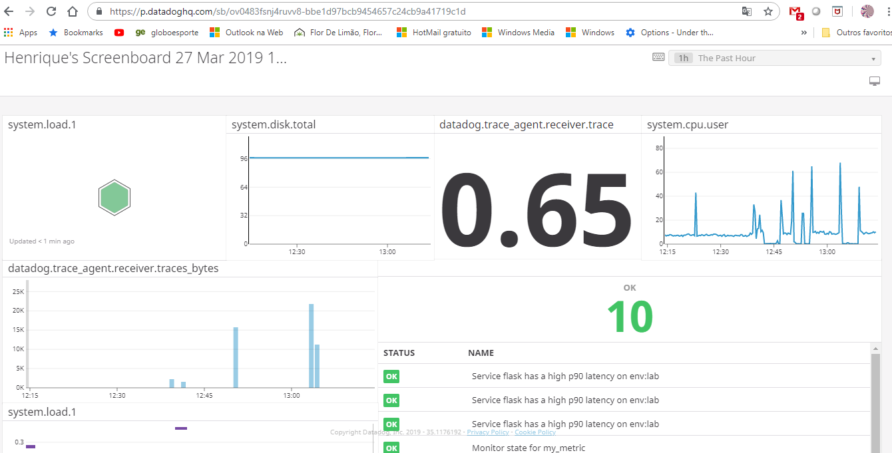

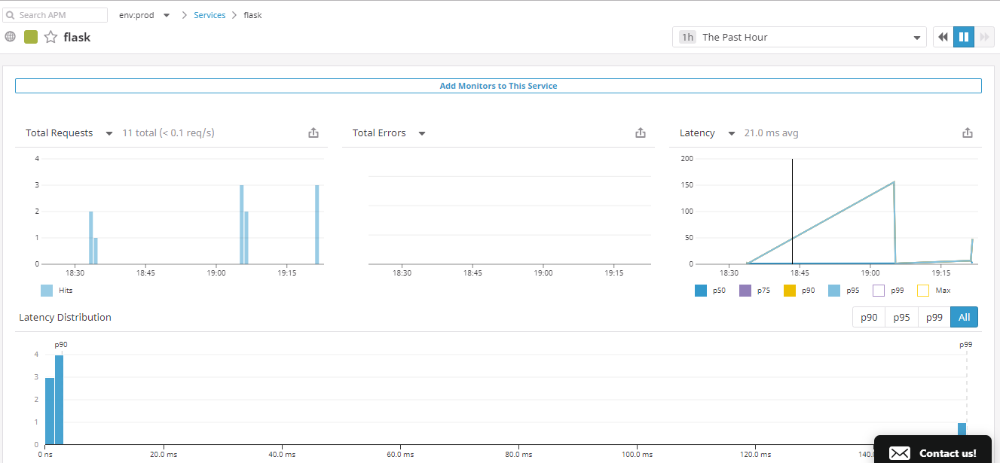
  
### Question: What is the difference between a Service and a Resource? 
A service is a set of processes that do the same job. For instance, a simple web application may consist of two services:

A single webapp service and a single database service.
A Resource is a particular action for a service.

For a web application: some examples might be a canonical URL, such as /user/home or a handler function like web.user.home (often referred to as “routes” in MVC frameworks).
For a SQL database: a resource is the query itself, such as SELECT * FROM users WHERE id = ?.

# 5. Final Question
Datadog has been used in a lot of creative ways in the past. We’ve written some blog posts about using Datadog to monitor the NYC Subway System, Pokemon Go, and even office restroom availability!

Is there anything creative you would use Datadog for?  

# aircraft check list

### Every aircraft has a checklist that lists all of the items that must be checked and the order to do them in. For a big complex plane like an airliner these are quite extensive. There are a eletronic form that need to be delivery 10 min before take off without this you can delay the take off process. All companies need to delivery and to make it faster you can use datadog for this check list for some tasks.
### For the flight you want to do, you do a weight and balance calculation to make sure you are within safe limits,and know how much fuel you can take.
### Before the first flight of the day, or when you’re a new pilot on that particular aircraft,you would do a visual external check. This is just to check that there is no obvious fault that would compromise safety, like damage, broken or missing parts, flat or underinflated tyres, external lights not working. You would also check the engine oil level, fuel contamination by water, free movement of the control surfaces, free of icing, stall warning horn check. In the cockpit, before running through the checklist, you’d do a similar visual inspection to make sure that there was no obvious problems with instruments (like cracked glass, or anything missing),check for anything placarded by a previous pilot. You’d check for damage to harnesses, proper closure of the doors, clear windscreen, loose items in the cabin etc. You would check for full and free movement of the controls and visually check that they did what they were supposed to regarding control surface motion, etc (this is also on the checklist). You would generally briefly power up to check that there was power, and that the voltage was normal.If you had a passenger you would usually brief them about how to use the harness, close the door properly, explain how to keep themselves free of the controls,what you were doing, and make it clear who’s in charge. Then it’s on to the checklist, divided into pre-engine start, and post-engine start. Engine start may require permission from ATC. Included is the setting of instruments (e.g. the altimeter must be calibrated to the QNH or QFE pressure, align the gyrocompass to the magnetic compass). After engine start there is usually a warm up period, a power check, and a magneto check, to verify that both magnetos are working correctly.If you are doing a series of takeoffs, like just doing circuits with fullstops, backtracks and takeoffs,you usually only do a brief engine check before the takeoff, you don’t run through a full test each time.

# Health application

### Amyotrophic Lateral Sclerosis patient to be able to communicate free of human intervention, thus returning the high esteem and making it more independent. 
### Using only eye movements they can access all computer resources and turn on light and TV change channels open doors and so on.
### The solution : Using tobii 4C + Optikey connected to a notebook and DataDog monitoring will help with dashboards to prevent system outage and remote support for this patient.
### Connect Datadog with Mobile Health apps :
        - Track heart beats
        - brain activity
### Connect Datadog Using Behavioral Health Apps in Clinical Practice Using apps in clinical practice can act as a valuable adjunct to psychotherapy. behavioral health apps are beneficial for helping psychologists maintain a better connection with their patients, and improve tracking of :
        - Track patients mood
        - symptoms
### With a system like this is possible to monitor not just computer but health status of patients behavioral health and on the same platform 

Your answers to the questions go here.
