# Datadog Demo

## Introduction
Datadog is a monitoring service for different architecture layers, either in cloud or on premises. Both infrastructure and middleware layers are monitored, providing insights of servers, databases, applications and tools through its data analytics platform.

This guide will use the Datadog Agent to monitor a server (that is the local workstation), a local MySQL database, a custom metric and a python application, to simulate a real and complete monitoring service.

## Environment 
For this demo, the environment will be based on Linux containers, using the Docker image format, which is the most used format for running Linux containers. Nowadays, organization are following the digital transformation using the Linux containers to ship their applications on the cloud. As such, an environment based on this technology is a better fit for a demo, also in terms of portability and ease of replication.

However, Datadog supports the following platforms:


## Prerequisites
The host, the server running the demo, it must have access to internet (directly or via proxy), to be able to connect to the Docker public registry. The internet connection is also used to download and install other tools needed by the Datadog Agent. Last, but not least, a trial license to run the platform on the Datadog cloud environment.
In the next paragraphs are listed the required and optional softwares to run the demo.

### Required
* Docker; 
* Python 3, python3-setuptools, easy_install3, pip-3;
* Python Datadog Agent package;
* Python Flask package.

### Optional 
* Git;

### Datadog trial
Open the browser to the Datadog site and click on the "Free trial" button, at the following link:
[https://www.datadoghq.com/](https://www.datadoghq.com/)

Signup as per the following image:


Once registered, a confirmation email is sent as follows:
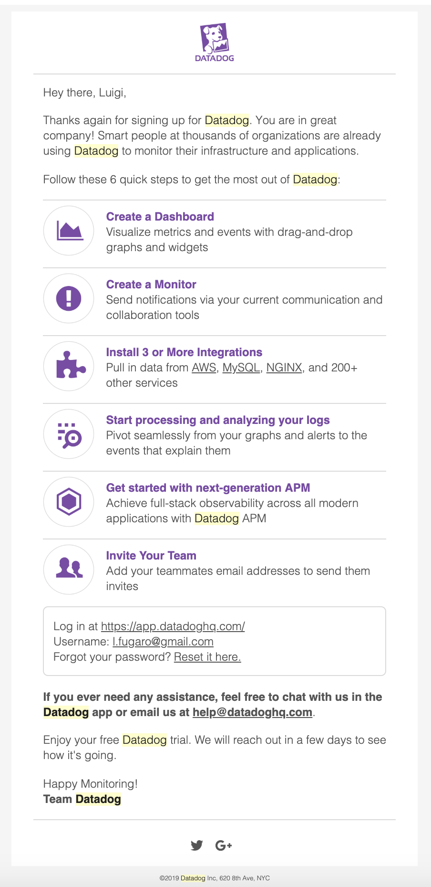

The signup process also provides a API KEY, which belongs to the account and it is used to run the Datadog Agent on the system.

## Docker
Docker is a piece of software that lets you create Linux containers with a specific image format, that is, the Docker image format.
Linux containers are a mash-up of functionalities available with the Linux kernel (that's why you often hear the phrase, Containers are Linux). Linux containers provide a lot of flexibility in regards to application deployment. As a matter of fact, not just the application gets deployed, but the entire software stack. And the software stack is made by the application itself, its dependencies, the operative system, and the tools and processes running in the operating system. Freezing the complete software stack gives tremendous portability capability.

Docker brought Linux containers to a large scale, providing a toolkit for developers and administrators.

Docker can be installed following the instructions described in the [https://www.docker.com](https://www.docker.com) site. There is a Docker software bundle specific for each platform such as Linux (Debian and Red Hat based), Windows, and Mac OS.

### Datadog Agent
Datadog provides a Docker container image that can be used by anyone, and once Docker is installed, the Datadog Docker image can be discovered issuing the following command in a terminal window:

```bash
# docker search datadog
NAME                                  DESCRIPTION                                     STARS               OFFICIAL            AUTOMATED
datadog/docker-dd-agent               Docker container for the Datadog Agent.         85                                      [OK]
datadog/agent                         Docker container for the new Datadog Agent      28
datadog/squid                         Squid proxy configurable container.             14
tutum/datadog-agent                   Datadog agent inside a container optimized f…   4
datadog/cluster-agent                 Docker container for the new Datadog Cluster…   3
datadog/docker-dogstatsd              DogStatsD Dockerfile for Trusted Builds.        3                                       [OK]
datadog/agent-dev                     Development builds for the Datadog Agent 6      2
datadog/dev-dd-agent                  Development and test builds for docker-dd-ag…   2                                       [OK]
datadog/docker-library                TBD                                             1                                       [OK]
datadog/dogstatsd                     Standalone DogStatsD image for custom metric…   1
datadog/docker-filter                 Filtering proxy for a read-only access to th…   1                                       [OK]
gridx/datadog-agent-arm32v7                                                           0
janeczku/datadog-rancher-init         Sidekick image for deploying DataDog Agent i…   0                                       [OK]
opendoor/datadog-agent                                                                0
pasientskyhosting/datadog-agent       Custom Datadog Agent                            0                                       [OK]
csdisco/datadog-docker-dd-agent       Storing the 'latest' datadog docker dd-agent…   0
mozorg/datadog-agent                  Datadog agent for use with Mozilla Deis clus…   0
goldstar/datadog                                                                      0
datadog/cluster-agent-dev             Datadog Cluster Agent - DCA | Dev images        0
cfgarden/datadog-event-resource                                                       0
datadog/datadog-agent-runner-circle   CircleCI test runner/builder (debian)           0                                       [OK]
concourse/datadog-event-resource                                                      0
datadog/dogstatsd-dev                 Development builds for DogStatsD 6              0
tinklabs/datadog-agent                                                                0
datadog/tokumx                        Tokumx image for testing the datadog integra…   0
```

And the Docker container image for the new Datadog Agent is named "datadog/agent". Before the Docker image can be run as container needs to be pulled locally, as follows:
```bash
# docker pull datadog/agent
```

Once the "datadog/agent" is downloaded and stored locally on the host, the container can be run.
To properly run the "datadog/Agent", a list of parameters need to be set, such as DD_API_KEY, DD_HOSTNAME, DD_TAGS, DD_APM_ENABLED.
* DD_API_KEY - Your Datadog API key (required);
* DD_HOSTNAME - Hostname to use for metrics (if autodetection fails);
* DD_TAGS - Host tags separated by spaces;
* DD_APM_ENABLED - Enable trace collection with the trace Agent.

The Datadog Agent can be run as container as follows:
```bash
# docker run -it --rm=true --hostname=datadog.foogaro.com --name dd-agent -v `pwd`/mysql.conf.yaml:/etc/datadog-agent/conf.d/mysql.d/conf.yaml:rw -v `pwd`/randomcheck.py:/etc/datadog-agent/checks.d/randomcheck.py:rw -v `pwd`/randomcheck.yaml:/etc/datadog-agent/conf.d/randomcheck.yaml:rw -v /var/run/docker.sock:/var/run/docker.sock:ro -v /proc/:/host/proc/:ro -v /sys/fs/cgroup/:/host/sys/fs/cgroup:ro -e DD_API_KEY=329e0c344a47864d92ae0342f3797b3b -e DD_TAGS=name\:luigi -e DD_TAGS=lastname\:fugaro -e DD_APM_ENABLED=true
```

The above command also includes some settings (such as configuration files, MySQL database integrations that are explained later in this guide) and environment variables, that are placed into the main configuration file, locate by default at the following path: ```/etc/datadog-agent/datadog.yaml```


### MySQL Database
MySQL database can be run in a different server, in the cloud or locally. To ease the example, MySQL will be installed locally along side the Datadog agent.

To install MySQL the following commands can be issued in a terminal window:
```bash
# wget –c https://dev.mysql.com/get/mysql-apt-config_0.8.11-1_all.deb
# sudo dpkg –i mysql-apt-config_0.8.10-1_all.deb
# sudo apt-get update
# sudo apt-get install mysql-server
```

This kind of setup sets an auto-generated root password, which can be retrieved as follows:

```bash
# cat /var/log/mysqld.log
2019-07-08T21:08:16.573123Z 0 [System] [MY-013169] [Server] /usr/sbin/mysqld (mysqld 8.0.16) initializing of server in progress as process 72
2019-07-08T21:08:18.544871Z 5 [Note] [MY-010454] [Server] A temporary password is generated for root@localhost: dbdp1uJ(S/gt
2019-07-08T21:08:20.241957Z 0 [System] [MY-013170] [Server] /usr/sbin/mysqld (mysqld 8.0.16) initializing of server has completed
```

Once the root password is revealed, it can be used to integrate the Datadog Agent. Eventually, MySQL root password can be changed to something more mnemonic, as follows:

```bash
# ALTER USER 'root'@'localhost' IDENTIFIED BY 'dataDog.2019';
```

The Datadog Agent needs to be able to read special tables on the database, and for such reason a specific user with specific grants needs to be created as follows:
```bash
CREATE USER 'datadog'@'localhost' IDENTIFIED WITH mysql_native_password by 'dataDog.2019';
ALTER USER 'datadog'@'localhost' WITH MAX_USER_CONNECTIONS 5;
GRANT REPLICATION CLIENT ON *.* TO 'datadog'@'localhost';
GRANT PROCESS ON *.* TO 'datadog'@'localhost';
GRANT SELECT ON performance_schema.* TO 'datadog'@'localhost';
```

Now that the database is ready to accept a user authentication as "datadog", the Datadog Agent itself needs the integration, that needs to know how to connect to the MySQL database.
As stated before, the database is running locally, therefore the integration will point to MySQL running on "localhost" listening on its default port which is 3306.

Datadog Agent relies on a specific folder to read all its integration points.
By default the folder with all the configuration is located at the following path: ```/etc/datadog-agent/conf.d```
For MySQL there is the subfolder ```mysql.d``` which contains the configuration file.
The configuration file named "conf.yaml" looks like the following:

```bash
init_config:

instances:
  - server: 127.0.0.1
    user: datadog # datadog
    pass: 'dataDog.2019' # from the CREATE USER step earlier
    port: 3306 # e.g. 3306
    options:
        replication: false
        galera_cluster: true
        extra_status_metrics: true
        extra_innodb_metrics: true
        extra_performance_metrics: true
        schema_size_metrics: false
        disable_innodb_metrics: false
```

The Datadog Agent needs to be restarted in order for the new configuration to take effect, and it can be restarted as follows:

```bash
kill -9 $(pidof process-agent)
s6-svstat /var/run/s6/services/process/
```

Once the main process is stopped, it is automatically rescheduled and a new process with a new process ID is generated.


## Collecting Metrics
Next paragraphs will focus on how to implement a python script which automatically generates some random value to be used for a metric called "my_metric". As described at the beginning, the purpose of the demo is to monitor a server, a database, a metric and an application. The metric can be thought as a service which is pulled by the Datadog Agent to read the metric.

### Implementation details
A metric sending a random integer value between "0" (zero) "1000" (one thousand).

#### Script Python
```python
from random import randint
from checks import AgentCheck
class RandomCheck(AgentCheck):
    def check(self, instance):
        self.gauge('my_metric', randint(0,1000))
```
The script is also available here [randomcheck.py](https://github.com/foogaro/hiring-engineers/blob/master/files/randomcheck.py).

The script must be located in the folder ```/etc/datadog-agent/checks.d```.

#### Integration
The integration, as previously described for the MySQL database, it is triggered by a file in the YAML format into the ```/etc/datadog-agent/conf.d``` folder. The file filename must be the same as its script filename, except for the file extension.

In this case:
* ```/etc/datadog-agent/checks.d/randomcheck.py```.
* ```/etc/datadog-agent/conf.d/randomcheck.yaml```.

The metric might need to be submitted at regular intervals, which by default are every 15 seconds. The value could be changed based on requirements, for example the metric needs to be submitted once every 45 seconds.
The resulting YAML file would look like the following:
```yaml
init_config:

instances:
  - min_collection_interval: 45
```

The YAML file provides separation of concern between implementation details and configuration, so that for example the interval can be changed without modifying the Python script at all. This kind of separation comes in hand for providing different behaviour for different environments, and the configuration can be put in place while provisioning the platform.

It's now time to really check what the Datadog Agent is collecting from the metric, the database and the host.

## Visualizing data
To visualize some data, connect to the Datadog site and login using the credentials provided during the Signup process.
Once logged connect to the following URL: [https://app.datadoghq.com/infrastructure/map](https://app.datadoghq.com/infrastructure/map)

### Host
The platform should display the host generic view with the tags previously configured, as follows:
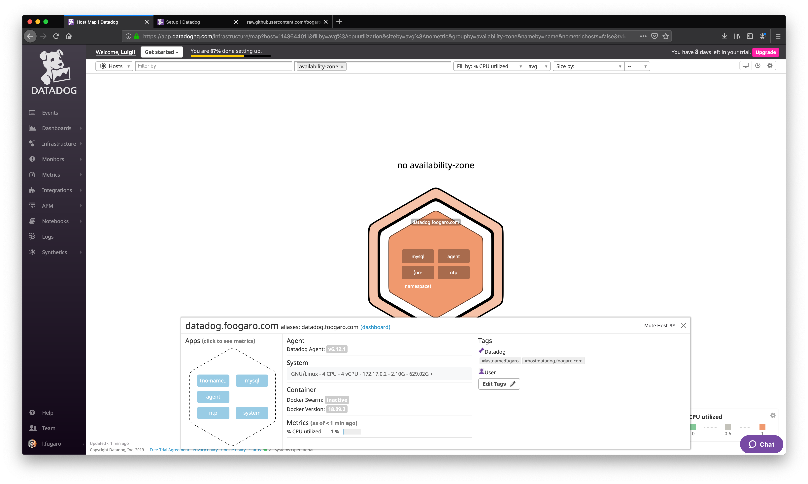

### Database
The platform should display the host generic view with the database previously configured, as follows:
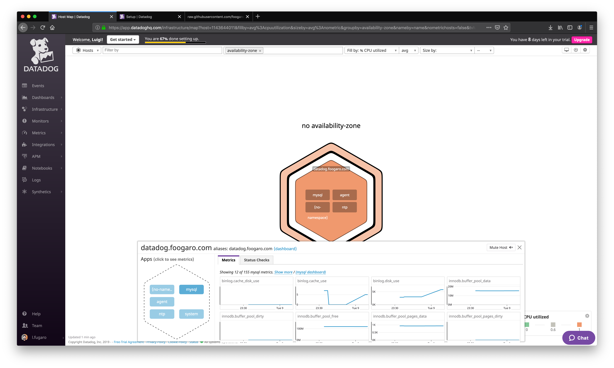

The database Integration should also be visible as validated in the integration section at the following URL: [https://app.datadoghq.com/account/settings#integrations/mysql](https://app.datadoghq.com/account/settings#integrations/mysql)

And the page should look like the following:
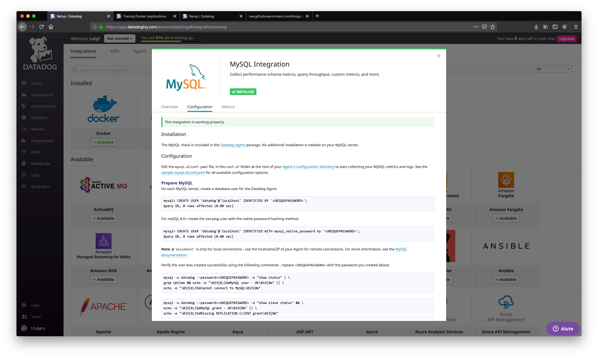

### Metric host scoped
The platform should display the host generic view with the metric previously configured, as follows:


The metric should also be visible in the metric section at the following URL: [https://app.datadoghq.com/metric/explorer](https://app.datadoghq.com/metric/explorer)

And the page should look like the following:
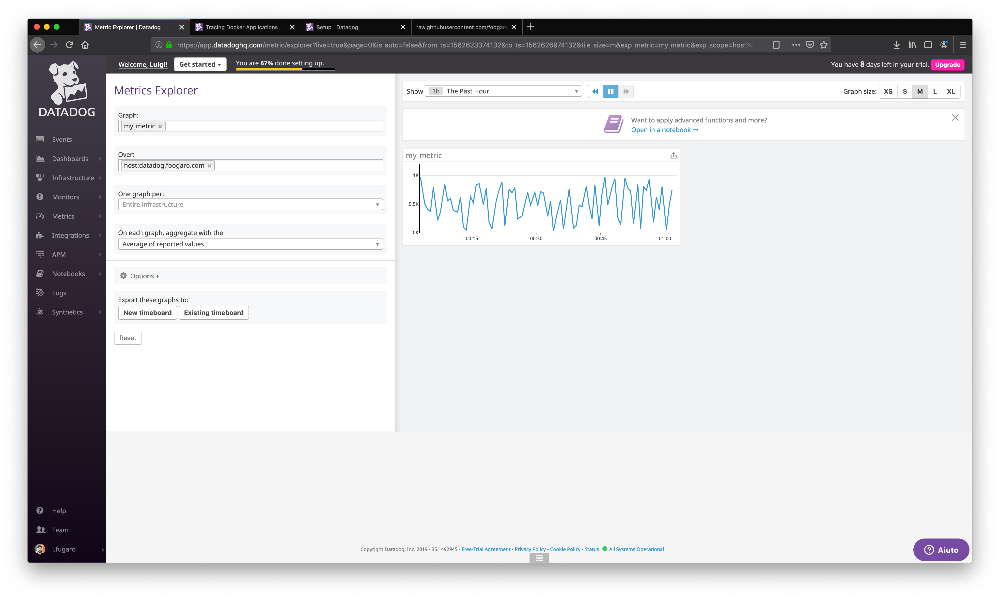

However, all the above single information can be grouped into a single view to better monitor the situation of the database and the metric.
In the next paragraph will be described how to create a single view called Timeboard, to show the state of the metric and the database in a time series scenario.

### Timeboard
A Timeboard can be created using the platform or its creation can be scripted in favor of automation, using the Datadog API.
For the above reasons a Python script will be used to create the Timeboard, which will graphically represent:
* The custom metric scoped over the host.
* Any metric from the Integration on the MySQL database with the anomaly function applied.
* The custom metric with the rollup function applied to sum up all the points for the past hour into one bucket.

And the script is the following:

```python
from Datadog import initialize, api

options = {
    'api_key': '329e0c344a47864d92ae0342f3797b3b',
    'app_key': 'a57a258b956ff7a5486da53dcb2c92c6e0926867'
}

initialize(**options)

title = "Hiring Engineer Timeboard"
description = "An informative timeboard."
graphs = [{
    "definition": {
        "events": [],
        "requests": [
            {"q": "avg:my_metric{host:datadog.foogaro.com}"}
        ],
        "viz": "timeseries"
    },
    "title": "Avg of my_metric over host:datadog.foogaro.com"
},
{
    "definition": {
        "events": [],
        "requests": [
            {"q": "avg:my_metric{host:datadog.foogaro.com}.rollup(sum, 3600)"}
        ],
        "viz": "query_value"
    },
    "title": "custom metric with the rollup function applied, 1 hour"
},
{
    "definition": {
        "events": [],
        "requests": [
            {"q": "anomalies(avg:mysql.net.connections{host:datadog.foogaro.com}, 'basic', 2)"}
        ],
        "viz": "timeseries"
    },
    "title": "Avg of mysql.net.connections, with anomaly detection applied"
}]

template_variables = [{
    "name": "host1",
    "prefix": "host",
    "default": "host:datadog"
}]

read_only = True
api.Timeboard.create(title=title,
                     description=description,
                     graphs=graphs,
                     template_variables=template_variables,
                     read_only=read_only)
```

The Python script to create the Timeboard, it is available for download at the following link:

[https://github.com/foogaro/hiring-engineers/blob/master/files/timeboard.py](https://github.com/foogaro/hiring-engineers/blob/master/files/timeboard.py).

The script can be launched in a terminal window with the following command:
```bash
# python3 timeboard.py
```

The above command should create the dashboard that can be viewed at the following link:
[https://app.datadoghq.com/dashboard/lists](https://app.datadoghq.com/dashboard/lists)

A list of available dashboards should appear, as depicted below:
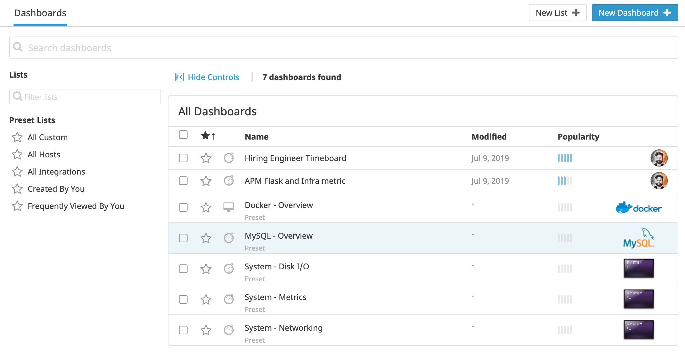

Click on the "Hiring Engineer Timeboard", and the resulting dashboard should look like the following:


The Timeboard, as its name suggests, shows metric's values overtime, and this time can also be adjusted to have insight for a specific period, like for example the last 5 minutes, as shown below:
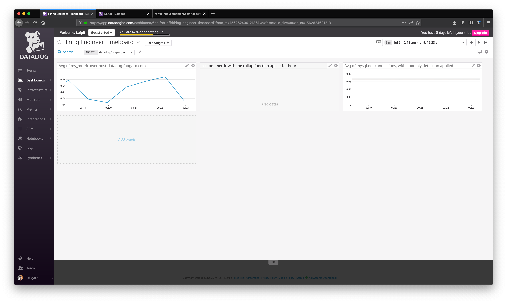

In this case the insight shows up something important that needs to be shared, the user can take a snapshot and use the @ notation to send it to other people of the team, as shown below:
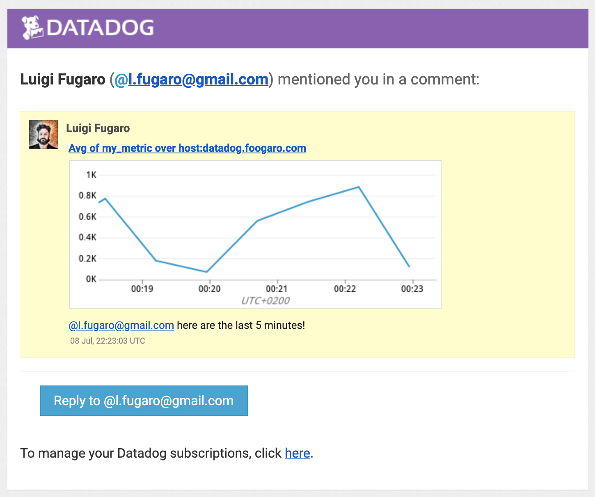


## Monitoring Data
Looking at a dashboard overtime can be tedious and the team in charge of looking at the graphs can do other tasks and be more productive. For this case the Datadog platform provides an automatic mechanism to monitor the data based on threshold, on which some actions might be taken.

The platform can create a new Metric Monitor that watches the average of the custom metric (my_metric) and will alert if it’s above the following values over the past 5 minutes:
* Warning threshold of 500
* Alerting threshold of 800
* Notify if there is No Data for this query over the past 10m.

### Threshold
The threshold can be set in the Monitor section at the following URL: [https://app.datadoghq.com/monitors#create/metric](https://app.datadoghq.com/monitors#create/metric)

And the configuration are the following:
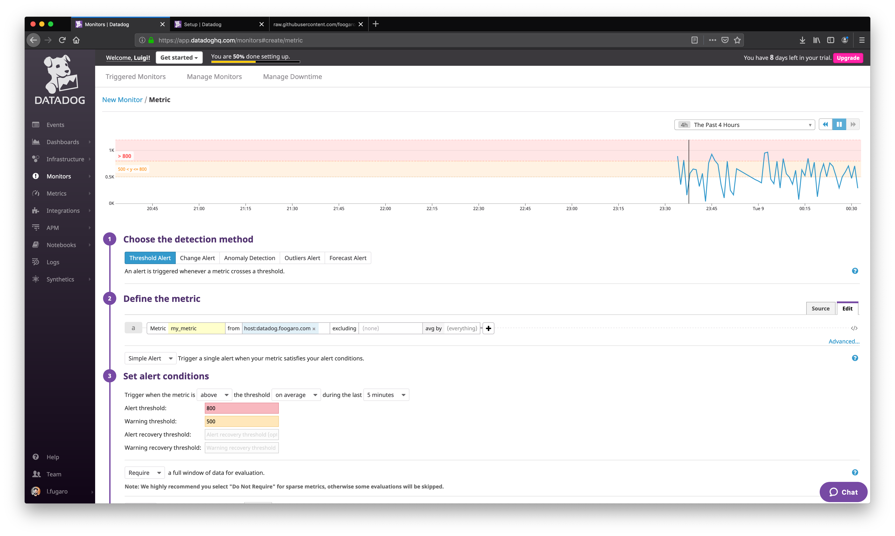
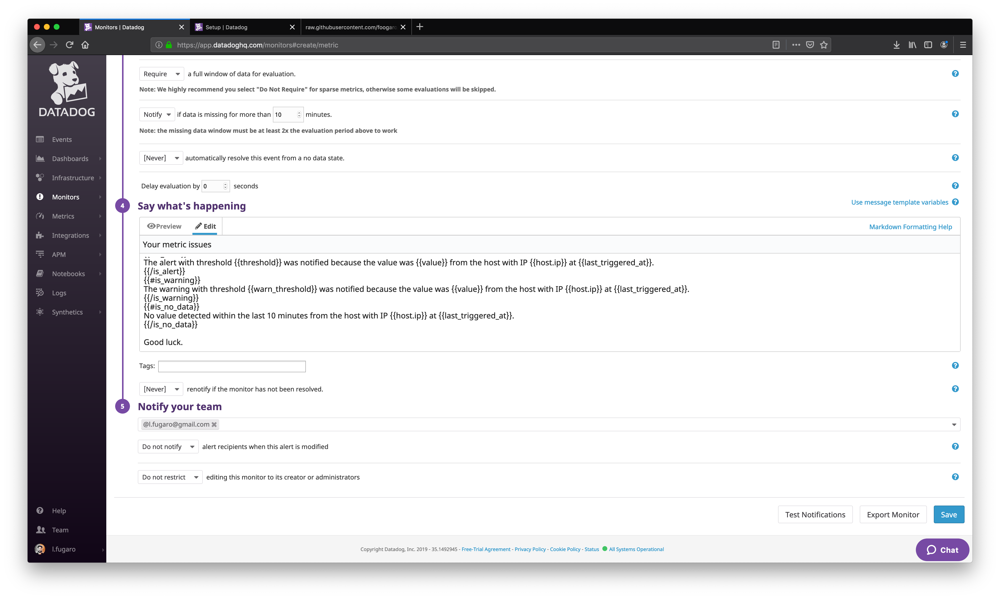

Furthermore, the Monitor feature provides the capability to send custom email to notify the user about the value of the metric.

### Notification
For example, the monitor can configure monitor’s message so that it will:
* Send an email whenever the monitor triggers.
* Create different messages based on whether the monitor is in an Alert, Warning, or No Data state.
* Include the metric value that caused the monitor to trigger and host ip when the Monitor triggers an Alert state.

The message configuration is the following:
```
Hi @l.fugaro@gmail.com

The APM states:
{{#is_alert}}
The alert with threshold {{threshold}} was notified because the value was {{value}} from the host with IP {{host.ip}} at {{last_triggered_at}}.
{{/is_alert}}
{{#is_warning}}
The warning with threshold {{warn_threshold}} was notified because the value was {{value}} from the host with IP {{host.ip}} at {{last_triggered_at}}.
{{/is_warning}}
{{#is_no_data}}
No value detected within the last 10 minutes from the host with IP {{host.ip}} at {{last_triggered_at}}.
{{/is_no_data}}

Good luck.
```

#### Email
Whenever the monitor is triggered and the conditions are met, it will send an email, as the following:
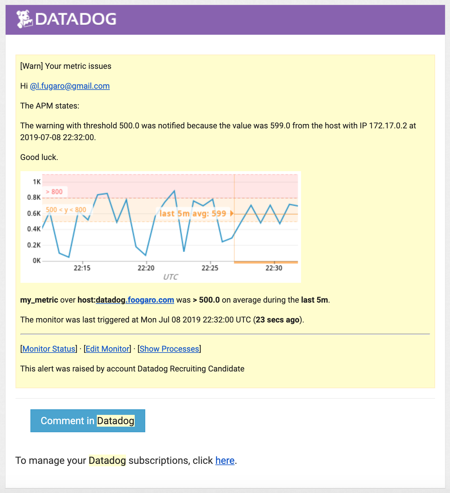

#### Alternatives
However, notifications are meant to be useful whenever someone on the team can react to a problem. Nonetheless, notification can be sent only in a certain period, and silenced in a different period, or during a scheduled downtime. For example the monitor can be configured such that:
* silences it from 7pm to 9am daily on M-F,
* silences it all day on Sat-Sun.

And here are the relative configuration:
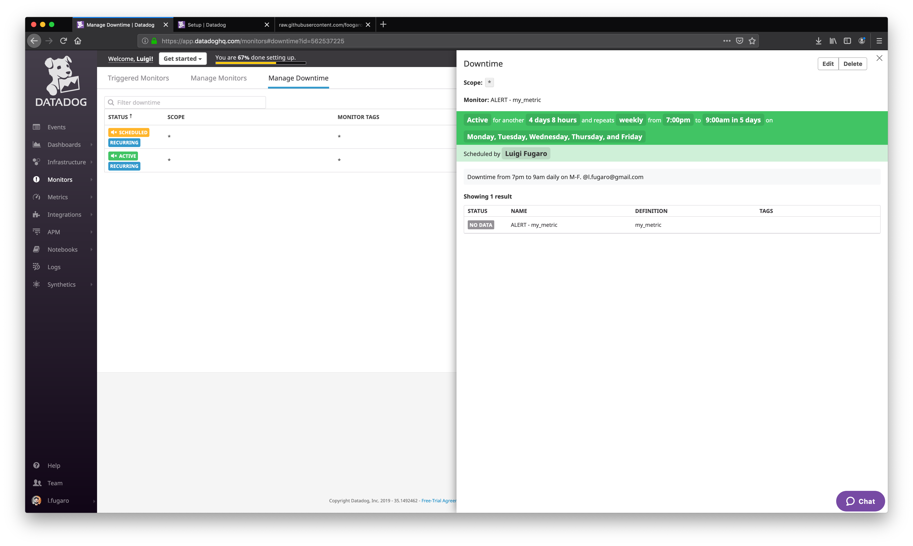
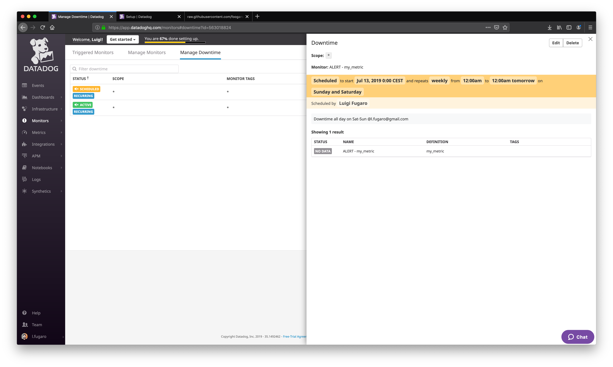

A reminder is sent via email when the downtime is triggered (started or stopped), as shown below for the two above mentioned cases:
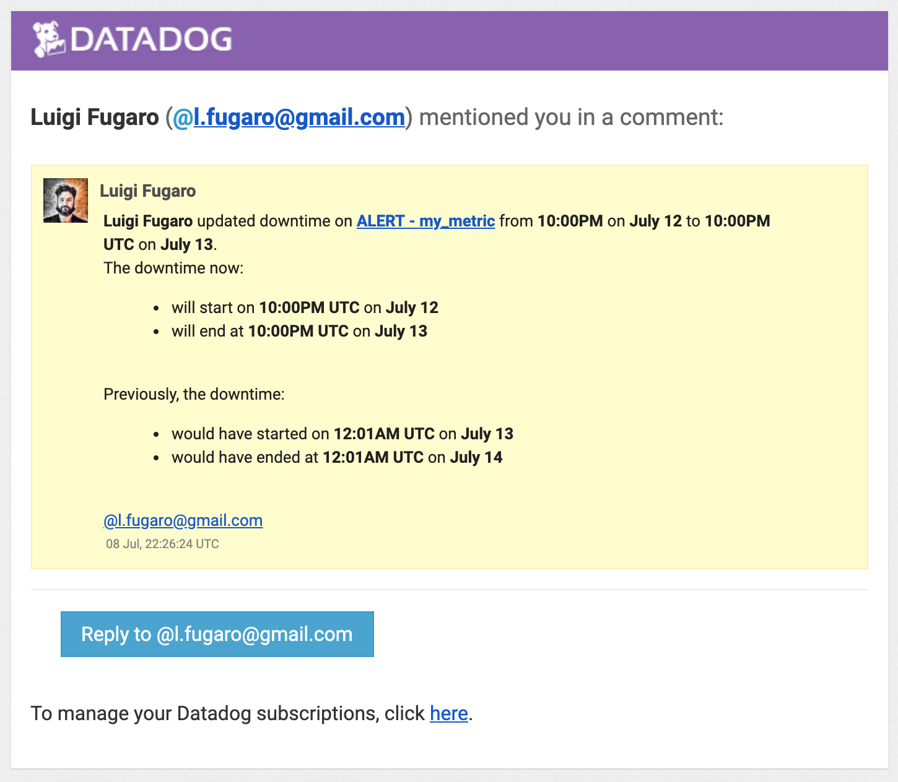
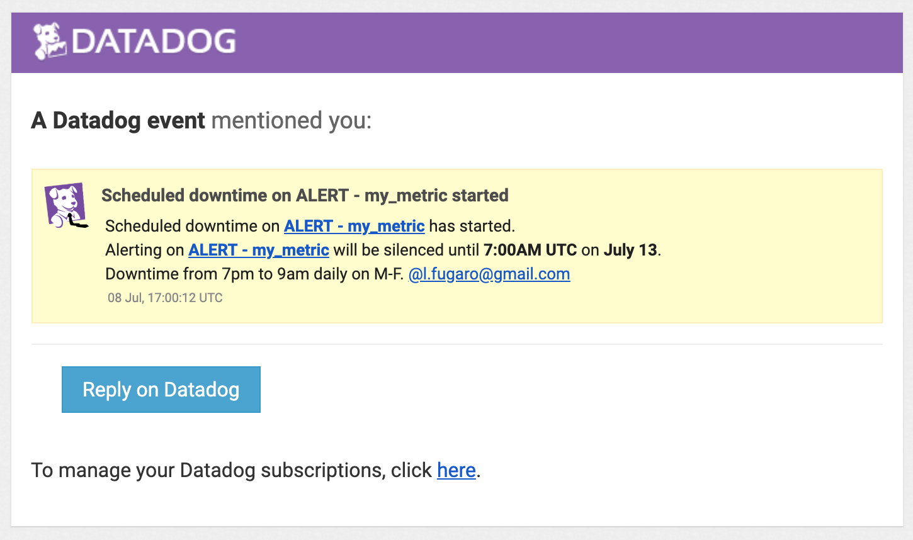

## Collecting APM Data
As described at the beginning, Datadog Agent can collect metrics in a full-stack fashion, top-down, from the host to the application level, to check, verify and detect performance issues.
Transaction traces, application health, throughput, latency, can be collected and monitored with Datadog APM.

### Flask Application
A REST application can be monitored/traced using the Datadog Trace capabilities. Given the following Flask app instrument this using Datadog’s APM solution:

```python
from flask import Flask
import logging
import sys

# Have flask use stdout as the logger
main_logger = logging.getLogger()
main_logger.setLevel(logging.DEBUG)
c = logging.StreamHandler(sys.stdout)
formatter = logging.Formatter('%(asctime)s - %(name)s - %(levelname)s - %(message)s')
c.setFormatter(formatter)
main_logger.addHandler(c)

app = Flask(__name__)

@app.route('/')
def api_entry():
    return 'Entrypoint to the Application'

@app.route('/api/apm')
def apm_endpoint():
    return 'Getting APM Started'

@app.route('/api/trace')
def trace_endpoint():
    return 'Posting Traces'

if __name__ == '__main__':
    app.run(host='0.0.0.0', port='5050')
```

### ddtrace-run
The application can be monitored by running the application with Python and Datadog Trace, as follows:
```bash
# ddtrace-run python3 apm_flask.py
```

### Dashboard
The application Flask can be downloaded from the following URL:

[https://github.com/foogaro/hiring-engineers/blob/master/files/apm_flask.py](https://github.com/foogaro/hiring-engineers/blob/master/files/apm_flask.py).

The application REST API can be invoked using cURL from a terminal window to quickly repeat the call, as follows:
```bash
# curl http://localhost:5050/api/apm
```

The trace of the application collected by the Datadog platform can be viewed also with other metrics, for example with the custom metric, as shown below:


## Conclusion
Datadog monitoring provides a full set of features such as Analytics, Infrastructure Monitoring, and APM.
The scenario in which the platform can be adopted and promoted are really heterogeneous, from the industry sector to the manufacturing sector, weather, IoT, really any scenario.
The Datadog platform could be also used to monitor buildings, by a domotic point of view. As ingle apartment or a building composed by several apartments and lofts, can monitor:
* energy efficiency
* set threshold to automatically switch on or off devices (such as heater, air conditioning, and so on)
* resource consumption;

Everything could be automated to prevent waste of money and resources, to less impact on the environment and contribute to a green environment.
