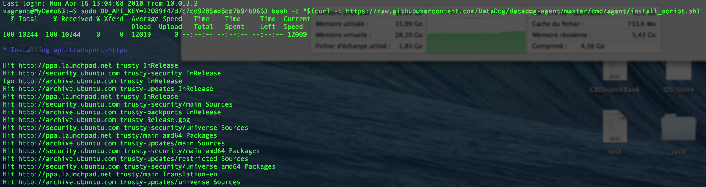
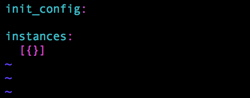

## The Exercise

Don’t forget to read the [References](https://github.com/DataDog/hiring-engineers/blob/solutions-engineer/README.md#references)

## Questions

Please provide screenshots and code snippets for all steps.

## Prerequisites - Setup the environment

Installation on a vagrant VM using ubuntu with JRS (Tomcat + Postgres + Apache2 installed).
Just packaged an existing one I am using daily for demo and POCs.
I did not want to up a new one in order to have some data etc directly up and ready.

### Installation of Datadog:



### Datadog is now up and running :


## Collecting Metrics:

* Add tags in the Agent config file and show us a screenshot of your host and its tags on the Host Map page in Datadog.

  * The configuration file is here: [datadog.yaml](conf/datadog.yaml)
  * The configuration screenshot:
  
  * The Host Map screenshot:
  
  
  Remark: I changed the hostname several times in datadog.yaml and yet the previous name still appear. They disappeared some minutes after.


* Install a database on your machine (MongoDB, MySQL, or PostgreSQL) and then install the respective Datadog integration for that database.

  * Installation of PostgreSQL already made (as well as MySQL , Tomcat, apache2).
  * Configuration of the Integration:
    * psql -h localhost -U datadog postgres -c "select * from pg_stat_database LIMIT(1);"&& echo -e "\e[0;32mPostgres connection - OK\e[0m" || \ ||echo -e "\e[0;31mCannot connect to Postgres\e[0m"
    * Configuration file : [postgres.yaml](conf/conf.d/postgres.yaml)
    * Configuration Screenshot:
    
    
  * I made further integrations with Java and Tomcat : 
    * Java JMX Configuration file : [jmx.yaml](conf/conf.d/jmx.yaml)
    * Tomcat Configuration file : [tomcat.yaml](conf/conf.d/tomcat.yaml)
    
    
    
* Create a custom Agent check that submits a metric named my_metric with a random value between 0 and 1000.

  * Configuration Screenshot :
  
  
  * Custom Metric Script: [customagentcheck.py](conf/check.d/customagentcheck.py)
  * Custom Metric Script screenshot:
  
  * Status after Datadog Agent restart:
  
  * Let's visualize if our metric is accessible fromt he WEB UI:
  
  
* Change your check's collection interval so that it only submits the metric once every 45 seconds.

  * Configuration Screenshot:
  
  * Custom Metric Configuration File: [customagentcheck.yaml](conf/conf.d/customagentcheck.yaml)
  * Collector : 1 Run for the customagentcheck while 3 for the others => default frequency time is 15s => OK
  
  
  * From the WEB UI:
  
  
* **Bonus Question** Can you change the collection interval without modifying the Python check file you created?

  * I did not use the python check file but only the .yaml at the instance level
  From the documentation :
  "For Agent 5, min_collection_interval can be added to the init_config section to help define how often the check should be run globally,
  or defined at the instance level. For Agent 6, min_collection_interval must be added at an instance level, and can be configured
  individually for each instance."
  CCL: So to me it is not suggested as a good solution to put it in python file, it makes sense to me that somehow the agent keep the
  control/power on when executing the check and somehow defining it at yaml level permits it.

## Visualizing Data:

Utilize the Datadog API to create a Timeboard that contains:

* Your custom metric scoped over your host.
* Any metric from the Integration on your Database with the anomaly function applied.
  * Usage of the UI to configure and generate the relevant JSON, screenshot: 
  
* Your custom metric with the rollup function applied to sum up all the points for the past hour into one bucket
  * Usage of the UI to configure and generate the relevant JSON, screenshot: 
  

Please be sure, when submitting your hiring challenge, to include the script that you've used to create this Timemboard.
  
  * Please find the script there : [customtimeboard.py](src/customtimeboard.py)

Once this is created, access the Dashboard from your Dashboard List in the UI:

  * By Default Dashboard Screenshot : 
  

* Set the Timeboard's timeframe to the past 5 minutes
* Take a snapshot of this graph and use the @ notation to send it to yourself.

  * Snapshot Definition screenshot: 
  

* **Bonus Question**: What is the Anomaly graph displaying?

  * The received email with 5m timeframe: 
  
  * The anomalies function learn from the past of a given metric to try to establish what is the normal behavior of this metric. If the timeframe is too short its more complicated for the algorithm to get sufficient data to make relevant analysis.
  * The received email with 1H timeframe: 
  
  * Here we can see that with 1H data the algorithm is able to establish some "normal behavior zone" in grey. 
  

## Monitoring Data

Since you’ve already caught your test metric going above 800 once, you don’t want to have to continually watch this dashboard to be alerted when it goes above 800 again. So let’s make life easier by creating a monitor.

Create a new Metric Monitor that watches the average of your custom metric (my_metric) and will alert if it’s above the following values over the past 5 minutes:

* Warning threshold of 500
* Alerting threshold of 800
* And also ensure that it will notify you if there is No Data for this query over the past 10m.

  * Configuration screen with UI : 
  
  

Please configure the monitor’s message so that it will:

* Send you an email whenever the monitor triggers.
* Create different messages based on whether the monitor is in an Alert, Warning, or No Data state.
* Include the metric value that caused the monitor to trigger and host ip when the Monitor triggers an Alert state.

  * 
  
* When this monitor sends you an email notification, take a screenshot of the email that it sends you.

  * When 800 > my_metric > 500
  
  * When my_metric > 800
  
  * When No Data
  


* **Bonus Question**: Since this monitor is going to alert pretty often, you don’t want to be alerted when you are out of the office. Set up two scheduled downtimes for this monitor:

    * One that silences it from 7pm to 9am daily on M-F,
    
    * And one that silences it all day on Sat-Sun.
    
    * Make sure that your email is notified when you schedule the downtime and take a screenshot of that notification.
    
    


## Collecting APM Data:

Given the following Flask app (or any Python/Ruby/Go app of your choice) instrument this using Datadog’s APM solution:

```
from flask import Flask
import logging
import sys

# Have flask use stdout as the logger
main_logger = logging.getLogger()
main_logger.setLevel(logging.DEBUG)
c = logging.StreamHandler(sys.stdout)
formatter = logging.Formatter('%(asctime)s - %(name)s - %(levelname)s - %(message)s')
c.setFormatter(formatter)
main_logger.addHandler(c)

app = Flask(__name__)

@app.route('/')
def api_entry():
    return 'Entrypoint to the Application'

@app.route('/api/apm')
def apm_endpoint():
    return 'Getting APM Started'

@app.route('/api/trace')
def trace_endpoint():
    return 'Posting Traces'

if __name__ == '__main__':
    app.run()
```    
  * Please find the source of the instrumented app there : [collectapm.py](src/collectapm.py)
  
  I only added two rest call to Datadog API to return some Json ie. more data in order to get some network traffic to analyse in dashboard later.
  
  * Runned as Flask application or usual Python obviously give the same result: 
  
      `export FLASK_APP=/vagrant/collectapm.py`
      
      `ddtrace-run python -m flask run --host=0.0.0.0 --port=10000`
      
      
      OR
      
      `ddtrace-run python collectapm.py`
      
* **Note**: Using both ddtrace-run and manually inserting the Middleware has been known to cause issues. Please only use one or the other.

* **Bonus Question**: What is the difference between a Service and a Resource?

  ### Service : 
  The name of a set of processes that work together to provide a feature set. For instance if an application need a webapp and a database to wrok, the webapp will be a service and the database another one. 
  In this exercie collectapm.py exposes one service.
  
  ### Resource :
  It's a particular query to a given service. Regarding a database it is simply the SQL of a query, regarding a webapp it will be a canonical URL ...
  In our Exercice any route exposed are resources ( '/api/trace' , '/api/dashboards' ,'/api/timeboards')

Provide a link and a screenshot of a Dashboard with both APM and Infrastructure Metrics.

  * The link : https://p.datadoghq.com/sb/7325eb6d3-b16752b25a33a734c8c895b491112c7b
  * The Screenshot : 
  
  

Please include your fully instrumented app in your submission, as well.

## Final Question:

Datadog has been used in a lot of creative ways in the past. We’ve written some blog posts about using Datadog to monitor the NYC Subway System, Pokemon Go, and even office restroom availability!

Is there anything creative you would use Datadog for?

  * Quickly I can think on monitoring the availability of Vélib in different stations within Paris (or whatever the city who propose bikes) as they expose open data for this .
  * Any domotized building could be monitored using datadog.

## Instructions

If you have a question, create an issue in this repository.

To submit your answers:

* Fork this repo.
* Answer the questions in answers.md
* Commit as much code as you need to support your answers.
* Submit a pull request.
* Don't forget to include links to your dashboard(s), even better links and screenshots. We recommend that you include your screenshots inline with your answers.

## References

### How to get started with Datadog
* [Datadog overview](http://docs.datadoghq.com/overview/)
* [Guide to graphing in Datadog](http://docs.datadoghq.com/graphing/)
* [Guide to monitoring in Datadog](http://docs.datadoghq.com/guides/monitoring/)

### The Datadog Agent and Metrics

* [Guide to the Agent](http://docs.datadoghq.com/guides/basic_agent_usage/)
* [Datadog Docker-image repo](https://hub.docker.com/r/datadog/docker-dd-agent/)
* [Writing an Agent check](http://docs.datadoghq.com/guides/agent_checks/)
* [Datadog API](https://docs.datadoghq.com/api/)

### APM
* [Datadog Tracing Docs](https://docs.datadoghq.com/tracing)
* [Flask Introduction](http://flask.pocoo.org/docs/0.12/quickstart/)

### Vagrant
 * [Setting Up Vagrant](https://www.vagrantup.com/intro/getting-started/)

### Other questions:

* [Datadog Help Center](https://help.datadoghq.com/hc/en-us)
