# Introduction
This document will run through the DataDog hiring challenge described here:
https://github.com/DataDog/hiring-engineers/blob/solutions-engineer/README.md

# Environment Setup

To complete this challenge I'm using a laptop with running on Mac OS 10.12 Sierra.

We need to:
- Install *Virtualbox* (to manage Virtual Machines),
- Install *vagrant* (a tool to quickly install a virtual machines)
- Install Ubuntu with vagrant (see below)


Once the vm is up and running let's ssh into with

`vagrant ssh`


Meanwhile we need also to create an account for DataDog.
Register using "Recruiting Candidate" as company.

Then select the services you'll run (e.g MySQL, Python) - optional.

# Install the Agent


Then you need to install the main component to let DataDog works: the agent on the VM.

Select "Ubuntu" and copy and paste the handy installation script into the ubuntu shell


When trying to run the installation command, it will fail because there is no curl installed


THe solution is simple then (and it's even explained in the following line) Let's then install curl!

`vagrant@precise64:~$ sudo apt-get install curl`


Run it again now:

`vagrant@precise64:~$ DD_API_KEY=ff3c5f106b1e280f6be82c1e535a5dea bash -c "$(curl -L https://raw.githubusercontent.com/DataDog/datadog-agent/master/cmd/agent/install_script.sh)"`


wait for the installation to finish and for the agent to connect to the DataDog server.

This is what you'll see at the end if the installation is successfull


And the DataDog webpage you'll also see that the agent is reporting


So far so good!

# Challenges
## Collecting Metrics


##### Add tags in the Agent config file and show us a screenshot of your host and its tags on the Host Map page in Datadog.

Become root (or use sudo before each command)

`sudo su`

Then open the datadog.yaml file

`root@precise64:/home/vagrant# vi /etc/datadog-agent/datadog.yaml`


Remove the comments and modify as needed

Note: having multiple line for the tags may cause problem.


restart the Agent

```
vagrant@precise64:~$ sudo stop datadog-agent
datadog-agent stop/waiting

vagrant@precise64:~$ sudo start datadog-agent
datadog-agent start/running, process 3908

```


From the DataDog Dashboard our host is finally visible with the right tags


To play around I've also created a metric for dashboard


##### Install a database on your machine (MongoDB, MySQL, or PostgreSQL) and then install the respective Datadog integration for that database.

Let's install mysql first

`vagrant@precise64:~$ sudo apt-get install mysql-server`

Provide a password for mysql root access (e.g. test)

From the DataDog website, go into Integration, select mysql and install


Follow the instructions in the config page:


I had to make some small modification to the script to run the it as the DB user root ( `-uroot`) and ask for password (`-p`)

```
vagrant@precise64:~$ sudo mysql -uroot -p -e "CREATE USER 'datadog'@'localhost' IDENTIFIED BY '6NdoTrXndcwJUlR5g[KOjUQj';"
```

```
vagrant@precise64:~$ sudo mysql -uroot -p -e "GRANT REPLICATION CLIENT ON *.* TO 'datadog'@'localhost' WITH MAX_USER_CONNECTIONS 5;"
```

insert the password you setup for the root account

```
sudo mysql -uroot -p -e "GRANT PROCESS ON *.* TO 'datadog'@'localhost';"

sudo mysql -uroot -p -e "GRANT SELECT ON performance_schema.* TO 'datadog'@'localhost';"
```

Let's run the verification command and check the output:


All good!


Now we need to install the mysql agent:
From the instruction on the next DataDog page:


Let's first copy the conf.yaml.example file into the conf.d folder (and rename it=)

```
vagrant@precise64:~$ sudo cp /etc/datadog-agent/conf.d/mysql.d/conf.yaml.example /etc/datadog-agent/conf.d/mysql.yaml
vagrant@precise64:~$ sudo nano /etc/datadog-agent/conf.d/mysql.yaml
```

Before


After


```
init_config:

instances:
    # NOTE: Even if the server name is "localhost", the agent will connect to MySQL using TCP/IP, unless you also
    # provide a value for the sock key (below).
  - server: localhost
    user: datadog    
    pass: 6NdoTrXndcwJUlR5g[KOjUQj
    port: 3306             # Optional
    # sock: /path/to/sock    # Connect via Unix Socket
    # defaults_file: my.cnf  # Alternate configuration mechanism
    # connect_timeout: None  # Optional integer seconds
    tags:                  # Optional
      - optional_tag1
      - optional_tag2
    options:               # Optional
      replication: 0    
    #   replication_channel: channel_1  # If using multiple sources, the channel name to monitor
   #   replication_non_blocking_status: false  # grab slave count in non-blocking manner (req. performance_schema)
      galera_cluster: 1
```


Restart the Agent

```
sudo datadog-agent status
```

Run the check
```
sudo datadog-agent status
```


##### Create a custom Agent check that submits a metric named my_metric with a random value between 0 and 1000.


For more information, read the tutorial here:
https://docs.datadoghq.com/agent/agent_checks/

Create a custom check config:
`/etc/datadog-agent/conf.d/mycheck.yaml`


```
vagrant@precise64:/etc/datadog-agent/conf.d$ cat mycheck.yaml
init_config:

instances:
   [{
      min_collection_interval: 1
   }]
   ```


And then the custom check code(make sure to use the same name):
`/etc/datadog-agent/checks.d/mycheck.py`

 


```
vagrant@precise64:/etc/datadog-agent/checks.d$ cat mycheck.py
import random
from checks import AgentCheck
class mycheck(AgentCheck):
    def check(self, instance):
        self.gauge('test.my_metric', random.random()*1000)
```

Check if the custom agent is working
```
sudo datatog-agent check mycheck
```


Now we can see on the DataDog app the metric being sent! Well done!


##### Change your check's collection interval so that it only submits the metric once every 45 seconds.

To do that let's change the config file we created before. We need to add a parameter: `min_collection_interval` defined in second.

```
vagrant@precise64:/etc/datadog-agent/conf.d$ sudo cat mycheck.yaml
init_config:

instances:
   [{
      min_collection_interval: 45
   }]
```
##### Bonus Question Can you change the collection interval without modifying the Python check file you created?

?????


## Visualizing Data:
##### Utilize the Datadog API to create a Timeboard that contains:

- Your custom metric scoped over your host.
- Any metric from the Integration on your Database with the anomaly function applied.
- Your custom metric with the rollup function applied to sum up all the points for the past hour into one bucket

Let's first create the API integration: in the DataDog app go to Integration/API

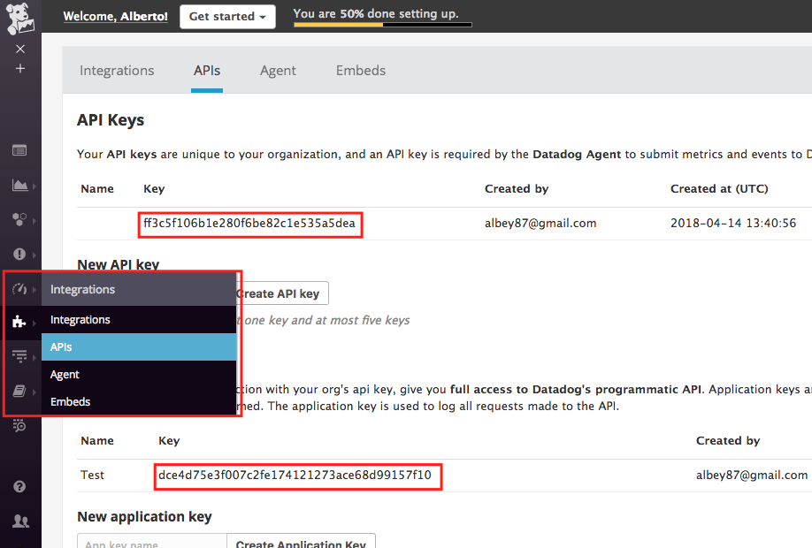

Save the two keys you'll need for authentication

```
api_key=ff3c5f106b1e280f6be82c1e535a5dea
app_key=dce4d75e3f007c2fe174121273ace68d99157f10
```

There are several way to make an API call. I've used POSTman

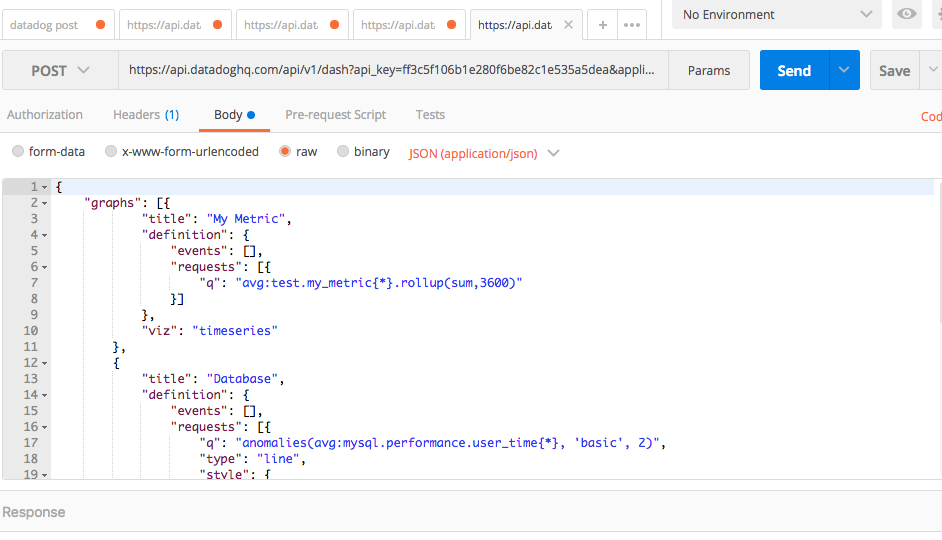

Key information about this API call:

- ###### Your custom metric scoped over your host.
  -  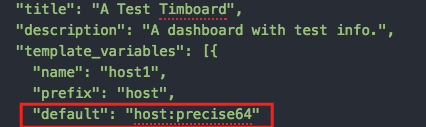
- ###### Any metric from the Integration on your Database with the anomaly function applied
  - 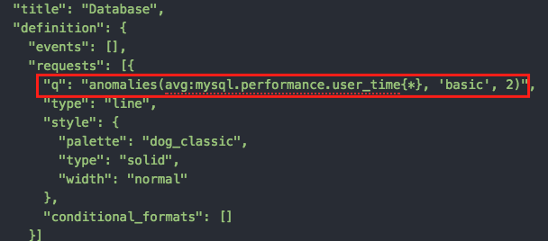
- Your custom metric with the rollup function applied to sum up all the points for the past hour into one bucket
  - 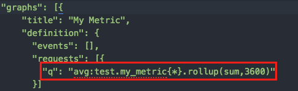

If you are not sure about the syntax, you can go on the DataDog GUI, create a dashboard and look at the code

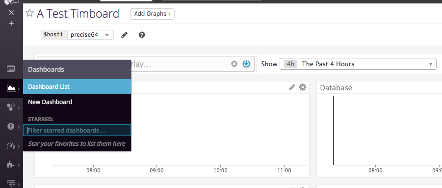

Edit a metric (click on the pencil)

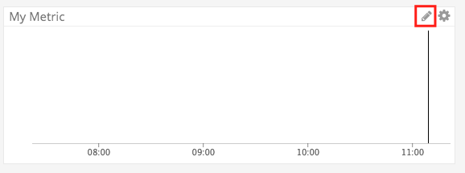

Add the relevant function (e.g. Anomalies)
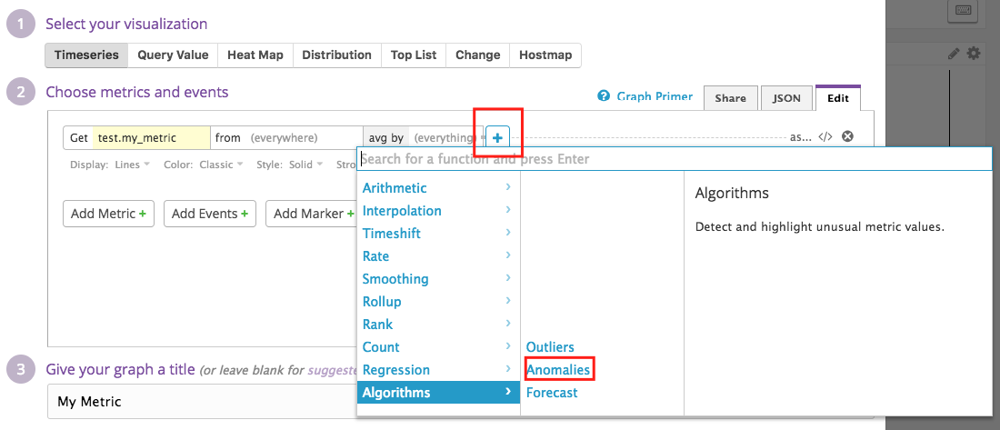

Then look at the JSON code:

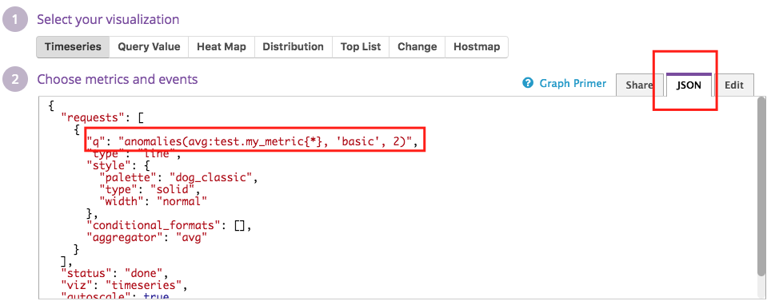

This is the resulting API call:

```
curl  -X POST -H "Content-type: application/json" \
-d '{
	"graphs": [{
			"title": "My Metric",
			"definition": {
				"events": [],
				"requests": [{
					"q": "avg:test.my_metric{*}.rollup(sum,3600)"
				}]
			},
			"viz": "timeseries"
		},
		{
			"title": "Database",
			"definition": {
				"events": [],
				"requests": [{
					"q": "anomalies(avg:mysql.performance.user_time{*}, 'basic', 2)",
					"type": "line",
					"style": {
						"palette": "dog_classic",
						"type": "solid",
						"width": "normal"
					},
          "conditional_formats": []
				}]
			},
			"viz": "timeseries"
		}
	],
	"title": "A Test Timboard",
	"description": "A dashboard with test info.",
	"template_variables": [{
		"name": "host1",
		"prefix": "host",
		"default": "host:precise64"
	}],
	"read_only": "True"
}' \
"https://api.datadoghq.com/api/v1/dash?api_key=${api_key}&application_key=${app_key}"
```

That is the answer:

```
{
    "dash": {
        "read_only": true,
        "graphs": [
            {
                "definition": {
                    "requests": [
                        {
                            "q": "avg:test.my_metric{*}.rollup(sum,3600)"
                        }
                    ],
                    "events": []
                },
                "title": "My Metric"
            },
            {
                "definition": {
                    "requests": [
                        {
                            "q": "anomalies(avg:mysql.performance.user_time{*}, 'basic', 2)",
                            "style": {
                                "width": "normal",
                                "palette": "dog_classic",
                                "type": "solid"
                            },
                            "type": "line",
                            "conditional_formats": []
                        }
                    ],
                    "events": []
                },
                "title": "Database"
            }
        ],
        "template_variables": [
            {
                "default": "host:precise64",
                "prefix": "host",
                "name": "host1"
            }
        ],
        "description": "A dashboard with test info.",
        "title": "A 2nd Test Timboard",
        "created": "2018-04-15T18:53:27.439772+00:00",
        "id": 786370,
        "created_by": {
            "disabled": false,
            "handle": "albey87@gmail.com",
            "name": "Alberto De Ronzi",
            "is_admin": true,
            "role": null,
            "access_role": "adm",
            "verified": true,
            "email": "albey87@gmail.com",
            "icon": "https://secure.gravatar.com/avatar/b1591c8b06c04f271df41ba3ed655a3b?s=48&d=retro"
        },
        "modified": "2018-04-15T18:53:27.449562+00:00"
    },
    "url": "/dash/786370/a-2nd-test-timboard",
    "resource": "/api/v1/dash/786370"
}
```

And this is the resulting dashboard:

Just anomalies
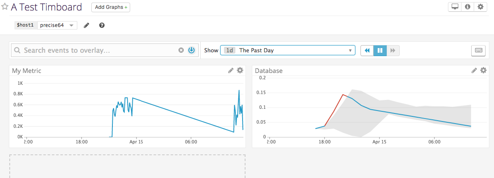

1 Hour Bucket
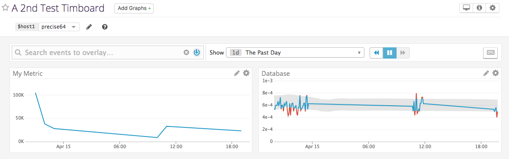

##### Once this is created, access the Dashboard from your Dashboard List in the UI:

- ###### Set the Timeboard's timeframe to the past 5 minutes
  - On the graph, select the last portion of the line and in the "Show" section you'll see `5m`
- Take a snapshot of this graph and use the @ notation to send it to yourself.
- Bonus Question: What is the Anomaly graph displaying?
  - The anomaly is marking when the metric deviate from the average value.


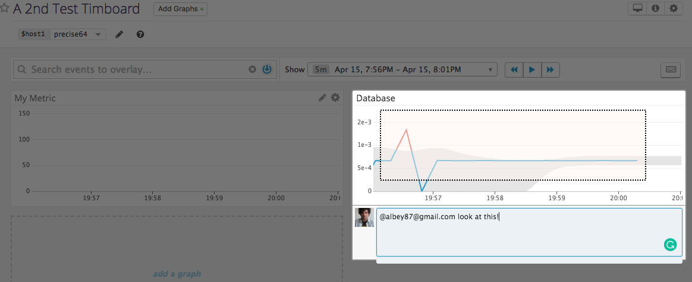

This is the email I received with the notification:

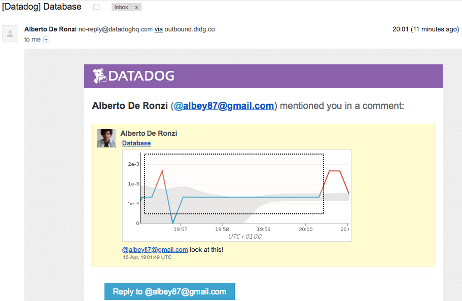

## Monitoring Data

##### Since you’ve already caught your test metric going above 800 once, you don’t want to have to continually watch this dashboard to be alerted when it goes above 800 again. So let’s make life easier by creating a monitor.
##### Create a new Metric Monitor that watches the average of your custom metric (my_metric) and will alert if it’s above the following values over the past 5 minutes:

- Warning threshold of 500
- Alerting threshold of 800
- And also ensure that it will notify you if there is No Data for this query over the past 10m.

From the Datadog GUI go into Monitor and then create new metric:
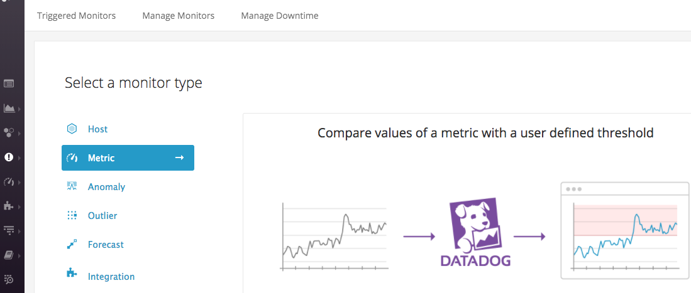

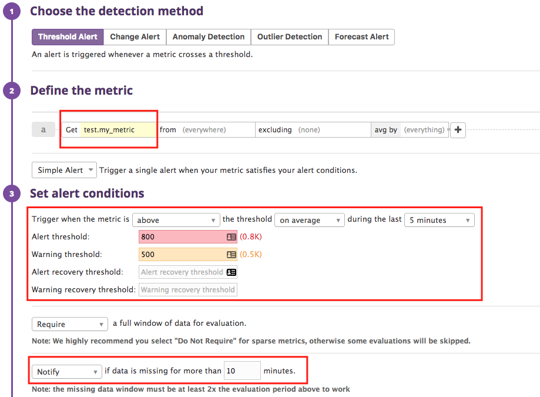


##### Please configure the monitor’s message so that it will:

- Send you an email whenever the monitor triggers.

- Create different messages based on whether the monitor is in an Alert, Warning, or No Data state.

- Include the metric value that caused the monitor to trigger and host ip when the Monitor triggers an Alert state.
  - To show the host name and ip you need to select the host in the `from` field
  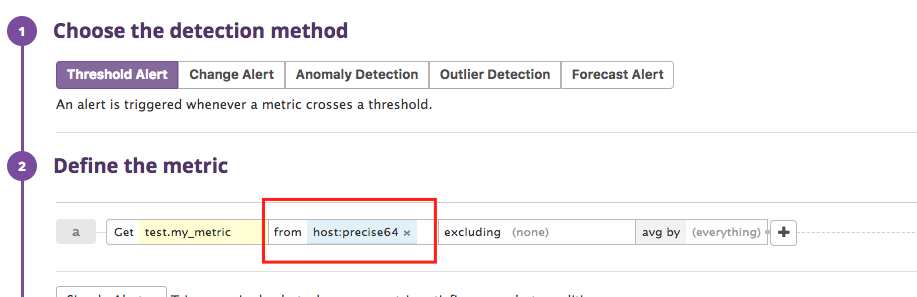

- When this monitor sends you an email notification, take a screenshot of the email that it sends you.

Alerting

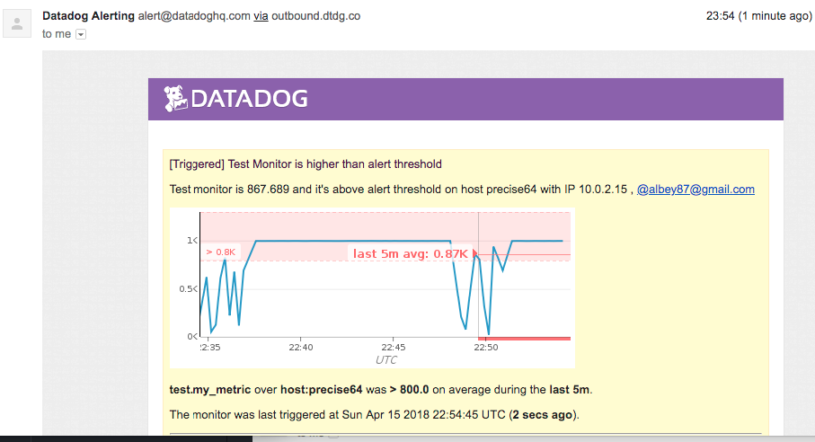

Warning

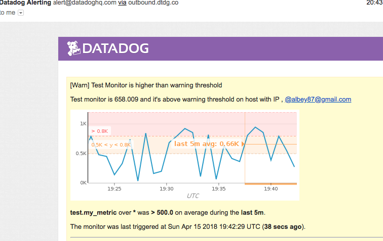


No Data.
In order to have the no data alert I've changed the min_collection_interval to be 650 (just above 10 min)

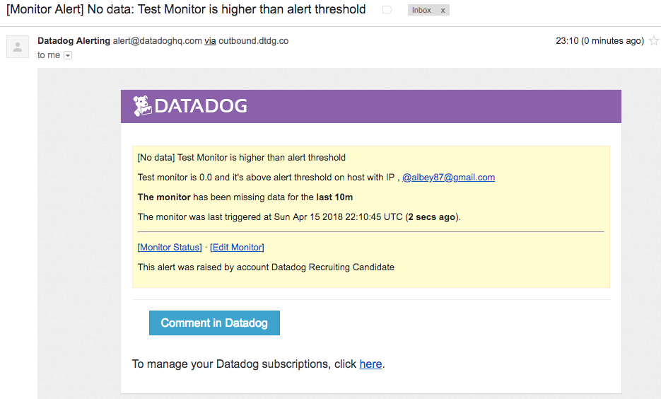


##### Bonus Question: Since this monitor is going to alert pretty often, you don’t want to be alerted when you are out of the office. Set up two scheduled downtimes for this monitor:

- One that silences it from 7pm to 9am daily on M-F,
- And one that silences it all day on Sat-Sun.
- Make sure that your email is notified when you schedule the downtime and take a screenshot of that notification.

You can achieve this with the Manage Downtime function:
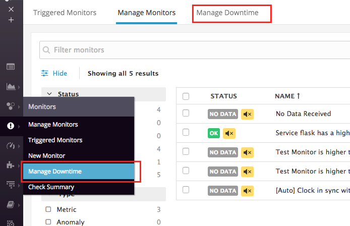

For the evening weekly mute:

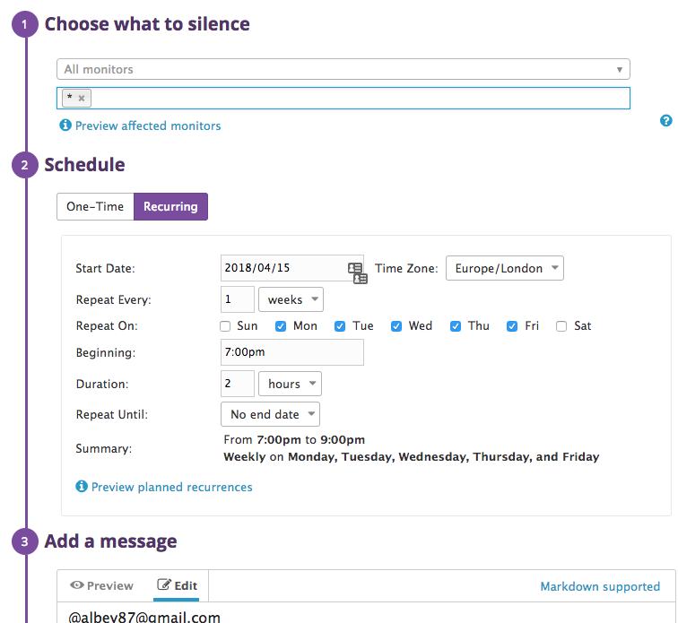

For the weekend mute:
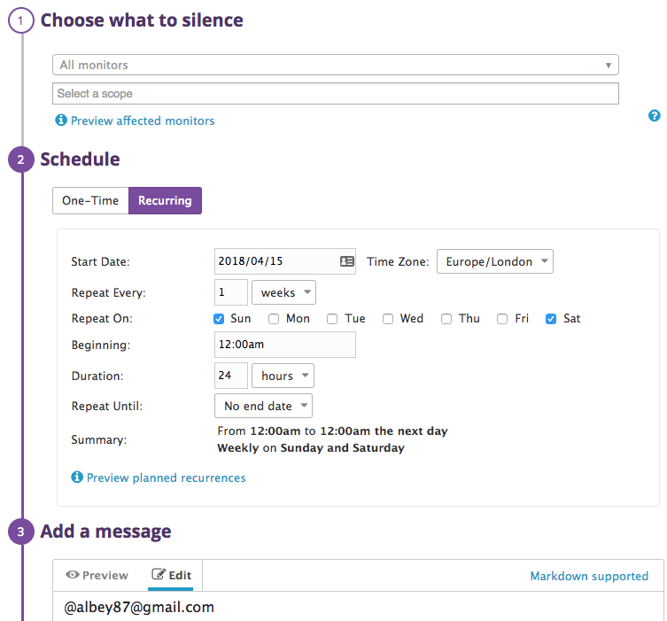

Note, Time is in UTC, we are in BST now!

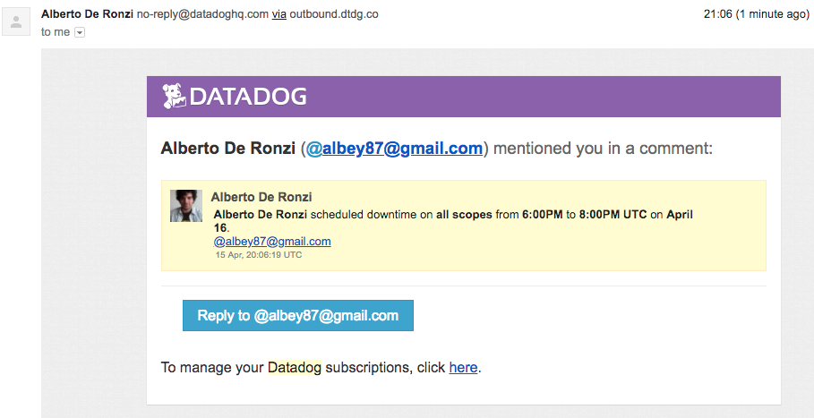

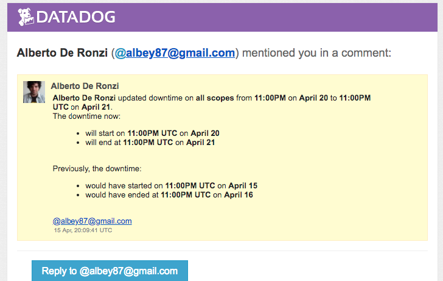


## Collecting APM Data

##### Given the following Flask app (or any Python/Ruby/Go app of your choice) instrument this using Datadog’s APM solution:

```
from flask import Flask
import logging
import sys

# Have flask use stdout as the logger
main_logger = logging.getLogger()
main_logger.setLevel(logging.DEBUG)
c = logging.StreamHandler(sys.stdout)
formatter = logging.Formatter('%(asctime)s - %(name)s - %(levelname)s - %(message)s')
c.setFormatter(formatter)
main_logger.addHandler(c)

app = Flask(__name__)

@app.route('/')
def api_entry():
    return 'Entrypoint to the Application'

@app.route('/api/apm')
def apm_endpoint():
    return 'Getting APM Started'

@app.route('/api/trace')
def trace_endpoint():
    return 'Posting Traces'

if __name__ == '__main__':
    app.run()
```

##### Please include your fully instrumented app in your submission, as well.


That's the version with the code in the app

```
from flask import Flask
from ddtrace import tracer
from ddtrace.contrib.flask import TraceMiddleware
import logging
import sys

# Have flask use stdout as the logger
main_logger = logging.getLogger()
main_logger.setLevel(logging.DEBUG)
c = logging.StreamHandler(sys.stdout)
formatter = logging.Formatter('%(asctime)s - %(name)s - %(levelname)s - %(message)s')
c.setFormatter(formatter)
main_logger.addHandler(c)

app = Flask(__name__)

traced_app = TraceMiddleware(app, tracer, service="my-flask-app")

@app.route('/')
def api_entry():
    return 'Entrypoint to the Application'

@app.route('/api/apm')
def apm_endpoint():
    return 'Getting APM Started'

@app.route('/api/trace')
def trace_endpoint():
    return 'Posting Traces'

if __name__ == '__main__':
    app.run(port=5001)
```

Note:

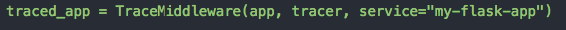

To generate some load, a simple script


```
vagrant@precise64:~/datadog$ while true; do curl 127.0.0.1:5002 ; sleep 5; done
```

That's the resulting dashboard

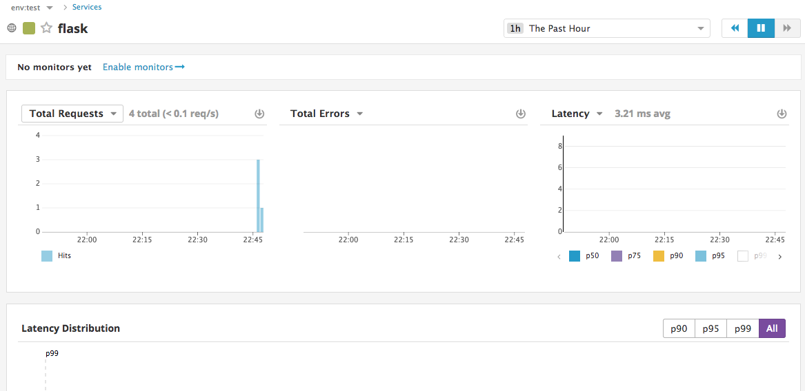

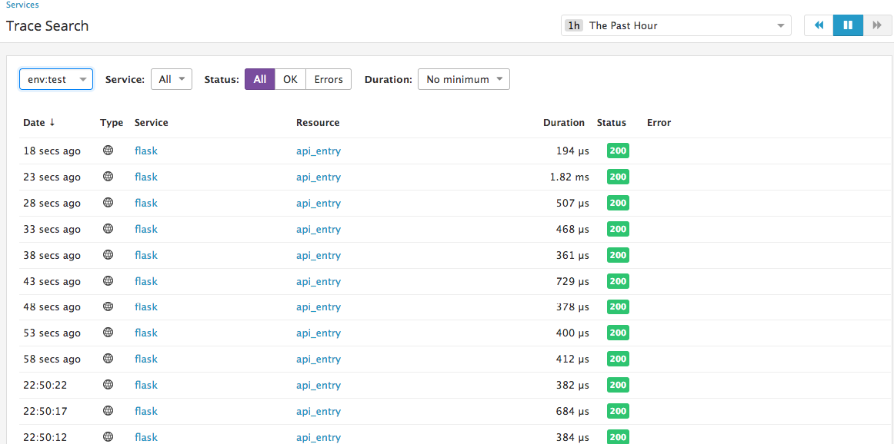


##### Provide a link and a screenshot of a Dashboard with both APM and Infrastructure Metrics.

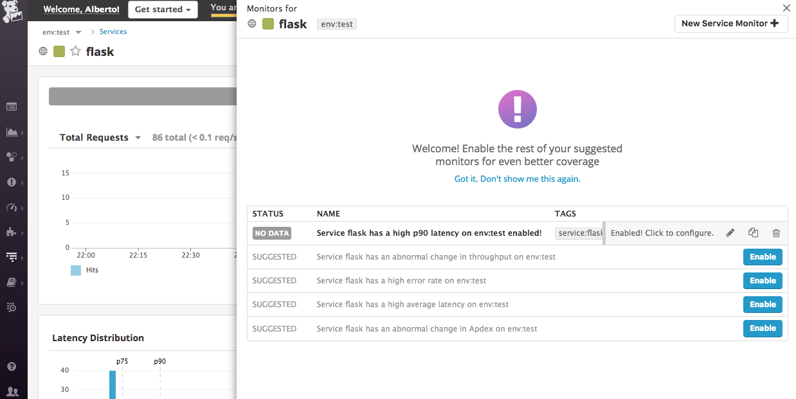

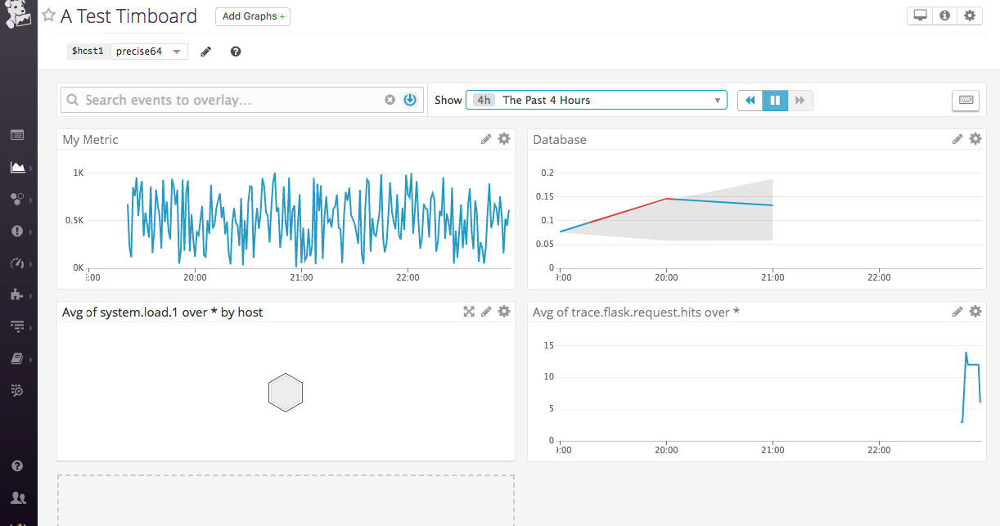

##### Bonus Question: What is the difference between a Service and a Resource?

- A process running provide a Service, i.e. a webserver or a Database
- A Resource is an item requested by a service (e.g. a database query)

## Final Question:
##### Datadog has been used in a lot of creative ways in the past. We’ve written some blog posts about using Datadog to monitor the NYC Subway System, Pokemon Go, and even office restroom availability!
##### Is there anything creative you would use Datadog for?

It is possible to use DataDog as central control centre for the *office coffe machine* in a big organization building.
 - Check if they are active
 - Check for any error (e.g. no coffe)
 - Monitor how many people use them per day
 - Monitor trends for coffee/cappuccino through the day and through the week (I'm sure there is a spike in strong coffee on Monday morning!)


 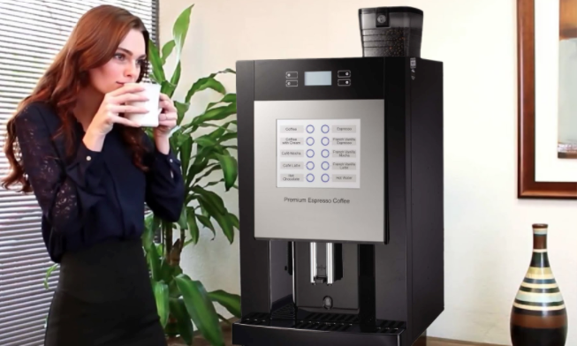
