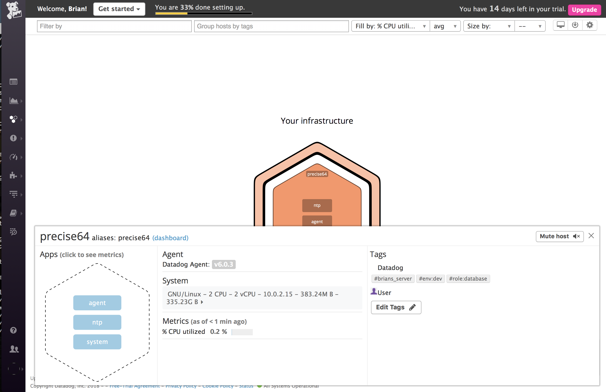
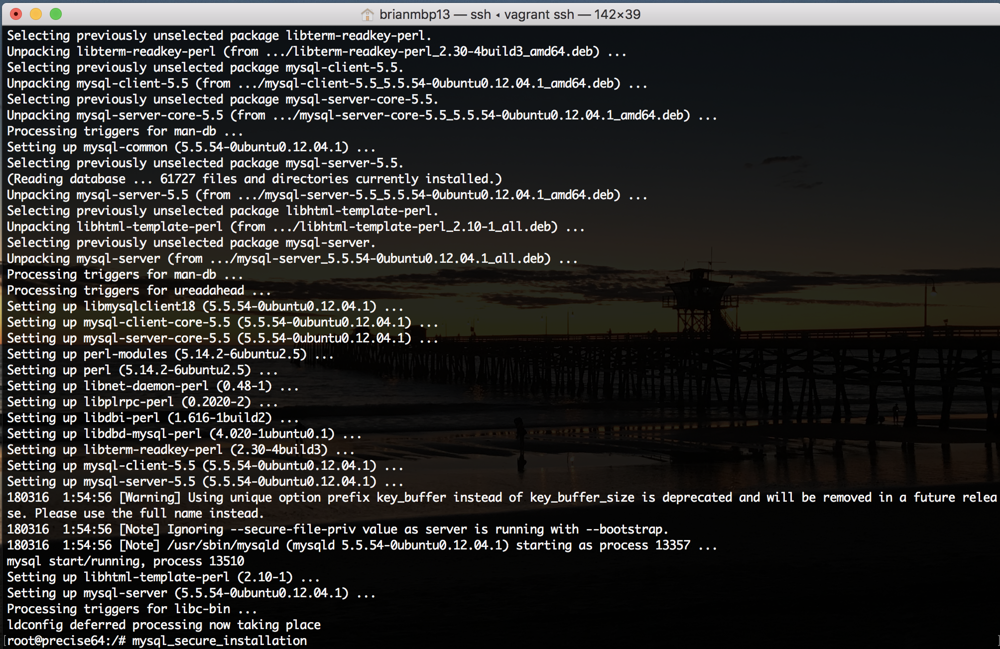
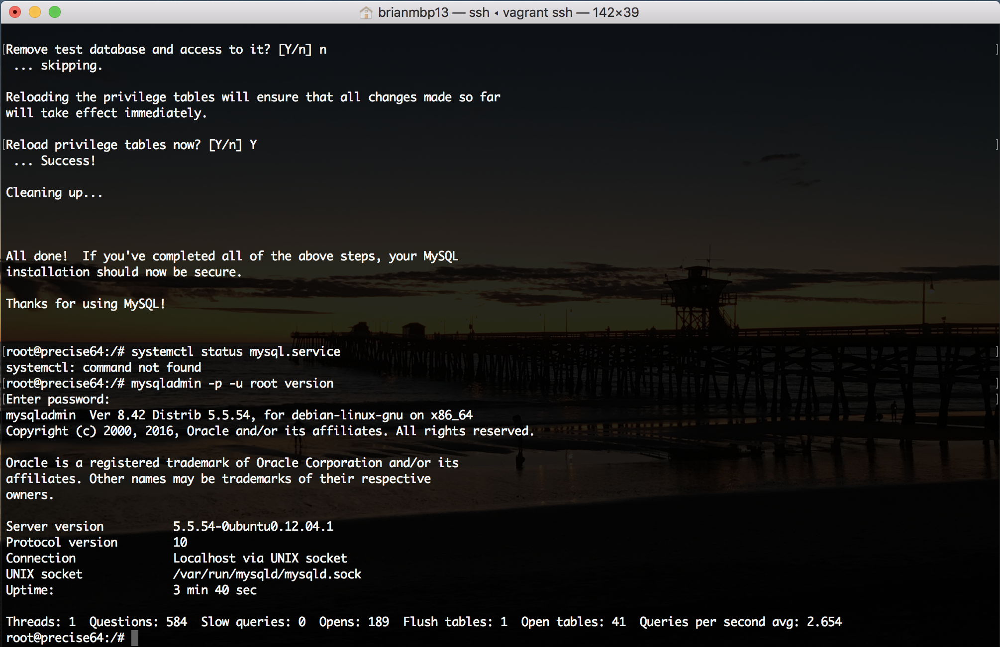

Your answers to the questions go here.

Add tags in the Agent config file and show us a screenshot of your host and its tags on the Host Map page in Datadog.


Install a database on your machine (MongoDB, MySQL, or PostgreSQL) and then install the respective Datadog integration for that database.



Create a custom Agent check that submits a metric named my_metric with a random value between 0 and 1000.
my_metric.py
```
from checks import AgentCheck
class myCheck(AgentCheck):
        def check(self, instance):
                self.guage('my_metric', 223)
```
Change your check's collection interval so that it only submits the metric once every 45 seconds.
```
my_metric.yaml
init_config:
min_collection_interval: 45
instances:
        [{}]
```
Bonus Question Can you change the collection interval without modifying the Python check file you created?

Utilize the Datadog API to create a Timeboard that contains:

Your custom metric scoped over your host.
Any metric from the Integration on your Database with the anomaly function applied.
Your custom metric with the rollup function applied to sum up all the points for the past hour into one bucket
Please be sure, when submitting your hiring challenge, to include the script that you've used to create this Timemboard.

Once this is created, access the Dashboard from your Dashboard List in the UI:

Set the Timeboard's timeframe to the past 5 minutes
Take a snapshot of this graph and use the @ notation to send it to yourself.
Bonus Question: What is the Anomaly graph displaying?
