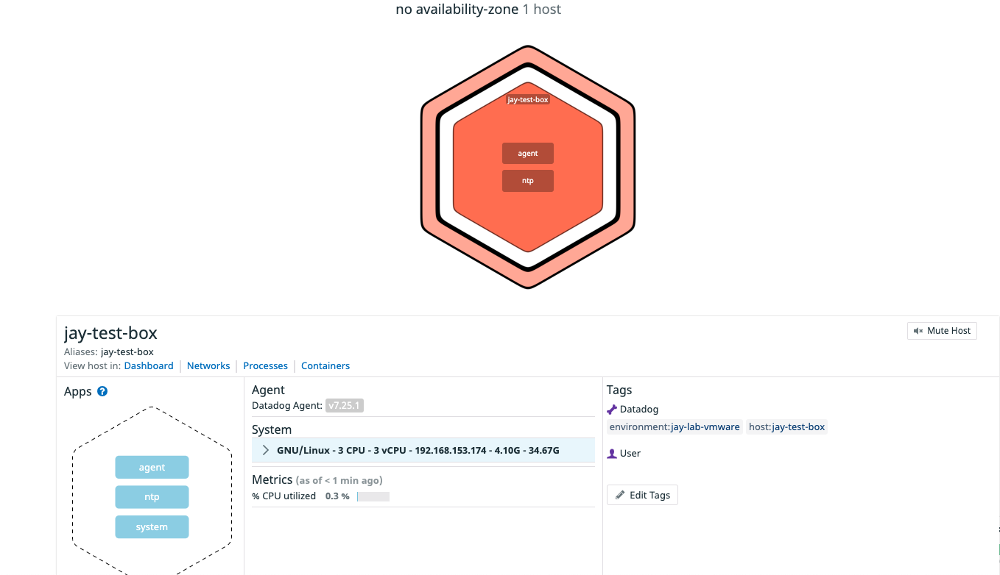
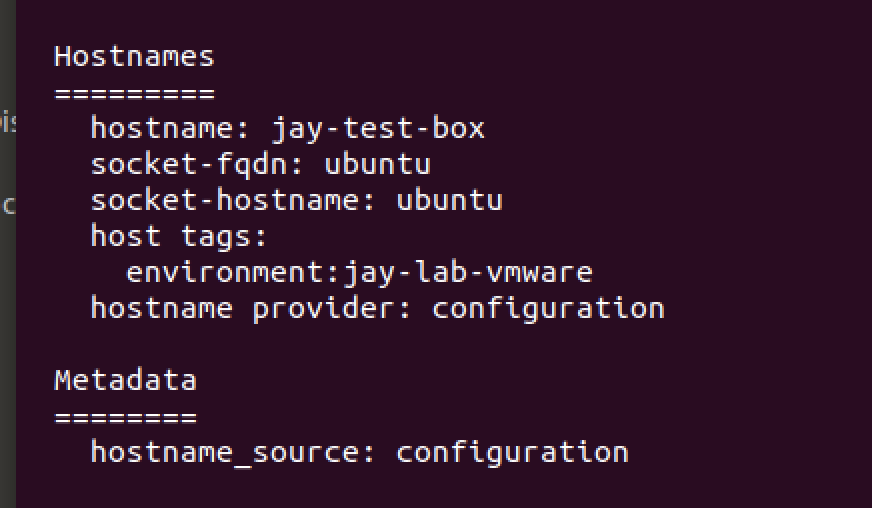
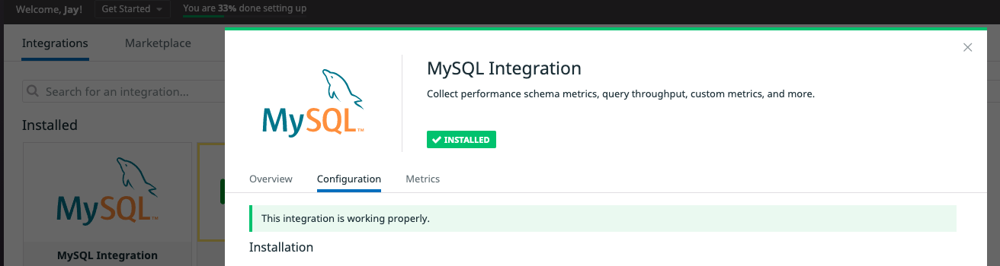
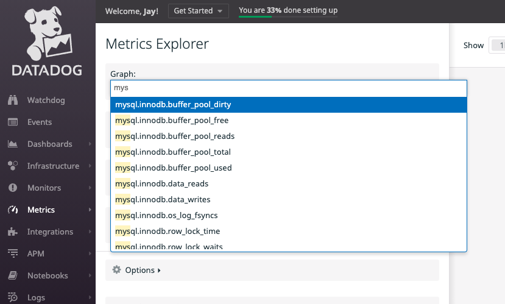

## Tasks - The following are the categories in which the tasks have been allocated. 
----------------
    Environment Set-up
    Collecting Metrics
    Visualizing Data
    Monitoring Data
    Collecting APM Data
    Creative Use of Datadog

Reviewer - I have done my best to try and provide you all the details as possible. 

#### Environment Set-up
- VMWare Fusion as Hypervisor on my Macbook Pro (Personal Laptop)
- Operating System - Ubuntu 18.04 - My favourite OS for any Testing
- Datadog Account - jaydesai83@gmail.com
- Datadog Agent - v7.25.1

#### Collecting Metrics
##### Task: 
Add tags in the Agent config file and show us a screenshot of your host and its tags on the Host Map page in Datadog.
##### How: 
Installed Agent >> Standard Process from Portal for Ubuntu. Edited “datadog.yaml” file located at “/etc/datadog-agent/datadog.yaml” and inserted a couple of tags.

Host in Datadog Dashboard

Agent Status Output

##### Task: 
Install a database on our machine and then install the respective datadog integeration for that database. 
##### How: 
Installed Integeration >> Standard Process from Portal for MySQL. Edited “conf.yaml” file located at “/etc/datadog-agent/conf.d/mysql.d/conf.yaml” and made changes according to the provided instructions.

Plugin Installed from Datadog Portal

Database Metrics available in Metrics Explorer

##### Task: 
Create a custom Agent check that submits a metric named my_metric with a random value between 0 and 1000.

##### How: 
Followed guide to create a custom agent check. Created a file called mycheck.py “/etc/datadog-agent/check.d/mycheck.py” 
Additionally, created a mycheck.yaml file “/etc/datadog-agent/conf.d/mycheck.yaml” 

Custom Check from Datadog Agent Status Output

Custom Check metrics in Datadog Portal

##### Task: 
Change your check's collection interval so that it only submits the metric once every 45 seconds.

##### How: 
Edited the .yaml file to include –min_collection_interval value and set it to 45. 

##### Task: Bonus Round
Can you change the collection interval without modifying the Python check file you created?

##### How: 
I think the documentation is now updated showing how to edit the .yaml file to change the collection interval. I used the available documentation. 

#### Visualizing Data
##### Task: 
Utilize the Datadog API to create a Timeboard that contains:
    Your custom metric scoped over your host.
    Any metric from the Integration on your Database with the anomaly function applied.
    Your custom metric with the rollup function applied to sum up all the points for the past hour into one bucket
##### How: 
Download the Postman Collection for datadog and authenticated via the available API Key.

