# Enterprise Sales Engineer - Zhang 

# Overview
Datadog is the leading monitoring service for cloud-scale monitoring service for cloud-scale applications through a SaaS-based data analytics platform. We can describe Datadog as **Unify logs, metrics and traces** from across your distributed infrastructure. <br>
I'll demostrate the capabilities of Datadog from both development and operation prospectives through the exercises and also provide you my personal feedback about this tool. 

## Instruction for setup the environment:

* Install virtualbox and vagrant for MacOS via brew.
  * brew cask install virtualbox
  * brew cask install vagrant
* Bring up the vm.
  * vagrant init hashicorp/bionic64
  * vagrant up
* SSH into the vm.
  * vagrant ssh

**Note:** <br> 
*I am using macOS for this demo.*<br>
*If you are setting up on Windows, here is the [instruction](https://medium.com/@botdotcom/installing-virtualbox-and-vagrant-on-windows-10-2e5cbc6bd6ad) for setting up the environment.*<br>

# Answers

## Collecting Metrics

This section covers collection: How do you get the metrics and events from your host up to Datadog. Firstly let me explain what a host is as far as Datadog is concerned. A host is any computing resource that you can run a job that you want to monitor and can also run the Datadog agent. That resource could be a physical box in a data center, or a virtual machine/instance on a cloud service, or even a Docker container. You can send metrics from a single host or thousands of hosts. <br>

I will be leveraging various resources including the [documentation](https://docs.datadoghq.com/), the application and its [integration](https://docs.datadoghq.com/integrations/) tiles, which can help you solve most problems quickly. <br>

The first step to collect metrics and events is to install the agent. After you setup a trial account, the installation process will be right in front of you. For established accounts, visit agent under **integrations** and choose the platform you wish to install. *I really appreciate the easiness of agent installation procedure that Datadog provides, especially the options for installing on automation tools like Chef, Puppet and Ansible. When you are working with thousands of instances in the data center, automation is the key for agent management. I'd also like to point out that Datadog combines features into one single agent, which is easy to maintain. From operation point of view, easy-to-automate and easy-to-maintain are 2 big advantages compared with major compatitors like New Relic and AppDynamic, where there are multiple agents to maintain and automate with. <br>


### * Add tags in the Agent config file and show us a screenshot of your host and its tags on the Host Map page in Datadog.

Configuration happens in the **datadog.conf** file. The location of this file depends on your OS, but you can find out more that [here](https://docs.datadoghq.com/agent/basic_agent_usage/?tab=agentv6v7). <br>
Within the configuration file, you can set up the tags to use for this agent, which is one of the most important sections to edit. You will get so much more out of the product if you assign tags to each host and integration you want to monitor. Tags make thing better. For example: you have several instances of different sizes on a cloud provider, you could assign a size tag to each of them. Some get a tag of size:small, some get size:medium, and the rest get size:large. These instances serve different rules, so you assign the tags role:database, role:web. Finally you assign tags based on availability zone: az:useast and az:uswest. Once thsoe tags are setup, you can more easily query the data and create dynamic dashboards that work with your environment. It is cruical to implement a good tagging strategy. <br>

`tags: ["environment:demo", "os:ubuntu"]`

After you make changes to the configuration of the agent, you have to restart the agent. <br>
**sudo systemctl stop datadog-agent** <br>
**sudo systemctl start datadog-agent** <br>

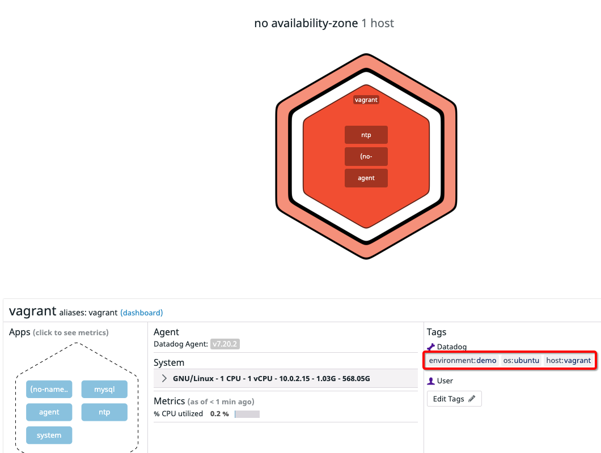


I am showing an agent that is running on a Linux VM.However, you might be wondering if anything is different if this were an instance on public cloud like AWS, Azure or GCP. For Azure for example, it is true that you could monitor all your VMs using Azure Monitor and not install any agent. However, the frequency of data collection is long so that a lot might missing from the story. For instance, CPU Memory usage metrics, it might not be able to capture all the spikes that you want to monitor. It is a similar story with all cloud platforms<br>

### * Install a database on your machine (MongoDB, MySQL, or PostgreSQL) and then install the respective Datadog integration for that database.

Let's start looking how to bring in metrics from other applications. This is where the **integrations** come in. I installed MySQL in my example. <br>
There are four types of integrations.
* Hosted integrations: rely on an API key. These include services like AWS or Github.
* Local integrations: rely on an endpoint we can reach to collect the metrics from like MySQL.
* Notification integrations: primarily push information out instead of collecting information into Datadog like PagerDuty, Slack and Webhooks.
* Frameworks, Libraries, APIs & Trace: instrument with your applications.

Regarding the MySQL example: <br>
* firstly I installed MySQL on my VM via package manager.
  * sudo apt-get update
  *sudo apt-get install mysql-server
* Once MySQL is up and running, I created a database user for the Datadog agent based on [Instruction](https://app.datadoghq.com/account/settings#integrations/mysql)
* Then I added this configuration block to the mysql.d/conf.yaml to collect the MySQL metrics
* Whenever you add an integration or make any tweaks, run the info command **sudo /etc/init.d/datadog-agent info** to see that everything is ok
* Restart the agent and verify if the agent is reporting to the dashboard. You should be able to see metrics reporting to the pre-built "MySQL - Overview" dashboard in **Dashboard** section. 


Created /etc/datadog-agent/conf.d/mysql.d/conf.yaml <br>
**Note**: Wrap your password in single quotes in case a special character is present. <br>
```
    instances: 
       - server: 127.0.0.1
         user: datadog
         pass: "password"
         port: 3306
	 tags:
	   - role:db
	   - environment:demo
         options:
           replication: 0
           galera_cluster: 1
           extra_status_metrics: true
           extra_innodb_metrics: true
           extra_performance_metrics: true
           schema_size_metrics: false
           disable_innodb_metrics: false
 ```

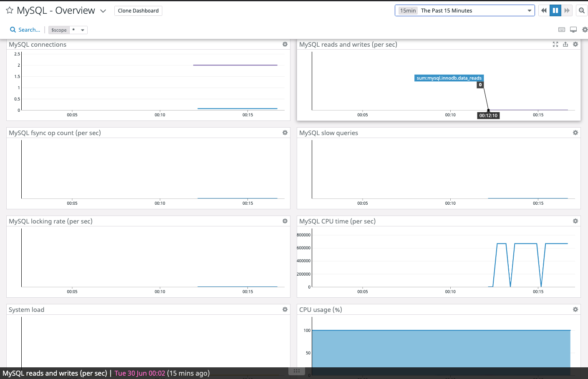

### * Create a custom Agent check that submits a metric named my_metric with a random value between 0 and 1000. <br>
**Note:Documentation needs to be corrected. The example code doesn't work as expected. Should be updated as below https://docs.datadoghq.com/developers/write_agent_check/?tab=agentv6v7** <br>
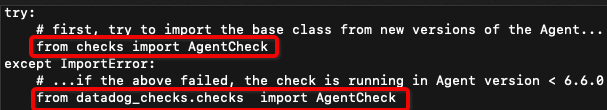

1. Create **custom_mycheck.py** under /etc/datadog-agent/checks.d folder, where you define your custom metric <br>

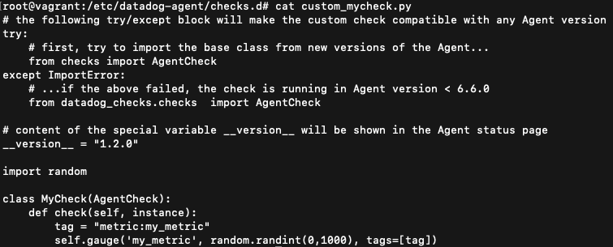

2. Create **custom_mycheck.yaml** under /etc/datadog-agent/conf.d folder, where you configure the collection interval of your custom metric <br>

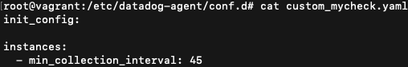

3. Run your custom check by `sudo -u dd-agent -- datadog-agent check custom-mycheck` to confirm the configuration works. Find your custom metric name and you should see the status as OK. <br>

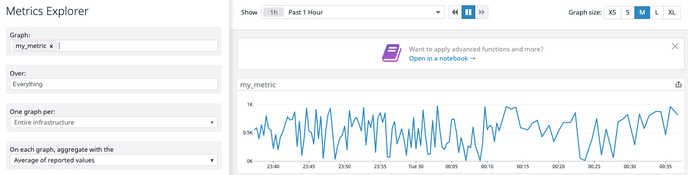

### * Change your check's collection interval so that it only submits the metric once every 45 seconds.

Modify the custom_mycheck.yaml file by changing **min_collection_interval: 45** <br>

### * **Bonus Question** Can you change the collection interval without modifying the Python check file you created?

I did not change the Python file, instead I modified the yaml file above.<br>
Another solution would be to create a cron job, which calls the check with "sudo -u dd-agent -- datadog-agent check custom_mycheck" <br>


## Visualizing Data:

Utilize the Datadog API to create a Timeboard that contains:

* Your custom metric scoped over your host.
* Any metric from the Integration on your Database with the anomaly function applied.
* Your custom metric with the rollup function applied to sum up all the points for the past hour into one bucket

Please be sure, when submitting your hiring challenge, to include the script that you've used to create this Timeboard.


Firstly you need to generate a API and application keys in Datadog console by clicking **APIs** in **Integration** dropdown menu. An API key is required by the Datadog Agent to submit metrics and events to Datadog. And application key gives you full access to Datadog's programmatic API. You pick the option that you are comfortable with in the API [documentation](https://docs.datadoghq.com/dashboards/guide/timeboard-api-doc/?tab=bash) to write your script. For my example below, I used curl. curl assumes usage of BASH and GNU coreutils. On MacOS you can install coreutils via the Homebrew: **brew install coreutils** In order to add multiple graphs to the timeboard, I inserted multiple objects into the graph array.<br>

To scope the custom metric over host, you can use the tags that you defined earlier to identify your host. And appending the **.rollup()** function at the end of a query allows you to perform custom time aggregation.
 <br>


Script is as below: <br>

```
api_key=1d277ec3da15e2ad90fca7de484a9315
app_key=16e7f5eff2caba4208fd90884caae4dbbd3907c5

curl  -X POST -H "Content-type: application/json" \
-d '{
      "title" : "My Timeboard Final Version",
      "read_only" : "True",
      "graphs" : [{
          "title": "my_metric scoped over host",
          "definition": {
              "events": [],
              "requests": [
                  {"q": "avg:my_metric{host:vagrant}"}
              ],
              "viz": "timeseries"
          }
      },
      {
	      "title": "MySQL CPU time anomalies",
	      "definition": {
		  "events": [],
		  "requests": [
			{"q": "anomalies(avg:mysql.performance.cpu_time{host:vagrant}, \"basic\", 3)"}
		  ],
		  "viz": "timeseries"
               }
	},
	{	
		"title": "my_metric with rollup to sum up all the points for the past hour",
        	"definition": {
            	"events": [],
            	"requests": [
                	{ "q": "avg:my_metric{host:vagrant}.rollup(\"sum\", 3600)"}
            ]
   		 }
	}
      ]
}' \

```


Once this is created, access the Dashboard from your Dashboard List in the UI:
Here is the link to the dashboard: https://app.datadoghq.com/dashboard/m9w-te7-88z/my-timeboard-final-version?from_ts=1593539069918&to_ts=1593542669918&live=true <br>

### * Set the Timeboard's timeframe to the past 5 minutes

You can select the past 15 mins and then click and zoom on one of the graph and selecting a 5 mins interval <br>
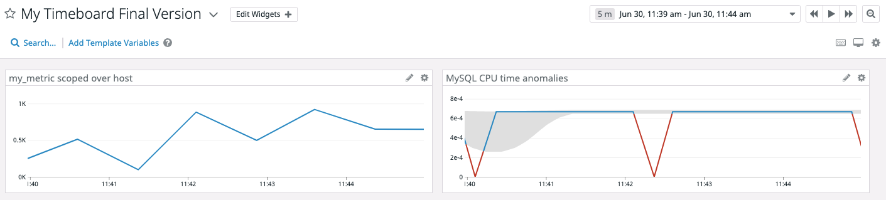

### * Take a snapshot of this graph and use the @ notation to send it to yourself.

Out of box, there are two types of notification supported: desktop notifications and emails. But more can be added with integrations like integrating with Slack, ServiceNow and etc. Once it's setup, you can @ notify by typing the **@** sign followed by the name of the person specified in the email notification setting.

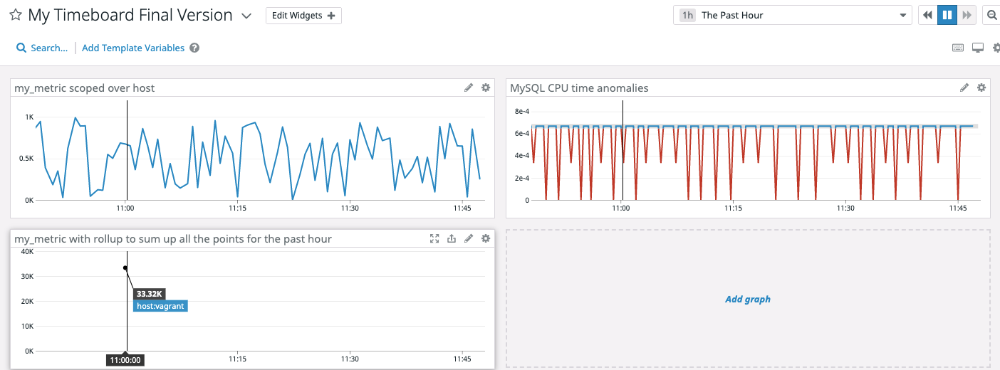


Timeboards have a very specific structure, so you are only able to add it to the grid of graphs. However Datadog provides another type of dashboard, screen boards, which I love as I can get more flexibility with the placement of graphs. <br>
So a time series line graph displays a line for each group of data. You can choose any metric collected, as long as the metric has seen new data in the last 24 hours.<br>

### * **Bonus Question**: What is the Anomaly graph displaying?

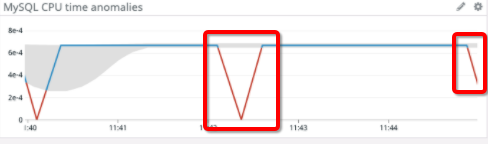

As you know, metrics change all the time. The problem is sometimes metrics fluctuate so much that it's tough to automatically detect what's normal and what's not. The anomly detection algorithm helps us to identify when a metric is deviating from the majority of historical behavior. As the snapshot above, I used MySQL CPU time anomaly as example. The gray bands show us what is expected based on historical trends. You can see the highlight outliers, which is quickly flagged as an anomly. The Anomaly graph displaying tells us that even though the metric fluctuates, it stays in the expected range based on past trends. However, for some cases, when the actual value didn't match the prediction, that is an anomaly. <br>


## Monitoring Data

Since you’ve already caught your test metric going above 800 once, you don’t want to have to continually watch this dashboard to be alerted when it goes above 800 again. So let’s make life easier by creating a monitor.

Create a new Metric Monitor that watches the average of your custom metric (my_metric) and will alert if it’s above the following values over the past 5 minutes:

* Warning threshold of 500
* Alerting threshold of 800
* And also ensure that it will notify you if there is No Data for this query over the past 10m.


Below is the 4 steps to set up monitors:<br>
1. Pick the metric to watch for by the query editor. There is a dropdown menu below to select simple or multi alert. This option just reflects the settings configured in the group-by box in the query editor. for example if you choose to group by region, then the simple/multi dropdown will change to multi and trigger a separate alert for every region.
2. Set the conditions. Threshold lets you set a static threshold, when the metric passes, will trigger an alert. The threshold alert can be useful for metrics that tent to be the same value most of time. 
3. Enter the message. You can use the conditional statements in the message body. You can define different messages to appear if it is or is not a warning, or is or is not an alert. If you forget the template variables available, just click the link above the message body for a quick hint on how to use them. 
4. Define the recipients. you can @ notify by typing the **@** sign followed by the name of the person specified in the email notification setting.

As an alternative, you can also setup up monitor by [importing](https://app.datadoghq.com/monitors#create/import) monitor from JSON file. Below is an example:

```
{
	"id": ,
	"name": "Attention: My_Metric is very high on {{host.ip}}",
	"type": "metric alert",
	"query": "avg(last_5m):avg:random.my_metric{*} by {host} > 800",
	"message": "On {{host.name}} {{host.ip}} {{#is_no_data}}we are missing something!{{/is_no_data}} \n\n{{#is_alert}}    The value is above {{threshold}} {{/is_alert}} \n\n{{#is_warning}}     We are Warning you! The value is above {{warn_threshold}} {{/is_warning}} \n\n\nThanks @zhang.alex.zhao@gmail.com",
	"tags": [],
	"options": {
		"notify_audit": false,
		"locked": false,
		"timeout_h": 0,
		"new_host_delay": 300,
		"require_full_window": false,
		"notify_no_data": true,
		"renotify_interval": "0",
		"escalation_message": "",
		"no_data_timeframe": 10,
		"include_tags": true,
		"thresholds": {
			"critical": 800,
			"warning": 500
		}
	}
}

```


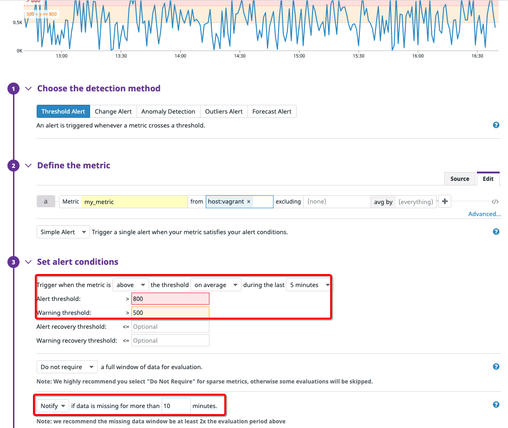

Please configure the monitor’s message so that it will:

* Send you an email whenever the monitor triggers.
* Create different messages based on whether the monitor is in an Alert, Warning, or No Data state.
* Include the metric value that caused the monitor to trigger and host ip when the Monitor triggers an Alert state.

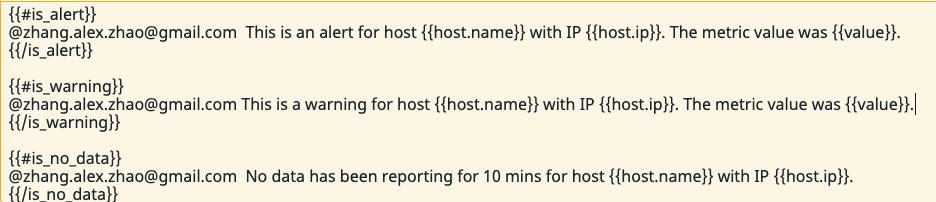

* When this monitor sends you an email notification, take a screenshot of the email that it sends you.


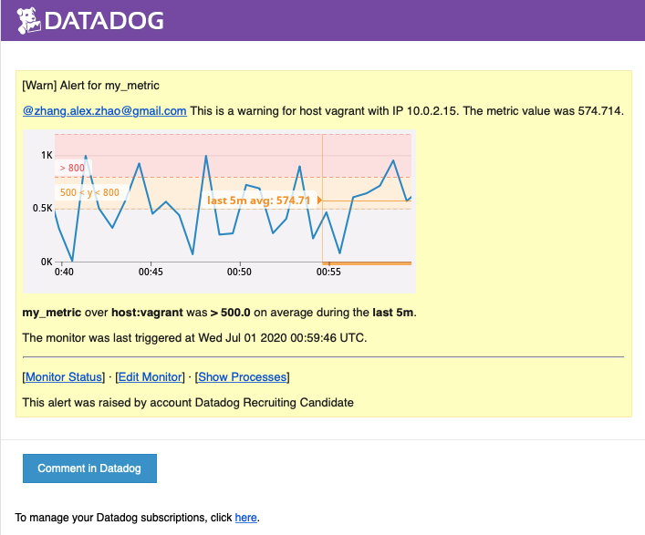

* **Bonus Question**: Since this monitor is going to alert pretty often, you don’t want to be alerted when you are out of the office. Set up two scheduled downtimes for this monitor:

This can be accomplished via the manage downtime. <br>

  * One that silences it from 7pm to 9am daily on M-F,
  
  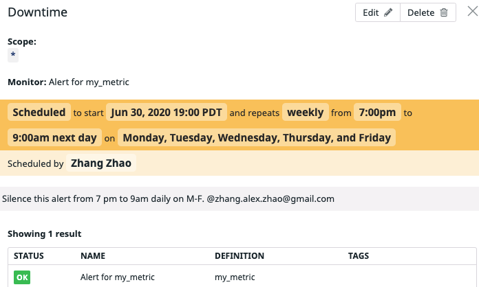
  
  * And one that silences it all day on Sat-Sun.
  
  
  
  * Make sure that your email is notified when you schedule the downtime and take a screenshot of that notification.
  
  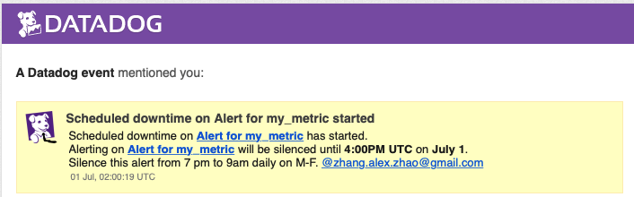

## Collecting APM Data:

Given the following Flask app (or any Python/Ruby/Go app of your choice) instrument this using Datadog’s APM solution:

```python
from flask import Flask
import logging
import sys
# Have flask use stdout as the logger
main_logger = logging.getLogger()
main_logger.setLevel(logging.DEBUG)
c = logging.StreamHandler(sys.stdout)
formatter = logging.Formatter('%(asctime)s - %(name)s - %(levelname)s - %(message)s')
c.setFormatter(formatter)
main_logger.addHandler(c)
app = Flask(__name__)


app.route('/')
def api_entry():
    return 'Entrypoint to the Application'
@app.route('/api/apm')
def apm_endpoint():
    return 'Getting APM Started'
@app.route('/api/trace')
def trace_endpoint():
    return 'Posting Traces'
if __name__ == '__main__':
    app.run(host='0.0.0.0', port='5050')
```

* **Note**: Using both ddtrace-run and manually inserting the Middleware has been known to cause issues. Please only use one or the other.


Datadog covers many of the popular libraries and frameworks used you might be interested in manually instrumenting your application whether that be to get some additional visibility into your business logic or because of custom tooling you might want to get some insight into. Many cases manual instrumentation sounds intimidating. You will have to manually instrument the passing of trace headers span metadata between different parts of your code base. However by using data dogs tracing clients will actually be able to handle much of the underlying logic automatically.

You are able to search all your traces by any tag for real-time visibility. Each trace captures the end-to-end lifespan of a request, from frontend clients down to database. What's more, datadog automatically correlates the logs from all the services in the distributed trace as well as the metrics from infrastructure and the runtime, which is a big plus from operation support point of view. The correlation helps the application support team quickly pinpoint the root cause in a single place instead of jumping from different tools.

When you want to investigate at the code level, Datadog profiling measures your code. You can get more context around performance issues. For example, find the hottest lines of code consuming the most CPU and memory.


Here is the steps I took for implementing the demo app:

Firstly, install ddtrace by **pip install ddtrace** 

By default, Flask runs apps on port 5000. The Datadog agent also uses 5000 by default, so this command below specifies a different Flask port to avoid any conflit<br>

Btw, APM is enabled by default in Agent 6 or higher so that you don't have to change anything in the datadog.yaml configuration file.

Secondly, run the ddtrace as below, the trace agent begins to run. Then, go visit all of the routes on the flask app. You should be able to see app showed on traces on the APM. 

```
FLASK_APP=sample_app.py DATADOG_ENV=flask_test ddtrace-run flask run --port=4999
```

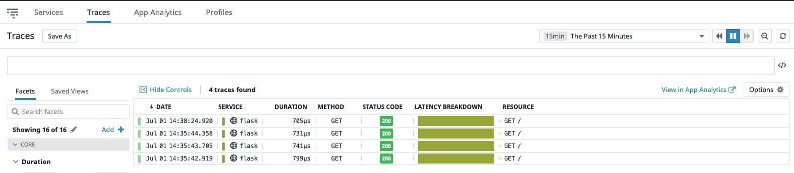 

https://app.datadoghq.com/apm/services?end=1593640453237&env=flask_test&paused=false&start=1593636853237


* **Bonus Question**: What is the difference between a Service and a Resource?

Services are the building blocks of microservice architectures - broadly a service groups together endpoints, queriers, or jobs for the purposes of building your application. An example would be a database like MySQL. <br>

Resources are particular action for a given service. They are typically an instrumented web endpoint, database query, or backgroud job. Same like the MySQL database example as a service, the actual SQL query would be a resource.<br>

Provide a link and a screenshot of a Dashboard with both APM and Infrastructure Metrics.

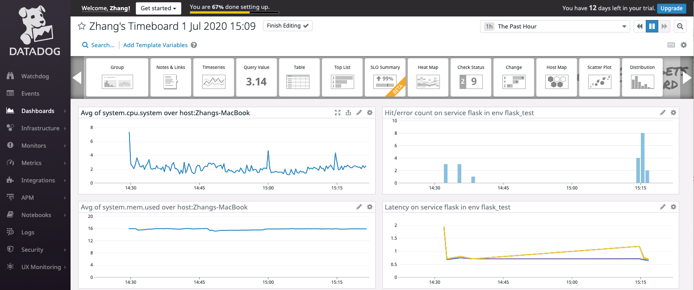 

https://app.datadoghq.com/dashboard/n6z-296-72s/zhangs-timeboard-1-jul-2020-1509?from_ts=1593638483258&live=true&to_ts=1593642083258

Please include your fully instrumented app in your submission, as well.

## Final Question:

Datadog has been used in a lot of creative ways in the past. We’ve written some blog posts about using Datadog to monitor the NYC Subway System, Pokemon Go, and even office restroom availability!

Is there anything creative you would use Datadog for?

My interest is to use Datadog to provide end to end service visibility, which includes end user monitoring by synthetic monitoring, APM traces, metrics and application logs. Just knowing that the application performance is degraded is not good enough, we need to correlate to the business services so that we can quick identify when certain alerts were triggered, what specific business services that the application provides were affected. This will be very helpful to understand the real impact caused by the issue. For example, for Ecom application, “check-out” is definitely a critical service. Every time the alerts are triggered, I need to quickly verify if “check-out” service is being affected.  Datadog as the platform, that integrates end user monitoring, APM traces and logs, enables us to see this flow in one place. By configuring end user monitoring, we can pro-actively identify issues before real customers are getting impacted. APM metrics provide us indicators of performance degradation and it is also where correlation with business services happens by identifying the important APIs/classes/methods that contribute to the services and setup alerts against those metrics. And logs help us to dig in to understand “what” caused the issue.<br> 


