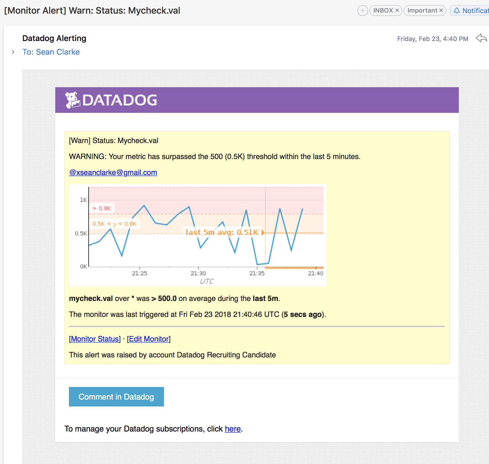
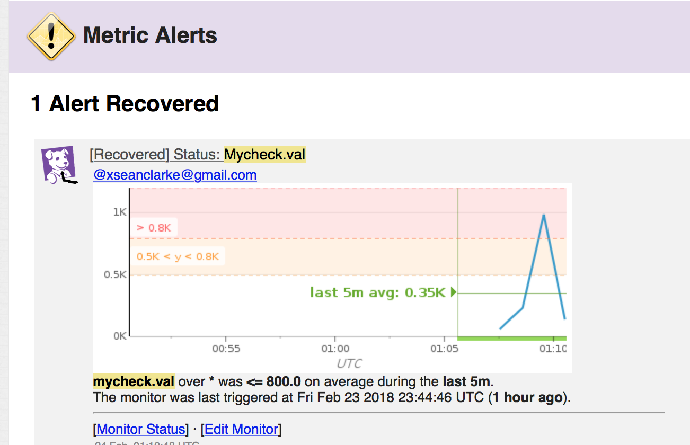
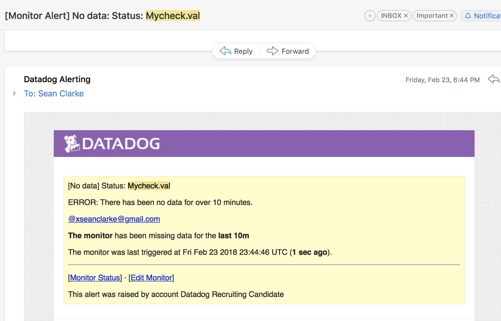
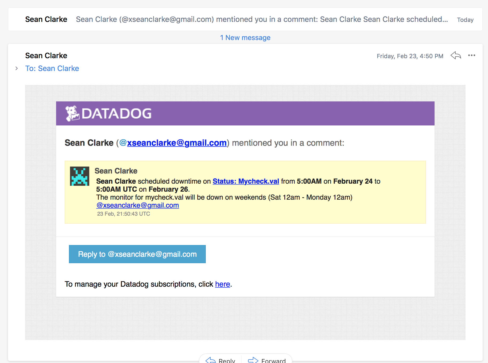
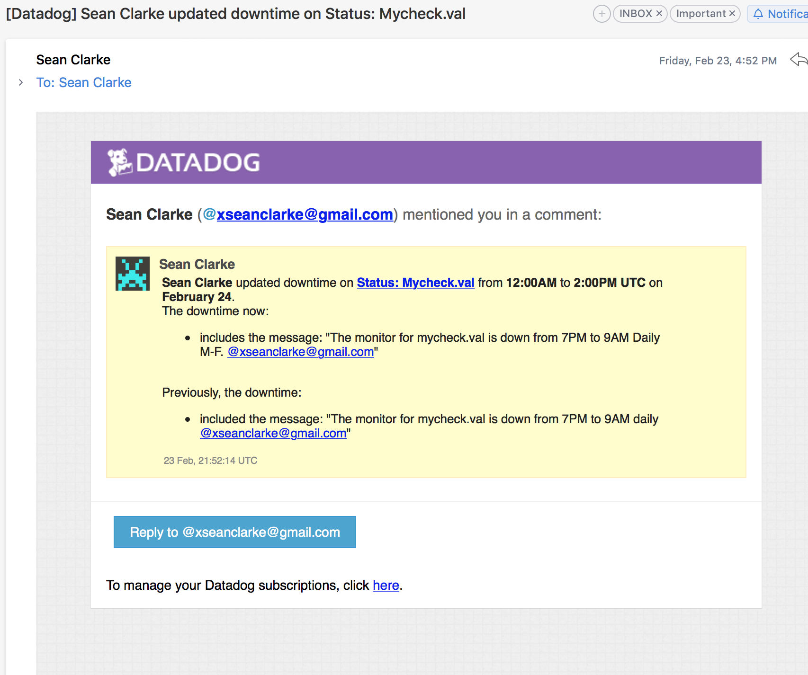
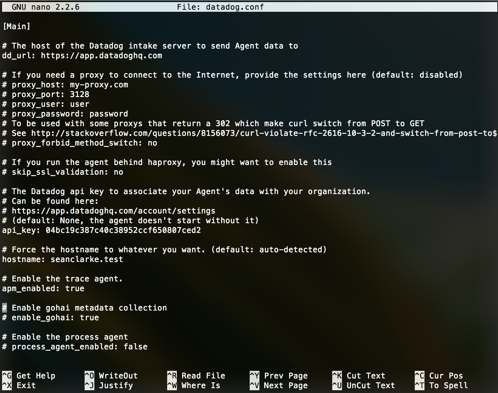
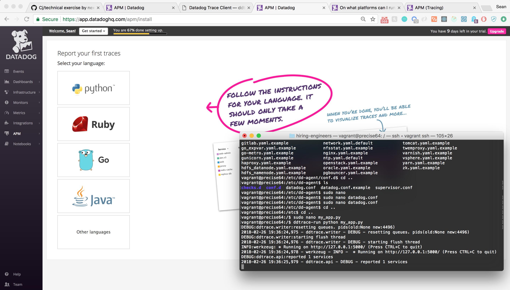

Your answers to the questions go here.

# The Exercise
## Prerequisites - Setup the environment

I used a Vagrantfile to persist a simple Ubuntu 12.04 VM on my local machine.


## Collecting Metrics

1. Agent Tags (added via config) - 

2. Database Install / Integration (Postgres) - 

3. Custom Agent - 

4. Collection Interval Set to 45 Seconds - 

5. BONUS QUESTION: Yes, in fact you can change the minimum collection interval of the check directly through the corresponding .yaml file. However, in the even the agent defines a value lesser, that value will take precedence.

Eg:
```
  init_config:
      min_collection_interval: 45

  instances:
      [{}]
```

## Visualizing Data

In order to utilize the API I created a python file to submit JSON to the API. The code is as follows:
```
from datadog import initialize, api

options = {
    'api_key': '04bc19c387c40c38952ccf650807ced2',
    'app_key': '81fb25b5736dd9c01c1a7c6e434cce868d9fbefe'
}

initialize(**options)

title = "Aint No Timeboard Like the Present"
description = "A timeboard of my_metrics."
graphs = [
  {
    "definition": {
      "events": [],
      "requests": [{
          "q": "anomalies(sum:postgresql.rows_returned{host:seanclarke.test}, 'basic', 2)"
      }],
      "viz": "timeseries"
  },
  "title": "Graph: Postgres"
},
{
  "definition": {
      "events": [],
      "requests": [{
          "q": "sum:mycheck.val{host:seanclarke.test}.rollup(sum,3600)"
      }],
      "viz": "timeseries"
  },
  "title": "Graph: My Metric (Rollup)"
}
]

read_only = True
api.Timeboard.create(title=title,
                   description=description,
                   graphs=graphs,
                   read_only=read_only)

```

1. Created Timeboard (Custom Metric + Anomaly Func. + Rollup Function) - 

2. Timeboard w/ 5 Minute Timeframe - 

3. Timeboard Email - 

4. BONUS QUESTION: The anomaly graph is used to display cases in which the metrics extend beyond the general accepted range. Essentially, in the event of an anomaly, or unusual behavior, the user will be able to track the occurance.

## Monitoring Data

1. Warning Threshold (500) - 

2. Alert Threshold (800) - 

3. No Data 10 Min+ - 

4. BONUS QUESTION:
  i) Weekday Downtime Email - 

  ii) Weekend Downtime Email - 

## Collecting APM Data

1. APM Enabled - 

2. DDtrace Running (No APM):
  i) 
  ii) 

## I look forward to discussing the issue that arose in attempting over the course of a week to employ the APM. I look forward to sharing my experience with Datadog team and perhaps providing a robust and full fledged solution to this issue for future developers to reference.

## Final Question:

"A lover of all things music, I would love to work with a platform such as Soundcloud in perhaps providing artists will greater feedback regarding users interactions with their tracks. For instance: A timestamp at which point a song was paused to isolate portions of a song that could be improved upon (provided there is a highly concentrated portion)."
