## Collecting the tags

### Setting up tags

Tags are labels you can use to group your infrastructure according to hostgroup, purpose, system characteristics or anything else you can think of


In DataDog you can then breakout metrics by the various tags. 

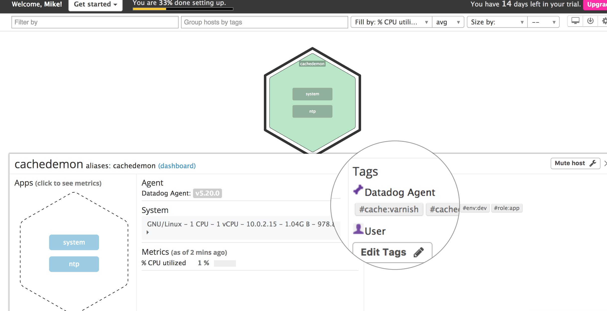

### Adding a service

Datadog ships with common application integrations. To use them simply copy the service's `.example` file to a `.conf` file and make modifcations as needed. For instance to enable monitoring for mysql run `cp /etc/dd-agent/conf.d/mysql.conf.example /etc/dd-agent/mysql.conf` and then run `service datadog-agent restart`

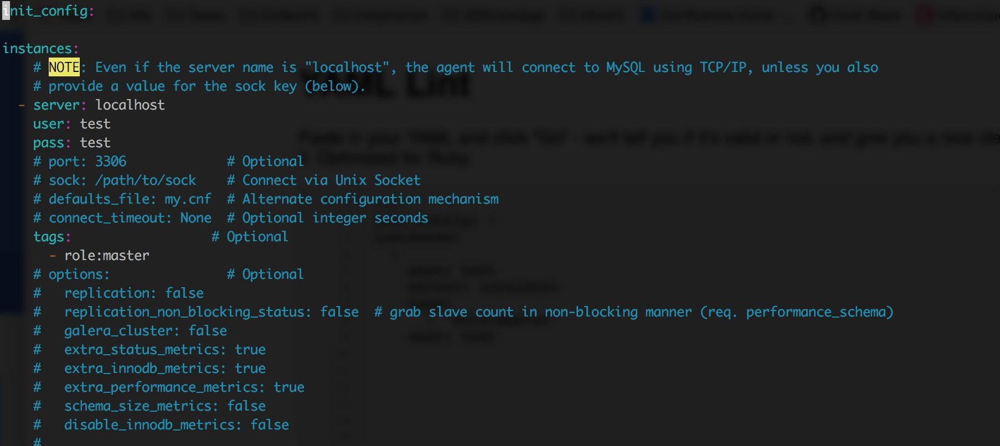

You will now see the mysql service on your infrastructure dashboard. 

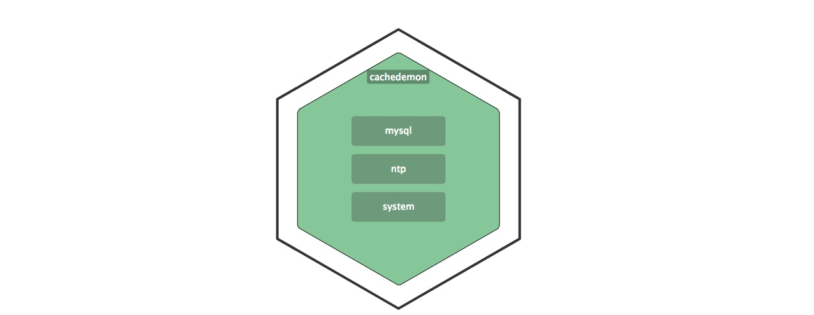

### Custom metrics

Datadog provides an API for adding custom metrics called AgentCheck. To create an agent check simply create a file `/etc/dd-agent/checks.d/my_metric.py` following the documentation [here](https://docs.datadoghq.com/guides/agent_checks/). An example is provided in this repo [here](./checks.d/my_metric.py). Then add a corresponding service yaml [/etc/dd-agent/conf.d/my_metric.yaml](./conf.d/my_metric.yaml). 

After a datadog service restart you will see the metric appear on your infrastructure dashboard.

 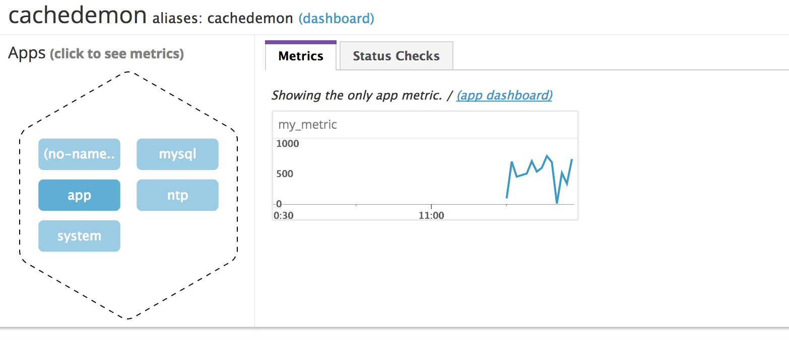

To change the interval by which your metric is collected you can change the `min_collection_interval` value in your `my_metric.yaml` configuration. e.g.

```
init_config:
  min_collection_interval: 45
```

It is important to understand that the above setting does not necessarily mean your metric will be collected precisely every 45 seconds. If your `collector_profile_interval` in `datadog.conf` is set to 20 that means the collector runs every 20 *seconds* and checks whether the required interval has passed for each check. If it's only been 43 seconds since `my_metric`'s last collection, it will be skipped. Consequently `my_metric` will not be collected until the next run 20 seconds later.

**Bonus**: If you increase `collector_profile_interval` to a rate higher than the `min_collection_interval` for your custom metric, you are effectively increasing the rate at which your metric is collected. This is because each time the collector runs, the `my_metric` interval will have passed and new data will be collected. 

## Visualizing Data

You can use the Datadog API to create timeboards in the DataDog API. For instance, when the code in [scripts/timeboard.py](./scripts/timeboard.py) is run, it uses the API to create a timeboard with 3 different graphs. 
 
1. A graphy displaying the raw output of `my_mertic.py`
2. MySQL Connections with Anomaly detection
3. A rollup of the my_metric.py data on an hourly basis

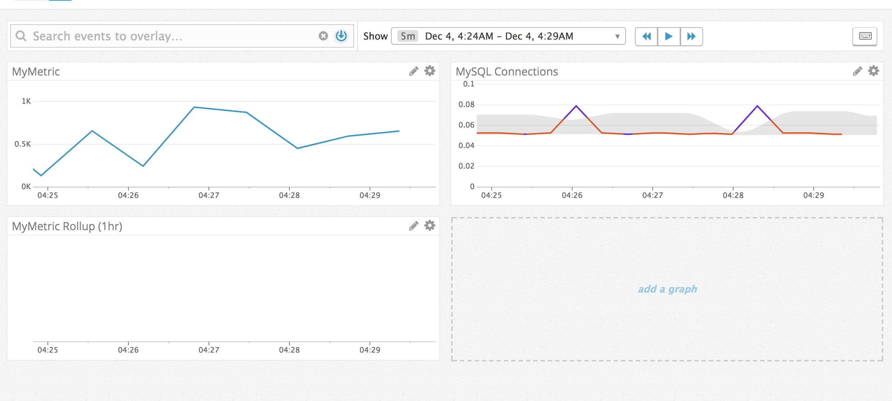

You can zoom in on a graph by clicking and dragging across the portion you would like to feature. Then click the camera icon to snapshot. The `@` symbol in the comments allows you to send the snapshot to an email or even a slack channel. [Read more about annotations](https://www.datadoghq.com/blog/real-time-graph-annotations/)]

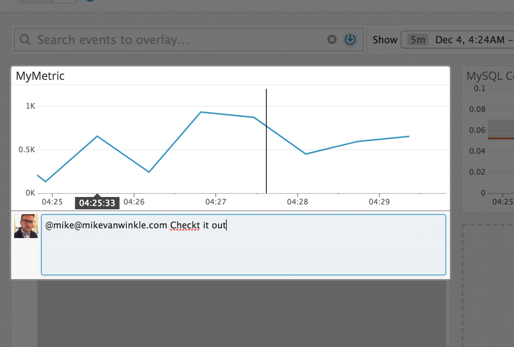

*Bonus:* Anomaly detection uses machine learning to establish the "normal" pattern of behavior for a specific metric. For instance, if your traffic goes up at 10:00 AM everyday, many of your metrics are likely to be affected. Anomaly detection helps you visualize whether changes are within normal ranges.

## Monitoring Data

Setting up a monitor for your data is an easy process. Simply navigate to the "Monitors" tab and select "New Monitor" then choose a metric and set threshholds. 

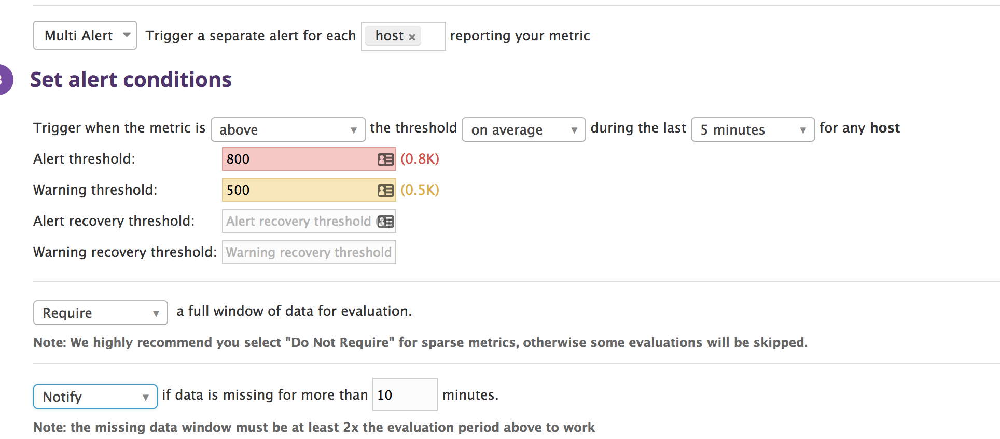

You can use built-in variables to customize the message triggered by the monitor. 

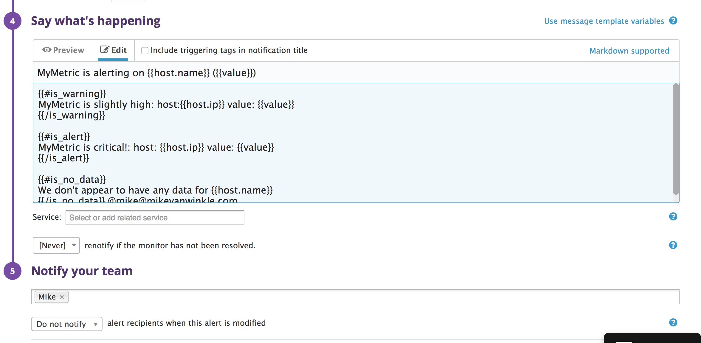

When the monitor threshholds are reached a message will be sent. Here's an example of the resulting email: 

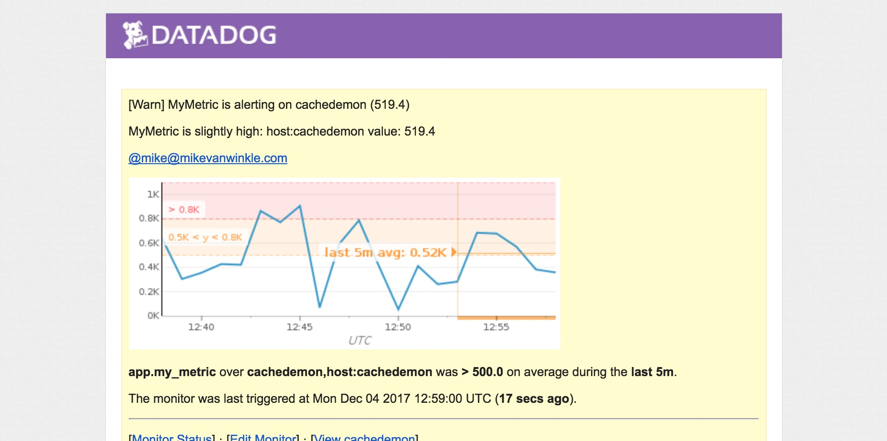

If you need to silence alerts for a period of time, use the [downtime functionality](https://app.datadoghq.com/monitors#/downtime). Here's an example of a scheduled nightly downtime: 

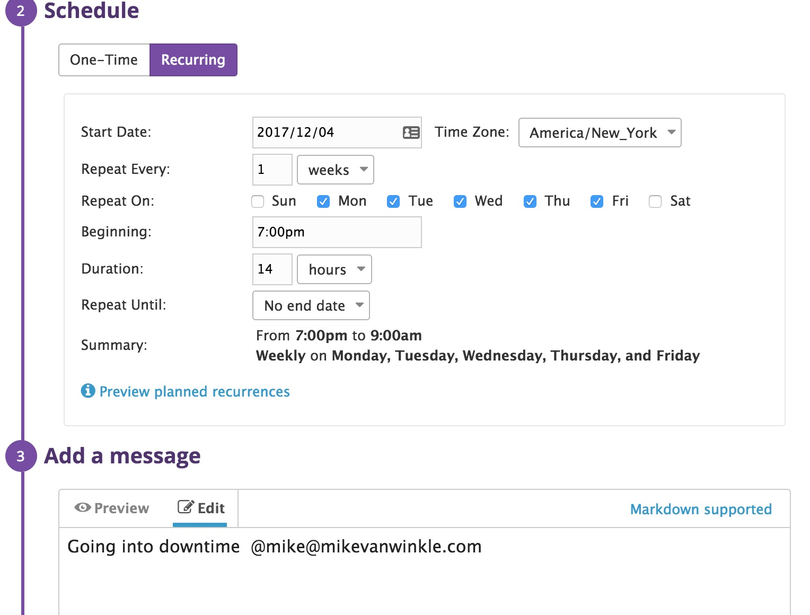

You can even schedule downtime just for the weekends! 

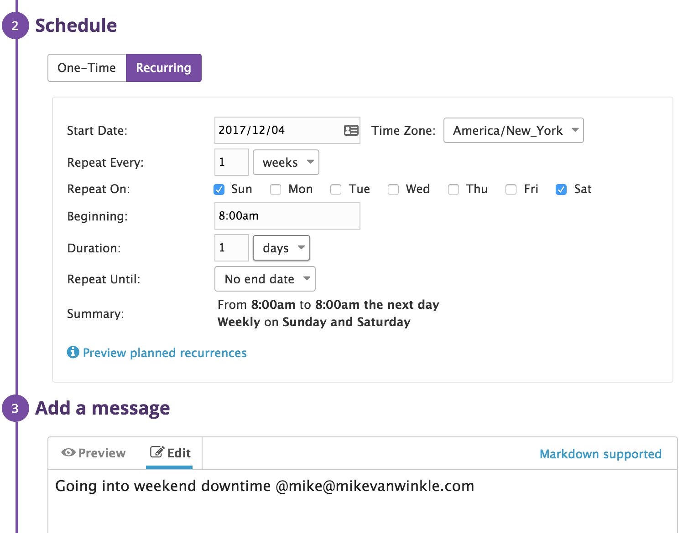


## APM

Datadog's APM provides a powerful way to monitor what's happening *inside* your application. Included in this repo, is a [simple flask app](./scripts/flask.py) with the DataDog APM Trace instrumented. Once running you can go to your APM dashboard and see detailed information about the different resources used: 

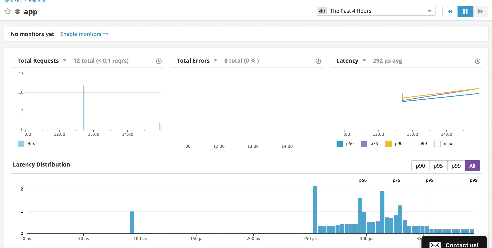

**Bonus:** A `resource` is subset of a `service`. For instance, if you are a running an API for creating users, the API itself would be considered a `service` while the individual endpoints like `PUT /user` would be considered a `resource`. The same logic would apply to a database. The database itself is the `service` while the queries against that database would be classified as `resources`.

## Getting creative 

I am fascinated by the possibility of using DataDog to monitor real world data. It would be fun to explore this in the context of a brewery or tap house. Using some very basic (Arduino Sensors)[https://www.dfrobot.com/product-1031.html] you could use DataDog guages to track the weight of the keg and infer when a keg is almost empty. Attaching "beer:<name>" tags to each sensor input, would allow you to easily visualize the popularity of each beer in real time, rather than waiting for a monthly accounting report. 


