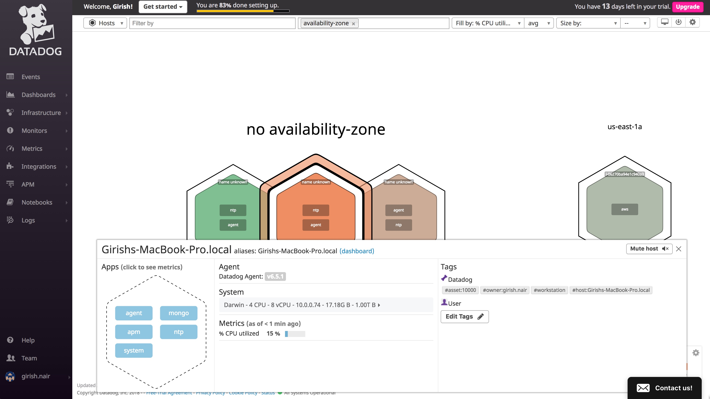
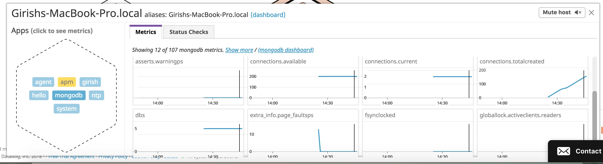
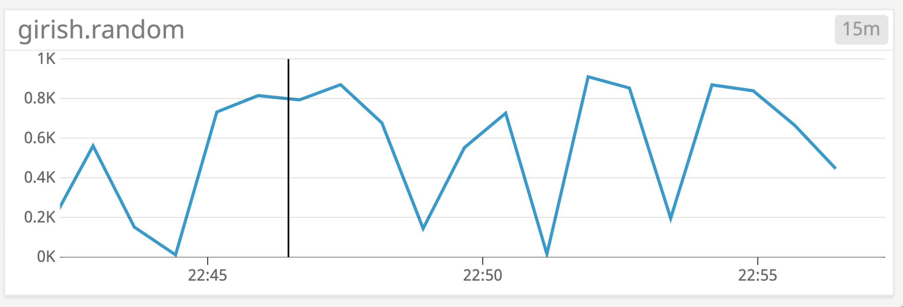

## Collecting Metrics


### Exercise 1 

I use the following [Datadog config](./opt/datadog-agent/etc/datadog.yaml) file for my Macbook Pro agent.

Here is a view of my Macbook Pro with tags.




### Exercise 2

The Datadog MongoDB agent is setup to monitor on the local workstation.




### Exercise 3

I added a custom metric "girish.random" to display a random number between 0 and 1000.

 The customer metric files are [random_num.py](./opt/datadog-agent/etc/checks.d/random_num.py) and [random_num.yaml](./opt/datadog-agent/etc/conf.d/random_num.yaml). The `min_collection_interval` has been set to `45 seconds`.

Here is a view of my custom metric dashboard. 





## APM

### Java Agent

I ran the Spring Petclinic application with the following command:

```
java -javaagent:datadog/dd-java-agent-0.16.0.jar -jar ./target/spring-petclinic-1.5.1.jar
```
